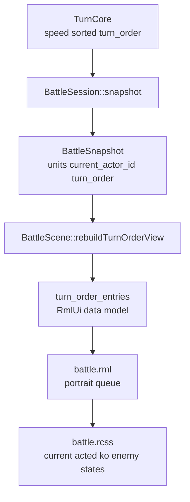

# 2.1 行动顺序条开发计划

## 目标

为战斗场景补充顶部横向行动顺序条，让玩家在下指令时能看见本轮内的行动节奏。

第一阶段只做 Classic Turn 制的表现层队列，不改行动规则、不引入 ATB/TPB 计时、不重算速度。队列直接消费 `TurnCore` 已经生成的稳定速度排序：

- 当前行动者高亮。
- 本轮已行动但仍存活的单位灰化。
- 尚未行动的单位正常显示。
- 战斗不能单位保留在队列中但置灰，避免玩家误以为它还会行动。
- 玩家角色优先显示已有 portrait；敌人第一阶段固定使用 `E1/E2/E3` 这类编号 fallback 和敌方配色。

## 当前上下文

- `TurnCore` 已持有 `turn_order_`，并通过 `turnOrder()` 暴露只读顺序；`advanceTurn()` 会跳过死亡单位并维护 `round_index_`。
- `BattleSession::snapshot()` 当前包含 `units`、`current_actor_id`、`round_index`、`outcome`，但没有把 `turn_order` 放进快照。
- `BattleScene` 已有 RmlUi data model，`party_status_ / main_actions_ / target_entries_` 等 view model 都在场景内重建和绑定。
- `ui/rmlui/scenes/battle.rml` 顶部右侧已有 `battle-top-status`，左上区域可用于行动顺序条，不需要挤压底部 HUD。
- `assets/data/rpg/enemies.json` 当前存在中文敌人名，例如“哥布林”“侏儒”；第一阶段不要依赖按名称截断生成 slot 文本。
- `portraitDecoratorForUnit()` 当前只识别玩家 actor / portrait，敌方单位会返回 `none`；敌方 slot 必然走 fallback 文本路径。

## 数据流



## 数据契约

在 `BattleSnapshot` 增加一个只读字段：

```cpp
std::vector<BattleUnitId> turn_order{};
```

`BattleSession::snapshot()` 负责从 `turn_core_.turnOrder()` 拷贝该字段。这样 UI 不需要直接访问 `TurnCore`，仍保持 `BattleSession` 是表现层唯一入口。

第一阶段不必在 `BattleSnapshot` 增加 `current_turn_order_index`，也不在 `TurnCore` 暴露 `current_turn_index_` getter。`BattleScene` 可用 `current_actor_id` 在 `turn_order` 中查找当前下标：

- 找不到 current actor 或战斗已结束：不显示 current / acted 状态，只根据 KO 状态置灰。
- 找到 current actor：下标小于 current 的存活单位标记为 `acted_this_round`，等于 current 的单位标记为 `current`，大于 current 的存活单位标记为 upcoming。
- `ko` 优先级高于 `acted_this_round`；死亡单位显示为 KO/disabled 风格，不表达“已行动”。
- 生成 view model 时清洗为互斥状态：KO 单位必须 `ko=true, current=false, acted=false`；当前单位必须 `current=true, acted=false, ko=false`；已行动单位必须 `acted=true, current=false, ko=false`。

这个契约只暴露现有领域状态，不新增或改变回合推进逻辑。

## ViewModel 设计

在 `BattleScene` 内新增 `TurnOrderEntryViewModel`，延续当前场景本地 view model 的做法，不为第一阶段额外创建 controller 文件。

建议字段：

- `int unit_id`
- `int entry_index`
- `Rml::String name`
- `Rml::String short_label`
- `Rml::String portrait_decorator`
- `bool current`
- `bool acted`
- `bool ko`
- `bool enemy`

`short_label` 第一阶段不从单位名截断，避免中文敌人名全部退化为 `?` 或产生多字节截断问题。规则固定为：

- 玩家方有 portrait 时显示头像；缺失 portrait 时按玩家方在 `turn_order` 中出现的位次显示 `P1/P2/P3`。
- 敌方一律按敌方在 `turn_order` 中出现的位次显示 `E1/E2/E3`。
- 名称截断、`EnemyData::short_label` 或敌方头像都留到第二阶段；第一阶段不扩展 RPG catalog 字段。

`portrait_decorator` 复用现有 `portraitDecoratorForUnit()`。玩家有 portrait 时显示图像；敌人或缺失 portrait 时使用 `decorator: none` 并显示 `short_label`。不需要单独的 `fallback_label_visible` 字段，RML/RCSS 可通过 `portrait_decorator == "none"` 和 `short_label` 内容决定显示。

为减少每帧 diff 代码，`TurnOrderEntryViewModel` 优先提供 `friend bool operator==(const TurnOrderEntryViewModel&, const TurnOrderEntryViewModel&) = default;`，刷新时直接比较 `turn_order_entries_ != next_turn_order_entries`。如果 `Rml::String` 默认比较在当前编译环境不可用，再退回到逐字段 helper，但必须覆盖所有字段。

## UI 布局

在 `battle.rml` 中新增 `#battle-turn-order-bar`，建议放在 `battle-top-status` 前。两者都是绝对定位且横向不重叠；放在前面可以降低未来顶部状态文本遮挡队列的风险。

- `#battle-turn-order-bar`
- 内部 `data-for="entry : turn_order_entries"`
- slot 使用 `data-class-current-turn-entry`、`data-class-acted-turn-entry`、`data-class-ko-turn-entry`、`data-class-enemy-turn-entry`

布局建议：

- 位置：`left: 6dp; top: 6dp; width: 304dp; height: 34dp`
- slot：`28dp x 30dp`，固定宽高，`gap: 3dp`
- portrait/fallback：`22dp x 22dp`
- 当前行动者使用亮色边框和轻微上移，不改变 slot 尺寸。
- 已行动和 KO 只改变颜色、透明度、边框，不改变布局尺寸。
- fallback label 必须加 `font-effect: shadow(1dp 1dp #000000cc)`，避免亮色战斗背景下文字不可读。
- 溢出时第一阶段使用 `overflow: hidden`；按 `304dp / (28dp + 3dp)` 计算最多约 9 个 slot，超过 9 个会被裁掉，不触发滚动或 `+N` 汇总。

现有 `battle-top-status` 保持右上角显示 `turn_text` 与 `result_text`。行动顺序条不参与键盘/手柄导航，不使用 button，也不改变当前菜单 focus 逻辑。

## 刷新策略

新增 `BattleScene::rebuildTurnOrderView()`，在 `refreshView()` 中与 `rebuildPartyStatusView()` 同步调用。

触发时机：

- `BattleScene::init()` 后首次 `refreshView()`。
- 玩家或敌方行动结算后，`session_.submitAction()` 已经推进到下一行动者，队列立即高亮下一行动者。
- `NextTurn` / `WaitingForInput` 每帧 `refreshView()` 会做内容相等比较，只有变化时 `markDirty("turn_order_entries")`。

行动动画播放期间队列提前切到下一行动者是第一阶段可接受行为，因为它反映的是领域快照已经完成结算后的真实状态。若手感上希望等 `AnimatingResult` 结束再切换，可后续增加一个 presentation snapshot hold，但不在本阶段引入额外状态。

## 实现步骤

1. 扩展领域快照
   - 在 `BattleSnapshot` 增加 `turn_order`。
   - 在 `BattleSession::snapshot()` 填充 `turn_order = turn_core_.turnOrder()`。
   - 不修改 `TurnCore::advanceTurn()`、排序规则或胜负判定。

2. 增加 RmlUi view model
   - 在 `BattleScene` 增加 `TurnOrderEntryViewModel` 和 `std::vector<TurnOrderEntryViewModel> turn_order_entries_`。
   - 为 `TurnOrderEntryViewModel` 提供默认相等比较或完整字段比较 helper。
   - 在 `ensureDataTypesRegistered()` 注册 struct 与 array。
   - 在 `initUI()` 绑定 `turn_order_entries`。
   - 新增 `rebuildTurnOrderView()`，从 `session_.snapshot()` 构建队列条目。
   - `rebuildTurnOrderView()` 同时负责 `P{n}` / `E{n}` fallback label 和 `current/acted/ko` 互斥状态推导。

3. 接入 `refreshView()`
   - 在 `refreshView()` 中调用 `rebuildTurnOrderView()`。
   - 使用与 `party_status_` 相同的相等比较方式，避免每帧无意义 dirty。
   - `markMenuDirty()` 不需要标记行动顺序条；它不是菜单内容。

4. 编写 RML
   - 在顶部左侧加入行动顺序条容器。
   - 每个 slot 显示 portrait 或 fallback label。
   - 不添加可点击事件，不加入 `tf-nav-auto`。

5. 编写 RCSS
   - 固定容器和 slot 尺寸，避免队列变化造成布局跳动。
   - 区分 current、acted、ko、enemy 四类视觉状态。
   - fallback label 使用 shadow，保证背景图较亮时仍可读。
   - 保持与现有战斗 HUD 的深色边框风格一致，但避免把顶部做成另一个大型面板。

6. 补充测试
   - `BattleSessionTest`：验证 `snapshot.turn_order` 与速度排序一致。
   - `BattleSessionTest`：验证提交行动后 `snapshot.current_actor_id` 与 `turn_order` 仍能对应下一行动者。
   - `BattleSessionTest`：覆盖死亡跳过场景，确认 `turn_order` 不变、`current_actor_id` 跳到下一个存活单位，且通过 lookup 得到的下标符合预期。
   - `BattleSceneSmokeTest`：源码回归检查 `TurnOrderEntryViewModel` 已注册、`Bind("turn_order_entries"` 已接线、RML 中存在 `battle-turn-order-bar`。
   - 如有必要，补一个小型 helper 测试覆盖 acted/current/ko 的状态推导；若逻辑保持在 `BattleScene` 私有方法，则以 smoke test 为主。

7. 构建与验证
   - 运行 `ninja -C build game_tests`。
   - 运行相关过滤测试，例如 `./build/tests/game_tests --gtest_filter='*BattleSession*:*BattleSceneSmoke*'`。
   - 运行 `ninja -C build battle_tester`。
   - 打开 `battle_tester`，确认顶部队列在玩家行动、敌方行动、KO、跨回合时状态正确。

## 待办清单

- [x] `BattleSnapshot` 增加 `turn_order` 字段。
- [x] `BattleSession::snapshot()` 填充行动顺序。
- [x] `BattleScene` 增加 `TurnOrderEntryViewModel`。
- [x] `TurnOrderEntryViewModel` 增加默认相等比较或完整字段比较 helper。
- [x] 注册并绑定 `turn_order_entries` RmlUi data model。
- [x] 实现 `BattleScene::rebuildTurnOrderView()`。
- [x] `rebuildTurnOrderView()` 使用 `P{n}` / `E{n}` 生成 fallback label。
- [x] `rebuildTurnOrderView()` 清洗 `current/acted/ko` 为互斥状态。
- [x] `refreshView()` 接入行动顺序条刷新。
- [x] `battle.rml` 新增顶部行动顺序条结构。
- [x] `battle.rcss` 新增 current / acted / ko / enemy 状态样式和 fallback label shadow。
- [x] 补充 `BattleSessionTest`。
- [x] `BattleSessionTest` 覆盖死亡单位跳过但 `turn_order` 不变的场景。
- [x] 补充 `BattleSceneSmokeTest`。
- [x] 运行 `ninja -C build game_tests`。
- [x] 运行相关 game tests。
- [x] 运行 `ninja -C build battle_tester`。
- [ ] 手动截图或录屏确认行动顺序条表现。

## 风险与边界

- 第一阶段显示的是 Classic Turn 的静态速度顺序，不是 ATB/TPB 的实时蓄力条。
- `TurnCore::turn_order_` 当前只在构造时按速度排序；如果未来技能改变速度、召唤单位或插队，需要再扩展 TurnCore 的重排或插队事件。
- 第一阶段不在 `TurnCore` 暴露 `current_turn_index_` getter；UI 只通过 `current_actor_id` lookup `turn_order` 推导位置，避免未来插队 / ATB 改动时把内部下标语义泄漏给表现层。
- 当前 `BattleActionResult` 结算时已经推进到下一行动者，因此行动动画期间队列会提前高亮下一位。这与现有 `turn_text` 的领域快照语义一致。
- 敌人第一阶段固定使用 `E{n}` fallback label；若后续希望敌方显示头像或更语义化缩写，可在 enemy data 或 sprite seed 中补 `portrait/icon/short_label` 字段。
- 顶部队列第一阶段最多可靠显示约 9 个 slot，超过后会裁切；如果后续 troop 规模扩大，需要补滚动、缩放或 `+N` 汇总。
- 行动顺序条不应抢占菜单导航 focus，也不应成为目标选择入口；它只是只读 HUD。

## 需要确认的问题

暂无阻塞问题。默认采用“顶部左侧横向队列 + 玩家头像 / 敌方 `E{n}` fallback + 当前高亮 / 已行动灰化”的方案。
