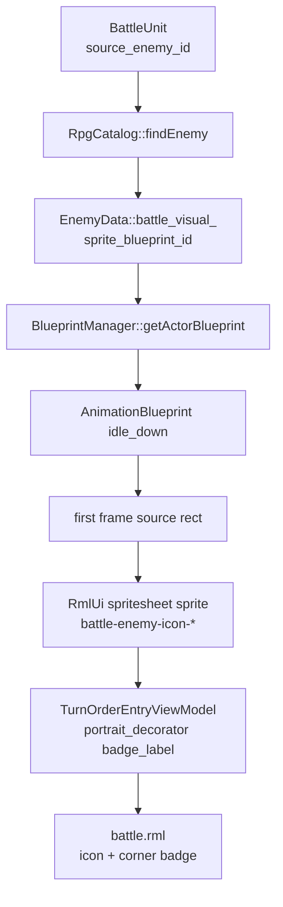

# 行动顺序条敌方图标实现计划

## 目标

在已经完成的 `2.1 行动顺序条` 基础上，把敌方单位从 `E1/E2/E3` 文本 fallback 升级为真实图标：

- 敌方 slot 使用该敌人的 `idle_down` 动画第一帧作为图标。
- 图标右下角显示敌方编号 `1/2/3`。
- 玩家方继续使用现有 portrait 逻辑，不受本阶段影响。
- 只改表现层数据与 RmlUi 展示，不改 `TurnCore`、行动排序、AI 或战斗结算规则。

当前 `assets/data/rpg/enemies.json` 的 `battle_visual.idle_animation` 多数仍是 `idle_right`，但 `assets/data/actor_blueprint.json` 的敌人蓝图通过 `direction` 会生成 `idle_down / idle_up / idle_right`。本阶段的行动顺序条图标应固定优先取 `idle_down`，而不是复用战场 side-view 的 `idle_right`。

## 当前上下文

- `BattleScene::rebuildTurnOrderView()` 已为行动顺序条构建 `TurnOrderEntryViewModel`。
- `TurnOrderEntryViewModel` 当前字段包含 `short_label` 与 `portrait_decorator`；敌人因为 `portraitDecoratorForUnit()` 返回 `none`，所以显示 `E{n}`。
- RML 结构为 `data-style-decorator="entry.portrait_decorator"`，当有 decorator 时可以直接渲染图像。
- RmlUi 的 `image(...)` decorator 可以引用 `@spritesheet` 中定义的 sprite，也可以引用整张图片路径；如果要裁剪动画第一帧，需要把对应 frame 注册成 spritesheet sprite。
- 敌方战斗精灵已经通过 `EnemyData::battle_visual_` 关联到 actor blueprint，战场渲染也已经走 `blueprint_manager_ -> animations_ -> applyAnimationFrame()` 这条链路。

## 数据流



## 方案选择

采用“静态 RCSS spritesheet + C++ 运行时解析”的混合方案：

- 新增 `ui/rmlui/theme/battle_enemy_icons.rcss`，为当前敌人资源声明 `@spritesheet` 与 sprite 名称。
- `BattleScene` 不硬编码 texture path 和坐标，只根据 `source_enemy_id -> battle_visual.sprite_blueprint_id -> idle_down 第一帧` 推导应使用的 sprite 名称。
- sprite 名称使用稳定规则，例如 `battle-enemy-icon-goblin`、`battle-enemy-icon-gnome`、`battle-enemy-icon-slime`。
- 若后续新增敌人，只需要补对应 RCSS spritesheet 条目；C++ 逻辑仍按相同命名规则解析 decorator。

不在本阶段做运行时动态生成 RCSS 或动态注册 spritesheet。RmlUi 的 stylesheet 在文档加载时合并，动态追加样式需要更多 runtime 支持，当前收益不高。

## 数据契约

### ViewModel 字段

扩展 `TurnOrderEntryViewModel`：

```cpp
Rml::String badge_label{};
```

字段语义：

- `portrait_decorator`：图标 decorator。玩家沿用现有 portrait；敌人优先使用 `image(battle-enemy-icon-*)`。
- `short_label`：只作为“没有图标时的居中文本 fallback”。敌人图标解析成功时必须为空。
- `badge_label`：右下角脚标。敌人图标解析成功时为 `1/2/3`；敌人图标缺失并回退到 `E1/E2/E3` 时可为空，避免重复显示。

刷新比较必须把 `badge_label` 纳入 `operator==` 或自定义比较，避免角标变化时 RmlUi 不刷新。

### 编号规则

沿用当前行动顺序条的敌方 side index 规则：

- 在 `turn_order` 中按出现顺序递增。
- 第一名敌人 badge 为 `1`，第二名为 `2`。
- 这样当前 `E1/E2/E3` 迁移后语义保持一致，不额外引入 troop slot 编号或战场坐标排序。

如果未来目标选择菜单也要显示同一编号，再抽出 `BattleEnemyDisplayIndexResolver`，不要在本阶段扩大范围。

## 图标解析

新增一个小型 helper，建议先放在 `battle_scene.cpp` 匿名 namespace，避免为单一 UI 需求提前拆文件：

```cpp
struct BattleEnemyIconDescriptor {
    Rml::String decorator{"none"};
    bool available{false};
};
```

建议 helper：

- `battleEnemyIconSpriteName(std::string_view sprite_blueprint_id)`  
  把蓝图 id 规范化为 RmlUi sprite 名称：`battle-enemy-icon-` + 小写字母数字与 `-`。当前 `goblin/gnome/slime` 会直接得到稳定名称。
- `findEnemyIdleDownAnimation(const ActorBlueprint& blueprint)`  
  优先查 `idle_down`，缺失时查 `idle`，再缺失才失败。`idle` fallback 只服务于没有 `direction` 展开的简单蓝图；当前 goblin / gnome / slime 都会生成 `idle_down`，不会走 bare `idle` 常规路径。
- `enemyTurnOrderIconDecorator(const BattleUnit& unit, const RpgCatalog* rpg_catalog, const BlueprintManager* blueprint_manager)`  
  检查 `source_enemy_id`、`battle_visual.valid()`、actor blueprint 存在、`idle_down` 动画存在且 `frames_` 非空。成功返回 `image(battle-enemy-icon-*)`；失败返回 `none` 并让调用方继续使用 `E{n}` fallback。

虽然实际裁剪由 RCSS 完成，C++ 仍要验证 blueprint 和 `idle_down` 存在。这样配置错误时不会生成一个 RmlUi 无法解析的 decorator，也能保留现有文本 fallback。

## RCSS 资源

新增 `ui/rmlui/theme/battle_enemy_icons.rcss`：

```css
@spritesheet battle-enemy-goblin-icons {
    src: ../../../assets/farm-rpg/Enemy/Goblins/Archer Goblin/Idle.png;
    battle-enemy-icon-goblin: 0px 0px 32px 32px;
}
```

当前资源对应关系：

- `goblin`：`assets/farm-rpg/Enemy/Goblins/Archer Goblin/Idle.png`，`idle_down` 第一帧为 `0px 0px 32px 32px`。
- `gnome`：`assets/farm-rpg/Enemy/Goblins/Spear Goblin/Idle.png`，`idle_down` 第一帧为 `0px 0px 32px 32px`。
- `slime`：`assets/farm-rpg/Enemy/Slimes/Blue/Slime/Idle.png`，`direction` 是 `left/down/up`，所以 `idle_down` 第一帧为 `0px 32px 32px 32px`。

在 `ui/rmlui/scenes/battle.rml` 中新增 link：

```xml
<link type="text/rcss" href="../theme/battle_enemy_icons.rcss"/>
```

放在 `portrait.rcss` 之后、`battle.rcss` 之前，便于场景样式只负责布局和状态。

## RML / RCSS 布局

更新 `battle.rml`：

- 在 `.battle-turn-order-portrait` 内继续显示 `short_label`。
- 在 `.battle-turn-order-entry` 内、`.battle-turn-order-portrait` 同级新增右下角 badge。不要把 badge 放进 portrait 内部，否则 portrait 的 `overflow: hidden` 会裁掉外突的角标。

```xml
<div class="battle-turn-order-entry" ...>
    <div class="battle-turn-order-portrait" data-style-decorator="entry.portrait_decorator">
        <span class="battle-turn-order-label" data-if="entry.short_label != ''">{{ entry.short_label }}</span>
    </div>
    <span class="battle-turn-order-badge" data-if="entry.badge_label != ''">{{ entry.badge_label }}</span>
</div>
```

更新 `battle.rcss`：

- `.battle-turn-order-entry` 增加 `position: relative;`，作为 badge 的定位上下文。
- `.battle-turn-order-portrait` 增加 `overflow: hidden; image-color: #ffffffff;`，只裁剪 icon 本体，不裁剪 badge。
- `.battle-turn-order-badge` 使用 `position: absolute`，固定 `left/top/width/height`，不要改变 slot 尺寸。
- badge 建议尺寸 `9dp x 9dp`，位置 `left: 18dp; top: 19dp`。这里优先用显式 `left/top`，避免依赖 RmlUi 对 `right/bottom` 的定位细节。
- badge 使用深色半透明背景、1dp 边框与 shadow 字体，保证在亮色像素上可读。
- KO / acted 状态下 badge 与 icon 一起降透明度或降亮度，但 current 的金色边框仍优先可见。
- acted / KO 图标暗化必须显式覆盖 `image-color`：

```css
.battle-turn-order-entry.acted-turn-entry .battle-turn-order-portrait {
    image-color: #ffffff77;
}

.battle-turn-order-entry.ko-turn-entry .battle-turn-order-portrait {
    image-color: #ffffff44;
}
```

注意遵守 RmlUi RCSS 规则：

- 不写 `border: 1dp solid ...`。
- 不使用 `font-style: italic`。
- 绝对定位不要依赖 `left + right` 或 `top + bottom` 自动拉伸。

## 实现步骤

1. 新增敌方 icon spritesheet
   - 添加 `ui/rmlui/theme/battle_enemy_icons.rcss`。
   - 为 `goblin / gnome / slime` 定义 `battle-enemy-icon-*` sprite。
   - 在 `battle.rml` link 该文件。

2. 扩展 ViewModel
   - 在 `TurnOrderEntryViewModel` 增加 `badge_label`。
   - 在 `ensureDataTypesRegistered()` 注册 `badge_label`。
   - 确认相等比较覆盖 `badge_label`。

3. 添加 icon helper
   - 增加 sprite 名称规范化 helper。
   - 增加敌方 `idle_down` 图标 decorator 解析 helper。
   - 解析失败时返回 `none`，只记录 debug/warn 中必要的信息，避免每帧刷屏。

4. 更新 `rebuildTurnOrderView()`
   - 玩家方逻辑保持不变。
   - 敌方先尝试 `enemyTurnOrderIconDecorator()`。
   - 成功：`portrait_decorator=image(battle-enemy-icon-*)`，`short_label=""`，`badge_label=std::to_string(side_index + 1)`。
   - 失败：维持当前 `short_label=E{n}`，`badge_label=""`。

5. 更新 RML / RCSS
   - RML 增加 badge span。
   - RCSS 增加 badge 样式与状态样式。
   - 保持 slot 固定尺寸，避免行动队列刷新时跳动。

6. 补充测试
   - `BattleSceneSmokeTest`：检查 `badge_label` 注册与 RML 绑定。
   - `BattleSceneSmokeTest`：检查 `battle_enemy_icons.rcss` 被 link。
   - `BattleSceneSmokeTest`：检查 RCSS 存在 `battle-enemy-icon-goblin / gnome / slime`。
   - `BattleSceneSmokeTest`：检查源码包含 `idle_down` 图标解析路径，并且仍保留 `turnOrderFallbackLabel()` fallback。
   - 新增资源 smoke test：遍历项目 RPG catalog 的敌人，确认每个有效 `battle_visual.sprite_blueprint_id` 都能在 actor blueprint 中找到 `idle_down` 动画。
   - 同一个资源 smoke test 同步检查 `battle_enemy_icons.rcss` 中存在 `battle-enemy-icon-<sprite_blueprint_id>`，避免新增敌人后静默退回 `E{n}`。

7. 构建与验证
   - 运行 `ninja -C build game_tests`。
   - 运行过滤测试：`./build/tests/game_tests --gtest_filter='*BattleSceneSmoke*:*RpgCatalog*'`。
   - 运行 `ninja -C build battle_tester`。
   - 打开 `battle_tester`，确认敌方行动顺序 slot 显示像素图标，右下角编号清晰，current / acted / KO 状态仍正确。

## 待办清单

- [ ] 新增 `ui/rmlui/theme/battle_enemy_icons.rcss`。
- [ ] 在 `battle.rml` 引入敌方 icon spritesheet。
- [ ] `TurnOrderEntryViewModel` 增加 `badge_label`。
- [ ] 注册并绑定 `badge_label`。
- [ ] 新增敌方 icon decorator 解析 helper。
- [ ] `rebuildTurnOrderView()` 使用敌方 icon，失败时保留 `E{n}` fallback。
- [ ] `battle.rml` 新增右下角 badge 元素。
- [ ] `battle.rcss` 新增 badge 样式和状态样式。
- [ ] 补充 `BattleSceneSmokeTest`。
- [ ] 补充敌方 `idle_down` 与 `battle_enemy_icons.rcss` 资源 smoke test。
- [ ] 运行 `ninja -C build game_tests`。
- [ ] 运行相关过滤测试。
- [ ] 运行 `ninja -C build battle_tester`。
- [ ] 手动截图确认敌方 icon 与编号表现。

## 风险与边界

- 当前计划不修改 `assets/data/rpg/enemies.json` 的 `battle_visual.idle_animation`。战场精灵仍可使用 side-view 的 `idle_right`，行动顺序条单独使用 `idle_down` 作为头像。
- RCSS 中的 frame 坐标需要与 actor blueprint 的 `idle_down` 第一帧保持一致。若未来敌人资源改成不同帧宽或方向顺序，必须同步更新 `battle_enemy_icons.rcss`。
- 如果敌人数量和种类快速增加，静态 RCSS 会开始变笨重；届时再做运行时生成 icon atlas 或 RmlUi stylesheet 注入。
- 本阶段不处理玩家方缺 portrait 时的 P 编号样式，也不把敌方编号接入目标选择菜单。
- 本阶段不改变行动顺序条最多约 9 个 slot 的显示限制。

## 需要确认的问题

暂无阻塞问题。默认采用“敌方 idle_down 第一帧图标 + 右下角数字 badge + 缺资源时保留 `E{n}` fallback”的方案。
