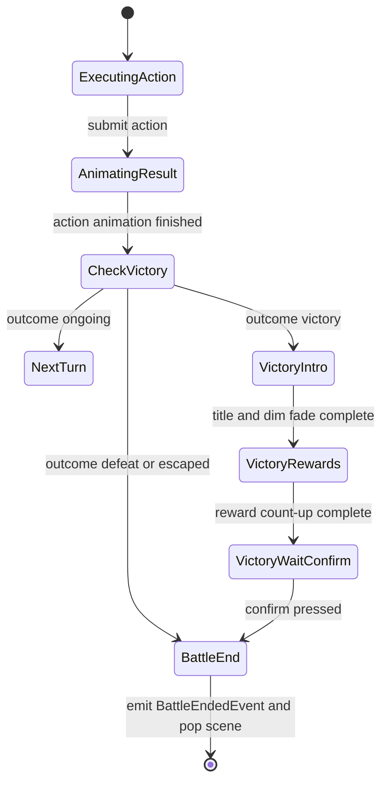

# 4.1 Victory 流程动画开发计划

## 目标

为战斗场景补充 RPG Maker 风格的 Victory 流程动画，让战斗胜利不再直接 `pop scene + GameScene 通知`，而是在战斗场景内完成一段明确的胜利定格、奖励展示与确认退出流程。

第一阶段重点做“胜利演出 + 奖励预览 + 确认关闭”，并为后续角色成长系统预留接口。由于当前项目尚未落地角色经验、等级成长、升级技能习得和对应存档写回，`经验条增长动画 / Level up / 新技能习得` 不建议在本阶段硬编码假逻辑，而是作为第二阶段接入。

- 胜利触发后，先播放已有行动结果动画与 KO 演出，再进入 Victory 流程。
- 战场变暗，存活玩家角色进入胜利定格姿势或轻微庆祝 pose。
- 屏幕显示 `Victory!` 大字，随后展示本场已可写回奖励：Gold、掉落物。
- 玩家第一次按确认键可跳过 Intro / count-up，第二次确认后再发送 `BattleEndedEvent` 并弹出战斗场景。
- 奖励随机掉落只结算一次，战斗内 Victory 画面与 `GameScene` 写回必须使用同一份奖励结果。
- 后续接入成长系统后，再扩展 EXP 展示、经验条增长、升级弹窗和新技能习得列表。

## 当前上下文

- `BattleScene::runStateMachine()` 当前流程为：
  - `ExecutingAction` 提交 `BattleSession::submitAction()`
  - `AnimatingResult` 等待 `BattleAnimationDirector` 完成
  - `CheckVictory` 发现 `session_.outcome() != Ongoing`
  - 直接进入 `BattleEnd`
  - `requestBattleEnd()` 立即触发 `BattleEndedEvent` 并 `requestPopScene()`
- `BattleAnimationDirector` 已支持行动者位移、受击、KO 透明/旋转持久 pose。Victory 流程应复用它留下的 KO 姿态，不要重置敌方倒下表现。
- `BattleScene` 已有 RmlUi data model、输入上下文、菜单输入监听、`result_text_`、滚动战斗日志、行动顺序条、队伍 HUD 和命令面板。
- `BattleRewardResolver` 已能从 `BattleOutcome::Victory + final_units + RpgCatalog` 汇总 `exp_total / gold_total / item_drops`，但当前写回只使用了 gold 和 item drops，`exp_total` 还没有角色成长落点。
- `GameScene::onBattleEnded()` 收到事件后调用 `processBattleEndedForGameScene()`，负责：
  - 写回战斗内道具库存差异
  - 胜利时写回金币和掉落
  - 推进任务进度
  - 显示探索场景里的奖励/任务通知
- `BattleEndedEvent` 当前只携带 `outcome / final_units / remaining_item_stocks`。如果 Victory 画面要展示掉落结果，必须避免在 `BattleScene` 和 `GameScene` 各自 roll 一次掉落。
- `ui/rmlui/scenes/battle.rml` 与 `battle.rcss` 已承载全部战斗 HUD；Victory overlay 适合放在同一 RML 文件的顶层，绑定 `victory_visible` 等字段，不参与普通命令焦点。

## 设计边界

本计划做：

- 新增战斗场景内 Victory presentation 状态，不再胜利后立即退出。
- 新增 Victory overlay data model 与 RCSS。
- 新增 Victory 流程控制器，管理阶段计时、奖励数字滚动、确认门禁。
- 新增奖励摘要在战斗结束事件中的传递，保证展示与写回一致。
- Victory 时由 `BattleScene` 强制填充已结算奖励摘要，`GameScene` 只消费事件中的摘要，不再二次 resolve 掉落。
- 进入 Victory 时处理一次性胜利音频：淡出当前 BGM，播放 Victory ME 或胜利音效。

本计划不做：

- 不在本阶段新增完整角色成长组件、经验存档 schema、等级曲线表。
- 不在本阶段实际提升角色等级或学习技能。
- 不在本阶段展示 EXP 或经验条；`BattleRewardSummary::exp_total` 继续作为后续成长系统输入保留。
- 不做复杂可翻页结算界面；第一阶段只显示一屏奖励摘要。
- 不引入新的 UI scene；Victory overlay 作为 `BattleScene` 的一个子状态。
- 不改写回合制领域规则和胜负判定规则。
- 不改 Defeat / Escaped 退出路径；失败和逃跑仍走当前即时 `BattleEnd -> pop scene`，未来可单独补失败/逃跑演出。

## 目标流程



关键点：

- `Defeat / Escaped` 第一阶段可以继续沿用当前即时退出或后续单独做失败/逃跑演出。
- Victory 流程发生在 `BattleScene` 内，`BattleEndedEvent` 只在玩家确认后发送。
- 如果未来需要自动关闭，可在 `VictoryWaitConfirm` 中增加超时策略，但第一阶段建议等待玩家确认。

## 数据契约

### BattleEndedEvent 扩展

建议扩展 `src/game/defs/events.h`：

```cpp
struct BattleEndedEvent {
    game::battle::BattleOutcome outcome{game::battle::BattleOutcome::Ongoing};
    std::vector<game::battle::BattleUnit> final_units{};
    std::unordered_map<entt::id_type, int> remaining_item_stocks{};
    std::optional<game::battle::BattleRewardSummary> reward_summary{};
};
```

语义：

- `reward_summary` 在 Victory 路径上必须由 `BattleScene` 填充；`RpgCatalog` 不可用时填充空摘要并记录 warn，不回退到 `GameScene` 二次结算。
- 非 Victory 事件保持 `std::nullopt`。
- `BattleScene` 在 Victory 路径上必须填充 `reward_summary`，`GameScene` 对 Victory 事件直接消费该字段，不再二次 resolve 掉落。

注意：

- `BattleRewardSummary` 中的掉落是随机结果，不能在显示和写回时分别 resolve。
- `BattleRewardResolver` 当前内部使用随机引擎。若 Victory 画面展示掉落，`GameScene` 必须使用事件携带的同一份 `item_drops`。
- `BattleRewardSummary::empty()` 仅表示“本次摘要没有奖励数值”，不作为“是否已结算”的 sentinel，判断已结算应只看 `reward_summary.has_value()`。

### Victory 奖励 ViewModel

`BattleScene` 内新增 RmlUi view model：

```cpp
struct VictoryRewardItemViewModel {
    int entry_index{0};
    Rml::String label{};
    Rml::String count_text{};
};

struct VictoryViewModel {
    bool visible{false};
    Rml::String title{"Victory!"};
    Rml::String gold_text{"Gold 0"};
    Rml::String prompt_text{};
    bool rewards_visible{false};
    bool confirm_visible{false};
};
```

`BattleScene` 持有：

```cpp
std::optional<game::battle::BattleRewardSummary> victory_reward_summary_{};
VictoryViewModel victory_view_{};
std::vector<VictoryRewardItemViewModel> victory_reward_items_{};
```

条目展示规则：

- Gold：`Gold {animated_gold}`。
- Items：按 `BattleRewardSummary::item_drops` 展示，名称优先通过 `ItemCatalog` 查 `display_name_`，找不到用原始 `item_id`。
- 如果无掉落，items 区域可以显示 `No items`，但不要把整个奖励窗做成空白。

### Victory 流程控制器

建议新增纯表现 helper：

- `src/game/scene/battle_victory_flow_controller.h`
- `src/game/scene/battle_victory_flow_controller.cpp`

核心职责：

```cpp
enum class BattleVictoryFlowPhase {
    Inactive,
    Intro,
    Rewards,
    WaitConfirm,
    Finished
};

struct BattleVictoryFlowSnapshot {
    BattleVictoryFlowPhase phase{BattleVictoryFlowPhase::Inactive};
    float dim_alpha{0.0f};
    float title_scale{1.0f};
    float title_alpha{0.0f};
    int displayed_gold{0};
    bool rewards_visible{false};
    bool confirm_visible{false};
};

class BattleVictoryFlowController final {
public:
    void reset();
    void begin(const game::battle::BattleRewardSummary& reward_summary);
    void update(float delta_time_seconds);
    void confirm();

    [[nodiscard]] BattleVictoryFlowSnapshot snapshot() const;
    [[nodiscard]] bool active() const;
    [[nodiscard]] bool waitingForConfirm() const;
    [[nodiscard]] bool finished() const;
};
```

推荐时间轴：

| 阶段 | 时长 | 表现 |
|---|---:|---|
| Intro | 0.65s | 战场 dim 从 0 到 0.55，`Victory!` 从 1.35x 缩放到 1.0x 并淡入 |
| Rewards | 0.85s | 奖励面板淡入，Gold 从 0 count-up 到目标值 |
| WaitConfirm | 无限 | 显示确认提示，等待玩家输入 |

计数动画：

- `displayed_gold = round(gold_total * ease(t))`
- 掉落列表不逐个滚动，随奖励面板一起出现。
- 第一次 confirm 在 Intro / Rewards 阶段时应直接跳过到 `WaitConfirm`，并把 `displayed_gold` 设为最终值。
- 第二次 confirm 在 `WaitConfirm` 阶段才真正结束 Victory 流程。

## BattleScene 集成

### FlowState 调整

将 Victory 收敛为单个 `VictoryFlow`，由 `BattleVictoryFlowController::snapshot().phase` 区分 Intro / Rewards / WaitConfirm。这样 `BattleScene` 的流程状态机保持短平，计时细节集中在 controller：

```cpp
enum class FlowState {
    WaitingForInput,
    ExecutingAction,
    AnimatingResult,
    CheckVictory,
    VictoryFlow,
    NextTurn,
    BattleEnd
};
```

状态机规则：

- `CheckVictory`
  - `Ongoing` -> `NextTurn`
  - `Victory` -> `beginVictoryFlow()` -> `VictoryFlow`
  - `Defeat / Escaped` -> `BattleEnd`
- `VictoryFlow`
  - 每帧 `victory_flow_controller_.update(delta_time)`
  - controller `finished()` 后进入 `BattleEnd`
  - 等待确认期间吞掉普通战斗菜单输入，只响应 confirm
- `BattleEnd`
  - 调用 `requestBattleEnd()`，事件携带 `victory_reward_summary_`

### beginVictoryFlow()

新增私有方法：

```cpp
void beginVictoryFlow();
void updateVictoryFlow(float delta_time);
void rebuildVictoryView();
void confirmVictoryFlow();
```

`beginVictoryFlow()` 逻辑：

- `leaveInputMenu()`
- 清除 `command_focus_actor_id_`
- 隐藏状态 tooltip
- 通过 `BattleRewardResolver` 结算 `victory_reward_summary_`
- 初始化 `victory_flow_controller_`
- 调用一次性胜利音频处理：先淡出当前 BGM，再播放 Victory ME / 胜利音效
- 追加战斗日志：`Victory!` 或 `Party is victorious!`
- 刷新 Victory view model

奖励结算：

```cpp
if (rpg_catalog_) {
    game::battle::BattleRewardResolver resolver{};
    victory_reward_summary_ = resolver.resolve(session_.outcome(), session_.units(), *rpg_catalog_);
} else {
    spdlog::warn("BattleScene: RPG catalog 不可用，Victory 奖励摘要按空结果处理。");
    victory_reward_summary_ = game::battle::BattleRewardSummary{};
}
```

### requestBattleEnd()

修改 `requestBattleEnd()`：

```cpp
event.reward_summary = victory_reward_summary_;
```

注意：

- `remaining_item_stocks` 仍然每种 outcome 都写入，用于道具消耗回写。
- 非 Victory 的 `reward_summary` 应保持 `std::nullopt`。
- Victory 事件发送前必须保证 `reward_summary.has_value()`。

### 输入规则

- Victory flow active 时，`actions_enabled_ = false`，普通 PartyCommand / ActorCommand / List / Target 全部隐藏。
- `onMenuConfirmPressed()`
  - 若 `state_ == FlowState::VictoryFlow`，调用 `confirmVictoryFlow()` 并返回 true。
  - controller 内部负责：Intro / Rewards 阶段第一次确认直接跳过动画并进入 `WaitConfirm`，`WaitConfirm` 阶段第二次确认完成退出。
- `onMenuCancelPressed()`
  - Victory flow 中吞掉输入，不关闭 scene。
- 鼠标点击：Victory overlay 提供 `Continue` 按钮，绑定 `victory_continue()`；进入 `WaitConfirm` 后必须主动 `Focus()` 到该按钮，保证键盘/手柄确认键可用。

## Victory 角色 Pose

第一阶段不必新增精灵动画资源，也不要求蓝图存在 `victory` animation。推荐用现有 pose 系统做轻量表现：

- 新增 `victoryPoseFor(unit_id, side)`，只作用于存活玩家单位。
- `presentationPoseFor()` 优先级：
  - `battle_animation_director_.poseFor(unit_id)`
  - `victoryPoseFor(unit_id, side)`
  - `commandFocusPoseFor(unit_id, side)`
- Victory pose 表现：
  - 存活玩家轻微上浮循环：`offset.y = -2dp + sin(elapsed * tau * 1.2) * 2dp`
  - 颜色略提亮：`FColor{1.08, 1.05, 0.86, 1.0}`
  - 不移动敌方 KO pose，保留倒下状态。

后续如果蓝图支持 `victory` 动画，再扩展为：

- `BattleSpriteComponent` 记录 idle animation 与 optional victory animation。
- 进入 Victory 时对存活玩家切换到 `victory`，缺失则回退 pose。

## UI 布局

在 `ui/rmlui/scenes/battle.rml` 顶层新增 overlay，建议放在 `battle-log-panel` 后、`battle-hud` 前或 `body` 末尾：

```xml
<div id="battle-victory-overlay" data-if="victory.visible">
    <div id="battle-victory-dim"></div>
    <div id="battle-victory-title">{{ victory.title }}</div>
    <div id="battle-victory-rewards" data-if="victory.rewards_visible">
        <div class="battle-victory-reward-line">{{ victory.gold_text }}</div>
        <div class="battle-victory-item-row" data-for="item : victory_reward_items">
            <span class="battle-victory-item-name">{{ item.label }}</span>
            <span class="battle-victory-item-count">{{ item.count_text }}</span>
        </div>
    </div>
    <button id="battle-victory-continue"
            class="battle-text-button tf-nav-auto"
            data-if="victory.confirm_visible"
            data-event-click="victory_continue()">{{ victory.prompt_text }}</button>
</div>
```

RCSS 约束：

- `#battle-victory-overlay` 显式 `left/top/width/height = 0/0/640dp/360dp`，不要用 `right/bottom` 隐式拉伸。
- dim 层用半透明黑色，不用渐变 orb。
- 标题在中上部，不能遮住底部 HUD 奖励信息。
- 奖励面板居中偏下，但不要做成嵌套卡片；只用一层面板。
- `Continue` 是真实按钮，设置 `tab-index: auto` 或复用 `tf-nav-auto`。
- 字体大小在 640x360 下稳定，标题建议 `28dp-32dp`，奖励行 `10dp-12dp`。
- 不使用 `border: 1dp solid ...`；继续用 `border-width` / `border-color`。

推荐尺寸：

- overlay：`640dp x 360dp`
- title：`left: 0; top: 74dp; width: 640dp; height: 42dp`
- rewards：`left: 190dp; top: 128dp; width: 260dp; min-height: 92dp`
- continue：`left: 250dp; top: 228dp; width: 140dp; height: 24dp`

## GameScene 写回调整

`processBattleEndedForGameScene()` 中 Victory reward 写回应改为接收事件内摘要：

```cpp
const auto reward_result = applyVictoryRewards(registry, services, evt);
```

`applyVictoryRewards()` 内部策略：

- 非 Victory：返回空。
- `evt.reward_summary.has_value()`：使用该 summary 写回 gold/items。
- `GameScene` 对 Victory 事件直接断言摘要存在，不做二次随机结算。

`formatBattleSettlementFeedback()` 不显示 EXP，因为第一阶段 Victory overlay 也不显示 EXP；成长系统落地前不在任何写回通知中暗示经验已持久化。

## 音频方案

Victory 进入 Intro 时补 RPG Maker 风格的一次性音频反馈：

- 在 `game::defs::audio` 增加 `VICTORY_ME_ID`，并在 `assets/data/resource_mapping.json` 的 `sound` 或 `music` 中配置对应资源。
- `BattleScene::beginVictoryFlow()` 调用 `context_.getAudioPlayer().stopMusic(VICTORY_BGM_FADE_OUT_MS)` 淡出当前 BGM。
- 随后播放 Victory ME。若资源作为 sound 加载，调用 `playSound(VICTORY_ME_ID.value())`；若作为短 music 加载，调用 `playMusic(VICTORY_ME_ID.value(), false, 0)`。
- 第一阶段不要求 ME 结束后自动恢复探索 BGM，因为战斗场景确认后会 pop，探索场景的 BGM 恢复策略后续可在 `GameScene` 音乐状态里统一整理。

## 后续成长系统预留

第二阶段建议新增独立计划，而不是塞进 Victory 动画实现：

- `ActorProgressComponent` 或 party actor progress save data：`actor_id / level / exp / learned_skills`。
- `RpgCatalog::ClassData` 增加 exp curve、level params、level skill learns。
- `BattleProgressionResolver`：输入 actor progress + reward summary，输出：
  - 每个 actor 的 exp before/after
  - level up 列表
  - learned skills 列表
  - param growth delta
- `BattleEndedEvent` 或新的 settlement result 携带 progression result。
- Victory overlay 扩展为每个角色经验条逐个增长，并在升级时插入 `Level up!` 子阶段。

第一阶段 ViewModel 可提前预留字段但不显示：

```cpp
std::vector<VictoryActorProgressViewModel> victory_actor_progress_{};
```

不过不建议先注册空数组，除非当次实现马上有测试覆盖。

## 实现步骤

1. 扩展结算事件契约
   - 在 `BattleEndedEvent` 增加 `std::optional<BattleRewardSummary> reward_summary`。
   - 补 include 与编译依赖。
   - 更新相关测试构造，确认不破坏非 Victory 事件。

2. 新增 Victory flow controller
   - 添加 `battle_victory_flow_controller.h/.cpp`。
   - 实现 `begin / update / confirm / snapshot`。
   - 单元测试覆盖 intro、reward count-up、skip-to-confirm、wait confirm、confirm finished。

3. 集成 BattleScene 状态机
   - 增加 `FlowState::VictoryFlow`。
   - `CheckVictory` 中 Victory 进入 `beginVictoryFlow()`。
   - `update()` 中推进 controller。
   - `requestBattleEnd()` 携带 `victory_reward_summary_`。
   - Victory flow 期间关闭菜单、隐藏 target highlight 和状态 tooltip。

4. 注册 RmlUi 数据模型
   - 新增 `VictoryViewModel`、`VictoryRewardItemViewModel`。
   - `ensureDataTypesRegistered()` 注册 struct 和数组。
   - `initUI()` 绑定 `victory` 与 `victory_reward_items`。
   - 注册 `victory_continue` click event。

5. 编写 Victory overlay RML/RCSS
   - 修改 `ui/rmlui/scenes/battle.rml`。
   - 修改 `ui/rmlui/scenes/battle.rcss`。
   - 保持普通 HUD 尺寸稳定，overlay 显示时不挤压既有元素。

6. 增加 Victory pose
   - 在 `BattleScene` 增加 `victory_elapsed_seconds_` 或从 controller snapshot 取时间。
   - 新增 `victoryPoseFor()`，只影响存活玩家。
   - 确保 KO 敌人的 persistent pose 继续生效。

7. 调整 GameScene 奖励写回
   - `applyVictoryRewards()` 只消费 `evt.reward_summary`。
   - 避免重复 roll 掉落。
   - Victory 事件无摘要时直接视为契约错误。

8. 清理旧即时退出行为
   - 确认 `BattleSceneSmokeTest.ContainsStateMachineStages` 更新包含 `VictoryFlow`。
   - 确认 `EmitsBattleEndedEventAndRequestsPop` 仍成立，但事件只在确认后触发。
   - `result_text_` 胜利时可以显示 `Result: Victory`，但主要表现交给 overlay。
   - Defeat / Escaped 继续沿用旧即时退出逻辑。

## 测试计划

### 单元测试

- `tests/game/battle/battle_victory_flow_controller_test.cpp`
  - `BeginStartsIntroWithZeroDisplayedRewards`
  - `UpdateReachesRewardTotals`
  - `ConfirmSkipsIntroAndRewardsToWaitConfirm`
  - `WaitsForConfirmAfterRewardAnimation`
  - `ConfirmFinishesOnlyWhenWaiting`

- `tests/game/game_scene_battle_reward_writeback_test.cpp`
  - 事件带 `reward_summary` 时写回该 summary。
  - 事件带 `reward_summary` 时不再次调用随机掉落 resolver。
  - Victory 事件缺少 `reward_summary` 时触发断言/测试失败。

### 静态 smoke test

更新 `tests/game/battle/battle_scene_smoke_test.cpp`：

- 包含 `FlowState::VictoryFlow`。
- 注册 `VictoryViewModel` 和 `VictoryRewardItemViewModel`。
- 绑定 `victory`、`victory_reward_items`。
- RML 包含 `battle-victory-overlay`、`battle-victory-continue`、`victory_continue()`。
- RCSS 没有 `border: 1dp solid`。

### 集成/手动验证

### 行为测试

- 新增 `BattleSceneVictoryFlowBehaviorTest` 或扩展现有 scene 测试：
  - 模拟最后一击进入 Victory 后，不按确认时 dispatcher 不应收到 `BattleEndedEvent`。
  - 在 Intro / Rewards 阶段第一次 confirm 只跳到 `WaitConfirm`，仍不发送事件。
  - 在 `WaitConfirm` 第二次 confirm 后才发送 `BattleEndedEvent`，且事件包含 `reward_summary`。
  - Defeat / Escaped 仍沿用当前即时退出路径，不进入 Victory overlay。

使用 ninja：

```bash
cmake --build build --target TinyFarmTests -j -- -k 0
ctest --test-dir build --output-on-failure -R "BattleVictory|BattleSceneSmoke|BattleReward"
```

手动验证：

- 进入一场可快速胜利的 troop。
- 击败最后一个敌人后，先看到 KO 演出，再出现 Victory overlay。
- Gold 数字从 0 增长到摘要值。
- 掉落列表和回到探索后的实际背包写回一致。
- 胜利 BGM / ME 切换符合预期。
- 按确认后才退出战斗场景。
- 逃跑和失败不进入 Victory overlay。

## 风险与注意事项

- 掉落随机结果必须单次结算。若实现时遗漏 `reward_summary` 事件传递，会造成 UI 展示和背包写回不一致。
- `BattleScene` 是 push 在探索场景上的 scene，Victory 等待确认期间必须继续持有 Battle 输入上下文，避免 Gameplay 输入穿透。
- Victory overlay 按钮如果参与焦点，需要确认 `tf-nav-auto` 生效；进入 `WaitConfirm` 时必须主动聚焦到 `Continue`，避免键盘确认找不到焦点。
- 第一阶段不显示 EXP，避免在没有角色成长系统时误导玩家。
- 如果 `RpgCatalog` 不可用，Victory overlay 仍应可显示 `Victory!`，奖励摘要按空结果处理并记录 warn。

## 完成标准

- Victory 后不会立即 pop scene，而是出现战斗内 Victory overlay。
- 玩家确认后才发送 `BattleEndedEvent`。
- Victory overlay 展示的 Gold/Items 与 `GameScene` 实际写回一致。
- 第一阶段不展示 EXP，不伪造等级成长。
- Victory Intro 有一次性音频反馈，且不会阻塞确认退出。
- `BattleVictoryFlowController` 有单元测试覆盖。
- `BattleScene` RML/RCSS 接线有 smoke test 覆盖。
- 使用 ninja 构建并通过相关测试。
