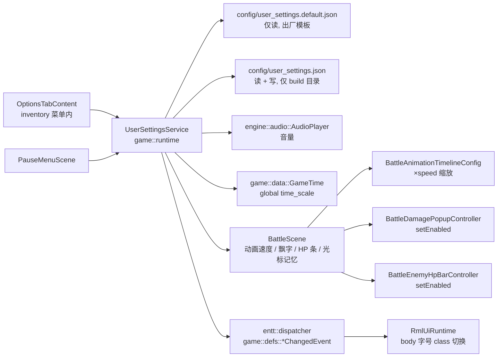

# Inventory 菜单 Options 标签页落地计划

## 元信息
- 任务ID：`INV-OPTIONS-001`
- 任务标题：`InventoryMenu 中实现 Options 标签页：游戏体验与呈现偏好设置`
- 优先级：`P2`
- 状态：`Implemented`（自动化测试 800/800 通过；游戏内手动验收待执行）
- 计划时间：`2026-05-15` 起
- 依赖任务：`无`
- 设计原则：与 `PauseMenuScene` **职能分层**（PauseMenu = 系统级控制；Options = 游戏体验偏好）；引入轻量级 `UserSettingsService`（**game 层**）作为偏好设置的唯一真源；不入存档 schema；不修改 engine 层接口，遵守 `game → engine` 单向依赖（见 `CMakeLists.txt:111-117`，game 依赖 engine，反向禁止）。

## Context

`InventoryMenuScene`（`src/game/scene/inventory_menu_scene.cpp`）的 tabset 已经接入 Inventory / Equipment / Quests / Map 四个标签页内容，唯独 `MenuTabId::Options` 还是 `PlaceholderTabContent`（`inventory_menu_scene.cpp:39-52`、`inventory_menu_scene.cpp:290`），RML 里也只是占位的 `.placeholder-panel`（`ui/rmlui/scenes/inventory_menu.rml:241-244`）。

与此同时 `PauseMenuScene` 已经覆盖了系统级的全部入口：Resume / Save / Load / Title、`game_time_->time_scale_` 的全局倍速、`AudioPlayer::setMusicVolume/setSoundVolume`（见 `pause_menu_scene.cpp:319-353`、`ui/rmlui/scenes/pause_menu.rml`）。因此 Inventory 菜单的 Options 标签不应该是系统暂停面板的副本，而应该承担 JRPG 主菜单里 "Config / System" 的角色——专注 **战斗呈现** 与 **UI 体验** 偏好。

目前的偏好设置基础设施：
- `AudioPlayer` 已提供 `loadConfig / saveConfig`（`audio_player.h:105-106`、`audio_player.cpp:469、535`），但 PauseMenu 改音量后没有任何路径调 `saveConfig`，下次启动还是被 `audio.json` 的默认值覆盖；且 `saveConfig` 只写 `audio.json`，其他偏好（战斗 / UI）没有同等机制。因此引入统一 `UserSettingsService` 仍然必要。
- `engine::core::Config` 有 `loadFromFile / saveToFile`（`config.h:48-49`），但只覆盖窗口 / 渲染 / 性能字段，没有玩家偏好。
- 战斗呈现层已经有可控的旋钮：`BattleAnimationTimelineConfig` 的各个 `*_seconds` 字段（`battle_animation_director.h:31-44`，调用点 `battle_scene.cpp:966-973、2492+`）、`BattleDamagePopupController` 的 spawn 路径、`BattleEnemyHpBarController` 的 reveal/alpha 路径。**这些控制器目前都没有"启用 / 禁用"开关**，需要补一个轻量的 `setEnabled(bool)`。
- `ui/rmlui/theme/base.rcss` 的根 `body` 是 `font-size: 16dp`，**但项目内大量 .rcss 直接硬编码具体 dp**（如 `battle.rcss:64` 的 `24dp`、`inventory_menu.rcss:351` 的 `11dp`、`dialogue_bubble.rcss:22` 的 `16dp`），这些声明不会随 body 字号变化。RmlUi 6.2 原生支持 `em`/`rem` 单位（验证：`external/RmlUi-6.2/Source/Core/PropertyParserNumber.cpp:15-16`），干净解法是把硬编码 `Xdp` 迁移到 `Xrem`（相对 body）。
- `game::data::GameTime::time_scale_`（`src/game/data/game_time.h:49`）是 game 层数据；engine 的 `GameApp` 无法直接持有或修改它。global time scale 的 apply 必须由 game 层托管（这是把 service 放 game 层的关键约束之一）。



## Goals

- 在 `InventoryMenuScene` 的 Options 标签内提供 **5 项偏好设置**，并能在游戏内即时生效：
  1. 战斗动画速度（×1 / ×1.5 / ×2 / ×3）
  2. 伤害飘字显示开关
  3. 敌方 HP 条显示开关
  4. UI 字号（Small / Normal / Large）
  5. 光标记忆（Cursor Memory）：战斗中"记住上次选的指令 / 技能 / 目标"
- 引入 `game::runtime::UserSettingsService`（game 层）作为偏好设置的唯一真源；持久化方案：source 提交 `config/user_settings.default.json` 作出厂模板，runtime 写回到 build 目录的 `config/user_settings.json`（**不**进 source repo，避免 `CopyConfig.cmake` 覆盖玩家修改）；启动时 apply 到各子系统，运行中 setter 立即生效并 dirty-flag 写回。
- `PauseMenuScene` 的音量 / 全局倍速调节改为通过 `UserSettingsService`，做到"两边改、一处存"；旧 `audio.json` 作为出厂默认保留，用户值落在 `user_settings.json`。
- `MenuTabId::Options` 的 placeholder 替换为真实 `OptionsTabContent`，RML / RCSS 完整；键盘 / 手柄方向键可在选项行之间导航并修改取值（与现有 `tf-nav-auto` 体系一致）。
- 单元测试覆盖：`UserSettingsService` JSON roundtrip、字段范围 clamp、缺失字段 fallback；`OptionsTabContent` 源码层关键字符串断言；战斗呈现层的 `setEnabled`/速度缩放在 controller 单测中验证。
- 文档：在 `docs/` 下追加一篇 `gameplay/options.md` 简述 Options 项的语义与持久化策略。

## Non-Goals

- 不实现窗口配色 / 主题切换（RmlUi 6.2 无 CSS variables，全 RCSS 改动量大，留待独立计划）。
- 不实现对话气泡逐字滚动（"消息速度"选项）：当前 `DialogueBubbleView::setText` 即时呈现，typewriter 需要新增 controller 状态机，单独立项。
- 不实现键位重绑或键位查看页面。
- 不实现难度切换、语言切换。
- 不引入 Save 按钮 / Apply 按钮等显式提交动作；所有改动 **立即生效** 并标记 dirty，菜单关闭时一次性 flush 写回 JSON（避免每个 setter 都 IO）。
- 不修改任何 save schema 字段（settings 是 global 偏好，不入 v4 存档）。
- 不在 Options Tab 里复制 PauseMenu 已有的 Resume / Save / Load / Title 入口。
- 不接入 ImGui debug panel UI；本计划只覆盖正式 RmlUi 路径。

## Decisions

- **服务归属（关键）**：`UserSettingsService` 放在 **game 层**（`src/game/runtime/`），不放 engine。理由：
  1. 项目依赖方向是 `game → engine` 单向（`CMakeLists.txt:111-117`），engine 不能 include game。
  2. 需要 apply 的 `game::data::GameTime::time_scale_` 与 `BattleScene` 都在 game 层；如果 service 在 engine，它无法持有 `GameTime&` 或派发 `game::defs::*ChangedEvent`。
  3. 由 service 反向调 `engine::audio::AudioPlayer::setMusicVolume(...)`、`engine::ui::rmlui::RmlUiRuntime::applyBodyFontScaleClass(...)` 等公开 setter 即可——这是合法的 game → engine 调用。
- **设置项归属**：放在 Options Tab 的全部都是"非系统级"偏好。音量与全局倍速虽然 PauseMenu 已有，但因为决定让 `UserSettingsService` 成为唯一真源，它们也会进入 `user_settings.json`；**不**在 Options Tab 里重复显示音量/倍速控件，避免冗余。
- **持久化策略（关键，避免 CopyConfig.cmake 覆盖玩家修改）**：
  - source 提交 `config/user_settings.default.json` 作为出厂模板；CopyConfig.cmake 会把它复制到 build 目录。
  - service 启动时优先尝试加载 build 目录的 `config/user_settings.json`；若不存在则退回 `config/user_settings.default.json`；若两者都缺，使用代码内默认值。
  - setter 写回**始终**写到 build 目录的 `config/user_settings.json`；source 目录**不会**有此文件。
  - 这样 `CopyConfig.cmake`（`cmake/CopyConfig.cmake:17、37`）的 MD5 比对路径里就只有 `.default.json`，不会触碰玩家写的 `user_settings.json`；保留 CopyConfig 现状即可，不改 cmake 脚本。
  - `.gitignore` 追加 `config/user_settings.json` 以防开发者误提交。
- **持久化时机**：
  - 启动：`UserSettingsService` 在 `GameRuntimeAssembler` 中构造（紧邻 `GameTime` 创建之后）；构造时 `load()`，并立即 apply 到 `AudioPlayer` / `GameTime::time_scale_` / 缓存到 service 自身字段（battle / ui 偏好稍后由各 scene `init()` 时拉取）。
  - 运行：setter 调用立即生效并把内部 `dirty_` 置 true。
  - 写回：`Options` 标签 `onDeactivated()` / `InventoryMenuScene::clean()` / `PauseMenuScene::clean()` 触发一次 `flushIfDirty()`；`GameRuntimeAssembler::shutdown`（或它在 `GameApp` 退出时被调用的等效钩子）兜底再 flush 一次。engine 层 `GameApp` 本身**不**直接持有 service。
- **战斗动画速度的实现路径**：**不复用** `game_time_->time_scale_`（那是全局时间倍速、PauseMenu 已占用）；而是让 `BattleScene::animationConfigForPlan()` 在返回 `BattleAnimationTimelineConfig` 前，把 `attack_duration_seconds / action_hold_seconds / cast_duration_seconds / hit_feedback_duration_seconds / weapon_*_seconds / impact_time_seconds / minimum_duration_seconds` 这一批 `*_seconds` 字段统一除以 `battle_animation_speed_`。`duration_seconds` 若为 0 走 `minimum_duration_seconds` 兜底也同样按 speed 缩放。
- **战斗飘字 / HP 条开关的实现路径**：在 `BattleDamagePopupController` 和 `BattleEnemyHpBarController` 各加一个 `bool enabled_{true}` 与 `setEnabled(bool)`；`enabled_ == false` 时：
  - DamagePopup：`spawnFromResult()` 早返回；`update()` 仍正常推进 / 清空已存在的 popup，避免切换瞬间残留。
  - EnemyHpBar：`revealFromResult()` 不更新 `visible_seconds_remaining`；`syncFromSnapshot()` 仍更新内部 `target_ratio`（保持数据一致），但 `update()` 中 alpha 推向 0 直至完全隐藏；`setHighlightedTarget` 也不写 alpha。
- **UI 字号实现路径（关键，仅靠 body class 不够）**：项目内大量 `.rcss` 硬编码具体 `Xdp` 的 `font-size`（已验证 `battle.rcss:64`、`inventory_menu.rcss:351`、`dialogue_bubble.rcss:22` 等），单纯给 `<body>` 加 class 不会让这些位置随字号变化。解法分两步：
  1. **底层迁移到 `rem` 单位**：在 Phase 4 把项目内所有 `.rcss` 中显式 `font-size: Xdp` 改为 `font-size: Yrem`（`Y = X/16`，因为 body 默认 16dp）；RmlUi 6.2 原生支持 `rem` 单位（验证 `external/RmlUi-6.2/Source/Core/PropertyParserNumber.cpp:15-16`）。这样所有 font-size 都跟随 body 字号缩放。
  2. **body class 切换根字号**：`ui/rmlui/theme/base.rcss` 追加 `body.tf-font-small { font-size: 14dp; } body.tf-font-normal { font-size: 16dp; } body.tf-font-large { font-size: 18dp; }`。
  3. 切换由 `UserSettingsService::setUiFontScale` 派发 `game::defs::UiFontScaleChangedEvent`；订阅者 `RmlUiRuntime` 提供新接口 `applyBodyFontScaleClassToAllDocuments(UiFontScale)`，把三个 class 在所有已加载文档的 `<body>` 上互斥替换。
  4. 新文档 load 完成时通过 `RmlDocumentController::load()` 统一应用当前 scale class，保证跨 Scene 一致。
  - 已枚举需迁移的 `.rcss` 文件清单见"影响范围"小节。
- **光标记忆的实现路径**：在 `BattleScene` 中新增四个映射：`last_actor_command_per_actor_`（值类型 `int`，存的是 `static_cast<int>(ActorCommandId)`；现状 `ActorCommandId` 是 `battle_scene.cpp:89` 匿名命名空间私有 enum，本计划**不**把它移头文件，直接用 `int` 存）、`last_skill_per_actor_`（`game::battle::SkillId` 或 string，按 BattleScene 现有 list 元素类型决定）、`last_item_per_actor_`（`game::data::ItemId`，按现有类型）、`last_target_per_actor_`（`game::battle::BattleUnitId`）。进入 actor command 子菜单时若 `cursor_memory_enabled_` 为 true，则把焦点 / 默认 list_index 设到上次值；战斗结束清空。该开关默认 **打开**。
- **PauseMenu 的兼容**：PauseMenu 的 `adjustMusicVolume / adjustSoundVolume / adjustTimeScale` 改为调用 `UserSettingsService::setMusicVolume / setSoundVolume / setGlobalTimeScale`；service 内部再调 `AudioPlayer::setMusicVolume` 等。`refreshVolumeLabels()` 数据源不变（仍读 `AudioPlayer::getMusicVolume()`），但写入路径换成 service。
- **Options 焦点流**：每行一个控件（Stepper 或 Toggle 或 Choice），上下方向键在行间切换，左右键调整当前行取值（Stepper / Choice 双向，Toggle 仅切 on/off）。沿用现有 `tf-nav-auto / tf-focus-ring-blue / tf-focus-ring-gold` 样式；不引入额外焦点状态机。
- **不破坏现有存档**：偏好不入 save，旧存档进入新 Options 标签直接读取 `user_settings.json`。

## 影响范围

### 修改的数据文件
| 文件 | 修改内容 |
|------|----------|
| `config/user_settings.default.json`（**新增，进 source repo**） | 出厂模板：`{"audio": {"music_volume": 0.5, "sound_volume": 0.3}, "time": {"global_scale": 1.0}, "battle": {"animation_speed": 1.0, "show_damage_popup": true, "show_enemy_hp_bar": true, "cursor_memory": true}, "ui": {"font_scale": "normal"}}`。会被 CopyConfig.cmake 复制到 build 目录。 |
| `config/user_settings.json`（**仅 build 目录, runtime 创建, 不进 source**） | 玩家偏好实际写入位置；source 不含此文件，CopyConfig.cmake 不会覆盖之。 |
| `.gitignore` | 追加 `config/user_settings.json` 以防误提交。 |

### 新增的源代码文件
| 文件 | 用途 |
|------|------|
| `src/game/runtime/user_settings.h` | `UserSettings` POD（音量、global_time_scale、battle 偏好、UI font scale），含范围常量与 `BATTLE_ANIMATION_SPEED_CHOICES`、`clampToNearestChoice` 工具函数 |
| `src/game/runtime/user_settings_service.h` | `UserSettingsService`：load/save、setter、`dirty_` 标志、构造时持有 `entt::dispatcher&` / `AudioPlayer&` / `GameTime&` / `RmlUiRuntime&` 引用，setter 内部 apply 并派发事件 |
| `src/game/runtime/user_settings_service.cpp` | service 实现 |
| `src/game/ui/options_tab_content.h` | `OptionsTabContent : public game::ui::IMenuTabContent` |
| `src/game/ui/options_tab_content.cpp` | 实现：data model 绑定、五项控件的 event handler、focus 状态 |
| `src/game/defs/options_events.h` | `UiFontScaleChangedEvent`、`BattleAnimationSpeedChangedEvent`、`DamagePopupVisibilityChangedEvent`、`EnemyHpBarVisibilityChangedEvent`、`CursorMemoryChangedEvent`（均位于 `game::defs` 命名空间） |
| `tests/game/user_settings_service_test.cpp` | JSON roundtrip、clamp、缺失字段 fallback、setter dirty 标志、fallback 到 `.default.json` 的行为 |
| `tests/game/options_tab_content_test.cpp` | source-test 风格：data binding 字段、event handler 名字、focus 流关键字符串 |
| `tests/game/battle_cursor_memory_test.cpp` | 光标记忆 helper 单测（见 Phase 4） |
| `tests/game/battle_animation_speed_test.cpp` | 动画速度缩放单测（见 Phase 2） |
| `docs/gameplay/options.md` | 文档：Options 项语义、与 PauseMenu 的职能分层、持久化策略、mermaid 流程图 |

### 修改的源代码文件
| 文件 | 修改内容 |
|------|----------|
| `src/CMakeLists.txt` | `target_sources(engine PRIVATE ...)` 追加 `engine/ui/rmlui/rml_ui_runtime.cpp` 改动不变（已存在）；`target_sources(game PRIVATE ...)` 追加 `game/runtime/user_settings_service.cpp`、`game/ui/options_tab_content.cpp`；新增的 `.h` 因项目实际把头文件也列进了 target_sources 一并加上（参考 `src/CMakeLists.txt:11`、`161` 现状） |
| `tests/CMakeLists.txt` | `GAME_TEST_SOURCES` 追加 `game/user_settings_service_test.cpp`、`game/options_tab_content_test.cpp`、`game/battle_cursor_memory_test.cpp`、`game/battle_animation_speed_test.cpp`、（若新建）`game/battle_damage_popup_controller_test.cpp`、`game/battle_enemy_hp_bar_controller_test.cpp` |
| `.gitignore` | 追加 `config/user_settings.json` |
| `src/game/runtime/game_runtime_assembler.{h,cpp}` | 在 `GameTime` 创建之后构造 `UserSettingsService`，注入 `entt::dispatcher` / `AudioPlayer` / `GameTime` / `RmlUiRuntime` 引用；`load()` 一次；通过 `Context` 暴露 getter（见下） |
| `src/engine/core/context.h` / `context.cpp` / `context_modules.h` | **不**在 engine 持有 `UserSettingsService`（避免反向依赖）。改为让 `GameRuntimeAssembler` 把 service 指针通过 game 层自身的 `GameContext` / 直接传给需要它的 game scene 构造参数。`engine::core::Context` 不动 |
| `src/engine/audio/audio_player.cpp` | **不动**。service 调既有 `setMusicVolume / setSoundVolume` 即可；`saveConfig` 也不再额外调用——音量由 `user_settings.json` 接管 |
| `src/engine/ui/rmlui/rml_ui_runtime.h/.cpp` | 新增 `applyBodyFontScaleClassToAllDocuments(std::string_view next_class)`：内部遍历已加载文档，把 `body` 上 `tf-font-small / tf-font-normal / tf-font-large` 三个 class 互斥替换为 `next_class`。该接口位于 engine 层，game 层 service 反向调用合法 |
| `src/engine/ui/rmlui/rml_document_controller.cpp` | `load()` 成功后回调一次外部注入的 "current font scale resolver"，自动给新文档 body 加正确 class。Resolver 类型 `std::function<std::string()>`，由 game 层在 service 启动时注入到 runtime（runtime 持有该函数指针），engine 层不需要知道 game 的 enum |
| `src/game/scene/pause_menu_scene.h` / `.cpp` | 构造增加 `UserSettingsService*`；`adjustMusicVolume / adjustSoundVolume / adjustTimeScale` 改走 `service.setMusicVolume(...)` 等；`clean()` 调 `service.flushIfDirty(...)`；不改 UI 与 RML |
| `src/game/scene/inventory_menu_scene.h` / `.cpp` | 构造增加 `UserSettingsService*`；把 `tabs_.emplace(Options, std::make_unique<PlaceholderTabContent>())` 换成真实 `OptionsTabContent` 构造，传入 service |
| `src/game/runtime/game_runtime_assembler.cpp` | PauseMenu / InventoryMenu 构造点改为传入 service 指针 |
| `src/game/scene/battle_scene.h` | 新增 `last_actor_command_per_actor_`（值类型 `int`）/ `last_skill_per_actor_` / `last_item_per_actor_` / `last_target_per_actor_` 字段；`cursor_memory_enabled_` 与 `battle_animation_speed_` 缓存；监听 `CursorMemoryChangedEvent` / `BattleAnimationSpeedChangedEvent` / `DamagePopupVisibilityChangedEvent` / `EnemyHpBarVisibilityChangedEvent` |
| `src/game/scene/battle_scene.cpp` | 1) `animationConfigForPlan()` 按 `battle_animation_speed_` 缩放所有 `*_seconds`；2) 进入 actor command / skill list / item list / target select 时若启用 cursor memory，预选上次值；3) `init()` 时从 service 读初始值并订阅 change 事件；4) 战斗结束清空四张 last_*_per_actor_ 映射 |
| `src/game/scene/battle_damage_popup_controller.h/.cpp` | 增加 `bool enabled_{true}` + `setEnabled(bool)`；`spawnFromResult` 在 disabled 时早返回 |
| `src/game/scene/battle_enemy_hp_bar_controller.h/.cpp` | 增加 `bool enabled_{true}` + `setEnabled(bool)`；disabled 时 reveal / highlight 不写 alpha，`update()` 把 alpha 推向 0 |

### 修改的 UI 文件
| 文件 | 修改内容 |
|------|----------|
| `ui/rmlui/scenes/inventory_menu.rml` | 把 `#panel-options` 内 `.placeholder-panel` 替换为完整 Options 表单：5 个 `.options-row`，每行含 label + 控件（Stepper / Toggle / Choice），含 `data-model="inventory_menu"` 内的新增字段绑定 |
| `ui/rmlui/scenes/inventory_menu.rcss` | 追加 `.options-row / .options-row-label / .options-stepper / .options-toggle / .options-choice` 等样式；遵守 `border: <width> <color>`、`display: block`、`tab-index: auto` 等 RmlUi 规则 |
| `ui/rmlui/theme/base.rcss` | 追加 `body.tf-font-small { font-size: 14dp; } body.tf-font-large { font-size: 18dp; } body.tf-font-normal { font-size: 16dp; }`；同时把现有 `.label / .label-small / .label-large` 的 `font-size: Xdp` 改为 `font-size: Yrem`（`Y = X / 16`）以跟随 body 缩放 |
| **`.rcss` 全面字号迁移（Phase 4）**：将以下文件中所有显式 `font-size: Xdp` 改为 `font-size: (X/16)rem`（小数保留 4 位）：`ui/rmlui/theme/base.rcss`、`ui/rmlui/theme/menu_widgets.rcss`、`ui/rmlui/theme/slot_widgets.rcss`、`ui/rmlui/scenes/inventory_menu.rcss`、`ui/rmlui/scenes/shop_menu.rcss`、`ui/rmlui/scenes/battle.rcss`、`ui/rmlui/scenes/pause_menu.rcss`、`ui/rmlui/scenes/title.rcss`、`ui/rmlui/scenes/save_slot_select.rcss`、`ui/rmlui/scenes/quest_offer.rcss`、`ui/rmlui/scenes/recruit_offer.rcss`、`ui/rmlui/scenes/rest_dialog.rcss`、`ui/rmlui/hud/dialogue_bubble.rcss`、`ui/rmlui/hud/game_overlay.rcss`、`ui/rmlui/hud/hotbar.rcss`、`ui/rmlui/hud/time_clock.rcss`、`ui/rmlui/hud/item_tooltip.rcss`、`ui/rmlui/hud/game_input_prompt_overlay.rcss`。Phase 4 实施时通过 `grep -rn 'font-size: ' ui/rmlui` 拉清单，逐条机械替换。**learn / tests 子目录的演示文件保持不变**（教学文件不参与字号联动）。 |

### 不修改的文件（确认保留）
| 文件 | 原因 |
|------|------|
| `assets/data/*` | Options 项不依赖游戏数据目录 |
| `src/game/save/*` | settings 不入存档 |
| `config/audio.json` | 出厂默认保留；用户值落在 `user_settings.json` |
| `ui/rmlui/scenes/pause_menu.rml` | PauseMenu UI 不变，只换内部数据源 |
| `ui/rmlui/learn/*.rcss` / `ui/rmlui/tests/*.rcss` | 教学 / 测试演示文件，不参与字号联动 |
| `src/engine/core/context.{h,cpp}` / `context_modules.h` | service 在 game 层，不进 engine Context；engine 接口零改动以保持 `game → engine` 单向依赖 |
| `cmake/CopyConfig.cmake` | 通过"出厂模板 + 用户文件不进 source"的约定规避覆盖问题，无需改 cmake 脚本 |

## 执行步骤

### Phase 1：`UserSettingsService` + JSON 持久化（与 UI 无关，可独立测试）

目标：service 上线，PauseMenu 接入；启动→运行→退出全链路读 / 改 / 写正确。

1. 新建 `src/game/runtime/user_settings.h`：
   - `enum class UiFontScale { Small, Normal, Large };`
   - `struct UserSettings {`：
     ```
     float music_volume = 0.5f;
     float sound_volume = 0.3f;
     float global_time_scale = 1.0f;
     float battle_animation_speed = 1.0f;  // 取值集合：1.0/1.5/2.0/3.0
     bool show_damage_popup = true;
     bool show_enemy_hp_bar = true;
     bool cursor_memory = true;
     UiFontScale ui_font_scale = UiFontScale::Normal;
     ```
   - 提供 `BATTLE_ANIMATION_SPEED_CHOICES = {1.0f, 1.5f, 2.0f, 3.0f}` 常量与 `clampToNearestChoice(float)` 工具函数。
2. 新建 `src/game/runtime/user_settings_service.{h,cpp}`：
   - 构造接收 `entt::dispatcher&`、`engine::audio::AudioPlayer&`、`game::data::GameTime&`、`engine::ui::rmlui::RmlUiRuntime&` 引用并保存。**所有跨层调用方向都是 game → engine 或 game → game，合法。**
   - `loadFromFileOrFallback(user_path, default_path)`：先尝试 `user_path`，再尝试 `default_path`，都失败时用代码内默认值。缺字段走默认；越界 clamp；解析失败 spdlog::warn 不阻塞。
   - load 完成后立即 apply：`audio_player_.setMusicVolume(s.music_volume)`、`audio_player_.setSoundVolume(s.sound_volume)`、`game_time_.time_scale_ = s.global_time_scale`；UI font scale 在 Phase 4 才 apply 到 RmlUi。
   - `saveToFile(path)`：序列化为格式化 JSON。
   - `setMusicVolume / setSoundVolume / setGlobalTimeScale / setBattleAnimationSpeed / setShowDamagePopup / setShowEnemyHpBar / setCursorMemory / setUiFontScale`：写值 + apply 到对应子系统（音量调 AudioPlayer、时间调 GameTime）+ `dirty_=true` + 派发 `game::defs::*ChangedEvent`（Phase 1 先派发战斗 / UI 事件；Phase 2/4 的订阅者随相应 Phase 接入）。
   - `flushIfDirty(path)`：dirty 时写文件并清 dirty；指定写入路径恒为 `"config/user_settings.json"`（build 目录）。
3. 新建 `src/game/defs/options_events.h`：定义 5 个 `*ChangedEvent` 结构（仅含 new value 字段），命名空间 `game::defs`。
4. 在 `GameRuntimeAssembler` 中构造 service：
   - 在 `GameTime` 构造之后立即构造 service，调用 `loadFromFileOrFallback("config/user_settings.json", "config/user_settings.default.json")`。
   - 把 service 指针通过 game 层自身的传参链路传给 `PauseMenuScene` / `InventoryMenuScene` / `BattleScene` 的构造。
   - 在 `GameRuntimeAssembler::shutdown`（或等效退出钩子）调 `service.flushIfDirty(...)` 作兜底。
5. 新建 `config/user_settings.default.json`（见"修改的数据文件"）；`.gitignore` 追加 `config/user_settings.json`。
6. `PauseMenuScene`：
   - 构造增加 `UserSettingsService*` 参数（由 `GameRuntimeAssembler` 传入）。
   - `adjustMusicVolume / adjustSoundVolume / adjustTimeScale` 改走 `settings_.setMusicVolume(...)` 等；`refreshVolumeLabels()` 仍从 `AudioPlayer::getMusicVolume()` 读（保证回显与实际播放一致）。
   - `clean()` 末尾调用 `settings_.flushIfDirty("config/user_settings.json")`。
7. 更新 `src/CMakeLists.txt`：`target_sources(game PRIVATE ...)` 追加 `game/runtime/user_settings_service.cpp`（沿用现有 161 行起的 game block 风格）。
8. 单测 `tests/game/user_settings_service_test.cpp`（注册到 `tests/CMakeLists.txt` 的 `GAME_TEST_SOURCES`）：
   - default 构造后字段等于默认值。
   - `saveToFile + loadFromFile` roundtrip 在所有字段上保持一致。
   - 文件缺字段时单字段 fallback；越界（如 music_volume=2.0）clamp 到 [0,1]；battle_animation_speed 异常值 clamp 到最近 choice。
   - setter 触发 dirty；`flushIfDirty` 后写文件并清 dirty。
   - JSON 损坏时 `loadFromFileOrFallback` 退回 default 文件；default 也损坏时退回代码默认。
   - 测试使用临时目录 + mock `AudioPlayer/GameTime/RmlUiRuntime`（最简方式：用空 stub 类，或抽出"纯数据 + setter"的 inner struct 单独测，跨子系统部分另外覆盖）。
9. 验收：
   - 启动 → PauseMenu 调音量到 70% / 倍速 1.5x → 退出 → 重启 → 音量与倍速回到 70% / 1.5x。
   - 删除 build 目录 `config/user_settings.json` 后启动不崩，使用 `user_settings.default.json`；首次调音量后退出，build 目录的 `user_settings.json` 被创建。
   - **重要回归**：执行一次 `ninja -C build`，确认刚才写入的 `user_settings.json` **未被** CopyConfig 覆盖；MD5 与刚才写入时一致。

### Phase 2：战斗呈现接入（动画速度 / 飘字 / HP 条）

目标：战斗中三项偏好可通过 service setter 即时生效。

1. `BattleDamagePopupController.{h,cpp}`：
   - 增加 `bool enabled_{true}` 与 `void setEnabled(bool)`。
   - `spawnFromResult(...)` 两版本入口在 `if (!enabled_) return;` 处早返回。
   - `update(...)` 不受 enabled 影响，继续清空已存在 popup（避免切换瞬间残留）。
2. `BattleEnemyHpBarController.{h,cpp}`：
   - 增加 `bool enabled_{true}` 与 `void setEnabled(bool)`。
   - `revealFromResult / applyStagedSnapshotAndReveal`：disabled 时不写 `visible_seconds_remaining`、不调高亮。
   - `syncFromSnapshot`：仍写入 hp/max_hp/target_ratio（保数据一致），但若 disabled 不重置 alpha。
   - `update(...)`：disabled 时把每个 bar 的 `alpha` 用 `max(0, alpha - delta * 1/fade_seconds)` 拉到 0；`visible` 依据 alpha 判定。
3. `BattleScene`：
   - `init()` 读 `settings_->snapshot()` 当前值（service 指针由 `GameRuntimeAssembler` 在构造 BattleScene 时传入），调用 `damage_popup_controller_.setEnabled(...)` / `enemy_hp_bar_controller_.setEnabled(...)`；缓存 `battle_animation_speed_` 字段。
   - 订阅 `BattleAnimationSpeedChangedEvent` / `DamagePopupVisibilityChangedEvent` / `EnemyHpBarVisibilityChangedEvent`，handler 立即调对应 setter。
   - `animationConfigForPlan(presentation_plan)` 在 return 前：若 `battle_animation_speed_ > 0`，把 `config.attack_duration_seconds / action_hold_seconds / cast_duration_seconds / hit_feedback_duration_seconds / weapon_windup_seconds / weapon_lunge_seconds / weapon_return_seconds / impact_time_seconds / minimum_duration_seconds` 全部 `/= battle_animation_speed_`；若 `config.duration_seconds > 0` 也同样缩放。注意不要把 `config.actor_start_offset` 等位移字段缩放。
4. 单测扩展（注册到 `tests/CMakeLists.txt` 的 `GAME_TEST_SOURCES`）：
   - `tests/game/battle_damage_popup_controller_test.cpp`（如不存在则新建）：disabled 状态 spawn 不增加 popup 数量；enabled 后下一次 spawn 正常入列；中途 disable 不清空已存在 popup（继续按既有时间轴消亡）。
   - `tests/game/battle_enemy_hp_bar_controller_test.cpp`（如不存在则新建）：disabled 状态 `revealFromResult` 不抬高 alpha；alpha 在 disabled 下随时间衰减到 0。
   - `tests/game/battle_animation_speed_test.cpp`（**新增**纯函数风格；若 `animationConfigForPlan` 抽不出可测形态，则在 helper 中提取一个 `scaleAnimationTimeline(BattleAnimationTimelineConfig&, float speed)` 函数单独测）：给定 `battle_animation_speed=2.0`，断言关键 `*_seconds` 字段为原值的 0.5；speed=1.0 保持不变；非位移字段（`actor_start_offset`、`motion_style`）不被改动。
5. 验收：
   - 进战斗 → 通过 debug panel 临时设 `setBattleAnimationSpeed(2.0f)` → 攻击动画明显加速、impact 帧仍对齐飘字。
   - `setShowDamagePopup(false)` → 下一个攻击不再出飘字；已显示的飘字继续完成动画。
   - `setShowEnemyHpBar(false)` → 现有 HP 条淡出至消失；新一轮命中不出现 HP 条。
   - 回滚为 true 后行为恢复。

### Phase 3：Options Tab UI + 五项设置接通

目标：玩家可在 Inventory→Options 标签内通过键鼠 / 手柄修改全部五项偏好；改动即时生效；菜单关闭时落盘。

1. `src/game/ui/options_tab_content.{h,cpp}`：
   - `class OptionsTabContent final : public game::ui::IMenuTabContent`。
   - 构造接收 `Context& context`、`RmlDocumentController& document_controller`、`UserSettingsService& settings`、scene instance id。
   - data binding 字段（绑定到 `inventory_menu` model）：
     - `options_battle_speed_text`（"×1.0" / "×1.5" / "×2.0" / "×3.0"）
     - `options_show_damage_popup`（bool）
     - `options_show_enemy_hp_bar`（bool）
     - `options_cursor_memory`（bool）
     - `options_font_scale_text`（"Small" / "Normal" / "Large"）
   - data events：
     - `options_battle_speed_prev / options_battle_speed_next`（在 choices 内左右循环）
     - `options_toggle_damage_popup / options_toggle_enemy_hp_bar / options_toggle_cursor_memory`
     - `options_font_scale_prev / options_font_scale_next`
   - `onActivated()`：从 service 读当前值同步到绑定字段并 markDirty。
   - `onDeactivated()`：`settings_.flushIfDirty("config/user_settings.json")`。
   - `update(float)`：no-op。
   - `onCancel()`：返回 false（让 Scene 走默认 pop）。
2. `inventory_menu_scene.cpp`：
   - 把 `tabs_.emplace(MenuTabId::Options, std::make_unique<PlaceholderTabContent>())` 换成构造 `OptionsTabContent`，并传入 `InventoryMenuScene` 构造收到的 `UserSettingsService*`（由 `GameRuntimeAssembler` 注入）。
   - 删除 `PlaceholderTabContent`（如果只剩 Options 使用）。
3. `ui/rmlui/scenes/inventory_menu.rml` 的 `#panel-options` 改写：
   ```
   <panel id="panel-options">
     <div id="options-content">
       <div class="options-row tf-nav-auto tf-focus-ring-blue">
         <div class="options-row-label">Battle Speed</div>
         <button class="options-stepper-btn" data-event-click="options_battle_speed_prev">◀</button>
         <div class="options-row-value">{{ options_battle_speed_text }}</div>
         <button class="options-stepper-btn" data-event-click="options_battle_speed_next">▶</button>
       </div>
       <div class="options-row tf-nav-auto tf-focus-ring-blue">
         <div class="options-row-label">Damage Popups</div>
         <button class="options-toggle" data-class-on="options_show_damage_popup"
                 data-event-click="options_toggle_damage_popup">
           {{ options_show_damage_popup ? "On" : "Off" }}
         </button>
       </div>
       <div class="options-row tf-nav-auto tf-focus-ring-blue">
         <div class="options-row-label">Enemy HP Bar</div>
         <button class="options-toggle" data-class-on="options_show_enemy_hp_bar"
                 data-event-click="options_toggle_enemy_hp_bar">
           {{ options_show_enemy_hp_bar ? "On" : "Off" }}
         </button>
       </div>
       <div class="options-row tf-nav-auto tf-focus-ring-blue">
         <div class="options-row-label">Cursor Memory</div>
         <button class="options-toggle" data-class-on="options_cursor_memory"
                 data-event-click="options_toggle_cursor_memory">
           {{ options_cursor_memory ? "On" : "Off" }}
         </button>
       </div>
       <div class="options-row tf-nav-auto tf-focus-ring-blue">
         <div class="options-row-label">UI Font Size</div>
         <button class="options-stepper-btn" data-event-click="options_font_scale_prev">◀</button>
         <div class="options-row-value">{{ options_font_scale_text }}</div>
         <button class="options-stepper-btn" data-event-click="options_font_scale_next">▶</button>
       </div>
     </div>
   </panel>
   ```
4. `ui/rmlui/scenes/inventory_menu.rcss` 追加：
   - `#options-content { display: block; padding: 12dp; gap: 10dp; }`
   - `.options-row { display: flex; flex-direction: row; align-items: center; gap: 8dp; padding: 6dp 8dp; tab-index: auto; }`（注意 `tab-index: auto` 让方向键导航生效，见 `for_agent/rmlui-guide.md`）
   - `.options-row-label { width: 160dp; }`
   - `.options-row-value { min-width: 64dp; text-align: center; }`
   - `.options-stepper-btn, .options-toggle { padding: 4dp 10dp; border: 1dp #7aa2f7; background-color: #2f3650cc; tab-index: auto; }`
   - `.options-toggle.on { background-color: #9ece6acc; }`
5. 焦点流：每个 `.options-row` 是焦点单元；`nav-up / nav-down: auto` 在行间切换；行内的 `◀ ▶ / Toggle` 按钮依赖鼠标点击或在行 focused 时由 `OptionsTabContent` 监听 InputAction `menu_left / menu_right / menu_confirm` 触发 prev/next/toggle。
   - 选择：方案 B（监听 InputAction）。在 `OptionsTabContent::onActivated` 注册 `menu_left / menu_right / menu_confirm`；`onDeactivated` 取消。需要从当前 focused element 的 id 推断"当前行"，由 RML 上挂 `data-attr-options_row="battle_speed"` 等属性识别。
   - 兼容鼠标：行内左 / 右按钮点击直接派发 prev/next；toggle 行的整行点击与按钮点击都触发 toggle。
6. 测试 `tests/game/options_tab_content_test.cpp`（source-test 风格，注册到 `GAME_TEST_SOURCES`）：
   - 在 `options_tab_content.cpp` 源码字符串中断言：`options_battle_speed_prev / options_battle_speed_next / options_toggle_damage_popup / options_toggle_enemy_hp_bar / options_toggle_cursor_memory / options_font_scale_prev / options_font_scale_next` 全部存在；data binding 字段名全部存在。
7. 更新 `src/CMakeLists.txt`：`target_sources(game PRIVATE ...)` 追加 `game/ui/options_tab_content.cpp`。
7. 验收：
   - 进 Inventory → 切到 Options Tab → 看到五行配置，初始值与 `user_settings.json` 一致。
   - 按键 ▼▲ 在行间移动；选中 Battle Speed 行后按 ▶ 取值在 1.0/1.5/2.0/3.0 间循环；进战斗动画速度立即变化。
   - 切换三个 toggle 立即影响战斗呈现。
   - 切换 UI Font Size 触发 Phase 4 的字号联动（Phase 3 暂时只保存值与显示文案，不影响实际字号，由 Phase 4 接入）。
   - 退出 Inventory 菜单时 `user_settings.json` 被回写。

### Phase 4：UI 字号联动 + 光标记忆

目标：完成最后两项需要跨子系统协作的偏好。

1. UI 字号——底层 rcss `rem` 迁移（关键、机械改造）：
   - 列清单：`grep -rn 'font-size:' ui/rmlui --include='*.rcss' | grep -v 'learn/' | grep -v 'tests/'`，得到所有需要迁移的位置。
   - 替换规则：所有显式 `font-size: Xdp` → `font-size: Yrem`，其中 `Y = X / 16`（默认 body 是 16dp）。常见映射：`11dp→0.6875rem`、`12dp→0.75rem`、`13dp→0.8125rem`、`14dp→0.875rem`、`16dp→1rem`、`18dp→1.125rem`、`20dp→1.25rem`、`24dp→1.5rem`、`28dp→1.75rem`、`32dp→2rem`。
   - 仅迁移 `font-size`，**不**碰 `line-height`、`padding`、`width`、`height` 等几何尺寸（避免破坏布局）。`line-height` 跟随 `font-size: Yrem` 时若是 `Zdp` 应同步改为 `(Z/16)rem` 以保证行距随字号缩放；逐个 case-by-case 决定。
   - 改造范围见"修改的 UI 文件"小节的清单；不动 `ui/rmlui/learn/*` 与 `ui/rmlui/tests/*`。
2. UI 字号——切换接口：
   - `ui/rmlui/theme/base.rcss` 追加：
     ```
     body.tf-font-small  { font-size: 14dp; }
     body.tf-font-normal { font-size: 16dp; }
     body.tf-font-large  { font-size: 18dp; }
     ```
   - `RmlUiRuntime` 新增 `applyBodyFontScaleClassToAllDocuments(std::string_view next_class)`：遍历内部 loaded documents 表，对每个 `<body>` 元素调 `RemoveClass("tf-font-small"); RemoveClass("tf-font-normal"); RemoveClass("tf-font-large"); AddClass(next_class);`。
   - `RmlUiRuntime` 新增可注入的 `font_scale_class_resolver_`（`std::function<std::string()>`）：默认返回 `"tf-font-normal"`；`UserSettingsService` 构造时把 resolver 设置为 lambda 读取自己当前 `ui_font_scale`。
   - `RmlDocumentController::load()` 成功后自动应用 `font_scale_class_resolver_()` 返回的 class 到新文档 `<body>`，保证新 Scene 一致。
   - `UserSettingsService::setUiFontScale(...)` 派发 `game::defs::UiFontScaleChangedEvent`；service 自身订阅 dispatcher 后直接调 `rml_ui_runtime_.applyBodyFontScaleClassToAllDocuments(class_for(scale))`（也可以不走 event，直接在 setter 内同步调用——但保留 event 以便其它订阅者扩展）。
   - 启动期：service load 完成后立即调一次 `applyBodyFontScaleClassToAllDocuments`（此时通常还没文档加载，op 是 no-op，但保持调用对称）；首屏文档 load 时由 `RmlDocumentController::load()` 自动注入。
3. 光标记忆：
   - `BattleScene` 字段：
     ```
     bool cursor_memory_enabled_ = true;
     std::unordered_map<game::battle::BattleUnitId, int> last_actor_command_per_actor_;        // 存 static_cast<int>(ActorCommandId)
     std::unordered_map<game::battle::BattleUnitId, /* SkillId 实际类型 */> last_skill_per_actor_;
     std::unordered_map<game::battle::BattleUnitId, /* ItemId 实际类型 */> last_item_per_actor_;
     std::unordered_map<game::battle::BattleUnitId, game::battle::BattleUnitId> last_target_per_actor_;
     ```
   - SkillId / ItemId 的具体类型在 Phase 4 实施时按 `BattleScene` 现有 list 元素类型确认（grep `skill_list_` / `item_list_` 字段定义）；若是 string id 就用 string，若是数值 id 就用对应整型。`ActorCommandId` 不外移头文件，统一用 `int` 存。
   - 进入 `actor command` 子菜单时，若 `cursor_memory_enabled_` 且 map 中有该 actor 的条目，把默认选中下标设为 map 中记录的命令；进入 skill list / item list 同理；进入 target select 时若上次目标仍存活 / 仍是合法目标，使用上次目标作为默认；否则 fallback 到列表首个合法目标。
   - actor 确认一次操作后写回 map。
   - 战斗结束（victory / defeat / escape）清空四个 map。
   - `init()` 从 service 读 `cursor_memory`；订阅 `CursorMemoryChangedEvent` 实时更新 `cursor_memory_enabled_`。
4. 单测：
   - `tests/game/battle_cursor_memory_test.cpp`（**新增**）：把"根据 last_*_per_actor_ + 列表 + cursor_memory_enabled_ 解析默认下标"这一段抽成 free helper（例如 `resolveCursorMemoryDefaultIndex(last_value, entries, enabled, fallback_index)`），单测这个 helper。覆盖：enabled + 上次命中 → 命中；disabled → fallback；上次目标不在列表 / 已死亡 → fallback。
   - 注册到 `tests/CMakeLists.txt` 的 `GAME_TEST_SOURCES`。
   - 不在 RmlUi 层 mock；纯逻辑 helper 测试。
5. 验收：
   - 进 Options → 切换字号为 Large → Inventory / Battle / Shop / Dialogue 所有 UI 字号同步变大（无重启）。**注意**：未迁移到 rem 的位置（如 `line-height`、`padding`）保持原样；如果观察到行距 / 间距与字号不协调，按需把对应的 `line-height: Xdp` 也改成 `Yrem`。
   - 进入战斗 → 用 actor A 选 "Skill → 火球术 → 目标 B" → 下一回合 actor A 默认光标回到 "Skill"、再进入 skill list 默认选 "火球术"、target select 默认锁定 "B"（若仍存活）。
   - Options 关闭 Cursor Memory → 下一回合默认光标全部回到列表首项。

### Phase 5：测试 / 文档 / 回归

1. 跑 `ninja -C build engine_tests game_tests` + `ctest -j`，确保新增测试全部通过、回归无破坏。
2. 手动验证（覆盖全部决策）：
   - 启动→PauseMenu 改音量→退出→重启→音量保持（Phase 1）。
   - 进战斗→Options 改动画速度 ×2→当前动作不被打断、下一动作以新速度播放（Phase 2）。
   - Options 关掉飘字 / HP 条→战斗即时无飘字 / HP 条；重开战斗仍生效（Phase 2）。
   - Options 切字号→所有已打开 UI 即时变化、新打开 UI 默认正确（Phase 4）。
   - Options 关 Cursor Memory→战斗光标行为变化（Phase 4）。
   - 删除 `user_settings.json`→重启不崩，默认值正常加载；改一次设置后文件自动创建（Phase 1）。
3. 文档：
   - `docs/gameplay/options.md`：列出 5 项设置语义、PauseMenu vs Options 的分工、`UserSettingsService` 时序图（mermaid）、与存档的隔离。
   - `docs/overview.md` 在 "Shop MVP 已落地" 段落附近追加一行 "Options 偏好设置已落地：UserSettingsService + 5 项配置"。
4. `git diff --check` 通过；无 RmlUi 控制台 warn / error。

## Acceptance Criteria

- `MenuTabId::Options` 的 placeholder 被替换为完整 OptionsTabContent；五项配置可通过键鼠 / 手柄全程操作。
- `UserSettingsService` 是偏好设置的唯一真源；PauseMenu 与 OptionsTab 修改音量 / 倍速时一致地走 service。
- 战斗动画速度、飘字开关、HP 条开关、字号切换、光标记忆 五项均能在游戏内即时观察到效果。
- 字号切换 **跨所有正式 UI（inventory / shop / battle / pause / quest / recruit / rest_dialog / 全部 HUD）** 都生效；这要求 Phase 4 的 `dp → rem` 迁移完整覆盖了"修改的 UI 文件"小节列出的清单。learn / tests 演示文件不在验收范围。
- 持久化方案验证：
  - source repo 不含 `config/user_settings.json`（被 `.gitignore`）；只含 `config/user_settings.default.json`。
  - 删除 build 目录 `config/user_settings.json` 后启动不崩，使用 default 模板。
  - 改完音量后**再次构建一次** `ninja -C build`，build 目录的 `config/user_settings.json` 未被 CopyConfig.cmake 覆盖；MD5 与改完时一致。
- `engine → game` 单向依赖未被破坏：`engine/` 目录下无任何 include 指向 `game/`；`game::defs::*ChangedEvent` 等类型仅在 game 层引用。
- `src/CMakeLists.txt` 与 `tests/CMakeLists.txt` 已正确注册新增 cpp / 测试文件；`ninja -C build` 编译无 warn / error；运行无 RmlUi 控制台 warn。
- 不修改任何 save schema 字段；旧存档进入新 Options Tab 行为正常。

## Remaining Questions

- Cursor Memory 在"上次目标已死亡 / 已逃跑"时 fallback 策略目前为"列表首个合法目标"。是否需要 fallback 到"上次目标所属阵营的第一个存活目标"？此问题留到 Phase 4 实施时按手感调整，不阻塞落地。
- UI 字号档位选了 ±2dp（14 / 16 / 18 dp）。Large 是否需要更激进（如 20dp）以照顾视障玩家？需要先在游戏内观察现有 UI 是否能容纳更大字号而不溢出；如有溢出再回退或调整布局。
- `RmlDocumentController::load()` 内统一注入字体 class 是否会拖慢首屏（每个文档 load 都要查 resolver + apply class）？预估开销可忽略，留作 Phase 4 实施时 profile 决定。
- `dp → rem` 迁移过程中，**`line-height`、`padding`、`width`、`height` 是否也要一并迁移到 rem**？本计划默认只迁移 `font-size`，但若发现行距 / 控件高度与字号不协调，可在 Phase 4 验收阶段决定是否扩大迁移范围。这对 hotbar / HUD 等定宽控件影响最大，需要单独验证。
- `SkillId` / `ItemId` 在 Cursor Memory 中存什么类型，需要 Phase 4 实施时 grep `BattleScene` 现有 list 元素的实际字段类型再定，本计划留作 TBD。

## Todo

- [x] Phase 1: 新建 `src/game/runtime/user_settings.{h,cpp}` 与 `user_settings_service.{h,cpp}`；接入 `GameRuntimeAssembler`；不动 engine Context。**Codex review 后**：service 绑定 `registry.ctx<GameTime>()` 而非临时 shared_ptr；PauseMenu `loadFromFile` 成功后立即 `applyAll()`，防止存档值覆盖偏好。
- [x] Phase 1: 新建 `src/game/defs/options_events.h`（5 个 ChangedEvent 结构）。
- [x] Phase 1: 新建 `config/user_settings.default.json` 出厂模板；`.gitignore` 追加 `config/user_settings.json`。
- [x] Phase 1: `src/CMakeLists.txt` 的 `target_sources(game PRIVATE ...)` 追加 `user_settings.cpp` / `user_settings_service.cpp`；`tests/CMakeLists.txt` 的 `GAME_TEST_SOURCES` 追加 `user_settings_test.cpp`。
- [x] Phase 1: PauseMenu 构造参数 + `adjust*` 改走 service；`clean()` 调 `flushIfDirty`；service 单测 9 项覆盖默认值 / roundtrip / 缺字段 fallback / 越界 clamp / 非法 JSON / 字号互转 / class 名一致性等。
- [x] Phase 2: `BattleDamagePopupController` / `BattleEnemyHpBarController` 增加 `setEnabled`；BattleScene 接入 + 动画速度缩放（`scaleAnimationTimeline` 自由函数）；新增 4 项动画速度 + 2 项 popup + 3 项 HP 条单测（含 Codex review 后补的 highlight-clear 行为测试）；CMake 注册。**Codex review 后**：`setEnabled(false)` 立即清 reveal/highlight，`updateVisibility` 在 disabled 分支无条件 fade，避免残留 alpha=1。
- [x] Phase 3: `OptionsTabContent.{h,cpp}` + Inventory 菜单接入；`inventory_menu.rml` 五行表单（Battle Speed / Damage Popups / Enemy HP Bar / Cursor Memory / UI Font Size）+ `inventory_menu.rcss` 样式；source-test 4 项；CMake `target_sources` 与 `GAME_TEST_SOURCES` 注册更新。
- [x] Phase 4: `.rcss` 字号 `dp → rem` 机械迁移（9 个核心文件，learn/tests 子目录排除）；`base.rcss` 追加 `body.tf-font-{small,normal,large}` 三档规则；`RmlUiRuntime::applyBodyFontScaleClassToAllDocuments` 接口；`RmlUiRuntime::loadDocument` 自动应用当前 class。**Codex review 后**：移除 resolver lambda 模式（GameScene 销毁时 lambda 捕获的 service 指针会悬空），改为 runtime 直接持有 `std::string body_font_scale_class_`，service `setUiFontScale` 通过同一接口更新该字符串。
- [x] Phase 4: BattleScene Cursor Memory 完整接入（actor command / skill / item / target 四类记忆）；`battle_cursor_memory.h` 的 `resolveCursorMemoryDefaultIndex` 纯函数 + 5 项 helper 单测；CMake 注册。**Codex review 后**：补齐了 skill / item / target 三类记忆映射与写回路径，原先只接了 actor command。
- [x] Phase 5: 全量 `ninja -C build` + ctest 回归：**800/800 PASS、0 FAIL、9 项 pre-existing skip**；新增 `docs/options-and-user-settings.md`（含 mermaid 流程图）；`docs/overview.md` 增加一行偏好设置已落地的说明。**手动验收（CopyConfig 不覆盖回归 + 字号跨 Scene 联动 + 战斗光标记忆）仍需在实际游戏内执行**——自动化测试已覆盖纯逻辑层，但 in-game 视觉/体感验证未做。
