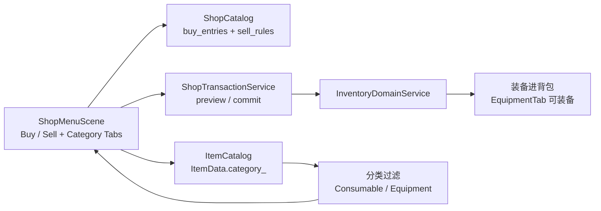

# 商店装备扩展与分类 Tab 计划

## 元信息
- 任务ID：`SHOP-CATEGORY-001`
- 任务标题：`商店补充装备物品并按分类 Tab 区分消耗品 / 装备`
- 优先级：`P1`
- 状态：`Implemented`（自动化验证通过；游戏内手动验证待执行）
- 计划时间：`2026-05-15` 起
- 依赖任务：`无`
- 设计原则：当前阶段游戏未上线，按 demo 重构思路推进，最小化对存档与商店数据结构的入侵；分类来源单一从 `ItemCatalog::ItemData::category_` 推导，不在 `shops.json` 引入冗余 category 字段。

## Context

当前商店系统 (`ShopMenuScene` + `ShopCatalog` + `ShopTransactionService`) 已经支持 Buy / Sell 双模式、quantity 调节、preview/commit 原子交易和 RmlUi data binding。`shop.village.general` 目前只贩售 `potion` 和 `strawberry_seed` 两种消耗品/种子；装备物品 (`equip_wooden_*`、`equip_iron_*`) 已经在 `assets/data/item_config.json` 与 `assets/data/rpg/equipment.json` 完整登记，但没有进入任何商店的 `buy_entries`，也没有对应的 `sell_rules`。

装备系统 (`PartyEquipmentComponent` + `EquipmentDomainService` + `EquipmentTabContent`) 已经可以从 inventory 装备/卸装备装备物品并参与战斗加成，因此一旦装备进入背包即可走完整闭环。

商店 UI 当前用左侧 Mode Toggle (Buy / Sell) + 单列条目列表的布局，所有可买/可卖物品平铺。新增装备后条目数量上升，没有分类区分时浏览体验下降，也不利于后续扩充更多商品。



## Goals

- 在 `shop.village.general` 中追加装备物品的 `buy_entries`，并补齐对应的 `sell_rules`。
- 在 `ShopMenuScene` 中新增 `Consumable` / `Equipment` 两个分类 tab。
- Buy 与 Sell 模式共用同一组分类 tab，切换 Mode 时分类保持。
- 分类来源从 `ItemCatalog::ItemData::category_` 派生，不在 `shops.json` 增加 category 字段。
- 键盘 / 手柄导航支持在分类 tab 上左右切换，且与现有 Mode Toggle / EntryList / Quantity / PrimaryAction 焦点流自然衔接。
- 单元测试覆盖：商店数据加载、分类过滤、navigation helper、scene smoke。

## Non-Goals

- 不新建独立的武器店 / 防具店 Scene 或地图实例。
- 不引入 "All" 分类 tab；仅 Consumable 与 Equipment 二选一。
- 不修改 `ShopCatalog` schema，也不在 `ShopBuyEntryData` / `ShopSellRuleData` 增加 category 字段。
- 不引入按角色 / 职业筛选可装备物品的二次过滤；玩家可以买下任意装备并在装备 Tab 中由 `EquipmentDomainService` 处理 `allowed_classes`。
- 不持久化分类 tab 的当前选择到存档；菜单关闭后下次重新打开使用默认分类。
- 不新增分类相关的图标素材；分类 tab 仅使用文字 + 现有按钮风格。
- 不调整存档 schema 版本。

## Decisions

- **分类范围**：仅 `Consumable` 和 `Equipment` 两个 tab。`Tool / Crop / Seed / Material / Unknown` 这些 `ItemCategory` 暂归入 `Consumable` tab 还是过滤掉？→ 决定：归入 `Consumable` tab。理由：当前商店里非消耗品的可买条目只有 `strawberry_seed` (Seed) 一项，把它和 `potion` 放在同一 tab 体验更连贯；玩家可卖物品 (`material_timber`、`strawberry_item` 等) 同理归入 `Consumable`。命名上用户面 label 仍保留 `Consumable` / `Equipment`，内部 enum 使用 `Consumable / Equipment` 两值，但 `Consumable` 实际表示 "Equipment 以外的全部" 这一语义。
- **分类来源**：从 `ItemCatalog::ItemData::category_` 推导，`ItemCategory::Equipment` 进入 `Equipment` tab，其它全部进入 `Consumable` tab。`shops.json` 不引入 category 字段，避免双源不一致。
- **Mode 与 Category 维度的耦合**：Mode Toggle (Buy/Sell) 与 Category Tabs 完全正交，但状态存储仍按 Mode 维度（与现有 `selected_buy_index_ / selected_sell_index_ / requested_buy_quantity_ / requested_sell_quantity_` 一致），不引入 (Mode × Category) 四套状态。具体规则收敛为一句：
  - 切换 Mode：保留 `current_category_` 不变；按 Mode 维度独立的 `selected_*_index_` 与 `requested_*_quantity_` 不重置（沿用现有行为）。
  - 切换 Category：保留 `current_mode_` 不变；只重置当前 Mode 对应的 `selected_*_index_` 为 0、`requested_*_quantity_` 为 1，并 `markTradeListsDirty()` 触发 rebuild。
  - 视图层（empty 提示文本、过滤后的列表）由 `(current_mode_, current_category_)` 共同决定，但底层 `selected_*_index_` 始终是该 Mode 下"过滤后列表"的下标。
- **UI 布局**：分类 tab 放在现有 Mode Toggle 同一行的右侧。当前 `#shop-mode-toggle` 宽 258dp，模式按钮各 95dp（含 4dp gap，总 194dp），剩 64dp 不足以容纳两个分类按钮。决定：把 mode 按钮缩到 80dp 一个，category 按钮 80dp 一个，单行结构改为 `[Buy][Sell] | [Cons][Equip]` 四按钮。或者把 Category Tabs 放到 Mode Toggle 下方的独立一行。考虑可读性和焦点流，采用方案 B：Mode Toggle 一行，Category Tabs 一行，列表往下顺延 26dp。需要相应调整 `shop_menu.rcss` 中 `#shop-body` / `#shop-list-col` 高度。
- **焦点流**：插入 `CategoryTabs` 焦点区，位于 `ModeToggle` 与 `EntryList` 之间。新焦点流（注意 EntryList 的 Up/Down 仍是**条目选择**，不是焦点切换；退出列表用 Left）：
  - `ModeToggle`：Left/Right 切 Mode；Down/Confirm 进入 `CategoryTabs`（替代原本直接进入 `EntryList`）。
  - `CategoryTabs`：Left/Right 在 Consumable / Equipment 之间切换；Up 回 `ModeToggle`；Down/Confirm 进入 `EntryList`（若当前 (Mode, Category) 无条目则维持在 `CategoryTabs`）。
  - `EntryList`：Up/Down **保持现有条目选择行为不变**；Left 改为回到 `CategoryTabs`（替代原本回 `ModeToggle`）；Right/Confirm 维持原行为（进入 `Quantity` / `PrimaryAction`）。
  - `Quantity` / `PrimaryAction` 维持原行为。
  - 退出全栈走两步：EntryList → CategoryTabs → ModeToggle，键盘 / 手柄玩家可通过连续 Left 顶到 ModeToggle。
- **过滤实现位置**：在 `rebuildBuyEntries()` / `rebuildSellEntries()` 中按当前 category 过滤，新增 helper `isItemInCategoryTab()`。view model 列表仅包含当前 category 的条目；其它 category 的条目不构造 view model，避免无用 RmlUi data rebind。
- **Sell 模式下"没有 sell rule"的处理**：保持现有"显示但 disabled"语义不变（`shop_menu_scene.cpp` 现状：所有非空 slot 都进入 sell list，无 sell rule 时 view_model.is_disabled=true）。Equipment / Consumable tab 在 Sell 模式下都遵循同一规则：先按 category 过滤背包 slot，再把没有 sell rule 的条目以 disabled 形式列出。这与现有 Consumable 模式（如 `material_timber` 没 sell rule 时也是 disabled）一致；不引入"额外跳过 sell_rule == nullptr"的二次过滤。
- **测试覆盖**：新增 `shop_menu_category_filter_test.cpp`（纯过滤逻辑）、扩展 `shop_menu_navigation_test.cpp`（CategoryTabs 焦点流）、`shop_catalog_test.cpp`（验证装备 sell_rules 被加载）。
- **不破坏现有存档**：当前 `SaveService` 不写入 shop UI 的临时状态；本计划亦不向 save schema 添加任何字段。

## 影响范围

### 修改的数据文件
| 文件 | 修改内容 |
|------|----------|
| `assets/data/shops.json` | `shop.village.general.buy_entries` 追加木质 / 铁质系列共 12 件装备，并在 `sell_rules` 中追加对应卖出规则；价格按 wooden ≈ 60–80G、iron ≈ 200–260G 量级分档（具体值见 Phase 1）|

### 修改的源代码文件
| 文件 | 修改内容 |
|------|----------|
| `src/game/ui/shop_menu_support.h` | 新增 `ShopMenuCategory` enum（`Consumable / Equipment`）；`ShopMenuFocusArea` 追加 `CategoryTabs`；`ShopMenuNavigationState` 加入 `current_category` + 每个 category 的 `has_*` 标记；`ShopMenuNavigationDecision` 加入 `switch_category` / `next_category`；声明 `isItemInCategoryTab()` 与 `resolveShopMenuCategoryDefault()` |
| `src/game/ui/shop_menu_support.cpp` | 实现 `resolveShopMenuNavigation()` 对 CategoryTabs 区的处理与跨区跳转；实现 `isItemInCategoryTab(category, ItemCategory)` 把 `Equipment` 单独归入 Equipment tab，其它全部归入 Consumable tab |
| `src/game/scene/shop_menu_scene.h` | 增加 `current_category_` 成员、按 category 的脏标记或 rebuild 入口、`switchCategory()` 接口、绑定字段 `current_category_is_consumable / is_equipment / has_consumable_buy / has_equipment_buy / ...` |
| `src/game/scene/shop_menu_scene.cpp` | 1) `rebuildBuyEntries()` / `rebuildSellEntries()` 引入 category 过滤；2) `syncCategoryBindings()` 同步绑定；3) 焦点流在 ModeToggle ↔ CategoryTabs ↔ EntryList 之间插入新分支；4) 切换 Mode 时保留 category，切换 Category 时重置 index 与 quantity |
| `src/game/scene/shop_menu_scene.cpp`（小修） | `formatFocusStatus()` 增加 CategoryTabs 提示文本 |

### 修改的 UI 文件
| 文件 | 修改内容 |
|------|----------|
| `ui/rmlui/scenes/shop_menu.rml` | 在 `#shop-mode-toggle` 下方新增 `#shop-category-tabs`，含 `Consumable` / `Equipment` 两个按钮；条目列表继续只根据 mode 与过滤后的 has_entries 显示，不在 RML 层重复增加 category 条件 |
| `ui/rmlui/scenes/shop_menu.rcss` | 调整 `#shop-list-col` 高度与列表高度以容纳新 26dp 行；为 `#shop-category-tabs` 复用 `.shop-tab-btn.selected` 等样式；增加 `.shop-category-button` 选中态 |

### 新增的源代码文件
| 文件 | 用途 |
|------|------|
| 无 | 计划在现有 `shop_menu_support` 中扩展，避免新增文件 |

### 新增 / 修改的测试文件
| 文件 | 修改内容 |
|------|----------|
| `tests/game/shop_menu_navigation_test.cpp` | 扩展导航 helper 单测：CategoryTabs 焦点流、ModeToggle / EntryList 与 CategoryTabs 的跨区跳转；EntryList Up/Down 回归（仍是条目选择） |
| `tests/game/shop_menu_category_filter_test.cpp` | **新增** 纯 helper 单测，验证 `isItemInCategoryTab()` 在所有 `ItemCategory` 上的归属规则 |
| `tests/game/shop_catalog_test.cpp` | 增加 14 个 buy_entries、12 件装备 sell_rules、`validateReferences` 通过、加载无 warn 的真实数据断言 |
| `tests/game/shop_transaction_service_test.cpp` | **端到端 commit 覆盖**：买入 / 卖出装备的 wallet 与 inventory 变化（不依赖 RmlUi Scene） |
| `tests/game/shop_menu_buy_flow_test.cpp` | 沿现有 source-test 风格，新增 category 相关源码字符串断言（`isItemInCategoryTab` / `switch_category_*` / `is_consumable_category` 等）；不引入 RmlUi Scene fixture |
| `tests/game/shop_menu_sell_flow_test.cpp` | 同上，sell 路径的 category 字符串断言 |
| `tests/CMakeLists.txt` 或对应注册位置 | 注册新增 `shop_menu_category_filter_test.cpp` |

### 不修改的文件（确认保留）
| 文件 | 原因 |
|------|------|
| `src/game/data/shop_data.h` / `shop_catalog.h` | 不引入 category 字段 |
| `src/game/domain/shop_transaction_service.{h,cpp}` | preview/commit 不需要 category；装备是普通 `ItemCategory::Equipment`，写入 inventory 后由 `EquipmentTab` 接管装备流程 |
| `src/game/save/save_*` | category tab 状态不入存档 |
| `assets/data/rpg/equipment.json` | 数据已完整，无需扩展 |
| `assets/data/item_config.json` | 装备 item 已登记，本计划不调价格、不增 item |

## 执行步骤

### Phase 1：数据扩展（装备进入村庄商店）

目标：让 `shop.village.general` 能买卖现有的全部 12 件装备，且 ShopCatalog 加载通过。

1. 编辑 `assets/data/shops.json`：
   - `buy_entries` 追加 12 件装备条目，价格分档：
     - `equip_wooden_sword` 60G / `equip_wooden_staff` 60G / `equip_wooden_helmet` 50G / `equip_wooden_armor` 80G / `equip_wooden_boots` 50G / `equip_wooden_accessory` 70G
     - `equip_iron_sword` 200G / `equip_iron_staff` 200G / `equip_iron_helmet` 180G / `equip_iron_armor` 260G / `equip_iron_boots` 180G / `equip_iron_accessory` 240G
   - `sell_rules` 追加对应卖出规则，sell_price 取 buy_price 的 40% 并向下取整，保证 `sell_price < buy_price` 不触发 `logSellPriceWarnings`。
2. 跑 `ShopCatalog::loadFromFile` 单元测试 / 启动游戏验证加载无 warn no error。
3. 验收：
   - 启动游戏后**先通过 debug panel / 测试存档给钱包注入 ≥ 300G**（`PlayerWalletComponent::gold_` 默认 0，否则没钱买装备）。
   - 进入村庄商店，能看到所有装备在 Buy 列表中（此时尚未引入 category tab，会与消耗品混在一起）。
   - 买下任意装备后回到 Inventory → Equipment Tab，可正常装备给队员。

### Phase 2：分类 Tab、过滤逻辑与焦点导航

目标：商店 UI 出现 `Consumable / Equipment` 两个分类 tab，列表按分类过滤，键鼠/手柄导航可在新焦点区切换。

1. `shop_menu_support.h/cpp`：
   - 新增 `enum class ShopMenuCategory { Consumable, Equipment }`。
   - `ShopMenuFocusArea` 追加 `CategoryTabs` 值，注意保持现有顺序不变以减少改动。
   - `ShopMenuNavigationState` 增加 `current_category` 字段、`has_consumable_entries` / `has_equipment_entries` 标记（按当前 Mode 视角，由 caller 填充）。
   - `ShopMenuNavigationDecision` 增加 `switch_category` (bool) 与 `next_category` (ShopMenuCategory)。
   - `resolveShopMenuNavigation()` 中处理：
     - `CategoryTabs` 区：Left/Right 切换两个 category；Up 回 `ModeToggle`；Down/Confirm 进入 `EntryList`（若当前 (Mode, Category) 无条目，则 Down/Confirm 维持 `CategoryTabs`，让玩家通过 empty 文案感知）。
     - `EntryList` 区：**Up/Down 仍然分别对应 `entry_delta = -1 / +1`**，与现状保持完全一致；只把 `Left` 的目标从 `ModeToggle` 改为 `CategoryTabs`（无论 `has_current_entries` 真假）。`Right` / `Confirm` 维持指向 `Quantity` / `PrimaryAction`。
     - `ModeToggle` 区：Down/Confirm 改为进入 `CategoryTabs` 而非直接进入 EntryList；Left/Right 切 Mode 维持不变。
   - 新增 `isItemInCategoryTab(ShopMenuCategory category, game::data::ItemCategory item_category)`：当 `category == Equipment` 仅返回 `item_category == Equipment`；否则返回 `item_category != Equipment`。
2. `shop_menu_scene.h/cpp`：
   - 增加 `current_category_` 字段，默认 `Consumable`。**保留**现有 `selected_buy_index_` / `selected_sell_index_` / `requested_buy_quantity_` / `requested_sell_quantity_` 不变；这些下标始终指向"当前 Mode + 当前 Category 过滤后的列表"。
   - `rebuildBuyEntries()` / `rebuildSellEntries()` 在 push view_model 前判断 `isItemInCategoryTab()`；Sell 模式仍把没有 sell rule 的条目以 `is_disabled=true` 加入列表（与现状一致）。
   - 新增 `syncCategoryBindings()` 同步以下绑定：`is_consumable_category`、`is_equipment_category`、`is_category_tabs_focused`、`has_consumable_entries`、`has_equipment_entries`、`empty_text`（按 category 调整文案）。其中 `has_consumable_entries / has_equipment_entries` 必须从当前 mode 的完整源数据全量扫描得到（Buy 扫 `shop_data_->buy_entries_`，Sell 扫背包非空 slot），不能从当前过滤后的 `buy_entries_ / sell_entries_` 推导。
   - `switchCategory(ShopMenuCategory next)`：变更 `current_category_`；按"切换 Category 时"规则只重置**当前 Mode 对应的** `selected_*_index_ = 0` 与 `requested_*_quantity_ = 1`（不动另一 Mode 的状态）；`markTradeListsDirty()` 后 `refreshAll()`。
   - `switchMode()` 维持现有"切 Mode 不重置 index/quantity"行为；切换后按当前 category 触发对应 mode 列表的 rebuild。
   - `formatFocusStatus()` 增加 `CategoryTabs` 分支的提示文本（"Left / Right switches category. Down enters the list."）。
   - 焦点初始化：menu 打开时若当前 (mode, category) 无条目，回退到 `CategoryTabs`（不再退回 `ModeToggle`，因为 CategoryTabs 是更近的有意义焦点入口）。
   - `normalizeFocusArea()` 与 `resolvePreferredShopMenuFocus()` 扩展为按 (mode, category) 判断 `has_current_entries`，并把 fallback 目标从 `ModeToggle` 改为 `CategoryTabs`。
3. `ui/rmlui/scenes/shop_menu.rml`：
   - 在 `#shop-mode-toggle` 之后新增：
     ```
     <div id="shop-category-tabs" data-class-focused="is_category_tabs_focused">
       <button class="tf-button-secondary shop-tab-btn shop-category-button"
               data-class-selected="is_consumable_category"
               data-event-click="switch_category_consumable">Consumable</button>
       <button class="tf-button-secondary shop-tab-btn shop-category-button"
               data-class-selected="is_equipment_category"
               data-event-click="switch_category_equipment">Equipment</button>
     </div>
     ```
   - `bindEvent("switch_category_consumable" / "switch_category_equipment")` 在 `initUI()` 中注册。
   - 条目列表的 `data-if` 不必改，因为过滤在 C++ 侧已经完成；列表本身就是 "当前 category + 当前 mode" 的条目快照。
   - empty 文案绑定 `empty_text` 维持，但 Phase 2 在 syncCategoryBindings 中追加按 category 的文案变体（如 "No consumables available." / "No equipment for sale."）。
4. `ui/rmlui/scenes/shop_menu.rcss`：
   - `#shop-mode-toggle` 高度保持 26dp。
   - 新增 `#shop-category-tabs`：高度 26dp，与 mode toggle 同样的 flex 行结构、focused 样式。
   - `#shop-list-col` 高度从 232dp 调整为 232dp（保持），但 `#shop-buy-list` / `#shop-sell-list` 高度从 196dp 调整为 170dp，腾出 26dp 给新 tab 行。
   - 视觉差异：分类按钮可加 `:checked` 似的下划线提示，沿用现有 `.selected` 样式不引入新素材。
5. 验收：
   - 进入商店默认显示 Consumable tab，列表包含 `potion`、`strawberry_seed`，不含装备。
   - 切到 Equipment tab，列表只包含 12 件装备，超出 170dp 由现有 `overflow-y: auto` 滚动处理。
   - Sell 模式下分类 tab 行为一致：按 category 过滤背包 slot；命中 category 但无 sell rule 的条目以 disabled 形式出现（与 Consumable 现有规则一致），背包内该 category 完全为空时 empty 文案显示 "No equipment to sell." / "No items to sell."。
   - 焦点流：ModeToggle ↔ CategoryTabs ↔ EntryList ↔ Quantity ↔ PrimaryAction；**EntryList Up/Down 仍是条目选择**，Left 退出到 CategoryTabs。键盘 / 手柄全程可控，鼠标点击各按钮也可工作。
   - 切换 Mode 不会丢失 category，且不重置 selected_index / quantity（沿用现有行为）；切换 Category 会重置当前 Mode 的 selected_index 与 quantity。

### Phase 3：测试与回归

测试策略：**纯逻辑层（helper / domain）走真实端到端断言；Scene 层维持 source-test 风格（字符串/绑定回归），不引入 RmlUi Scene fixture**。这与当前 `shop_menu_buy_flow_test.cpp:83` 的 `ShopMenuSceneWiresPreviewCommitAndStatusRefresh` 一致。

1. **新建** `tests/game/shop_menu_category_filter_test.cpp`（纯 helper 单测）：
   - 枚举 `ItemCategory` 全部值，断言 `isItemInCategoryTab(Equipment, Equipment) == true`，其它任意 ItemCategory 在 `Equipment` 下均为 false；在 `Consumable` 下 Equipment 为 false，其它均为 true。
   - 注册到 `tests/CMakeLists.txt`（或 `tests/game/CMakeLists.txt`，按当前注册位置）。
2. 扩展 `tests/game/shop_menu_navigation_test.cpp`（纯导航 helper 单测）：
   - CategoryTabs Up → ModeToggle。
   - CategoryTabs Down → EntryList（前提条件：当前 (mode, category) 有条目）。
   - CategoryTabs Down 在 (mode, category) 空条目时 → 维持 CategoryTabs。
   - CategoryTabs Left/Right 在两类间切换（`switch_category=true`，`next_category` 翻转）。
   - **EntryList Up/Down 保持 `entry_delta=-1/+1`**（回归现状）；EntryList Left → CategoryTabs（新行为，替代原 ModeToggle）；EntryList Right/Confirm → Quantity/PrimaryAction 保持现状。
   - ModeToggle Down/Confirm → CategoryTabs（替代原直接 EntryList）。
3. 扩展 `tests/game/shop_catalog_test.cpp`（真实数据加载）：
   - 用真实 `assets/data/shops.json` + `item_config.json` 加载后断言 `shop.village.general.buy_entries.size() == 14`、12 件装备 id 全部存在、`sell_rules` 含全部 12 件装备且 `sell_price < buy_price`、`validateReferences` 通过；价格断言覆盖 `logSellPriceWarnings` 的触发条件，不额外引入 spdlog test sink。
4. 扩展 `tests/game/shop_transaction_service_test.cpp`（端到端 commit 覆盖下放到这一层）：
   - 用真实 `ItemCatalog + ShopCatalog + InventoryDomainService` fixture，买入 `equip_wooden_sword`：断言 wallet 扣款、inventory 多出 1 件该装备（验证 Phase 1 数据 + 装备走与消耗品同一买卖路径）。
   - 先注入一件装备到 inventory，再 commitSell：断言 wallet 加款、inventory 槽位减少。
   - 这一层不依赖 RmlUi Scene，能可靠覆盖"切 Equipment tab → 买/卖"的实际数据闭环。
5. 扩展 `tests/game/shop_menu_buy_flow_test.cpp`（source-test，沿现有 `ShopMenuSceneWiresPreviewCommitAndStatusRefresh` 风格）：
   - 在 `shop_menu_scene.cpp` 源码字符串中追加断言：`isItemInCategoryTab`、`switch_category_consumable`、`switch_category_equipment`、`"is_consumable_category"`、`"is_equipment_category"`、`current_category_` 等关键标识符存在。
   - 不引入真实 RmlUi Scene fixture；端到端 commit 覆盖以 #4 ShopTransactionService 测试为准。
6. 扩展 `tests/game/shop_menu_sell_flow_test.cpp`（source-test 风格）：
   - 类似 #5，在源码字符串中追加 sell 路径的 category 关键字符串断言。
   - 真实 sell 闭环以 #4 ShopTransactionService 测试为准。
7. 跑 `ninja -C build engine_tests game_tests` + 相关 ctest 过滤；再跑一次全量 ctest 回归。
8. 手动验证：
   - **前置**：使用 debug panel（`game/debug/shop_debug_panel.cpp` 或 inventory/save 调试入口）或测试存档先给玩家钱包注入足够金币（≥ 300G），因为 `PlayerWalletComponent::gold_` 默认 0。
   - 走完 "进入村庄商店 → 切到 Equipment tab → 买木剑 → 切 Sell → 切 Equipment tab → 卖回木剑" 的循环。
   - 在 Buy 与 Sell 两种 Mode 下都验证：Consumable / Equipment tab 切换、empty 文案、键盘 / 手柄焦点流 `ModeToggle → CategoryTabs → EntryList → Quantity → PrimaryAction`，以及 EntryList Up/Down 仍是条目选择、Left 退到 CategoryTabs。

## Acceptance Criteria

- `assets/data/shops.json` 加载无 warn / error；`ShopCatalog::validateReferences` 通过。
- 商店 UI 中分类 tab 可见、可切换；切换后列表按预期过滤；Sell 模式下无 sell rule 的条目以 disabled 形式呈现（与 Consumable 现状一致）。
- 装备能从商店买到背包，并可在 Equipment Tab 装备给队员；可从背包卖回。
- 焦点流 `ModeToggle ↔ CategoryTabs ↔ EntryList ↔ Quantity ↔ PrimaryAction` 完整可达；EntryList Up/Down 仍是条目选择，Left 退到 CategoryTabs。
- 切换 Mode 不重置 selected_index / quantity；切换 Category 重置当前 Mode 的 selected_index 与 quantity。
- 新增 / 扩展的测试全部通过；端到端 commit 覆盖在 `shop_transaction_service_test.cpp` 中体现，Scene-level 测试维持 source-test 风格。
- `git diff --check` 通过，无格式 / 空白错误。
- 不修改任何 save schema，旧存档仍能正常进入新商店 UI。

## Remaining Questions

- Phase 1 中给出的装备价格仅为初步设定（参考木质 50–80G、铁质 180–260G）。是否需要在落地前根据当前经济强度（玩家初始金币、potion 30G 等）进一步校准？此问题留到 Phase 1 实施时按 spdlog warn 与游戏内测试结果再微调。
- 分类 tab 在条目超过 170dp 高度时使用 `overflow-y: auto` 滚动是否符合预期？目前 12 件装备按 24dp / 行 + 2dp 间距 ≈ 312dp，会触发滚动条；如果团队希望默认能一屏看完，可在后续阶段再考虑分页或缩小行高，不阻塞本计划落地。

## Todo

- [x] Phase 1: `assets/data/shops.json` 追加装备 buy_entries 与 sell_rules。
- [x] Phase 1: 验证 ShopCatalog 加载通过。
- [ ] Phase 1/3: 注入测试金币后，游戏内手动验证完整购买→装备→卖出循环。
- [x] Phase 2: 扩展 `shop_menu_support` 的 enum、navigation state/decision 与 helper（注意 EntryList Up/Down 保持现状）。
- [x] Phase 2: 修改 `ShopMenuScene` 引入 `current_category_`、过滤与绑定（按 Mode 维度复用现有 index/quantity，仅切 Category 时重置）。
- [x] Phase 2: 修改 `shop_menu.rml` / `shop_menu.rcss` 增加 CategoryTabs UI。
- [x] Phase 2: 焦点导航接入新 CategoryTabs 焦点区（EntryList Left → CategoryTabs；ModeToggle Down → CategoryTabs）。
- [x] Phase 3: 新增 `shop_menu_category_filter_test.cpp` 并注册到 CMake。
- [x] Phase 3: 扩展 navigation / catalog 测试；在 `shop_transaction_service_test.cpp` 增加装备买卖端到端覆盖。
- [x] Phase 3: `shop_menu_buy_flow_test.cpp` / `shop_menu_sell_flow_test.cpp` 沿 source-test 风格补 category 字符串断言。
- [x] Phase 3: `ninja -C build engine_tests game_tests` + ctest 回归通过。
