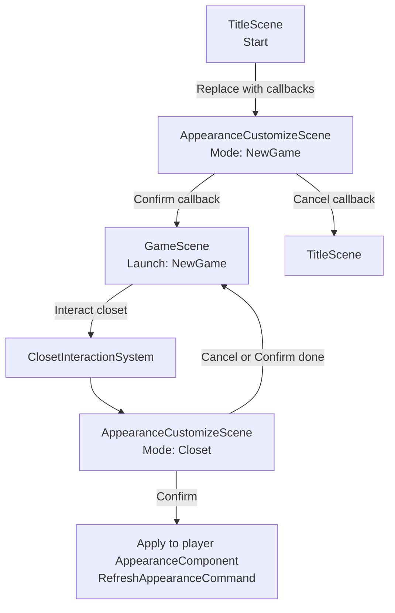
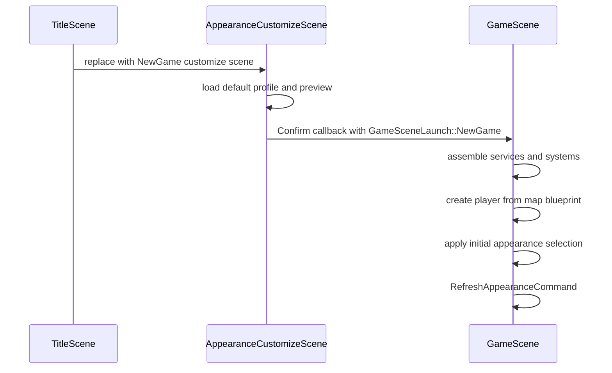
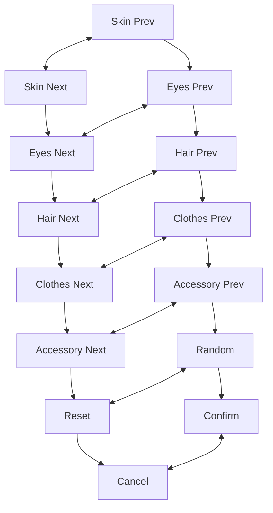

# 第一阶段：主角外观创建与衣柜换装

## 目标

把已经落地的分层外观系统接入正式游戏流程，让玩家可以在创建新游戏时先设定主角外形，并可在家中的衣柜对象处再次打开同一套换装界面。

本阶段只做可用闭环：
- 新游戏外观创建
- 衣柜交互换装
- 外观预览、确认、取消、重置
- 存档读写保持一致

不做后续扩展：
- 外观解锁、商店购买、任务奖励
- 多队友换装
- 装备外观和战斗武器显示的深度联动

## 当前依据

- 外观底层已完成：`AppearanceCatalog`、`AppearanceComponent`、`LayeredSpriteComponent`、`AppearanceSystem`。
- 玩家实体已由 `EntityFactory` 自动创建 `AppearanceComponent + LayeredSpriteComponent`。
- `SaveService` 已保存 `appearance_state.gender` 与 `appearance_state.slots`。
- 战斗场景已通过 `AppearanceSnapshot` 复用主角外观。
- 当前 `PlayerDebugPanel` 里已有切换 slot variant、reset profile、refresh 的调试逻辑，可作为正式 UI 的行为参考。
- 工作区新增了 `assets/maps/home_interior.tmj` 中 `type="closet"` 的对象，可作为衣柜入口。该对象应保持有效 `width/height`，实现阶段需要在 loader 中校验尺寸并输出清晰日志。

## 总体思路

新增一个正式的 `AppearanceCustomizeScene`，同时服务于新游戏和衣柜两种入口。场景内部使用临时外观选择数据，确认时才写回目标流程，取消时不污染真实玩家状态。



核心原则：
- `AppearanceCustomizeScene` 只负责 UI、预览和选择结果，不直接了解新游戏创建细节。
- 新游戏入口通过 confirm callback 创建 `GameScene(GameSceneLaunch::NewGame)`，避免 `AppearanceCustomizeScene` 依赖标题页或游戏场景细节。
- 衣柜入口通过 `ClosetInteractionSystem` push 同一场景，确认后写入当前玩家，完成后 pop 回游戏。
- RAII 管理场景资源：RML 文档、预览 registry、事件回调和临时资源都由 scene 生命周期持有与释放。

## 关键设计

### 1. 外观选择数据

新增轻量结构，避免 UI 直接操作 `AppearanceComponent`：

```cpp
struct AppearanceSelection {
    std::string profile_id;
    std::string gender;
    std::unordered_map<std::string, std::string> slot_variants;
};
```

配套 helper：
- 从 `AppearanceProfile` 创建默认 selection。
- 从玩家 `AppearanceComponent` 创建 selection。
- 把 selection 批量应用到玩家 `AppearanceComponent`，然后触发一次 `RefreshAppearanceCommand`。
- 按 slot 切换上一项、下一项、重置 profile 默认值。
- 提供 `randomizeSelection()`，只在 runtime switchable slots 中随机选择合法 variant。
- 只允许操作 `AppearanceCatalog::isRuntimeSwitchableSlot()` 返回 true 的 slot。

把 `profile_id` 也写进存档的 `appearance_state`。这样读档后 reset profile 能回到正确预设，而不是只能猜默认 profile。实施时将 `SAVE_SCHEMA_VERSION` 从 `4` bump 到 `5`，并让 v5 存档写入：

```json
{
  "appearance_state": {
    "profile_id": "player_default",
    "gender": "male",
    "slots": {}
  }
}
```

项目不要求向后兼容，可以直接按最新 schema 写入；如果仍保留旧存档读取，缺少 `profile_id` 时回退到 catalog 默认 profile。

### 2. 外观自定义场景

`AppearanceCustomizeScene` 提供两种模式：

| 模式 | 入口 | Confirm 行为 | Cancel 行为 |
|---|---|---|---|
| `NewGame` | 标题页 Start | 回调创建 `GameScene(GameSceneLaunch::NewGame)` | 回调创建 `TitleScene` |
| `Closet` | 衣柜交互 | 应用到当前玩家并刷新外观 | 关闭场景，不改玩家 |

场景持有：
- `AppearanceSelection draft_selection_`
- `AppearanceSelection original_selection_`
- `AppearanceCatalog` 指针或共享引用
- 预览用小型 `entt::registry`
- 预览实体的 `AppearanceComponent + LayeredSpriteComponent + AnimationComponent`
- RML data model 和事件绑定

提交语义：
- slot prev/next、reset、random 都只修改 `draft_selection_` 和预览实体。
- `Confirm` 才批量写真实玩家组件或传给新游戏启动参数。
- `Cancel` 直接丢弃 `draft_selection_`。
- 批量提交使用 helper 直接写 `AppearanceComponent`，最后触发一次 `RefreshAppearanceCommand`；不逐 slot 触发 `SetAppearanceSlotCommand`。

### 3. 预览渲染方案

本阶段不把 ECS 预览嵌入 RML ``，也不做离屏 framebuffer。选择方案为：**独立预览 registry + 游戏渲染阶段直接绘制 sprite**。

`AppearanceCustomizeScene` 持有：
- `entt::registry preview_registry_`
- `engine::system::RenderSystem preview_render_system_`
- 预览实体：`TransformComponent + RenderComponent + SpriteComponent + AnimationComponent + AppearanceComponent + LayeredSpriteComponent`
- 预览区域的逻辑屏幕矩形，例如 `preview_screen_rect_`

渲染方式：
- RML 文档中留出透明预览窗口，不使用 `` 承载角色。
- `AppearanceCustomizeScene::render()` 在 RmlUi retained UI 渲染前调用 `preview_render_system_.renderPrepared(preview_registry_, renderer, interpolation_alpha)`。
- 预览实体的位置由 `context_.getCamera().screenToWorld(preview_screen_rect_.center)` 计算，使它稳定落在 UI 预览窗口背后。
- 衣柜模式是覆盖在 `GameScene` 上的 push scene，底层 `GameScene` 已经调用过 `renderer.beginFrame(camera)`，此时预览场景不能再次切换 camera，只能追加 `renderPrepared()`。
- 新游戏模式是替换标题页后的全屏场景，若底层没有 world scene 负责 `beginFrame()`，则由 `AppearanceCustomizeScene` 用当前 `context` camera 调用一次 `renderer.beginFrame(camera)` 后再绘制预览。

这个方案复用 `LayeredSpriteComponent` 和 `AppearanceLayerCacheBuilder`，避免新增 GL texture 到 RML 图片桥接；代价是 RML 预览窗口必须保持透明，角色实际绘制在 RML 下方。

### 4. 新游戏流程

`TitleScene::onStartClicked()` 不再直接创建 `GameScene`，而是：



`GameScene` 不再同时接收 `NewGameOptions` 和 `load_slot` 两套可选参数，改为显式启动模式：

```cpp
struct NewGameOptions {
    std::optional<AppearanceSelection> initial_appearance;
};

struct LoadGameOptions {
    int slot;
};

using GameSceneLaunch = std::variant<NewGameOptions, LoadGameOptions>;
```

语义：
- `NewGameOptions`：使用传入 `initial_appearance`；如果为空，回退 catalog 默认 profile，便于测试和调试入口。
- `LoadGameOptions`：只从存档恢复外观，忽略任何新游戏外观选择。
- 构造函数层面不允许同时给新游戏参数和读档 slot，消除互斥歧义。

### 5. 衣柜交互

新增 `ClosetArea` 地图组件，使用 `type="closet"` 的 Tiled object 创建。实现方式对齐 `RestArea`：
- 在 `tiled_conventions.h` 增加 `OBJECT_TYPE_CLOSET`。
- 在 `map_component.h` 增加 `ClosetArea`。
- 在 `EntityBuilder::build()` 中识别 `type="closet"`。
- 新增 `EntityBuilder::buildClosetArea()`。
- 在 `spatial_layers.h` 增加 `CLOSET` 层。
- 将 closet rectangle 注册到静态空间索引，TileType 使用 `INTERACT`。
- 如果 `width/height <= 0`，本阶段直接报错并跳过创建；地图数据应使用有效矩形。
- 确认地图美术层已有可见衣柜图块或家具，否则需要在 `home_interior.tmj` 补一个可见 tile，避免玩家对空气交互。

`InteractionSystem::chooseFacingTarget()` 在所有动态目标候选都为空时，查询 `CLOSET` 层，再查询 `REST` 层。这样衣柜优先于床休息，但不抢 NPC、商店、任务、招募、宝箱的优先级。

新增 `ClosetInteractionSystem`：
- 订阅 `InteractCommand`。
- 若 target 有 `ClosetArea`，push `AppearanceCustomizeScene(Mode::Closet)`。
- 系统本身不需要 scheduler update，只需要在 `GameRuntimeAssembler` 中创建并由 RAII 析构断开事件。

### 6. RmlUi 界面

界面保持简洁，第一阶段只需要以下控件：
- 主角预览区域
- slot 列表：Skin、Eyes、Hair、Clothes、Accessory
- 每个 slot 一个 previous/next 操作
- `Random`
- `Reset`
- `Confirm`
- `Cancel`

所有可交互按钮必须设置 `tab-index: auto`，并明确 `nav-up/down/left/right`。导航结构建议：



Data model 建议：

```cpp
struct AppearanceSlotViewModel {
    std::string slot_id;
    std::string label;
    std::string variant_label;
    int variant_index;
    int variant_count;
};
```

RML 只绑定 view model 和事件，不直接拼接 catalog 逻辑。

## 需要新增的文件

- `src/game/scene/appearance_customize_scene.h`
- `src/game/scene/appearance_customize_scene.cpp`
- `src/game/scene/appearance_customize_types.h`
- `src/game/scene/game_scene_launch.h`
- `src/game/ui/appearance_customize_view_model.h`
- `src/game/ui/appearance_customize_view_model.cpp`
- `src/game/system/closet_interaction_system.h`
- `src/game/system/closet_interaction_system.cpp`
- `ui/rmlui/scenes/appearance_customize.rml`
- `ui/rmlui/scenes/appearance_customize.rcss`
- `tests/game/appearance_customize_view_model_test.cpp`

## 主要修改文件

- `src/game/scene/title_scene.cpp/.h`
- `src/game/scene/game_scene.cpp/.h`
- `src/game/save/save_data.cpp/.h`
- `src/game/save/save_service.cpp`
- `src/game/component/map_component.h`
- `src/game/loader/tiled_conventions.h`
- `src/game/loader/entity_builder.cpp/.h`
- `src/game/defs/spatial_layers.h`
- `src/game/system/interaction_system.cpp`
- `src/game/system/fwd.h`
- `src/game/runtime/system_bundle.h/.cpp`
- `src/game/runtime/game_runtime_assembler.cpp`
- `src/CMakeLists.txt`
- `assets/maps/home_interior.tmj`
- `docs/game/map_data_pipeline.md`

## 实现步骤

1. 新增 `AppearanceSelection` 与选择 helper  
   把 profile 默认值、玩家当前外观、slot prev/next/reset/random、apply-to-component 集中在独立 helper 中，避免 UI 和 debug panel 各写一套逻辑。

2. 扩展存档外观字段  
   将 `SAVE_SCHEMA_VERSION` 从 `4` bump 到 `5`。在 `appearance_state` 中加入 `profile_id`，保存和读取时同步 `AppearanceComponent::profile_id_`。读档后继续触发 `RefreshAppearanceCommand`。

3. 实现 `AppearanceCustomizeScene` 基础场景  
   先完成 RML 加载、data model、Confirm/Cancel 回调、slot 切换、reset 和 random。新游戏模式通过 callback replace 到 `GameScene` 或 `TitleScene`；衣柜模式通过 push/pop 返回游戏。

4. 接入预览实体  
   在场景内部创建独立预览 registry 和预览实体，复用 `AppearanceLayerCacheBuilder` 重建缓存。通过 `renderPrepared()` 直接绘制在 RML 透明预览窗口后方，不接入 RML ``。

5. 改造新游戏入口  
   `TitleScene::onStartClicked()` replace 到 `AppearanceCustomizeScene(Mode::NewGame)`。Confirm callback 创建 `GameScene(GameSceneLaunch::NewGame)`。`GameScene` 在玩家实体创建后、进入 Playing 前应用初始外观。

6. 接入 `type="closet"` 地图对象  
   增加 `ClosetArea`、`OBJECT_TYPE_CLOSET`、`spatial_layer::CLOSET` 与 `buildClosetArea()`。要求 `home_interior.tmj` 中 closet 对象使用有效矩形，并确认有可见衣柜图块。

7. 新增 `ClosetInteractionSystem`  
   订阅 `InteractCommand`，遇到 `ClosetArea` 时 push `AppearanceCustomizeScene(Mode::Closet)`。Confirm 时应用到真实玩家，Cancel 时直接关闭。

8. 完成 RmlUi 样式与导航  
   按现有菜单风格制作 `appearance_customize.rml/.rcss`，支持鼠标和键盘焦点。按钮必须 `tab-index: auto`，并设置清晰的 `nav-*` 链路。按钮使用明确图标或短文本，避免说明性文字堆叠。

9. 补测试与文档  
   增加 view model/helper 测试，覆盖 slot 切换、reset、非法 slot 忽略。更新地图数据管线文档，记录 `type="closet"` object 约定。

## 待办清单

- [ ] 新增 `AppearanceSelection` 与 helper。
- [ ] 给 `appearance_state` 增加 `profile_id`，将 `SAVE_SCHEMA_VERSION` bump 到 `5`，并更新保存/读取。
- [ ] 新增 `GameSceneLaunch = variant<NewGameOptions, LoadGameOptions>`，替换 `load_slot` 可选参数。
- [ ] 新增 `AppearanceCustomizeScene` 场景骨架。
- [ ] 新增外观自定义 RML/RCSS。
- [ ] 实现独立预览 registry、预览实体、`AppearanceLayerCacheBuilder` 刷新和 `renderPrepared()` 绘制。
- [ ] 修改标题页 Start 流程，replace 到新游戏外观创建场景。
- [ ] 让 `GameScene` 在 `NewGameOptions` 下应用初始外观，在 `LoadGameOptions` 下只读取存档外观。
- [ ] 新增 `ClosetArea` 组件与 `type="closet"` loader 支持。
- [ ] 新增 `spatial_layer::CLOSET` 并更新 `InteractionSystem` 查询优先级。
- [ ] 新增 `ClosetInteractionSystem` 并在 runtime assembler 中装配。
- [ ] 确认 `home_interior.tmj` 中 closet 对象有有效交互区域和可见衣柜图块。
- [ ] 给 Random/Reset/Confirm/Cancel 与 slot prev/next 设置完整键盘/手柄导航。
- [ ] 增加 helper/view model 单元测试。
- [ ] 用 ninja 构建并运行相关测试。
- [ ] 手动验证：新游戏创建外观、读写存档、衣柜确认、衣柜取消、战斗主角外观继承。
- [ ] 更新 `docs/game/map_data_pipeline.md` 的 object type 说明。

## 需要确认

- `home_interior.tmj` 中 closet 矩形现在已有有效 `width/height`。还需要确认对应位置在可视图层上确实画了衣柜或家具，避免玩家无法识别交互点。
