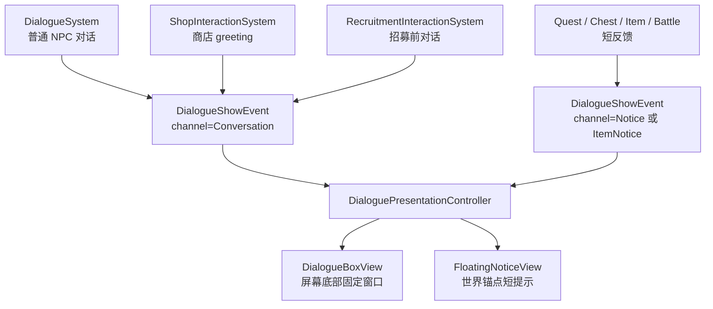

# JRPG 底部对话框重构计划

## 元信息

- 任务ID：`DIALOGUE-BOX-001`
- 任务标题：将角色对话从世界锚点气泡改为 JRPG 风格底部对话框
- 优先级：`P1`
- 状态：`Planned`
- 计划时间：`2026-05-19` 起
- 相关文档：
  - `docs/overview.md`
  - `docs/game/interaction_and_dialogue.md`
  - `docs/game/game_scene.md`
  - `docs/engine/layout-contract.md`
  - `for_agent/rmlui-guide.md`
  - `for_agent/docs-guide.md`

## Context

当前角色对话的表现链路是：

- 玩法系统发出 `DialogueShowEvent / DialogueMoveEvent / DialogueHideEvent`
- `DialogueBubbleController` 按 `channel` 路由到 3 个 `DialogueBubbleView`
- `DialogueBubbleView` 使用 `ui/rmlui/hud/dialogue_bubble.rml/.rcss`
- 面板锚在实体头顶，并在 `GameScene::prepareUi(alpha)` 阶段根据 camera 插值刷新位置

当前 channel 约定：

- `0`：NPC 对话、商店 greeting、招募前对话
- `1`：通知，如任务反馈、开箱、战斗结算提示
- `2`：物品提示，如右键使用物品反馈

这套结构对“头顶短句”很合适，但不符合 JRPG 风格。JRPG 对话通常是屏幕底部固定窗口，左侧可显示说话人头像，右侧显示说话人名称与文本。项目里已有可复用线索：

- `ui/rmlui/learn/learn_jrpg_dialogue.rml/.rcss` 有教学版底部对话框雏形
- `ui/rmlui/theme/portrait.rcss` 已提供 `portrait-player / portrait-lyria / portrait-tori`
- `assets/data/rpg/actors.json` 的 `ActorData::portrait_.decorator_` 是角色头像的稳定数据真源
- `InventoryMenuScene` 与 `BattleScene` 已经使用 `data-style-decorator="member.portrait_decorator"` 或等价 view model 展示头像

因此本次重构应把“角色说话”切到屏幕底部对话框，同时保留通知类文本的轻量浮动提示能力。换句话说，不把所有 `DialogueShowEvent` 都塞进主对话框，而是先清楚地区分：

- 对话：有说话人、需要玩家阅读和推进，走底部对话框
- 通知：系统反馈、奖励、拾取、物品使用提示，继续走世界锚点小提示或未来的 toast

## Goals

- 将 `channel=0` 的普通角色对话改为屏幕底部 JRPG 风格对话框。
- 对话框左侧显示头像；若无法解析头像，则隐藏头像区域并让文本区自动扩展。
- 复用 `RpgCatalog::ActorData::portrait_.decorator_` 和 `ui/rmlui/theme/portrait.rcss`，避免重复定义头像资源。
- 保留 `channel=1 / channel=2` 的短反馈能力，不让拾取、战斗奖励、物品提示占用主对话框。
- 让 UI 布局完全由 RML/RCSS 负责；C++ 只投影内容、显隐、头像 decorator 和可选打字机状态。
- 清理当前 `DialogueBubble*` 命名，让“对话框”和“浮动通知”在代码语义上分开。
- 补齐测试和文档，避免未来商店、任务、剧情系统接入时再混用 channel 语义。

## Non-Goals

- 本阶段不实现完整分支对话树、选项、剧情 flag、Lua 剧情 DSL。
- 本阶段不强制把所有 quest 文本迁移为主对话框；先迁移明确的 `channel=0` 角色说话路径。
- 本阶段不做复杂 portrait atlas 动态生成；先复用现有 `portrait.rcss` 与 `ActorData::portrait_.decorator_`。
- 本阶段不要求对话期间暂停整个世界或 push 独立 Scene；默认保留当前“靠近 NPC 交互推进，离远关闭”的探索语义。
- 本阶段不修改存档 schema。

## 设计决策

### 1. 表现层拆分

新增 `DialogueBoxView` 作为底部对话框，替代 `channel=0` 的头顶气泡表现。原 `DialogueBubbleView` 不再承担“角色对话”职责，建议重命名或收敛为 `FloatingNoticeView`，只服务通知类 channel。



### 2. channel 语义显式化

当前代码里大量使用裸数字 `0 / 1 / 2`。重构时新增命名常量或 enum。`DialogueChannel` 会被 events、helpers、controller、多个 system 同时引用，**建议直接放进 `game/defs/events.h` 顶部**（紧挨 `DialogueShowEvent` 定义），避免新增头文件后所有引用点都要多 include 一次：

```cpp
enum class DialogueChannel : std::uint8_t {
    Conversation = 0,
    Notice = 1,
    ItemNotice = 2,
};
```

事件结构可以继续存 `std::uint8_t channel`，也可以直接改成 `DialogueChannel channel`。项目未上线，不需要保持二进制兼容，推荐直接使用 enum，减少未来误用。

### 3. 头像解析策略

头像优先由 UI controller 侧解析，而不是让所有 gameplay 系统都知道 RmlUi decorator 名称。

推荐解析顺序：

1. **首选**：事件携带的 `speaker_actor_id_hash`（`entt::id_type`，本次重构应作为 `DialogueShowEvent` 的正式字段，非可选 fallback）。直接查 `RpgCatalog::findActor(hash)`。Lua 剧情、Quest 通知、非 recruit NPC 自语等场景都通过这个字段稳定指定说话人，不依赖 entity 的 `NameComponent`。
2. 否则根据 `evt.target` 的 `RecruitableComponent::actor_id_` 解析。
3. 否则根据 `evt.target` 的 `NameComponent::name_id_` 与 `ActorData::map_actor_id_hash_` 反查 actor。
4. 找到 actor 且 `actor.portrait_.decorator_` 非空，则生成 `image(<decorator>)`。
5. 找不到则返回 `none`，对话框隐藏头像区域。

> 设计目的：`speaker_actor_id_hash` 让"对话发起者 entity"与"剧情说话人"解耦。例如 Lua 剧情让玩家位置触发的事件让 Lyria "说话"，事件 target 仍是玩家或 trigger entity，但 speaker_actor_id_hash 是 lyria，头像才能正确。fallback 路径只是兼容现有"和谁说话头顶气泡就在谁上方"的近距对话。

为避免每次事件都线性遍历 actor，`DialoguePresentationController` 初始化时可以构建一个小缓存：

```text
map_actor_id_hash -> portrait_decorator
actor_id_hash -> portrait_decorator
```

现有数据下：

- `player` -> `actor.player` -> 当前 `actors.json` 写的是 `portrait-default`，但 `ui/rmlui/theme/portrait.rcss` 只定义了 `portrait-player / portrait-lyria / portrait-tori`，**没有 `portrait-default`**。Phase 3 解析头像之前必须先把 `actors.json` 中 player 的 `portrait.decorator` 改为 `portrait-player`（推荐，与 lyria/tori 对齐），否则 player 的对话头像会空白
- `lyria` -> `actor.lyria` -> `image(portrait-lyria)`
- `tori` -> `actor.tori` -> `image(portrait-tori)`
- 商人 Josh、任务 NPC Manu 当前没有 RPG actor portrait，显示无头像布局

> ⚠️ player decorator 的修复必须在 Phase 3 切换路由之前合入，否则切到底部对话框后玩家自语场景头像位会留空。

### 4. 对话框布局

新增：

- `ui/rmlui/hud/dialogue_box.rml`
- `ui/rmlui/hud/dialogue_box.rcss`

建议视觉规格基于 640x360 逻辑分辨率：

- 底部固定窗口：`left: 20dp; top: 248dp; width: 600dp; min-height: 92dp`
- 外框：复用 `ui-dialogue` 的九宫格，或先复用 `inventory-panel-bg`，后续替换为专用 dialogue window skin
- 头像：`56dp x 56dp`，左侧固定；无头像时整列隐藏
- 名牌：放在文本区上方，显示 speaker；speaker 为空时隐藏
- 文本：`white-space: pre-wrap; word-break: break-word; line-height: 18dp`
- 继续提示：右下角小箭头或闪烁 marker，第一版可用文本符号，后续再换 UI 图标

RML 结构草案（命名沿用本计划新增的 `dialogue-box-*`；视觉雏形可参考已有教学页 `ui/rmlui/learn/learn_jrpg_dialogue.rml/.rcss` 的 `portrait + text-area + continue-marker` 结构）：

> **样式归属**：对话框是 HUD 而非弹出场景，`ui-style-guide.md` §0 明确"HUD/对话气泡/Title 等非窗口式 UI 不在本指引强约束范围"。因此 **不要**套用 `tf-scene-panel`（那是弹出场景的米色木板，与 JRPG 暗色对话框视觉不符），也**不要** link `overlay_scene.rcss`。推荐做法：在 `dialogue_box.rcss` 内本地声明专用 ninepatch decorator，组织方式参考现有 `ui/rmlui/hud/dialogue_bubble.rcss`。只复用 `ui-style-guide.md` §1 配色与 §2 字体规范。

```xml
<rml>
<head>
    <link type="text/rcss" href="../theme/base.rcss"/>
    <link type="text/rcss" href="../theme/reset.rcss"/>
    <link type="text/rcss" href="../theme/spritesheet.rcss"/>
    <link type="text/rcss" href="../theme/portrait.rcss"/>
    <link type="text/rcss" href="dialogue_box.rcss"/>
</head>
<body class="tf-screen-root">
    <div id="dialogue-box-panel">
        <div id="dialogue-box-portrait-frame">
            <div id="dialogue-box-portrait"></div>
        </div>
        <div id="dialogue-box-copy">
            <div id="dialogue-box-speaker"></div>
            <div id="dialogue-box-text"></div>
        </div>
        <div id="dialogue-box-continue"></div>
    </div>
</body>
</rml>
```

注意 RCSS 必须遵守 `for_agent/rmlui-guide.md`：

- `.rcss` 开头写 `body, div, h1, h2, h3, h4, p, hr { display: block; }`
- 不使用 `border: 1dp solid ...`
- 绝对定位元素显式写 `width / height`，不依赖 `left + right`
- 不使用 bitmap 字体 italic

### 5. 打字机效果分阶段

第一版建议只做“整句显示 + 继续提示”，确保表现替换快速稳定。

第二版再加入打字机效果：

- `DialogueBoxView::update(delta_time)` 按字符推进 `visible_text_`
- 输入确认时如果打字机未完成，则立即显示完整句
- 输入确认时如果已完成，则推进下一句

这一步会影响 `DialogueSystem` 的输入语义，因此不放在第一阶段阻塞 UI 迁移。

### 6. 交互语义

第一版保持当前探索语义：

- 玩家按交互键打开或推进对话
- 对话目标离开范围后关闭
- 不 push 新 Scene，不暂停 GameState
- 不切入 `InputContextId::Dialogue`

后续若要更像 RPG Maker，可新增 `DialogueSessionSystem`：

- 对话期间冻结玩家移动
- push `InputContextId::Dialogue`
- 支持确认键快进打字机、推进行、关闭
- 支持 choices window 与 Lua 剧情脚本

## 影响范围

### 新增文件

| 文件 | 用途 |
|------|------|
| `src/game/ui/dialogue_box_view.h` | 底部对话框视图接口 |
| `src/game/ui/dialogue_box_view.cpp` | 加载 RML、设置文本、speaker、portrait、显隐与可选打字机 |
| `src/game/ui/dialogue_presentation_controller.h` | 统一订阅 DialogueShow/Move/Hide 并路由到对话框或通知 |
| `src/game/ui/dialogue_presentation_controller.cpp` | channel 路由、头像解析、通知转发 |
| `ui/rmlui/hud/dialogue_box.rml` | 底部对话框 DOM |
| `ui/rmlui/hud/dialogue_box.rcss` | 底部对话框样式 |

### 建议重命名或收敛文件

| 当前文件 | 建议目标 | 说明 |
|----------|----------|------|
| `src/game/ui/dialogue_bubble_view.*` | `floating_notice_view.*` | 继续用于 channel 1/2 的世界锚点提示 |
| `src/game/ui/dialogue_bubble_controller.*` | 删除或并入 `DialoguePresentationController` | 避免“主对话框”和“气泡控制器”并存造成语义混乱 |
| `ui/rmlui/hud/dialogue_bubble.*` | `floating_notice.*` | 与代码命名对齐 |
| `tests/game/dialogue_bubble_controller_test.cpp` | `dialogue_presentation_controller_test.cpp` | 同时覆盖底部对话框和浮动通知路由 |

> **样式策略**：`floating_notice.rml/.rcss` 第一版直接沿用现有 `dialogue_bubble.rml/.rcss` 的内容，仅文件名与代码引用同步重命名，不重做视觉。如后续需要差异化（例如通知带图标），再单独迭代。

### 修改文件

| 文件 | 修改内容 |
|------|----------|
| `src/game/defs/events.h` | 引入 `DialogueChannel`；**新增** `speaker_actor_id_hash`（`entt::id_type`，必填字段，作为头像解析主路径）；可选附带 `speaker_actor_id`（string，仅 debug / 反序列化用） |
| `src/game/system/system_helpers.h` | 将 `emitDialogueBubble*` 改名为 `emitDialogue*`；**保留 queued / immediate 两套 hide**：`emitDialogueHide`（`dispatcher.enqueue`，默认路径，匹配大多数 system）与 `emitDialogueHideNow`（`dispatcher.trigger`，立即触发，给 shop 等"hide 后立刻 push Scene"的路径用）。`Show` 当前已是 `trigger`，沿用即可；`Move` 当前已是 `trigger`，沿用 |
| `src/game/script/tinyfarm_script_module.cpp` | Lua `tf.dialogue.show / hide` 当前接 `int channel → std::uint8_t`，需新增 `parseDialogueChannel(int) -> std::optional<DialogueChannel>` 校验非法值；同时 `evt.speaker` 字段保留供脚本传字符串，但应增加可选 `speaker_actor_id`（string）参数 → 由模块自身 `entt::hashed_string` 转 hash 写入 `evt.speaker_actor_id_hash` |
| `src/game/ui/game_scene_ui_controller.h/.cpp` | 创建 `DialogueBoxView`、`DialoguePresentationController` 和通知 views；传入 `RpgCatalog*` |
| `src/game/scene/game_scene.cpp` | 初始化 `GameSceneUiController` 时传入 `services_->rpg_catalog.get()` |
| `src/game/system/dialogue_system.cpp` | 移除 channel 0 的 head position 依赖；`DialogueMoveEvent` 对主对话不再必要 |
| `src/game/system/recruitment_interaction_system.cpp` | 同上；招募前文本走底部对话框 |
| `src/game/system/shop_interaction_system.cpp` | 商店 greeting 走底部对话框；打开 ShopMenu 前显式 hide conversation |
| `src/CMakeLists.txt` | 注册新增 / 重命名 cpp |
| `docs/game/interaction_and_dialogue.md` | 更新对话表现链路和 channel 语义 |
| `docs/game/game_scene.md` | 更新 GameScene UI 装配说明 |
| `docs/engine/layout-contract.md` | 删除“DialogueBubbleView 是世界锚点型对话”的旧约束，改为主对话框固定布局 + 通知浮动控件 |

## 阶段计划

### Phase 1：命名与事件语义收敛

目标：先把“对话”和“气泡”从命名上拆开，为 UI 替换创造干净边界。

1. 新增 `DialogueChannel` enum 或命名常量。
2. 把系统内裸 `0 / 1 / 2` 替换为 `Conversation / Notice / ItemNotice`。
3. 在 `system_helpers.h` 中新增：
   - `emitDialogueShow(...)` — 沿用 `dispatcher.trigger`（immediate，匹配现状）
   - `emitDialogueMove(...)` — 沿用 `dispatcher.trigger`（immediate，匹配现状）
   - `emitDialogueHide(...)` — `dispatcher.enqueue`（queued，匹配现状大多数路径）
   - `emitDialogueHideNow(...)` — `dispatcher.trigger`（immediate），把 `shop_interaction_system.cpp` 中的本地 `emitDialogueBubbleHideNow` 迁过来，避免每个有"立即关对话再切 Scene"需求的 system 各自重新发明
4. 将旧 `emitDialogueBubble*` 调用点迁移到新 helper。商店原来对 merchant 用的 immediate hide 改成 `emitDialogueHideNow`。
5. 同步迁移 Lua 绑定：`src/game/script/tinyfarm_script_module.cpp` 中 `tf.dialogue.show / hide` 用新增的 `parseDialogueChannel(int)` 校验 channel，越界或负数直接返回 false，不再 silent clamp 成 0；同时为 `tf.dialogue.show` 增加可选 `speaker_actor_id` 字符串参数，hash 后写入 `evt.speaker_actor_id_hash`。
6. 第一阶段可以让旧 `DialogueBubbleController` 继续工作，只改变命名和 channel 常量。

验收：

- 编译通过。
- 现有气泡表现不变；`channel = Conversation`（即原 channel 0）**仍走头顶气泡**，不要在本 Phase 提前切到底部对话框，避免出现"代码已改但表现没换"的中间态 bug。
- 代码中新增功能不再使用 `DialogueBubble` 命名表达"主对话"。

### Phase 2：新增底部 DialogueBoxView

目标：实现底部对话框视图，但暂不切换业务路由。

1. 新增 `ui/rmlui/hud/dialogue_box.rml/.rcss`。
2. 新增 `DialogueBoxView`：
   - `setSpeaker(std::string_view)`
   - `setText(std::string_view)`
   - `setPortraitDecorator(std::string_view)`
   - `setVisible(bool)`
   - `isReady() / isVisible() / getText()` 等测试辅助接口
   - **禁止**引入 `world_anchor_state.h` 或 `setWorldAnchor / refreshAnchoredPosition`：底部对话框是屏幕固定 HUD，引入 anchor 接口会诱导后续维护者把它误用回头顶气泡模式
3. `DialogueBoxView` 直接通过 `RmlUiRuntime::loadDocument()` 加载文档，保持与当前 `DialogueBubbleView` / `ItemTooltipUI` 的轻量 HUD 模式一致。
4. `setText()` 使用 `textToInnerRml()`，不手写换行。
5. `setPortraitDecorator("none")` 时隐藏头像 frame；有值时写 `decorator` 或对应 class。
6. 先提供一个最小 smoke test，确认 RML 元素 id 存在、RCSS 使用 reset、文档能被 runtime 加载。

验收：

- 对话框能显示 speaker / text / portrait。
- 无头像时布局不留下明显空洞。
- RML/RCSS 不违反 RmlUi guide。
- `DialogueBoxView` 不参与 `refreshAnchoredWidgets`，不持有 camera 引用，不读取屏幕坐标。

### Phase 3：新增 DialoguePresentationController 并路由 channel

目标：让 `channel=Conversation` 进入底部对话框，通知 channel 保留浮动提示。

1. 新增 `DialoguePresentationController`，订阅：
   - `DialogueShowEvent`
   - `DialogueMoveEvent`
   - `DialogueHideEvent`
2. Controller 持有：
   - `DialogueBoxView* conversation_box_`
   - `FloatingNoticeView* notice_view_`
   - `FloatingNoticeView* item_notice_view_`
   - `const RpgCatalog* rpg_catalog_`
   - `entt::registry* registry_`
3. `onShow()` 路由：
   - `Conversation`：解析头像，设置 speaker/text/portrait，显示底部对话框
   - `Notice / ItemNotice`：沿用世界锚点提示，设置 anchor/text/visible
4. `onMove()` 路由：
   - `Conversation`：忽略
   - `Notice / ItemNotice`：更新 world anchor
5. `onHide()` 路由：
   - `Conversation`：隐藏底部对话框
   - `Notice / ItemNotice`：隐藏对应浮动提示
   - 注意 `PartyRecruitmentSystem` 招募成功时会对同一个 `recruiter` entity 连发 `Conversation` 与 `Notice` 两条 hide（见 `party_recruitment_system.cpp:135-136`）；二者必须各自清理对应 view，互不干扰，**测试需显式覆盖此场景**
6. `formatDialogueText()` 不再把 speaker 拼进正文；底部对话框用独立 speaker 区域。通知类文本可以继续保持短文本格式。

验收：

- 普通 NPC 对话显示在底部对话框。
- Lyria / Tori 等有 RPG actor portrait 的角色显示头像。
- 没有 portrait 的 NPC 不显示头像，文本区正常展开。
- 通知与物品提示仍是头顶短提示，不占用主对话框。

### Phase 4：GameSceneUiController 装配迁移

目标：替换 GameScene HUD 装配中的 3 个对话气泡。

1. `GameSceneUiController` 构造函数增加 `const RpgCatalog* rpg_catalog`。
2. `GameScene::initUI()` 传入 `services_->rpg_catalog.get()`。
3. `GameSceneUiController::init()` 改为创建：
   - 1 个 `DialogueBoxView`
   - 2 个浮动通知 view
   - 1 个 `DialoguePresentationController`
4. `refreshAnchoredWidgets()` 只刷新浮动通知，不刷新主对话框。
5. `clean()` 清理事件队列、controller 和所有 view，保持先销毁 controller 再销毁 view 的生命周期约束。

验收：

- Scene 退出时不残留 RmlUi 文档。
- 打开背包、商店、战斗、暂停菜单后返回探索，不出现旧对话框残留。
- 通知浮动位置仍在 `prepareUi(alpha)` 阶段刷新。

### Phase 5：玩法系统瘦身

目标：让 gameplay 系统不再为主对话框计算 head position。

1. `DialogueSystem`：
   - `showLine() / advanceDialogue() / startDialogue()` 等接口移除 `head_pos` 参数
   - `update()` 对 active conversation 不再每帧发 `DialogueMoveEvent`（底部对话框不需要 head 位置）
   - 距离关闭逻辑保留：仍读 `transform->position_` 判断玩家与对话目标的距离，超过阈值时关闭；关闭时发 `DialogueHideEvent(Conversation)`
2. `RecruitmentInteractionSystem`：
   - 同样移除主对话的 move 依赖
   - 招募前对话结束后 hide conversation，再发 `RecruitOfferRequestedEvent`
3. `ShopInteractionSystem`：
   - greeting 第一次交互显示底部对话框（发 `DialogueShowEvent(Conversation)`，speaker_actor_id_hash 取 merchant 配置的 actor，若 actor 表无 merchant 条目则留空）
   - 第二次交互调用 `emitDialogueHideNow(Conversation)`（**必须 immediate trigger，不能用 queued 版本**），紧接 push `ShopMenuScene`。商店当前正是依赖立即触发避免一帧残留，Phase 1 helper 拆分已保留这条路径
   - `ShopMenuScene` 关闭返回探索时确认底部对话框已为隐藏状态（依赖 controller 在 hide 路径已清理）
4. `QuestInteractionSystem`：
   - 第一版可以保留通知 channel
   - 后续可把有 NPC 说话语义的 progress/completed 文本改为 `Conversation`
5. `system_helpers::showTimedNotification()` 保持只用于 `Notice / ItemNotice`。

验收：

- 与 NPC 连续交互能逐句推进。
- 走远后底部对话框关闭。
- 商人 greeting 后再次交互能打开商店。
- 招募 NPC 对话结束后能打开 recruit offer scene。

### Phase 6：测试、文档与回归

目标：锁住行为，避免后续任务/剧情系统再次混淆主对话和通知。

测试建议：

- `tests/game/dialogue_presentation_controller_test.cpp`
  - `Conversation` show/hide 驱动 `DialogueBoxView`
  - `Conversation` move 被忽略
  - `Notice` show/move/hide 驱动浮动 view
  - speaker 不再拼进 body text
  - 无 portrait 时 decorator 为 `none`
- `tests/game/dialogue_box_view_smoke_test.cpp`
  - RML 文档能加载
  - 必需元素 id 存在
  - 设置文本后保存的 `getText()` 正确
- `tests/game/rmlui_architecture_regression_test.cpp`
  - `dialogue_box.rml` 链接 `../theme/portrait.rcss`
  - `dialogue_box.rcss` 不含 `solid`
  - `dialogue_box.rcss` 含 reset block
- 现有系统测试更新：
  - `dialogue_bubble_controller_test.cpp` 重命名为 `dialogue_presentation_controller_test.cpp`，并同步更新 `tests/CMakeLists.txt`（当前在第 222 行附近注册该测试源文件）
  - 增加用例：同一 `target` entity 在 `Conversation` 与 `Notice` 两个 channel 上同时收到 hide，二者各自清理对应 view
  - 增加用例：`emitDialogueHide` (queued) 与 `emitDialogueHideNow` (immediate) 时序差异 — 模拟 shop 流程"hide 后立即 push Scene"，断言 immediate 路径下 dispatcher 队列处理前 view 已隐藏
  - 增加用例：Lua `tf.dialogue.show("hi", "Lyria", 0)` 写入的 channel 经 `parseDialogueChannel` 后命中 `Conversation`，非法 channel（如 99）调用直接返回 false 不触发事件；带 `speaker_actor_id` 参数时 `evt.speaker_actor_id_hash` 命中 `actor.lyria.id_hash_`
  - 更新所有 source-test 中对 `dialogue_bubble` 路径的断言

文档更新：

- `docs/game/interaction_and_dialogue.md`
  - 更新事件流图
  - 说明 `Conversation / Notice / ItemNotice` 的用途
- `docs/game/game_scene.md`
  - 更新 `GameSceneUiController` HUD 子组件列表
- `docs/engine/layout-contract.md`
  - 主对话框归类为“屏幕固定 HUD 面板”
  - 浮动通知归类为“世界锚点型短提示”

构建与验证：

- `ninja -C build game_tests`
- `ninja -C build engine_tests`
- 相关 `ctest` 过滤：
  - dialogue
  - rmlui
  - game_scene_ui_controller
- 手动验证：
  - 与 Lyria 对话，有头像
  - 与 Tori 对话，有头像
  - 与商人对话，无头像或后续补头像，第二次交互进入商店
  - 收获/开箱/战斗奖励仍用短提示，不覆盖底部对话框

## 后续扩展

### A. 打字机与确认键

在 `DialogueBoxView` 中加入文本逐字显示：

- `text_speed_chars_per_second`
- `skipTyping()`
- `isTypingComplete()`

在 `DialogueSystem` 中增加输入语义：

- 第一次确认：若正在打字，直接显示全文
- 第二次确认：推进下一句

### B. Modal Dialogue Session

新增 `DialogueSessionSystem` 或覆盖式 `DialogueScene`：

- push `InputContextId::Dialogue`
- 冻结玩家移动
- 支持 choices window
- 支持 Lua 剧情脚本驱动

### C. 头像数据扩展

若后续 NPC 都需要头像，优先扩展 RPG actor 或新增独立 `dialogue_profiles.json`：

```json
{
  "profiles": [
    {
      "id": "npc.merchant.josh",
      "map_actor_id": "merchant",
      "display_name": "Josh",
      "portrait_decorator": "portrait-josh"
    }
  ]
}
```

不要把 RmlUi decorator 字符串散落在各个 gameplay system 中。

## 风险与缓解

| 风险 | 影响 | 缓解 |
|------|------|------|
| 所有事件都进底部框导致系统反馈打断对话 | 玩家体验混乱 | 严格保留 `Notice / ItemNotice` 浮动提示路线 |
| portrait 解析依赖名字导致误匹配 | 头像缺失或显示错误 | 使用 `ActorData::map_actor_id_hash_` 与可选显式 `speaker_actor_id`，并为缺失头像提供无头像布局 |
| RmlUi 布局被 C++ 手算拖回旧模式 | 后续难维护 | 对话框固定屏幕布局全交给 RCSS；C++ 不读取尺寸、不计算 left/top |
| 旧 `DialogueBubble` 命名残留 | 后续开发误用 | Phase 1/3 主动重命名 helper、controller、文档和测试 |
| 对话期间玩家仍可移动 | RPG 风格不完整 | 第一版保留当前探索语义，Modal Dialogue Session 放到后续扩展 |
| `actors.json` 中 player 的 `portrait.decorator` 为 `portrait-default`，但 `theme/portrait.rcss` 未定义该 class | Player 自语场景头像位空白 | Phase 3 解析头像前同步修复：把 `actors.json` 中 player 的 `portrait.decorator` 改为 `portrait-player`，与 lyria/tori 对齐 |

## Acceptance Criteria

- `channel=Conversation` 的角色对话显示在屏幕底部固定对话框。
- 有头像数据的角色显示头像；无头像数据时对话框布局自然收缩。
- speaker 和正文分区显示，正文不再被 controller 拼接成 `"Name:\nText"`。
- `Notice / ItemNotice` 仍保持短提示，不占用主对话框。
- `DialogueSystem` / `ShopInteractionSystem` / `RecruitmentInteractionSystem` 的主对话路径不再依赖 head position move。
- 文档更新反映新的对话表现链路。
- 新增和迁移后的 dialogue / RmlUi 测试通过。
- `git diff --check` 通过。

## Todo

- [ ] Phase 1：新增 `DialogueChannel`（放进 `game/defs/events.h`），替换裸 channel 数字。
- [ ] Phase 1：`DialogueShowEvent` 新增 `speaker_actor_id_hash`（必填正式字段）+ 可选 `speaker_actor_id` 字符串。
- [ ] Phase 1：新增 `emitDialogueShow/Move/Hide` + `emitDialogueHideNow`（immediate trigger），迁移旧 helper 调用点；商店原本地 `emitDialogueBubbleHideNow` 收敛到公共 helper。
- [ ] Phase 1：迁移 Lua 绑定 `tinyfarm_script_module.cpp` — 新增 `parseDialogueChannel(int)` 校验，并暴露 `speaker_actor_id` 可选参数。
- [ ] Phase 1（前置数据修复）：`assets/data/rpg/actors.json` 中 player 的 `portrait.decorator` 从 `portrait-default` 改为 `portrait-player`，确保 Phase 3 解析头像时能命中 `theme/portrait.rcss`。
- [ ] Phase 2：新增 `dialogue_box.rml/.rcss`。
- [ ] Phase 2：实现 `DialogueBoxView`。
- [ ] Phase 3：实现 `DialoguePresentationController` 与头像解析缓存。
- [ ] Phase 3：将 `channel=Conversation` 路由到底部对话框。
- [ ] Phase 4：迁移 `GameSceneUiController` 装配，保留两个浮动通知 view。
- [ ] Phase 5：瘦身 `DialogueSystem` / `RecruitmentInteractionSystem` / `ShopInteractionSystem` 的 head-position 逻辑。
- [ ] Phase 6：补测试、更新文档、运行 ninja/ctest。
