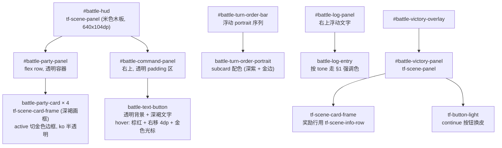

# Battle Scene UI 风格迁移方案

> 把 `ui/rmlui/scenes/battle.{rml,rcss}` 从"扁平黑底 + 蓝灰边"的旧风格迁移到 `for_agent/ui-style-guide.md` 定义的 Tokyo Night 米色木板风格。
> 仅做视觉皮肤层迁移; 不改战斗规则、布局尺寸、几何锚点和数据绑定。

## 背景

当前 `battle.rcss` 仍是旧扁平黑底风格 (`#101722f2` 半透明黑 + `#4d6077` 蓝灰边), 与已落地的 InventoryMenu / ShopMenu / AppearanceCustomize 三个基准场景视觉割裂。`ui-style-guide.md §12` 已把 `#battle-victory-panel` 列入待迁移清单, 但实际整个战斗 HUD (`#battle-hud`) 都需要按米色木板主面板 + 子卡画框的方式重做。

用户对本次迁移有明确诉求:
- 右下方"指令按钮区"内的命令按钮**保留文字按钮风格** (不用 ninepatch 按钮图), 仅按米色背景重调配色。
- 悬浮时**文字向右移动一小段** (4dp), 配合金色 `>` 光标出现, 增强"光标点击位"的视觉反馈。

## 目标

- HUD 主面板、队员卡片、胜利弹窗的视觉语言与基准场景一致 (米色木板 + 深褐画框)。
- 战斗 log / 状态 tooltip / state icon / HP/MP bar / turn order 全部换到 §1 调色板内。
- 命令按钮保持纯文字按钮 (transparent + 颜色驱动), 但在米色背景下可读, 悬浮态有右移动画。
- 现有 RML 结构、几何尺寸、`data-*` 绑定**完全不变**, 只改 RCSS 与必要的 class 名。

## 非目标

- 不调整战斗 HUD / 命令面板 / 队员卡的几何尺寸与定位 (布局上次已重构, 本次只换皮)。
- 不引入新按钮图片资源 (按钮区刻意保持文字风格)。
- 不动 RML 中的 `data-for / data-if / data-class-*` 等数据绑定。
- 不影响 `BattleScene` C++ 控制器层 (ViewModel / 命令注册 / nav helper 不需要改)。

## 设计概览



整体由两种主色块构成:
- **米色木板 (`tf-scene-panel`)**: HUD 主面板 + 胜利面板, 视觉上是 RPGMaker 风的窗口皮。
- **深褐画框 (`tf-scene-card-frame`)**: 队员卡片、胜利奖励组的分组容器, 仅边框, 让米色木板透出。
- **深紫子卡 (`tf-scene-subcard`)**: 状态 tooltip / turn-order portrait 等"浮动浅卡"使用, 与米色木板形成对比但不喧宾夺主。

## 分区设计

### 1. 主 HUD `#battle-hud`

| 属性 | 旧值 | 新值 |
|---|---|---|
| 装饰 | `background-color: #101722f2` + `border 1dp #4d6077` | `decorator: ninepatch(inventory-panel-bg, inventory-panel-bg-inner, 1.0)` (由 `tf-scene-panel` 提供) |
| padding | 无 | `4dp 8dp` (覆写 utility 默认的 10dp, HUD 横条更紧凑) |
| 几何 | `left:0 top:256 w:640 h:104` | 同前 (不调整) |

RML 改动只在 `<div id="battle-hud" class="tf-scene-panel">` 上加 class。

> ⚠️ `tf-scene-panel` utility 自带 `position: absolute`, 与现在 RCSS 中 #battle-hud 的 `position: absolute` 一致, 不冲突。

### 2. 队员卡片 `.battle-party-card`

| 属性 | 旧值 | 新值 |
|---|---|---|
| 装饰 | `background-color: #182333ee` + `border 1dp #405067` | `tf-scene-card-frame` (透明填充 + 深褐 ninepatch 边框) |
| padding | `4dp` | **保持 `4dp` (覆写 utility 默认的 8dp)**, 内部 114×78dp 布局不变 |
| 占位 border | (无) | `border: 1dp #00000000` 透明占位, 给状态切换备用 |
| `.active-party-member` | `border-color: #fce97fff` + `background-color: #21314aee` | 仅 `border-color: #fce97fff` + `transform: translateY(-1dp)` 微凸; 不再设 background-color (让米色木板透出) |
| `.ko-party-member` | bg/border 灰化 + 文字 `#777f8f` | `opacity: 0.5` + 文字色 §1 禁用色 (`#666666`); 不再设 background-color |

> **关于 padding**: `tf-scene-card-frame` utility 自带 `padding: 8dp` 是给 inventory 的"较大派对卡 (108×48)"等使用。124×88dp 的战斗卡片在 inventory_menu 的 `.party-card`(`inventory_menu.rcss:850`) 已验证过同样的 ninepatch 用 4dp padding 视觉无问题, 我们沿用这个模式, 保留现有内部 114×78dp 布局, 不改 stats/portrait/gap。
>
> **关于 border**: ninepatch 装饰与 RCSS `border` 可以共存 (inventory `.party-card` 用了同款手法: 默认 `border: 1dp #00000000` 透明占位 → `:hover` 变 `#e0af68`, `.party-selected` 变 `#7aa2f7`)。我们直接在 `.battle-party-card` 上设 1dp 透明边框作为占位, `.active-party-member` 时切到金色 `#fce97f`, 不需要内嵌指示 div。

RML 改动:
```html
<!-- 旧 -->
<div class="battle-party-card" data-for="member : party_status" ...>

<!-- 新 (只加 tf-scene-card-frame, 不需要其他子元素) -->
<div class="battle-party-card tf-scene-card-frame" data-for="member : party_status" ...>
```

RCSS 摘要:
```css
.battle-party-card {
    position: relative;
    box-sizing: border-box;
    width: 124dp;
    height: 88dp;
    padding: 4dp;                 /* 覆写 card-frame 默认 8dp */
    border: 1dp #00000000;        /* 透明占位, 状态切换用 */
    /* decorator 由 tf-scene-card-frame 提供 */
}

.battle-party-card.active-party-member {
    border-color: #fce97fff;
    transform: translateY(-1dp);
}

.battle-party-card.ko-party-member {
    opacity: 0.5;
}
```

### 3. 命令面板 `#battle-command-panel`

| 属性 | 旧值 | 新值 |
|---|---|---|
| 装饰 | `background-color: #182333ee` + `border 1dp #405067` | **去掉** 自定义 bg/border, 直接是主面板上的开放区域 |
| padding | `3dp 5dp` | 同前 |
| 几何 | `left:516 top:4 w:120 h:88` | 同前 |

> 之所以不给 command-panel 套 `tf-scene-card-frame`, 是因为 card-frame 自带 8dp padding 会把内部 4 个命令按钮 (Attack/Skill/Item/Guard/Escape/End Turn) 压不下。让命令按钮直接位于米色木板背景上, 视觉上和队员卡片画框形成"分区"对比, 也避免叠两层画框过重。

### 4. 命令按钮 `.battle-text-button` (**用户特别要求**)

保持文字按钮风格 (transparent 背景, 无 ninepatch), 只调配色 + 加右移动画。

#### 4.1 配色对照

| 状态 | 旧色 | 新色 (米色木板背景上) |
|---|---|---|
| 默认文字 | `#d8dee9` 浅蓝灰 | `#2a1f17` 深褐 (与 `tf-button-light` 默认色对齐) |
| 默认阴影 | `shadow(1dp 1dp #000000aa)` | `shadow(1dp 1dp #ffffff44)` (浅色背景用白阴影) |
| 默认背景 | transparent | transparent (不变) |
| hover / focus 文字 | `#fce97f` 金色 | `#8b4f1a` 棕红 (与 `tf-button-light` hover 对齐) |
| hover / focus 背景 | `#2c3b58` 半透明蓝 | **transparent** (不换底色) |
| active 文字 | `#ffffff` | `#6b5544` 中棕 |
| active 背景 | `#1d2940` | transparent |
| disabled 文字 | `#6e7480` | `#85705a99` (`tf-button-light` disabled) |
| 副标签 (sublabel) 默认 | `#abb6c9` | `#6f4f37cc` (`tf-scene-text-dark-muted`) |
| 副标签 (sublabel) hover | 跟随 label | `#8b4f1a` |
| disabled 副标签 | `#6e7480` | `#85705a99` |
| 光标 `>` | `#fce97f` | `#fce97f` (保持金色, 高亮触发点) |

#### 4.2 悬浮右移效果

通过 `padding-left` 过渡实现, 整个按钮内部 (光标 + 文字 + 副标签) 一起向右挪 4dp, 配合金色 `>` 出现, 视觉上像光标"推进"按钮内容:

```css
.battle-text-button {
    transition: padding-left 0.1s cubic-out, color 0.1s cubic-out;
    padding-left: 4dp;
    padding-right: 4dp;
    color: #2a1f17ff;
    font-effect: shadow(1dp 1dp #ffffff44);
}

.tf-input-mouse .battle-text-button:hover,
.tf-input-nav .battle-text-button:focus {
    padding-left: 8dp;   /* 右移 4dp */
    color: #8b4f1aff;
    /* 注意: 不再设 background-color, 维持 transparent */
}

.tf-input-mouse .battle-text-button:hover .battle-cursor,
.tf-input-nav .battle-text-button:focus .battle-cursor {
    opacity: 1;
    animation: 0.8s linear infinite battle-cursor-blink;
}
```

> `.battle-cursor` 默认 `opacity: 0` 但**占位** (因为它是 `display: inline-block`), 这样 hover 触发 padding-left 增加时, cursor "出现" + label "右移" 同时发生, 看起来是按钮被光标"激活"。
> 现有的 `battle-cursor-blink` keyframes 直接复用, 无需新增动画。

#### 4.3 disabled 视觉

```css
.battle-text-button.disabled,
.battle-text-button:disabled {
    color: #85705a99;
    /* 不改 padding-left, 保持 4dp, 即使被 hover/focus 也不右移 */
}

.tf-input-mouse .battle-text-button.disabled:hover,
.tf-input-nav .battle-text-button.disabled:focus,
.tf-input-mouse .battle-text-button:disabled:hover,
.tf-input-nav .battle-text-button:disabled:focus {
    padding-left: 4dp;
    color: #85705a99;
}
```

#### 4.4 target 列表的特殊文字色

target 行有 `.is-ally` / `.is-dead` 修饰:

| 类 | 旧色 | 新色 |
|---|---|---|
| `.is-ally` | `#8db8ff` 浅蓝 | `#7aa2f7` Tokyo Night 主蓝 |
| `.is-dead` | `#6e7480` | `#85705a99` |

### 5. 顶部 turn order `#battle-turn-order-bar`

容器维持浮动 (无背景), 每个 portrait 调整为 subcard 配色:

| 选择器 | 旧值 | 新值 |
|---|---|---|
| `.battle-turn-order-portrait` bg | `#0d1320ee` | `#24283bcc` (`tf-scene-subcard` 同款) |
| `.battle-turn-order-portrait` border | `#2d3a4f` | `#414868` |
| `.enemy-turn-entry .portrait` bg | `#1f1420ee` | `#24283bcc` (与默认同底, 不引入表外色) |
| `.enemy-turn-entry .portrait` border | `#533948` | `#f7768e` (§1 危险色, 红边标识敌方) |
| `.current-turn-entry .portrait` border | `#fce97f` | `#fce97f` (不变, 金色高亮; 优先级高于敌方红边) |
| `.acted/.ko .portrait` border | `#2c3440` | `#414868` (统一到 §1 暗灰) |
| 文字色 (.battle-turn-order-label) | `#ffffff` / 敌 `#ffc2d5` | `#ffffff` / 敌 `#f7768e` (§1 危险色) |
| acted/ko 文字 | `#747d8d` | `#666666` (§1 禁用色) |
| 角标 (badge) bg/border | `#05070bcc` + `#f4d475` | `#1a1b26cc` + `#fce97f` |

> portrait 太小 (28dp), 不适合 ninepatch, 维持纯色边框。

### 6. 顶部 status & log

| 选择器 | 旧值 | 新值 |
|---|---|---|
| `#battle-turn`, `#battle-result` | `#ffffff` + 阴影 | 同前 (已符合 `tf-scene-title`) |
| `#battle-result` (副) | `#d8dee9` | `#a9b1d6` (§1 副标题色) |
| `.battle-log-entry` 默认 | `#d8dee9` | `#a9b1d6` |
| `.log-damage` | `#ff9a9a` | `#f7768e` (§1 危险色) |
| `.log-recovery` | `#93e0a5` | `#9ece6a` (§1 成功色) |
| `.log-state` | `#d7bcff` | `#7dcfff` (§1 提示青色; 状态既可吉可凶, 用中性青) |
| `.log-system` | `#fce97f` | `#fce97f` (不变) |
| `.log-error` | `#ff7373` | `#f7768e` (§1 危险色) |

### 7. 状态 tooltip `.battle-state-tooltip`

按 `tf-scene-subcard` 风格重做:

| 属性 | 旧值 | 新值 |
|---|---|---|
| 背景 | `#0d1320f6` | `#24283bee` |
| 边框 | `1dp #697b95` | `1dp #414868` |
| 标题色 | `#fce97f` | `#fce97f` (不变) |
| turns 色 | `#abb6c9` | `#a9b1d6` |
| description 色 | `#d8dee9` | `#ffffff` (清晰可读) |

### 8. HP / MP / state-icon 配色

| 选择器 | 旧值 | 新值 |
|---|---|---|
| `.battle-hp-fill` | `#cf4354` | `#f7768e` (§1 危险/红) |
| `.battle-mp-fill` | `#4b85d9` | `#7aa2f7` (§1 主蓝) |
| `.battle-stat-bar` bg | `#090c12` | `#1a1b26cc` |
| `.battle-stat-bar` border | `#293241` | `#414868` |
| `.battle-stat-kind` (HP/MP 字样) | `#abb6c9` | `#6f4f37cc` (米色面板上的暗色 muted) |
| `.battle-stat-value` | (继承) | `#2a1f17` (米色面板上的暗色) |
| `.battle-state-icon-image` bg | `#0b1019ee` | `#1a1b26cc` |
| `.battle-state-icon-image` border | `#56657a` | `#414868` |
| `.battle-state-icon` hover border | `#fce97f` | `#fce97f` (不变) |
| `.battle-state-turns` (角标) bg/border | `#05070bcc` + `#f4d475` | `#1a1b26cc` + `#fce97f` |

> 队员卡片背景已是米色木板透出, HP/MP 槽是其内的小深色长条, 与状态 tooltip 配色统一 (`#1a1b26cc` + `#414868`)。

### 9. 队员名 / portrait

| 选择器 | 旧值 | 新值 |
|---|---|---|
| `.battle-party-name` | `#ffffff` + 黑阴影 | `#2a1f17` + 白阴影 (米色背景上的深色文字) |
| `.battle-party-name` (active) | `#ffffff` | `#fce97f` (`tf-scene-title-gold`) |
| `.battle-party-name` (ko) | (继承) | `#666666` + opacity (由父 `ko` opacity 控制) |
| `.battle-portrait` bg | `#0d1320` | `#1a1b26cc` |
| `.battle-portrait` border | `#2d3a4f` | `#414868` |

### 10. 战斗胜利面板 `#battle-victory-overlay` / `#battle-victory-panel`

按 §12 完整迁移:

| 选择器 | 旧值 | 新值 |
|---|---|---|
| `#battle-victory-overlay` bg | `#03070fcc` | `#1a1b26c0` (与 Inventory dim 一致) |
| `#battle-victory-panel` 装饰 | `#111822f2` + `1dp #f0d77e` | `tf-scene-panel` 米色木板 ninepatch |
| `#battle-victory-title` 色 | `#fff2a6` | `#fce97f` (`tf-scene-title-gold`) |
| `.battle-victory-row` bg/border | `#1a2535ee` + `1dp #46546a` | 移除 bg/border, 改用 `tf-scene-info-row` + `tf-scene-info-value-gold` |
| `.battle-victory-label` 色 | `#d8dee9` | `#2a1f17` (米色面板上的暗色, 即 `tf-scene-text-dark`) |
| `.battle-victory-value` 色 | `#fce97f` | `#e0af68` (`tf-scene-accent-gold`, 与价格/奖励数字一致) |
| `.battle-victory-item` bg | `#101722cc` | `transparent` (整组奖励包在一个 `tf-scene-card-frame` 内, 不再各行单独压底) |
| `.battle-victory-level` bg | `#172416dd` | `transparent` (同上) |
| `.battle-victory-level-label` 色 | `#c7f59c` | `#9ece6a` (§1 成功色, 升级用绿) |
| `.battle-victory-level-stats` 色 | `#fce97f` | `#e0af68` |
| `#battle-victory-continue` 按钮 | 自拼 bg/border + hover/focus | `tf-button-light tf-nav-auto tf-focus-ring-blue` (删除所有自拼 CSS, 几何只设 `width / margin / line-height`) |

RML 变更最小化, 主要是改 class:

```html
<!-- 旧 -->
<div id="battle-victory-panel">
    <div id="battle-victory-title">{{ victory_title }}</div>
    <div id="battle-victory-rewards">
        <div class="battle-victory-row">...</div>
    </div>
    <button id="battle-victory-continue" class="battle-text-button tf-nav-auto" ...>

<!-- 新 -->
<div id="battle-victory-panel" class="tf-scene-panel">
    <div id="battle-victory-title" class="tf-scene-title-gold">{{ victory_title }}</div>
    <div id="battle-victory-rewards" class="tf-scene-card-frame">
        <div class="battle-victory-row tf-scene-info-row">
            <span class="battle-victory-label tf-scene-info-label">Gold</span>
            <span class="battle-victory-value tf-scene-info-value-gold">{{ victory_gold_text }}</span>
        </div>
        ...
    </div>
    <button id="battle-victory-continue" class="tf-button-light tf-nav-auto tf-focus-ring-blue" ...>
```

#### 10.1 胜利面板几何重排

迁移会引入两项尺寸变化:
- `#battle-victory-rewards` 加 `tf-scene-card-frame` → 上下各 +8dp padding, 共 +16dp 高度。
- `#battle-victory-continue` 由 24dp 改 32dp (`tf-button-light` 高度固定, 不可覆写) → +8dp。

按面板内组件累加:

| 区块 | 旧高 | 新高 | 备注 |
|---|---|---|---|
| `#battle-victory-title` | 34dp | 34dp | 仅改色, 高度不变 |
| `#battle-victory-rewards` 外框 | 128dp | **144dp** | card-frame padding ×2 = +16dp; 内部 264×128 与旧 280×128 等效, 行布局不动 |
| `#battle-victory-continue` | 24dp | **32dp** | utility 决定 |
| 标题→奖励 mt | 6dp | 6dp | |
| 奖励→按钮 mt | 8dp | 8dp | |
| **小计 (内容)** | 200dp | **224dp** | +24dp |
| panel padding (10dp ×2) | 20dp | 20dp | |
| **panel height** | 212dp | **244dp** | +32dp |

定位调整:
- `#battle-victory-panel`: `width: 300dp; height: 244dp; left: 170dp; top: 6dp`
  (overlay 256dp 高, 居中: `(256-244)/2 = 6dp`)
- `#battle-victory-continue`: `width: 108dp; margin-left: 86dp; margin-top: 8dp` (高度交给 utility, 不写 `height` / `line-height` / `padding`)
- `#battle-victory-rewards`: 内部 `.battle-victory-row` / `#battle-victory-item-list` / `#battle-victory-level-list` 的子尺寸维持原值, 因为 card-frame 提供的内部宽度 264dp ≥ 旧子项的 280dp 还需要重测一次:
  - 旧子项写的是 `width: 280dp`, 新 card-frame 内宽是 `300 - 20 (panel padding) - 16 (card padding) = 264dp`
  - 需要把 `.battle-victory-row`, `.battle-victory-empty`, `.battle-victory-item`, `.battle-victory-level`, `#battle-victory-item-list`, `#battle-victory-level-list` 的 `width: 280dp` 改为 `width: 264dp`, 内部 label/value 宽度按比例缩 (label 148→140, value 116→108, item-label 194→186 等), 或者直接改成 `width: 100%` 让 flex 适配。
  - 推荐: 把这些固定 280dp 改为 `width: 100%` (因为内容是单行 flex 布局, 100% 即父容器宽度), label/value 用 `flex: 1` 或保持固定 dp 但加和减 16dp。

> 这些是基于 RCSS 静态规则的推算; 实施时可能仍需 1-2dp 微调, 计入步骤 6 的运行时验证。

## 实现步骤

| 步骤 | 改动 | 文件 |
|---|---|---|
| 0 | **前置: 在 `battle.rml` 的 `<head>` 加 link** (顺序: `spritesheet.rcss` 之后, `portrait.rcss` 之前) `<link href="../theme/menu_widgets.rcss"/>` + `<link href="../theme/overlay_scene.rcss"/>` | `battle.rml` |
| 1 | `#battle-hud` 在 RML 上加 `class="tf-scene-panel"` | `battle.rml` |
| 2 | `.battle-party-card` 在 RML 上加 `class="... tf-scene-card-frame"` (不再需要内嵌 indicator div) | `battle.rml` |
| 3 | 胜利面板按 §10 表格替换 RML class | `battle.rml` |
| 4 | 重写 `battle.rcss`: 删除旧 bg/border, 加新色; 命令按钮加 `padding-left` 过渡; 队员卡片覆写 `padding: 4dp` 并设透明占位 border | `battle.rcss` |
| 5 | `battle-victory-continue` 自定义 CSS 全部删除 (用 utility); 胜利面板尺寸按 §10.1 重排 | `battle.rcss` |
| 6 | 在 `BattleScene` 测试一遍各 menu state (party / actor / list / target / victory), 校对配色与右移动画 | (运行时验证) |

> **步骤 0 是必须的**: `tf-scene-panel` / `tf-scene-card-frame` 在 `theme/overlay_scene.rcss`, `tf-button-light` / `.tf-input-mouse/.tf-input-nav` 相关定义在 `theme/menu_widgets.rcss`。当前 `battle.rml` 只 link 到 `nav.rcss` 等, 没有这两个文件, 不补 link 的话所有 `tf-scene-*` / `tf-button-*` class 都不会生效。
> 步骤 1-5 都是纯前端 RML/RCSS 编辑, 不需要 C++ 改动。

## 验证清单

启动 `battle_tester` 或进入实战场景:

- [ ] HUD 整体是米色木板风, 与 Inventory/Shop 看起来"同一套窗口皮"。
- [ ] 4 张队员卡有深褐画框, 当前回合卡边框变金色 + 轻微上凸, KO 卡半透明。
- [ ] HP 条红 (`#f7768e`), MP 条蓝 (`#7aa2f7`); 队员名在米色背景上是深褐 (active 时变金色)。
- [ ] 命令按钮 (Attack/Skill/Item/Guard/Escape/End Turn) 默认深褐文字, 鼠标悬浮或方向键聚焦时:
  - [ ] 文字向右平移 4dp;
  - [ ] 文字变棕红 (`#8b4f1a`);
  - [ ] 金色 `>` 光标出现并闪烁;
  - [ ] disabled 项不会右移, 文字保持灰褐。
- [ ] target 列表中 ally 显示蓝色 (`#7aa2f7`), dead 显示灰褐。
- [ ] 顶部 turn order 暗紫底 + 金/红边, 当前回合 portrait 金色边。
- [ ] 战斗 log 按 tone 走 §1 调色板 (damage 红 / recovery 绿 / system 金 / state 青 / error 红)。
- [ ] state-icon hover 显示 tooltip, tooltip 是深紫 subcard 风。
- [ ] 胜利面板是米色木板, 奖励行用 info-row + gold 数值, continue 按钮是木牌 (`tf-button-light`)。
- [ ] 键盘/手柄方向键导航在新按钮上仍正常 (没破坏 `tf-nav-auto`)。

## 风险与缓解

| 风险 | 影响 | 缓解 |
|---|---|---|
| `tf-scene-panel` 的 ninepatch padding 默认 10dp, 应用到 HUD 横条 (640×104dp) 会挤掉内部布局 | 队员卡 / 命令区位置错位 | 在 `#battle-hud` 覆写 `padding: 4dp 8dp`, 内部 `#battle-party-panel` / `#battle-command-panel` 几何相对偏移不变 |
| 米色木板背景下深色文字易被 1dp 白阴影"糊掉" | 队员名 / HP 数字读起来模糊 | 用 `tf-scene-text-dark` 的标准搭配 (`#2a1f17` + `shadow(1dp 1dp #ffffff44)`), 与基准场景一致 |
| 命令按钮去掉 hover 背景, 焦点仅靠文字色 + 右移区分, 手柄玩家可能不易看到当前焦点 | nav 焦点辨识度下降 | 右移 4dp + 金色光标出现 + 文字变棕红的组合已经足够明显; 必要时可补一个左侧 2dp 金色短竖线 (`border-left: 2dp #fce97f` 只在 focus 时显示) |
| `tf-scene-panel` 的 ninepatch 是 `inventory-panel-bg`, 在 HUD 横条 (640×104) 比例下可能拉伸不均 | 边框线条不连续 | 风险低: 同款 sprite 已用于 360×238 / 580×308 等不同尺寸, ninepatch 9 段切片本就适应横条; 真机验证后若不理想再讨论新增"宽条木板" sprite |
| 胜利面板高度按 §10.1 算到 244dp, 与 overlay 256dp 的边距只剩 6dp 上下 | 视觉显得"撑满"; 字号在 1.25× 缩放下可能溢出 | 6dp 边距对 overlay 视觉够用; UI 字号缩放 1.25 时, `1rem` 字号会变 20dp, RmlUi flex/line-height 自适应, 主要保证 `tf-button-light` 的固定 32dp 高度不被字号扯破 (它本身是固定高度, 内部文字会被裁切但通常 1-2 字符的"Continue"用不到) |
| `tf-input-mouse` / `tf-input-nav` body class 由游戏运行时根据最近输入设置, 而本计划的 hover/focus 规则都依赖这两个 class 作前缀 | 如果 battle.rml 的 body 没有这两个 class, hover/focus 样式不生效 | 战斗场景已经用 `<body class="tf-screen-root tf-nav-root">`, 输入态 class 由 `RmlUiRuntime` 全局切换, 不需要额外处理; 若实施后发现样式失效需检查 `body` 上是否丢失运行时 class |

## 后续 (本计划之外)

- 待迁移清单 §12 中其他场景 (`quest_offer`, `recruit_offer`, `rest_dialog`, `pause_menu`, `save_slot_select`) 不在本计划范围, 但完成本计划后可作为示范, 类似地按"主面板 → 子卡画框 → 按钮换皮"三步迁移。
- 如果未来希望命令按钮真的换 ninepatch 皮, 可基于本计划新增"`battle-command-button` = `tf-button-light` 紧凑变体" (高度 18-20dp, 木牌窄版), 替换 `.battle-text-button`。当前用户明确不要按钮图, 不做。
