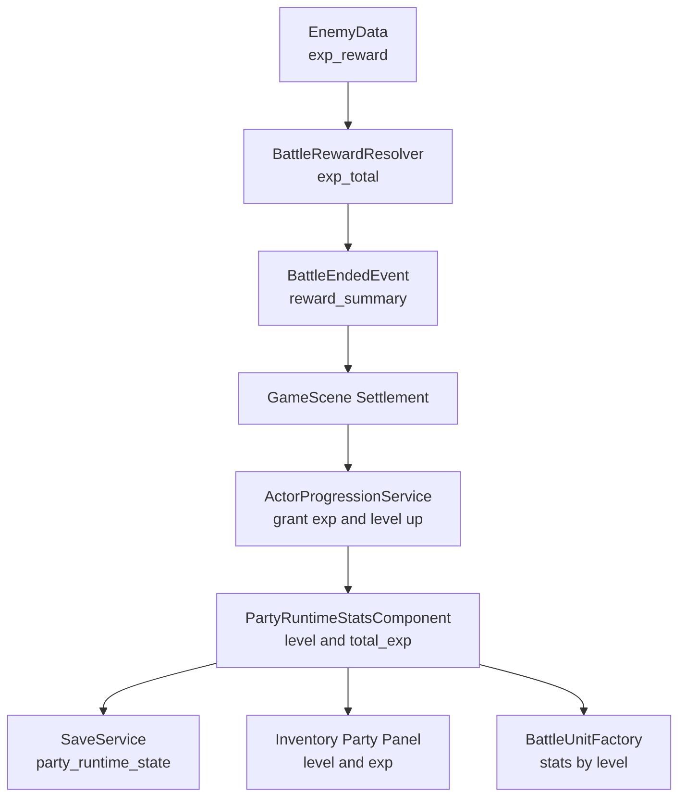

# 玩家经验值与升级曲线补充计划

## 元信息

- 任务ID：`RPG-PROGRESSION-001`
- 任务标题：补齐玩家队伍经验值、等级曲线与战斗经验写回
- 优先级：`P1`
- 状态：`Planned`
- 计划时间：`2026-05-21` 起
- 相关文档：
  - `docs/overview.md`
  - `docs/gameplay/turn-based-battle.md`
  - `plans/archive/jrpg-milestone/jrpg-milestone-b-battle-rewards-ai-index.md`
  - `plans/archive/jrpg-milestone/jrpg-milestone-b-stage4-reward-writeback-and-feedback.md`
  - `for_agent/code-guide.md`
  - `for_agent/docs-guide.md`

## Context

当前 JRPG 战斗奖励链路已经把经验值汇总出来，但还没有消费方：

- `BattleRewardSummary::exp_total` 已由 `BattleRewardResolver` 根据被击败敌人的 `EnemyData::exp_reward_` 聚合。
- `GameScene` 的 Victory 写回目前只处理金币与掉落，刻意把 `exp_total` 留给后续成长系统。
- `ActorData` 只有 `initial_level_ / max_level_`，没有运行时 `level / total_exp`。
- `PartyRuntimeStatsComponent` 已按 actor id 持久化 `current_hp / current_mp`，适合扩成“队伍成员运行时与成长状态”的近期真源。
- `InventoryMenuCharacterPanel` 当前等级显示直接读 `ActorData::initial_level_`，战斗单位构建也只用 class `base_params_`，等级不会影响面板或战斗数值。
- 存档 schema 当前为 v5，`party_runtime_state.actor_states` 只有 `current_hp / current_mp`。

本计划目标是把之前“经验只汇总”的预留点变成完整闭环：敌人给经验，队伍成员获得经验，达到曲线阈值后升级，升级后的等级和属性能进入菜单、战斗、存档与反馈。



## Goals

- 为玩家队伍成员补齐持久化的 `level` 与 `total_exp`。
- 在 class 数据上加入 RPG Maker 风格的经验曲线参数，并提供可测的曲线计算。
- 让战斗 Victory 的 `exp_total` 写回实际参战 actor，触发多级连升。
- 让等级影响战斗属性解析，而不是只改变 UI 文本。
- 升级时让 HP/MP 上限提升产生即时可见效果：不回满，但当前 HP/MP 会获得对应上限增量。
- 在胜利结算 UI/探索通知/队伍面板中展示经验与升级结果。
- 将存档 schema 升到 v6，并给旧存档补默认等级和经验。
- 补齐数据解析、曲线、战斗写回、存档 roundtrip 与 UI view model 测试。

## Non-Goals

- 本阶段不做职业切换、多职业经验、等级下降或转生。
- 本阶段不做复杂 reserve member 经验规则；默认只有实际参战 actor 获得经验。
- 本阶段不把技能学习系统一并重构为等级学习。若要加 `learnings`，作为后续阶段接入 `SkillState`。
- 本阶段不做独立结算 Scene；继续增强现有 Battle Victory overlay 与探索通知。
- 本阶段不做敌人等级、区域等级缩放或动态经验倍率。

## 设计决策

### 1. 运行时真源

近期推荐直接扩展 `ActorRuntimeState`，避免新增一个与 `PartyRuntimeStatsComponent` 平行的队伍成长组件。

```cpp
struct ActorRuntimeState {
    int current_hp{0};
    int current_mp{0};
    int level{1};
    int total_exp{0};
};
```

约定：

- `total_exp` 是累计经验，不是当前等级内经验。这样战斗奖励可以直接累加，也方便从曲线反推等级。
- `level` 是缓存值，`total_exp` 是真源。读档和写回时都由 `total_exp` 与 `actor.max_level_` 重新推导 `level`，避免存档手改后出现不一致。
- 若某个 actor 尚无 runtime state，则以 `ActorData::initial_level_` 初始化，并令 `total_exp = expForLevel(initial_level)`。
- `current_hp/current_mp` 缺失时初始化为当前等级的最大 HP/MP。
- 升级后默认不自动回满，但会把上限增量加到当前值：`current_hp += new_max_hp - old_max_hp`，`current_mp += new_max_mp - old_max_mp`，再 clamp 到新上限。这能让升级立刻有反馈，同时不等同于完全回复。
- 若后续想做“升级全回复”，可以作为配置项加到曲线或系统设置中。

### 2. RPG Maker 风格经验曲线

在 `ClassData` 增加经验曲线参数：

```cpp
struct ExpCurveData {
    int basis{30};
    int extra{20};
    int acc_a{30};
    int acc_b{30};
};
```

JSON 建议：

```json
{
  "id": "class.swordsman",
  "display_name": "Warrior",
  "exp_curve": {
    "basis": 30,
    "extra": 20,
    "acc_a": 30,
    "acc_b": 30
  },
  "base_params": {
    "mhp": 544,
    "mmp": 41,
    "atk": 19,
    "def": 17,
    "mat": 15,
    "mdf": 17,
    "agi": 29,
    "luk": 27
  }
}
```

公式采用 RPG Maker MZ / MV 同系的累计经验曲线思想，`level` 表示“达到该等级所需的总经验”：

```text
expForLevel(1) = 0

expForLevel(level) =
round(
    basis * pow(level - 1, 0.9 + acc_a / 250.0)
    * level * (level + 1)
    / (6.0 + level * level / 50.0 / max(acc_b, 1))
    + (level - 1) * extra
)
```

实现细节：

- 内部使用 `double` 和 `std::int64_t` 计算，再 clamp 到 `int`。
- `basis / extra / acc_a / acc_b` 读入时做最小值约束，避免非法曲线。
- 加载后验证 `level 1..max_level` 的经验阈值单调递增。
- `levelForExp(actor, total_exp)` 使用循环或二分均可；当前 max level 99，循环更直观且足够快。

### 3. 属性随等级成长

只加经验和等级但属性不变，会让升级没有玩法意义。因此本阶段同时让 `resolveActorStats` 接受等级。

推荐数据格式保持手写友好：

```json
{
  "param_curves": {
    "mhp": { "level_1": 544, "level_99": 7509, "shape": "linear" },
    "mmp": { "level_1": 41, "level_99": 895, "shape": "linear" },
    "atk": { "level_1": 19, "level_99": 196, "shape": "linear" },
    "def": { "level_1": 17, "level_99": 172, "shape": "linear" },
    "mat": { "level_1": 15, "level_99": 133, "shape": "linear" },
    "mdf": { "level_1": 17, "level_99": 159, "shape": "linear" },
    "agi": { "level_1": 29, "level_99": 324, "shape": "linear" },
    "luk": { "level_1": 27, "level_99": 332, "shape": "linear" }
  }
}
```

解析策略：

- `base_params` 继续作为 `level_1` 的兼容输入和简短测试 fixture 的默认值。
- `param_curves` 存在时优先使用曲线计算等级属性。
- `param_curves` 缺失时所有等级都返回 `base_params`，这样可以渐进迁移测试数据。
- `shape` 第一版支持 `linear / early / late`，明确使用归一化插值：
  - `t = clamp((level - 1) / (max_level - 1), 0, 1)`；若 `max_level <= 1`，直接返回 `level_1`。
  - `linear`: `u = t`
  - `early`: `u = pow(t, 0.6)`，前期成长更快。
  - `late`: `u = pow(t, 1.5)`，后期成长更快。
  - `value = round(level_1 + (level_max - level_1) * u)`。
- 装备加成仍在等级基础属性之后叠加，保持现有装备系统语义。

### 4. 经验发放规则

MVP 规则：

- 只有 `BattleOutcome::Victory` 发经验。
- 经验来源继续使用 `BattleRewardSummary::exp_total`。
- 从 `BattleEndedEvent::final_units` 取所有 `side == Player` 且有 `source_actor_id` 的唯一 actor id。
- 每个参战 actor 获得完整 `exp_total`，不按人数平分。
- HP 为 0 的参战 actor 仍获得经验，避免玩家在回合制战斗中因临时倒下而错过成长。
- 不在 active party 但未参战的 recruited actor 暂不获得经验。
- 满级 actor 的 `level` 与 `total_exp` 都截断在上限：`total_exp = expForLevel(max_level)`，`exp_to_next = 0`。这样未来调高 `max_level_` 时不会因为隐藏溢出经验而凭空连升。

写回结果建议新增纯数据结构：

```cpp
struct ActorExperienceGrant {
    std::string actor_id{};
    int gained_exp{0};
    int old_level{1};
    int new_level{1};
    int total_exp{0};
    int exp_to_next{0};
};

struct PartyExperienceGrantResult {
    std::vector<ActorExperienceGrant> actors{};
    [[nodiscard]] bool anyLevelUp() const;
};
```

`GameScene` 只负责在奖励写回阶段调用进度服务，并把结果交给反馈格式化函数；等级曲线和状态更新不写在 scene 内。

### 5. UI 与反馈

需要同步的玩家可见位置：

- Battle Victory overlay：在 Gold 旁新增 EXP count-up，显示 `EXP {{ victory_exp_text }}`。
- Battle Victory overlay 等待确认时追加升级列表，如 `Alex Lv.2`。
- 升级列表建议同时展示上限变化，例如 `Alex Lv.2  HP +74  MP +9`，让“不回满但获得上限增量”的规则对玩家可见。
- 探索态奖励通知：`formatBattleSettlementFeedback` 增加 `Gained EXP n` 和 level-up 行。
- Inventory party panel：等级读取 runtime state；建议额外显示 `EXP current / next` 或 `Next n`，至少先保证 `Lv.x` 不再使用 `initial_level_`。
- Debug Player 面板：增加 level/total_exp 调整按钮，方便数值调试。

注意：如果 Victory overlay 已展示经验，探索通知仍可以保留一行简短汇总，因为 BattleScene pop 后玩家需要在地图上看到最终结果。

## 影响范围

### 新增文件

| 文件 | 用途 |
|---|---|
| `src/game/domain/actor_progression_service.h` | 经验曲线、等级推导、经验写回结果的领域接口 |
| `src/game/domain/actor_progression_service.cpp` | `expForLevel / levelForExp / grantExperience` 实现 |
| `tests/game/actor_progression_service_test.cpp` | 曲线、连升、满级、非法输入 clamp 测试 |

### 修改文件

| 文件 | 修改内容 |
|---|---|
| `src/game/data/rpg_data.h` | 增加 `ExpCurveData / ParamCurveData`，扩展 `ClassData` |
| `src/game/data/rpg_catalog.cpp` | 解析 `exp_curve / param_curves`，补默认值与校验 |
| `assets/data/rpg/classes.json` | 为现有三种职业补经验曲线和等级属性曲线 |
| `src/game/component/party_runtime_stats_component.h` | `ActorRuntimeState` 增加 `level / total_exp` |
| `src/game/battle/actor_stats_resolver.h/.cpp` | 增加带 level 的属性解析重载 |
| `src/game/battle/battle_unit_factory.h/.cpp` | `BattleUnitBuildOptions::actor_runtime_states` 传入等级，构建单位时使用等级属性 |
| `src/game/system/party_recruitment_system.cpp` | 招募新成员时初始化 `level / total_exp / current_hp / current_mp` |
| `src/game/scene/game_scene_battle_settlement.h/.cpp` | Victory 写回经验并生成进度结果 |
| `src/game/scene/game_scene_reward_feedback.h/.cpp` | 奖励反馈增加 EXP 与 level-up 行 |
| `src/game/scene/battle_victory_flow_controller.h/.cpp` | EXP count-up 与升级结果快照 |
| `src/game/scene/battle_scene.h/.cpp` | 绑定 `victory_exp_text` 和升级列表 view model |
| `ui/rmlui/scenes/battle.rml/.rcss` | Victory overlay 增加 EXP 行和 level-up 列表 |
| `src/game/scene/inventory_menu_character_panel.cpp` | 等级与经验显示改读 runtime state |
| `src/game/save/save_data.h/.cpp` | `ActorRuntimeStateSaveData` 增加 `level / total_exp` |
| `src/game/save/save_migrator.cpp` | schema v5 -> v6 迁移，补 `level / total_exp` |
| `src/game/save/save_service.cpp` | 保存/读档 roundtrip 新字段，并读档后按目录校正 |
| `src/game/debug/player_debug_panel.cpp` | 增加经验和等级调试入口 |
| `src/CMakeLists.txt` | 新增源文件与测试编译项 |

## 实现步骤

### Phase 1. 数据模型与曲线服务

- 在 `rpg_data.h` 增加 `ExpCurveData / ParamCurveData`。
- 在 `RpgCatalog::loadClasses` 解析 `exp_curve / param_curves`。
- 新增 `ActorProgressionService`，先只做纯计算，不接 ECS。
- 覆盖测试：
  - 默认曲线 `expForLevel(1) == 0`。
  - `expForLevel(2) > expForLevel(1)` 且到 99 单调递增。
  - `levelForExp(expForLevel(n)) == n`。
  - 满级后 `exp_to_next == 0`。

### Phase 2. 属性解析接入等级

- 扩展 `resolveActorStats(catalog, actor, level, loadout)`。
- `InventoryMenuCharacterPanel` 和 `BattleUnitFactory` 都通过 runtime state 取等级。
- `PartyRecruitmentSystem` 初始化新成员时写入 `level = initial_level`、`total_exp = expForLevel(initial_level)`，并使用该等级属性初始化 HP/MP。
- `ItemUseSystem` 计算最大 HP/MP 时使用该 actor 当前等级。
- 覆盖测试：
  - Lv.1 保持现有数值。
  - Lv.10 属性高于 Lv.1。
  - `param_curves` 缺失时所有等级都返回 `base_params`，保证测试 fixture 和旧数据可渐进迁移。
  - 装备加成仍叠加在等级属性之后。

### Phase 3. 战斗经验写回

- 在 `applyVictoryRewards` 或同级 helper 中加入 `applyVictoryExperience`。
- 从 `final_units` 收集参战 actor id，按 actor 写入 `total_exp / level`。
- 升级后先把 HP/MP 上限增量加到 `current_hp/current_mp`，再 clamp 到新上限；缺失状态则按新等级最大值初始化。
- `PartyRuntimeStatsComponent::revision_` 在经验或等级变化时递增。
- 触发 `PartyRuntimeStatsChanged{full_sync=true}`，供已打开的菜单和调试 UI 未来订阅。
- 事件可能在 InventoryMenu 未打开时被丢弃，因此菜单打开时仍必须从 `PartyRuntimeStatsComponent` pull 当前快照；事件只作为打开期间的增量刷新信号。
- 覆盖测试：
  - Victory 写回经验并升级。
  - Defeat / Escaped 不写经验，但仍按现有战斗结束链路写回 HP/MP 与战斗物品 delta。
  - 同一 actor 只获得一次本场经验。
  - 满级 actor 不超过 `max_level_`，且 `total_exp` 停在 `expForLevel(max_level)`。

### Phase 4. UI 与反馈

- Battle Victory overlay 增加 EXP count-up。
- Victory 等待确认阶段显示升级角色列表。
- 探索态奖励通知加入 EXP 和 level-up 文本。
- Inventory party panel 改用 runtime level，补经验显示字段。
- Debug Player 面板提供添加经验、设为满级、重置到初始等级。
- 覆盖测试：
  - `BattleVictoryFlowController` 的 EXP 计数与 Gold 同步推进。
  - `formatBattleSettlementFeedback` 包含经验和升级行。
  - `InventoryMenuPartyPanelTest` runtime level 覆盖 `initial_level_`。

### Phase 5. 存档迁移与文档

- `SAVE_SCHEMA_VERSION` 升到 6。
- `save_migrator` 确保旧存档的 `party_runtime_state.actor_states.*` 拥有 `level / total_exp`。
- 读档应用时按 `RpgCatalog` 校正：
  - actor 不存在则跳过并 warn。
  - `total_exp` 是真源；若 `level` 与 `total_exp` 不一致，始终以 `total_exp` 重算 `level`。
  - 旧存档缺少 `total_exp` 时，先用 `saved_level` 或 `actor.initial_level_` 初始化为 `expForLevel(level)`。
  - 读档后 `total_exp` clamp 到 `[expForLevel(initial_level), expForLevel(max_level)]`。
  - `level = levelForExp(total_exp)`，并 clamp 到 `[initial_level, max_level]`。
- 更新 `docs/gameplay/turn-based-battle.md` 的奖励结算章节。
- 覆盖测试：
  - v5 存档迁移到 v6。
  - 保存后读取仍保留 level/total_exp/current_hp/current_mp。
  - 缺字段旧存档能初始化为 actor 初始等级。
  - 手改存档中 `total_exp` 高于 `level` 对应阈值时，读档会按 `total_exp` 重算等级。
  - 手改存档中 `total_exp` 低于 `level` 对应阈值时，读档会按 `total_exp` 下修等级，但不会低于 `actor.initial_level_`。

## 数值初始建议

第一版内容调参建议：

- 三个职业都使用默认 `exp_curve = { basis: 30, extra: 20, acc_a: 30, acc_b: 30 }`。
- 在 `actor_progression_service.h` 的 doxygen 中说明：`basis/extra` 控制整体经验需求与线性附加量，`acc_a` 主要影响曲线幂次，`acc_b` 主要影响高等级段压缩或拉伸，方便后续调参。
- 当前敌人经验偏低：Slime 6、Goblin 10、Gnome 10。若保持该值，Lv.2 约需 50 经验，玩家需要 5 到 8 场早期战斗升级，节奏偏慢但可接受。
- 为了演示升级闭环，建议把初期 troop 总经验控制在 12 到 20，让第 3 到第 4 场战斗触发第一次升级。
- `param_curves` 的 `level_99` 可以先参考 `for_agent/ref/data/Classes.json` 中 RPG Maker 参考职业的 99 级数值，再在后续战斗平衡阶段统一调低或调高。

## 验收标准

- 新开游戏后，玩家菜单显示 `Lv.1` 和合理的 EXP/Next 信息。
- 赢得战斗后，Victory overlay 显示获得 EXP；达到阈值时显示升级。
- 回到探索态后，通知文本包含经验与升级摘要。
- 再次进入战斗时，升级后的角色属性参与伤害、速度和 HP/MP 上限计算。
- 保存并读档后，角色等级、累计经验、当前 HP/MP 保持一致。
- `ctest` 中 RPG catalog、progression、battle reward writeback、save migrator、inventory party panel 相关测试通过。
- 使用 ninja 构建：`cmake --build build --target TinyFarmRPG_tests -j` 或项目当前测试目标名。

## ToDo

- [ ] Phase 1: 增加 RPG 数据模型与 `ActorProgressionService`
- [ ] Phase 2: 等级属性曲线接入菜单、物品使用与战斗单位构建
- [ ] Phase 3: Victory 经验写回与多级升级结果
- [ ] Phase 4: Battle Victory overlay、探索通知、队伍面板与调试 UI
- [ ] Phase 5: 存档 schema v6、迁移、roundtrip 测试与文档更新
