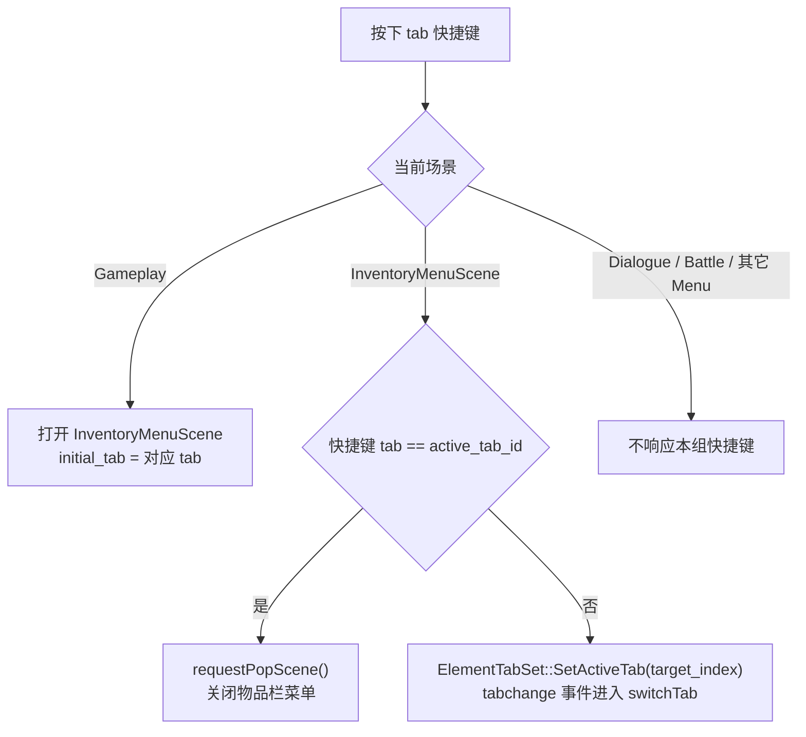

# Inventory Menu Tab 快捷键优化计划

> 目标：在探索中用独立快捷键直接打开物品栏菜单的指定 tab；在物品栏菜单内用同一组快捷键切换 tab；如果快捷键对应当前 tab，则关闭物品栏菜单。

## 背景

当前行为：
- 探索中按 `I` 触发 `inventory` action，由 `GameScene::onInventoryToggle()` push `InventoryMenuScene`。
- `InventoryMenuScene` 进入 `InputContextId::Menu` 后只监听 `menu_cancel`，所以退出依赖 `Esc` / `GamepadEast`。
- tab 切换由 `ui/rmlui/scenes/inventory_menu.rml` 的原生 `<tabset id="menu-tabset">` 触发 `switch_tab(ev.tab_index)`，C++ 侧通过 `InventoryMenuScene::switchTabFromTabsetIndex()` 同步 tab 内容生命周期。

这次优化要把“打开菜单”和“切到指定 tab”合并成同一套快捷键，并且保持 RmlUi 原生 tabset 的视觉选中状态与 C++ `active_tab_id_` 一致。

## 快捷键设计

| Tab | Action | 默认键盘 | 说明 |
|---|---|---:|---|
| Inventory | `inventory` | `I` | 保留现有入口和提示语义 |
| Equipment | `inventory_tab_equipment` | `C` | `E` 已用于 rotate_right，`C` 取 Character/装备角色页语义 |
| Quests | `inventory_tab_quests` | `J` | 取 Journal，避开 `Q` rotate_left |
| Map | `inventory_tab_map` | `M` | 常见地图快捷键 |
| Options | `inventory_tab_options` | `O` | 常见设置快捷键 |

手柄本阶段保持现状：`GamepadBack` 继续作为 Inventory tab 入口；菜单内仍可用方向键/确认/取消操作。为每个 tab 设计独立手柄键会和确认、取消、肩键翻页等动作抢位，先不做。

## 行为规则



细节约束：
- 菜单内按当前 tab 快捷键时直接关闭菜单，不走 `activeTab()->onCancel()`，避免 action menu 或 actor target mode 吞掉“再次按快捷键退出”的语义。
- 菜单内切换到其它 tab 时应先调用 RmlUi 原生 tabset 的 `SetActiveTab()`；该调用会同步选中态与 panel 显示，并派发 `tabchange`，最终走现有 `switch_tab(ev.tab_index)` → `switchTabFromTabsetIndex()` → `switchTab()`。这样点击 tab 与快捷键切 tab 共用同一条切换路径。
- `Esc` 保持原行为：优先让当前 tab / actor target mode 取消，再关闭菜单。
- Dialogue / Battle context 不加入这些 action，避免对话或战斗中误开物品栏菜单。

## 实施步骤

### 1. 输入映射与上下文

修改：
- `config/input.json`
- `src/engine/input/input_manager.cpp`

内容：
- 在 `defaultMappings()` 和 `config/input.json` 添加：
  - `inventory_tab_equipment`: `C`
  - `inventory_tab_quests`: `J`
  - `inventory_tab_map`: `M`
  - `inventory_tab_options`: `O`
- `Gameplay` context 允许 `inventory` 和新增 4 个 tab action。
- `Menu` context 允许 `inventory` 和新增 4 个 tab action，使物品栏菜单内能收到这些快捷键。
- `Dialogue` / `Battle` context 保持只允许菜单导航和取消确认，不加入 tab action。

### 2. 建立 tab shortcut 映射 helper

建议新增：
- `src/game/ui/inventory_menu_tab_shortcuts.h`
- `src/game/ui/inventory_menu_tab_shortcuts.cpp`

提供统一映射，避免 `GameScene` 和 `InventoryMenuScene` 各写一份：

```cpp
struct InventoryMenuTabShortcut {
    std::string_view action_name;
    game::ui::MenuTabId tab_id;
};

[[nodiscard]] std::span<const InventoryMenuTabShortcut> inventoryMenuTabShortcuts();
[[nodiscard]] std::optional<game::ui::MenuTabId> tabForInventoryMenuAction(entt::id_type action_id);
[[nodiscard]] int tabsetIndexForMenuTab(game::ui::MenuTabId tab_id);
```

映射表应包含现有 `inventory -> Inventory`，并包含新增 4 个 action。`MenuTabId` 当前枚举值与 RmlUi tabset 顺序一致，`tabsetIndexForMenuTab()` 直接 `static_cast<int>(tab_id)` 即可，不额外保存 `tabset_index` 字段，避免多一份同步约束。

### 3. GameScene 支持按目标 tab 打开菜单

修改：
- `src/game/scene/game_scene.h`
- `src/game/scene/game_scene.cpp`

计划：
- 将 `onInventoryToggle()` 拆成：
  - `openInventoryMenu(game::ui::MenuTabId initial_tab)`
  - `onInventoryToggle()` 调用 `openInventoryMenu(MenuTabId::Inventory)`
  - 新增 `onInventoryEquipmentShortcut()` / `onInventoryQuestsShortcut()` / `onInventoryMapShortcut()` / `onInventoryOptionsShortcut()`，分别调用 `openInventoryMenu(...)`
- `bindSceneInputActions()` 连接新增 action。
- 析构或清理路径中断开新增 action。
- push `InventoryMenuScene` 时传入 `initial_tab`。

### 4. InventoryMenuScene 支持初始 tab 与菜单内快捷键

修改：
- `src/game/scene/inventory_menu_scene.h`
- `src/game/scene/inventory_menu_scene.cpp`

计划：
- 构造函数增加 `game::ui::MenuTabId initial_tab = game::ui::MenuTabId::Inventory`。
- 新增成员 `initial_tab_id_`，`initUI()` 不再硬编码 `active_tab_id_ = Inventory`，改为使用初始 tab。
- `document_controller_.load(...)` 成功后，必须在 `activeTab()->onActivated()` 之前调用一次 `activateRmlTab(initial_tab_id_)`，让原生 `<tabset>` 从默认 index 0 同步到初始 tab。否则探索中按 `M` 直接打开菜单时，C++ 会激活 Map tab，但 RmlUi 仍显示 Inventory panel。
- 菜单进入时连接 5 个 tab shortcut action：
  - `inventory`
  - `inventory_tab_equipment`
  - `inventory_tab_quests`
  - `inventory_tab_map`
  - `inventory_tab_options`
- 清理和析构时断开这些 action。
- 新增 `handleTabShortcut(MenuTabId target_tab)`：
  - 如果 `target_tab == active_tab_id_`，调用 `requestPopScene()` 并返回 `true`。
  - 否则调用 `activateRmlTab(target_tab)`；不要直接调用 `switchTab(target_tab)`，让 `ElementTabSet::SetActiveTab()` 派发的 `tabchange` 事件进入原有切换链路。

### 5. 同步 RmlUi 原生 tabset

修改：
- `src/game/scene/inventory_menu_scene.cpp`

计划：
- 新增私有方法 `activateRmlTab(game::ui::MenuTabId tab_id)`。
- 通过 `document_controller_.document()->GetElementById("menu-tabset")` 找到元素。
- 将 `Rml::Element*` 用 `rmlui_dynamic_cast<Rml::ElementTabSet*>(element)` 转为 tabset，并做好 document / element / cast 失败的空指针保护。
- 调用 `tabset->SetActiveTab(tabsetIndexForMenuTab(tab_id))` 更新原生 tabset 选中态和 panel 显示。
- 不在快捷键路径中手动调用 `switchTab()`；`SetActiveTab()` 同步派发 `tabchange`，由 RML 现有 `data-event-tabchange="switch_tab(ev.tab_index)"` 进入同一份 C++ 切换逻辑。
- 初始 tab 同步也复用 `activateRmlTab(initial_tab_id_)`，并在首次 `onActivated()` 前执行。

### 6. 可选 UI 提示

本轮不强制改 UI 文案，避免增加画面拥挤度。后续如果需要，可以给 tab icon 加 tooltip 或在输入提示 overlay 中暴露当前 tab 快捷键。

## 测试计划

### 自动测试

建议补充：
- `tests/engine/input/input_context_test.cpp`
  - Gameplay context 允许新增 tab action。
  - Menu context 允许新增 tab action。
  - Dialogue / Battle context 不允许新增 tab action。
- `tests/game/inventory_menu_scene_slot_grid_registration_test.cpp`
  - source-level 断言 `InventoryMenuScene` 连接/断开 5 个 tab shortcut action。
  - source-level 断言使用 `ElementTabSet::SetActiveTab` 同步 tabset。
  - source-level 断言同 tab shortcut 走 `requestPopScene()`。
- `tests/game/game_scene_ui_controller_smoke_test.cpp`
  - source-level 断言 `GameScene` 连接新增 action，并向 `InventoryMenuScene` 传递初始 tab。
- `tests/game/ui_layout_integration_test.cpp`
  - 初始化 `InventoryMenuScene(..., MenuTabId::Map)` 后，检查 `menu-tabset` active tab 为 Map 对应 index。

### 构建与回归命令

项目 build 目录应保持 Ninja generator；下面命令通过 `cmake --build` 调用现有 Ninja 构建目录。

```bash
cmake --build build --target engine_tests game_tests TinyFarmRPG-Darwin -j 8
./build/tests/engine_tests --gtest_filter='InputContextTest.*:InputManagerRmlUiRoutingTest.*'
./build/tests/game_tests --gtest_filter='InventoryMenuSceneSlotGridRegistrationTest.*:GameSceneUiControllerSmokeTest.*:UILayoutIntegrationTest.InventoryMenuScene*'
```

### 手动验收

- 探索中按 `I`：打开 Inventory tab。
- 探索中按 `C`：打开 Equipment tab。
- 探索中按 `J`：打开 Quests tab。
- 探索中按 `M`：打开 Map tab。
- 探索中按 `O`：打开 Options tab。
- 菜单内从 Inventory 按 `M`：切到 Map tab，右侧角色框保留。
- 菜单内在 Inventory tab 再按 `I`：关闭物品栏菜单并回到探索。
- 菜单内在 Map tab 再按 `M`：关闭物品栏菜单并回到探索。
- 菜单内按 `Esc`：仍保持当前取消链路。
- 对话/战斗中按 `I/C/J/M/O`：不打开物品栏菜单。

## 风险与处理

- `I/C/J/M/O` 不是 `isMenuNavigationActionName()`，因此在 Menu context 下不会进入 `rmlui_suppressed_navigation_scancodes_`，RmlUi 仍会收到原始 keydown。当前物品栏没有文本输入框，风险低；若未来 Options 增加重绑或文本输入，需要在 `shouldSuppressRmlUiKeyboardEvent()` 或更靠近 editable focus 的层级里屏蔽 tab shortcut。
- `SetActiveTab()` 会同步派发 `tabchange`，快捷键路径应只调用 `SetActiveTab()`，不要先调用 `switchTab()` 再调用 `SetActiveTab()`，避免重复激活 tab 内容。
- `inventory` action 同时被 `GameScene` 和 `InventoryMenuScene` 监听；依赖现有 signal 消费顺序让顶层菜单场景先消费。现有 `InputContextTest.StackedMenuCallbacksPreferTopListenerAndRestoreAfterPop` 已覆盖这种栈式消费行为。
