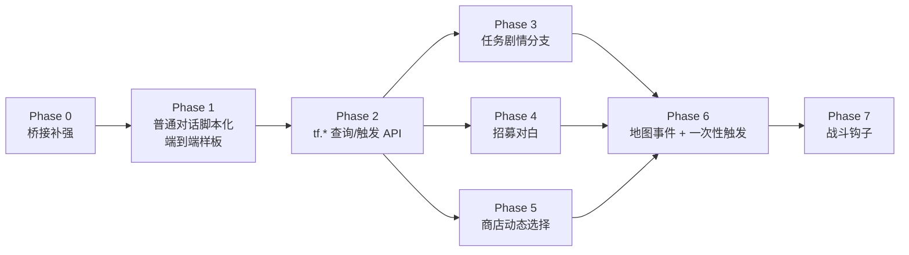

# Lua 内容层迁移计划

## 背景

Lua 扩展前的框架体检（`plans/archive/lua/2026-05-22-lua-expansion-preflight-refactor-plan.md`）已完成，`tf.time / tf.player / tf.command / tf.dialogue / tf.event / tf.callbacks / tf.script / tf.state` 等基础绑定到位，`bootstrap.lua` + `lib/` + `quests/` + `npcs/` 的目录骨架就位。

接下来要解决的是**让 Lua 真正承载剧本式内容**：对话、任务分支、招募对白、商店预设、地图触发、战斗回调。本计划聚焦"哪些迁、什么顺序、怎么避免脚本层变成绕过领域规则的第二套玩法系统"。

## 总体判断

**值得迁的（事件驱动 + 内容编排）**：

- 普通 NPC 对话（[DialogueSystem](../src/game/system/dialogue_system.cpp) 从 `dialogue_script.json` 读平铺行列表）
- 任务 NPC 的剧情分支（[QuestInteractionSystem](../src/game/system/quest_interaction_system.cpp) 的 offer/progress/ready/completed 文案与前后副作用）
- 招募对白与入队触发（[RecruitmentInteractionSystem](../src/game/system/recruitment_interaction_system.cpp) 自己重复读了一遍 `dialogue_script.json`）
- 商人 greeting / 开店前条件 / 动态 `shop_id` 选择
- 地图事件与一次性触发（开宝箱、进区域、首次对话等）
- 战斗入口选择和战斗结果回调（不是核心解算）

**不迁的（性能/原子性/类型安全要求高）**：

- `InventoryDomainService` / `ShopTransactionService` / `EquipmentDomainService` / `QuestTurnInService` 等领域写入
- 存档迁移、地图加载、碰撞/空间索引、渲染、RmlUi 场景
- 战斗核心解算（`TurnCore` / `BattleSession` / `BattleActionResolver` / `BattleRewardResolver`）
- 农场作物 Tick、NPC 漫游、Player 控制等每帧热路径
- 静态数据目录（actors / classes / equipment / enemies / troops 留 JSON）

## 现状阻塞点（必须先解决）

1. **`onInteract` payload 字段缺失**：[script_event_bridge.cpp:136-142](../src/game/script/script_event_bridge.cpp) 只塞 `player` + `target` handle。但 [scripts/npcs/lyria.lua:9](../scripts/npcs/lyria.lua) 已经在判断 `evt.target_actor_id` / `evt.target_name`——当前永远是 nil，脚本是空跑。

2. **NPC 缺稳定身份组件**：当前只有 [RecruitableComponent](../src/game/component/recruitable_component.h) 持有 `actor_id_`，普通 `NpcComponent` / `QuestGiverComponent` / `MerchantComponent` 都没有。`ActorComponent` 是玩家行为组件（持有种子、工具），不存身份。脚本要按 `actor_id` 判断 NPC，必须先补统一身份组件。

3. **InteractCommand 多路消费**：`QuestInteractionSystem` / `RecruitmentInteractionSystem` / `ShopInteractionSystem` 都订阅了 `InteractCommand`（`DialogueSystem` 已经对 Merchant/QuestGiver/Recruitable 早退，[dialogue_system.cpp:96-98](../src/game/system/dialogue_system.cpp)）。直接让 Lua 也消费同一 NPC 的交互会出现 C++ 默认表现 + Lua 自定义表现同时弹出。需要"该实体由 Lua 独占"标识机制。

4. **Recruitment 重复读对话表**：[recruitment_interaction_system.cpp:68](../src/game/system/recruitment_interaction_system.cpp) 自己又解析了一遍 `dialogue_script.json`，行推进逻辑与 `DialogueSystem` 并行存在。迁 Lua 时正好统一掉。

5. **对话推进无 advance 事件**：[dialogue_system.cpp:112-122](../src/game/system/dialogue_system.cpp) 的"按键推进"是通过下一次 `InteractCommand` 触发的，没有 `dialogue_advanced` 事件可供 Lua 订阅。`dialogue_closed` 只在最后关闭时发。Lua 端如果想做 sequence，必须自己拦截 interact 事件计数推进，而不是等"下一行"信号。

6. **无 Choice UI（已在 Phase 1.5 补齐）**：第一版 RmlUi 没有"选项弹窗"组件，也没有 `DialogueChoiceRequestedEvent`。`tf.dialogue.choice` 未挂在 Phase 1 临时实现，后续通过独立切片补 UI 与事件。

## 设计原则

- **C++ 做规则与状态真相，Lua 做剧情、条件、编排与内容变化**。
- Lua 不直接写 ECS 数据：所有写入仍走 `dispatcher` command 或 `domain::*Service`。
- 新增 `tf.*` 绑定走 `ScriptGameApi` facade，不让脚本绑定文件直接 include 大量领域头。
- 同一类规则在 C++ 和 Lua 两侧不能同时存在：迁移时**完整迁出**，不留双轨。
- 脚本入口 payload 提供稳定标识（actor_id / name / map_id），不让 Lua 反向查 ECS。
- 每个新 `tf.*` 子模块至少配套一个 smoke 测试 + 一个端到端测试。

## 总体路线

Phase 3 / 4 / 5 之间相对独立，可按需并行或重排。Phase 6 / 7 需要前面的 `tf.*` API 稳定后再启动。

---

## Phase 0：桥接补强（必做前置）

**目标**：补 NPC 身份组件、补 `tf.event` payload、建立"Lua 完全独占交互"的标识机制。不动 C++ 业务规则。

### 关键定义：`ScriptedInteractionComponent` 语义

**完全 Lua 独占**：挂此组件的实体，**所有 7 个 `InteractCommand` 订阅者**收到该实体的 interact 时**全部直接早退**，C++ 既不弹默认对话也不发任何派生事件（如 `quest_interaction`）。

完整订阅者清单（grep 验证）：

- [DialogueSystem](../src/game/system/dialogue_system.cpp:31)
- [QuestInteractionSystem](../src/game/system/quest_interaction_system.cpp:103)
- [RecruitmentInteractionSystem](../src/game/system/recruitment_interaction_system.cpp:61)
- [ShopInteractionSystem](../src/game/system/shop_interaction_system.cpp:63)
- [ChestSystem](../src/game/system/chest_system.cpp:72)
- [RestSystem](../src/game/system/rest_system.cpp:32)
- [ClosetInteractionSystem](../src/game/system/closet_interaction_system.cpp:26)

这是"该实体由 Lua 独占交互"的统一语义，不限于 NPC，也覆盖宝箱、休息点、衣柜等机关。Phase 6 脚本化宝箱/区域触发器时直接复用此机制。

- Lua 想知道"这是个任务 NPC"，自己调 `tf.quest.status(quest_id)` 查
- Lua 想触发招募确认，自己调 `tf.party.offer_recruit(actor_id, handle)`
- Lua 想打开商店，自己调 `tf.shop.open(shop_id, handle)`
- Lua 想模拟宝箱，自己调 `tf.command.add_item(...)` 并演对白

这样不会出现"C++ 走一半 + Lua 走一半"的双轨。Phase 3/4/5/6 都遵循这个语义。

### 待办

- [x] **新增 `ActorIdentityComponent`**：
  - 字段：`std::string actor_id_`、`entt::id_type actor_id_hash_`、`std::string blueprint_id_`
  - 在 [entity_factory](../src/game/factory) 给所有 NPC 蓝图实例化时挂上（不止 Recruitable）
  - 兼容现有 `RecruitableComponent::actor_id_`：迁移期间二者保持同步，后续把 Recruitable 的 actor_id 字段废弃
- [x] **丰富 `interact` 事件 payload**：在 [script_event_bridge.cpp:136](../src/game/script/script_event_bridge.cpp) 的 `onInteract` 中补充：
  - `target_actor_id`（统一从 `ActorIdentityComponent` 读取）
  - `target_name`（从 `NameComponent` 读取）
  - `target_kind`（枚举字符串：`npc` / `merchant` / `quest_giver` / `recruitable` / `chest` / `unknown`，按组件存在性判断）
  - `map_id`（当前地图）
- [x] **新增 `tf.entity` 只读查询**：`actor_id(handle)` / `name(handle)` / `position(handle)` / `has_component(handle, kind)`；脚本可以用同一套 API 查 `evt.target` 或任意 handle。
- [x] **新增 `ScriptedInteractionComponent`**：
  - 标记"该实体的交互由 Lua 完全独占"
  - 在 [entity_factory](../src/game/factory) 和 [tiled loader](../src/game/loader) 添加属性读取（Tiled 属性 `scripted_interaction = true`）
  - 写一个共享 helper `helpers::isScriptedInteraction(registry, target)`，**7 个 InteractCommand 订阅者**统一调用
  - 在每个订阅者的 `onInteractCommand` 最前面统一早退：
    - [dialogue_system.cpp:92](../src/game/system/dialogue_system.cpp)
    - [quest_interaction_system.cpp](../src/game/system/quest_interaction_system.cpp)
    - [recruitment_interaction_system.cpp](../src/game/system/recruitment_interaction_system.cpp)
    - [shop_interaction_system.cpp](../src/game/system/shop_interaction_system.cpp)
    - [chest_system.cpp:72](../src/game/system/chest_system.cpp)
    - [rest_system.cpp:32](../src/game/system/rest_system.cpp)
    - [closet_interaction_system.cpp:26](../src/game/system/closet_interaction_system.cpp)
- [x] **`tf.event.on("interact", fn)` 的 payload 测试**：写 fixture，构造一个带 `ActorIdentityComponent` + `NameComponent` 的实体，从 Lua 端 `assert` payload 字段齐全。
- [x] **更新 [lua-binding-guide.md](../docs/tutorial/lua-binding-guide.md)** 的事件 payload 章节，补充新字段。

### 验收

- [scripts/npcs/lyria.lua](../scripts/npcs/lyria.lua) 现有的 `target_actor_id == "actor.lyria"` 判断能真正命中（哪怕暂时不挂 `ScriptedInteractionComponent`）。
- 给一个测试实体挂 `ScriptedInteractionComponent` 后，**所有 7 个 InteractCommand 订阅者**都早退，Lua 是唯一处理方。验证矩阵至少包含：NPC（Dialogue/Quest/Recruitment/Shop）+ 宝箱（Chest）+ 衣柜（Closet）+ 床（Rest）。
- `tf.entity.actor_id(evt.target)` 在 Lua 端可以拿到稳定字符串。
- 普通 NPC（非 Recruitable）也能从 payload 读到 `target_actor_id`。

### 容易踩的坑

- `target_kind` 枚举要尽早定型；后面 Lua 脚本会到处 `if kind == "merchant"`，命名一改全要跟着改。
- `ScriptedInteractionComponent` 不要承担太多职责——它只是"独占标记"，不要塞额外配置（脚本模块名放 Tiled 属性，不进组件）。
- `ActorIdentityComponent` 与 `RecruitableComponent::actor_id_` 重叠期：迁移完成前，写入时同步两份；读取统一从 `ActorIdentityComponent`。
- "C++ 早退"逻辑用统一 helper，不要在 4 个 system 各自复制——避免后续新增 InteractionSystem 时漏判。

---

## Phase 1：普通 NPC 对话脚本化（端到端样板）

**目标**：把一个**纯对话 NPC**（非 Recruitable / 非 QuestGiver / 非 Merchant）完整搬到 Lua，验证 Phase 0 桥接是否真的可用。**只做对话，不动任务/招募/商店**。

> ⚠️ Lyria 和 Tori 当前都是 Recruitable（走 `RecruitmentInteractionSystem`），Phase 1 **不要**选她们做样板。建议在地图上加一个纯对话测试 NPC（只挂 `DialogueComponent` + `ActorIdentityComponent` + `ScriptedInteractionComponent`），等 Phase 4 招募对白迁移时再处理 Lyria。

### 待办

- [x] **`tf.dialogue` 保持现状**（只有 `show/hide`），不引入 `sequence`/`choice` 绑定。
- [x] **新建 [scripts/lib/dialogue.lua](../scripts/lib/dialogue.lua) 状态机式 helper**：
  - `dialogue.start(target, lines, on_done)`：在 module-local 表里登记 `{target → {lines, cursor}}`，立刻 `tf.dialogue.show(lines[1])`
  - 注册 `tf.event.on("interact", ...)` 全局监听：每次 interact 命中已登记的 target 时，`cursor + 1`，再 show 下一行；走到末尾时 `tf.dialogue.hide` + 触发 `on_done(interrupted=false)`，并清理状态
  - `dialogue.cancel(target)`：手动中断，触发 `on_done(interrupted=true)` 并清理
  - **不依赖 `tf.state`**，全部在 Lua module-local 变量中
- [x] **新增测试 NPC**：
  - 在合适地图（如 home_exterior 或 town）放一个 `npc.greeter` 测试 NPC
  - 挂 `DialogueComponent` + `ActorIdentityComponent{actor_id="npc.greeter"}` + `ScriptedInteractionComponent`
  - 新建 [scripts/npcs/greeter.lua](../scripts/npcs/greeter.lua)，注册 interact 回调，第一次说"Hi"，第二次说"Bye"
- [x] **`choice` 推迟到 Phase 1.5**：Phase 1 不引入临时假 UI；后续已补 `DialogueChoiceRequestedEvent` + RmlUi 选项弹窗，并开放 `tf.dialogue.choice`。
- [x] **保留 `DialogueSystem` 作为 fallback**：未挂 `ScriptedInteractionComponent` 的 NPC 仍走 C++ 路径，不破坏现有非脚本 NPC。
- [x] **端到端测试**：在 [script_dialogue_helper_test.cpp](../tests/game/script_dialogue_helper_test.cpp) 模拟 3 次 `InteractCommand`，断言依次显示 line1 → line2 → 关闭。

### 生命周期补强

- **已补强：脚本对话走远自动关闭**：`ScriptedDialogueLifecycleSystem` 订阅脚本化实体的 `DialogueShowEvent`，记录当前 conversation 目标，每 tick 检查玩家距离；超出阈值后发 `DialogueHideEvent`，Lua 端 `lib.dialogue` 通过 `dialogue_closed` 清理 module-local 状态并以 `interrupted=true` 调用回调。

### 验收

- 测试 NPC 走完整 Lua 对话流程：按一次 E 显示首行、再按一次 E 显示第二行、再按一次 E 关闭，`on_done(interrupted=false)` 触发。
- 调用 `dialogue.cancel(target)` 能正确清理 module-local 状态并触发 `on_done(interrupted=true)`。
- 端到端测试覆盖：正常推进路径 + 手动 cancel 路径。
- 脚本化对话走远自动关闭，并且 `dialogue_closed` 能中断 Lua helper 内部 sequence。

### 容易踩的坑

- **Phase 1 不做临时 `choice`**：选项 UI 已作为 Phase 1.5 独立切片补齐，脚本侧通过 `tf.dialogue.choice` / `lib.dialogue.choice` 使用。
- **协程暂时不要碰**：先用 module-local 状态机把流程跑通。3 层嵌套以内能接受；遇到深嵌套再考虑协程包装。
- **不能依赖 `dialogue_closed` 推进**：那是"关闭/中断"信号，不是"下一行"信号；多行对话仍必须用 interact 事件计数推进，`dialogue_closed` 只用于外部关闭时清理状态。
- **多 NPC 并发**：玩家正在和 A 说话时按 E 跳到 B 应该怎么办？helper 内部用 `{target → state}` map，切到新 target 时显式 `dialogue.cancel(old_target)`。
- **不要在 `tf.state` 里存"当前对话行号"**：会污染存档。短期状态用 Lua module-local 变量。
- Lyria / Tori 迁移延后：Phase 4 已把 `lyria_intro` / `tori_intro` 从 `dialogue_script.json` 迁出到 Lua。

---

## Phase 2：tf.* 查询与触发 API 扩展

**目标**：在不引入新规则的前提下，把 C++ 已有命令/查询暴露给 Lua。**只暴露"查询 + 触发已有 command/event"，不让 Lua 直接改组件**。

### 前置：脚本 API 依赖注入策略（必须先定）

当前 [ScriptModuleInstaller](../src/engine/script/script_module.h:13) 只接收 `lua/host/registry/dispatcher`，[ScriptGameApi](../src/game/script/script_game_api.h:28) 也只持有这三个引用——没有 catalog、没有 domain service、没有 Context。Phase 2 要做的 `tf.quest.turn_in`（需要 `QuestTurnInService`）、`tf.shop.open`（创建 `ShopMenuScene` 需要 Context）、`tf.party.offer_recruit / request_recruit`（需要招募事件/命令路径）现状没法直接拿到这些依赖。

**采纳策略 A：命令优先（推荐）**

Lua 只发命令，不直接调 service。新增以下 command（如已存在则复用）：

- `TurnInQuestCommand{quest_id, giver, player}` → 由现有 `QuestInteractionSystem` 或新增轻量 `QuestTurnInCommandHandler` 消费，内部走 `QuestTurnInService`
- `OpenShopCommand{shop_id, merchant, player}` → 由 `ShopInteractionSystem`（或新增 `ShopOpenCommandHandler`）消费，内部触发 `ShopMenuScene`
- `RecruitPartyMemberCommand`（已存在，复用即可，确认 [commands_recruit.h](../src/game/defs/commands_recruit.h)）
- `EnterBattleCommand`（已存在）
- `AcceptQuestCommand`（已存在）

绑定层只发命令，不持有 service 引用。这样 `ScriptGameApi` 不需要扩展依赖，符合现有"绑定薄、规则厚"原则。

**不采纳策略 B：扩展 installer/Context**

理由：把 `GameRuntimeServices` 传入绑定层会让 `ScriptGameApi` 持有大量服务引用，绑定文件包含大量领域头，违反 `plans/archive/lua/2026-05-22-lua-expansion-preflight-refactor-plan.md` Phase 1 已立下的"绑定层不直接散落调用 registry/dispatcher/domain service"原则。

### 命令补全任务（在子模块绑定前完成）

- [x] 检查 [commands_quest.h](../src/game/defs/commands_quest.h) 现有 command，缺什么补什么（至少需要 `TurnInQuestCommand`，因为 `QuestTurnInService` 当前只有 service 入口）。
- [x] 检查 [commands_shop.h](../src/game/defs/commands_shop.h)（或目前所在头文件）补 `OpenShopCommand{shop_id_hash, merchant, player}`，由 `ShopInteractionSystem` 或新增 handler 消费。
- [x] 已有命令在对应 system 中确认能正确收口。每个新命令配套一个 system 侧单元测试。

### 待办

按 ROI 顺序落地，每个子模块独立 PR：

- [x] **`tf.quest`**：
  - `status(quest_id) -> "unknown"/"offerable"/"in_progress"/"ready_to_turn_in"/"completed"`
  - `progress(quest_id, objective_id) -> {current, required}`
  - `offer(quest_id, giver_handle)` → 内部发 `QuestOfferRequestedEvent`，打开任务接取确认
  - `accept(quest_id, giver_handle)` → 内部发 [`AcceptQuestCommand`](../src/game/defs/commands_quest.h)（注意：是 AcceptQuestCommand，不是 QuestAcceptCommand）
  - `turn_in(quest_id, giver_handle)` → 内部走 `QuestTurnInService`
  - `is_available(quest_id) -> bool`（前置条件检查）
- [x] **`tf.party`**：
  - `members() -> {actor_id, ...}`（已招募列表）
  - `is_recruited(actor_id) -> bool`
  - `offer_recruit(actor_id, recruiter_handle)` → 内部发 `RecruitOfferRequestedEvent`，打开入队确认
  - `request_recruit(actor_id, recruiter_handle)` → 内部发 `RecruitPartyMemberCommand`
  - `level(actor_id) -> int`
- [x] **`tf.shop`**：
  - `open(shop_id, merchant_handle)` → 触发 `ShopMenuScene` 并指定 `shop_id`
  - **第一版只支持多个静态 shop_id 切换**（"今天卖哪套预设"），不做动态库存覆盖
  - `set_stock` / 动态库存延后到独立子任务（见下文"延后项"）
- [x] **`tf.battle`**：
  - `start(troop_id, opts)` → 内部发 `EnterBattleCommand`
  - 现有 `battle_started` / `battle_ended` payload 补充 `troop_id`、`actor_ids`（已有）、`rewards` 摘要
- [x] **`tf.map`**：
  - `current() -> map_id`
  - `warp(map_id, x, y) -> { ok, reason }` → 内部发 `WarpToMapCommand`，由 [MapTransitionSystem](../src/game/system/map_transition_system.h) 统一执行 fade、地图加载、安全落点与 map_enter/map_exit 事件。
- [x] 每个子模块配套 smoke 测试 + 一个端到端 fixture。
- [x] 更新 [lua-binding-guide.md](../docs/tutorial/lua-binding-guide.md) 的 API 树章节。

### 延后项（明确不在 Phase 2 范围）

| 延后项 | 阻塞原因 | 何时做 |
|---|---|---|
| `tf.shop.set_stock` 动态库存 | [ShopMenuScene](../src/game/scene/shop_menu_scene.h) 和 [ShopTransactionService](../src/game/domain/shop_transaction_service.h) 都直接持有 `ShopCatalog*`，运行时覆盖会让 UI / preview / commit 不一致 | 先抽 `ShopListingProvider` / `ShopRuntimeCatalog` 让 UI 与交易服务共享同一份运行时库存数据，再加 `set_stock` |
| `tf.map.warp` | 已在 Phase 2.5 完成 | `WarpToMapCommand` + `MapTransitionSystem` 订阅 + Lua 绑定 |

### 验收

- Lua 端可以纯通过 `tf.quest / tf.party / tf.shop / tf.battle / tf.map` 完成 demo 任务的"判断 → 触发"流程，不需要任何 C++ 改动。
- 所有写入仍经过现有 `domain::*Service` 或 dispatcher command。
- 单个 `tf.*` 子模块的绑定文件不超过 200 行，业务规则全部在 facade / service 里。

### 容易踩的坑

- **绑定层不要做业务判断**："够不够钱""库存满没满"留在 service 里。否则规则会双轨。
- **typed result，不要返回 bool**：失败原因走 enum 或 string，例如 `tf.quest.accept` 失败时返回 `{ok=false, reason="not_available"}`。
- **批量返回用 Lua table，不要返回多值**：`members()` 返回 `{...}`，不要返回 `string, string, string`。

---

## Phase 3：任务剧情分支迁出

**目标**：保留 `QuestCatalog` / `QuestLogOps` / `QuestTurnInService` / 战斗击败计数等真相逻辑，把 offer/progress/ready/completed 的对白和前后副作用迁 Lua。

### 设计要点

挂 `ScriptedInteractionComponent` 的 quest giver，[QuestInteractionSystem](../src/game/system/quest_interaction_system.cpp) **完全不参与**（Phase 0 的早退机制）。Lua 脚本：

1. 注册 `tf.event.on("interact", fn)`，按 `target_actor_id` 过滤
2. 自己调 `tf.quest.status(quest_id)` 查当前状态
3. 按 state 走 if/elseif 选 offer/progress/ready/completed 不同对白
4. offerable 对白结束时调 `tf.quest.offer(...)` 打开接取确认；交付时调 `tf.quest.turn_in(...)`

**不引入 `quest_interaction` 派生事件**——C++ 早退就是早退，Lua 主动查、主动调，避免双轨。

### 待办

- [x] **`giver_text` 字段从 `quests.json` 移除**（或保留作 fallback，仅供未挂 `ScriptedInteractionComponent` 的 quest giver 使用）。
- [x] **样板任务全 Lua 化**：把 `quest.village.goblin_cleanup` 改为：
  - C++ 仍按 `quests.json` 加载 objective / reward（数据真相不动）
  - Lua [scripts/quests/village_goblin_cleanup.lua](../scripts/quests/village_goblin_cleanup.lua) 提供：
    - 监听 interact + 按 `tf.quest.status()` 分支选对白
    - 监听 `quest_accepted` 触发"NPC 表情变化"等副作用
    - 监听 `quest_completed` 触发完成剧情
  - 给地图上的 quest giver 加 `ScriptedInteractionComponent`
- [x] **测试**：完整跑一遍接任务 → 击败 slime × 3 → 回 NPC 交付的链路，含 Lua 副作用断言。
- [x] **quest 脚本命名规范**：[script_host.cpp:76-78](../src/engine/script/script_host.cpp) 把 `.` 映射成 `/`，所以 quest id `quest.village.goblin_cleanup` 不能直接当 require 路径（会变 `quests/quest/village/goblin_cleanup.lua`）。约定：
  - Quest id：dot 命名，保留业务含义（`quest.village.goblin_cleanup`）
  - Lua module path：下划线压平（`quests.village_goblin_cleanup` → `quests/village_goblin_cleanup.lua`）
  - 在 `scripts/lib/quest.lua` 提供 `quest.module_for(quest_id) -> module_path` 工具函数
  - 在 [lua-binding-guide.md](../docs/tutorial/lua-binding-guide.md) 文档化此约定

### 验收

- `QuestInteractionSystem` 对挂 `ScriptedInteractionComponent` 的实体完全不响应。
- 一个新任务可以**只写 Lua + JSON**，不用碰 C++。
- 接任务 / 交付的 Lua 端写法清晰可读（50 行以内）。
- `quest.module_for(quest_id)` 测试覆盖各种命名情况。

### 容易踩的坑

- **不要让 Lua 决定"任务能不能接"**：可用性检查（前置任务完成、等级要求等）应该在 `QuestCatalog` 数据里描述，Lua 只读 `tf.quest.is_available()` 结果。否则同样的规则会散在多个 `scripts/quests/*.lua` 里。
- **存档兼容**：任务进度仍由 `QuestLogComponent` 持有，Lua 副作用产生的状态走 `tf.state`。两套状态不要交叉读写。
- **不要引入 `quest_interaction` 事件**：明确决定让 Lua 主动查状态，C++ 完全不再为 scripted quest giver 发派生事件。

---

## Phase 4：招募对白迁出

**目标**：消灭 [RecruitmentInteractionSystem](../src/game/system/recruitment_interaction_system.cpp) 对 `dialogue_script.json` 的重复读取，统一对白入口；保留 `PartyRecruitmentSystem` 写队伍的逻辑。

### 设计要点

挂 `ScriptedInteractionComponent` 的 Recruitable NPC，`RecruitmentInteractionSystem` **完全不响应**（Phase 0 早退）。Lua 脚本：

1. 注册 interact 回调，按 `target_actor_id` 过滤
2. 自己用 `dialogue.start(...)` helper 演招募对白
3. 对白结束时调 `tf.party.offer_recruit(actor_id, recruiter_handle)` 打开 `RecruitOfferScene`
4. 玩家确认后由 `RecruitOfferScene` 发 `RecruitPartyMemberCommand`，`PartyRecruitmentSystem` 照常写入队伍

### 待办

- [x] **Lyria / Tori 完整 Lua 化**：
  - 给地图上的 Lyria / Tori 加 `ScriptedInteractionComponent`
  - [scripts/npcs/lyria.lua](../scripts/npcs/lyria.lua) 注册完整 interact 回调：先说几句话 → 调 `tf.party.offer_recruit`
  - 同样改造 Tori
  - 从 `dialogue_script.json` 移除 `lyria_intro` / `tori_intro`
- [x] [RecruitmentInteractionSystem](../src/game/system/recruitment_interaction_system.cpp) 退化：
  - 删除 `loadDialogueFile` 和 `dialogue_table_`
  - 保留"判断是否可以招募 + 触发 `RecruitOfferScene`" 职责（响应非 scripted 实体）
- [x] **Lua 端"询问/确认"流程**：Lua 负责编排对白，确认弹窗继续复用 C++ `RecruitOfferScene`；`tf.party.request_recruit` 只作为确认后的底层提交入口。
- [x] **端到端测试**：Lyria 招募流程在 Lua 驱动下走完，覆盖 party 写入、运行时状态初始化、recruiter 移除，以及 scripted 实体不触发 C++ fallback。

### 验收

- `RecruitmentInteractionSystem` 行数显著减少（dialogue_table 删除后）。
- `dialogue_script.json` 不再被 recruitment 路径引用（除非保留 fallback）。
- 招募流程的对白可以在 Lua 中按 `tf.quest.status` / `tf.party.is_recruited` 等条件分支。

### 容易踩的坑

- **招募资格判定**：是否能加入（等级要求、是否已满员）放在 `tf.party.is_recruitable(actor_id) -> bool, reason` 之类的查询里，Lua 只读不算，规则留 C++。
- **RecruitOfferScene** 弹出是 UI 决策，由 C++ 保留；Lua 通过 `offer_recruit` 发起确认，不直接控制 Scene 生命周期。
- **首版无 Lua choice UI**：Phase 4 不做临时 Lua 选项弹窗，招募确认复用现有 C++ `RecruitOfferScene`。
- Lua 化 Lyria 前**确认 Phase 1 测试 NPC 已经稳定运行**，否则两边问题混在一起难定位。

---

## Phase 5：商店动态预设（限于静态 shop_id 切换）

**目标**：交易 UI 与 `ShopTransactionService` 留 C++；"商人 greeting / 今天卖哪套预设 / 任务后切换到新的 shop_id"交给 Lua。**第一版只做静态 shop_id 切换，不做动态库存覆盖**。

### 范围裁剪

[ShopMenuScene](../src/game/scene/shop_menu_scene.h) 和 [ShopTransactionService](../src/game/domain/shop_transaction_service.h) 当前都直接持有 `ShopCatalog*` 引用。如果 Lua 运行时覆盖某 `shop_id` 的库存（`set_stock`），UI 显示一套、交易校验另一套——会 desync。

因此 Phase 5 只做：

- **静态 shop_id 切换**：策划在 `shops.json` 中定义 `shop.weapon.day` / `shop.weapon.night` / `shop.weapon.post_quest_a` 等多个预设，Lua 根据条件选哪个传给 `tf.shop.open`。

不做（延后到独立子任务）：

- **动态库存覆盖**：需要先引入 `ShopListingProvider` / `ShopRuntimeCatalog` 抽象，让 UI 和 transaction service 通过同一个 provider 读运行时商品，再加 `set_stock`。

### 待办

- [x] **`tf.shop.open(shop_id, merchant_handle)`** 实现：触发 `ShopMenuScene` 并指定 shop_id。
- [x] [ShopInteractionSystem](../src/game/system/shop_interaction_system.cpp) 改造：挂 `ScriptedInteractionComponent` 的商人，C++ 完全不响应（Phase 0 早退）；Lua 自己决定先说什么话再 `tf.shop.open`。
- [x] **样板商店全 Lua 化**：选一个 NPC 商人，在 `shops.json` 增加两个预设（如 `shop.alice.day` / `shop.alice.night`），Lua 按 `tf.time.hour()` 选择。
- [x] 在 `shops.json` 配套增加按任务状态切换的样板（如 `shop.alice.post_first_quest`）。

### 验收

- 样板商店可以按时间或任务状态切换不同的静态 shop_id 预设。
- 交易过程仍走 `ShopTransactionService`，UI 和交易服务读同一个 shop_id 数据，无 desync。

### 容易踩的坑

- **不要在 Phase 5 加 `set_stock`**：那是另一个层级的工作，需要先抽 provider 抽象。强行做会造成 UI / 交易 desync。
- 价格策略（折扣、好感度议价）建议作为 shop_id 的不同预设（"打折版"作为单独 shop_id），不要让 Lua 算每个物品的实时价。
- 切换 shop_id 是 Lua 的责任，但 shop_id 本身要在 `shops.json` 中静态定义，Lua 不能凭空造一个 shop_id。

---

## Phase 6：地图事件 + 一次性触发

**目标**：把"进区域触发剧情、首次开宝箱触发对白、按机关切换地图"这类内容从 Tiled 硬编码组件改为 Lua 触发。

### 设计要点

脚本化宝箱/衣柜/床/机关**复用 Phase 0 的 `ScriptedInteractionComponent`**——挂上即可让 [ChestSystem](../src/game/system/chest_system.cpp) / [RestSystem](../src/game/system/rest_system.cpp) / [ClosetInteractionSystem](../src/game/system/closet_interaction_system.cpp) 早退，Lua 接管 interact。无需 Phase 6 引入新的早退机制。

地图进入/区域进入这类**非 interact 事件**才是 Phase 6 真正要新增的：需要 C++ 侧补 `MapEnteredEvent` / `ZoneEnteredEvent` 发布点，并桥接到 `tf.event`。

### 待办

- [x] **Tiled 属性扩展**：`script_event`（触发事件名）、`script_once_key`（一次性标记 key，配合 `tf.state`）已进入 `interact` payload；`script_module` 先作为可选元数据保留。
- [x] **新事件类型**：
  - [x] C++ 侧新增 `MapEnteredEvent` / `MapExitedEvent`，由 `MapTransitionSystem` 在成功切图后发布
  - [x] C++ 侧补 `ZoneEnteredEvent` / `ZoneExitedEvent` 与对应区域检测系统 `ZoneTriggerSystem`
  - [x] 在 [script_event_bridge.cpp](../src/game/script/script_event_bridge.cpp) 添加桥接：`tf.event.on("map_enter", fn)` / `on("map_exit", fn)`
  - [x] 在 [script_event_bridge.cpp](../src/game/script/script_event_bridge.cpp) 添加桥接：`tf.event.on("zone_enter", fn)` / `on("zone_exit", fn)`
- [x] **`scripts/maps/<map_id>.lua`** 目录约定：每张地图一个 Lua 脚本，注册该地图的特殊触发。
- [x] **一次性触发 helper**：`scripts/lib/once.lua` 包装 `tf.state` 实现 `once.run(key, fn)`。
- [x] **脚本化宝箱样板**：选一个现有宝箱挂 `ScriptedInteractionComponent`，Lua 演自定义对白后调 `tf.command.add_item`。
- [x] **地图触发样板**：home_exterior 地图首次进入弹一段引导对白（用 `once` helper + `tf.state`）。

### 验收

- 新增一处剧情触发只需要改 Tiled 文件 + Lua 文件，不动 C++。
- 一次性标记走 `tf.state`，读档不会重放。
- 脚本化宝箱复用 Phase 0 marker，不引入新的 component。

### 容易踩的坑

- `zone_enter` 是高频事件，要做 cooldown / 状态过滤，否则脚本回调每帧触发会拖垮 VM 预算。
- Tiled 属性命名要和 [for_agent/code-guide.md](../for_agent/code-guide.md) 风格一致，提前定型。
- 脚本化宝箱也需要在地图侧挂 Tiled 属性 `scripted_interaction = true`，不要因为"宝箱不是 NPC"就忘了。

---

## Phase 7：战斗钩子

**目标**：战斗核心解算不动，暴露关键钩子让 Lua 做 boss 阶段、剧情战斗、特殊胜利条件。

### 待办

- [x] **回调扩面**：
  - `tf.battle.on_turn_start(fn)` / `on_turn_end(fn)`
  - `tf.battle.on_unit_died(fn)`：payload 含 actor_id / unit_kind
  - `tf.battle.on_skill_used(fn)`
- [x] **`battle_started` payload 补充 encounter_id**：`battle_started` 已包含 `troop_id` / `actor_ids` / `battle_background_id` / `from_encounter` / `encounter_id`。
- [ ] **战斗自定义 metadata**：让 Lua 更稳定地区分剧情战、Boss 战和普通遭遇。
- [ ] **特殊胜利条件**：`tf.battle.set_victory_condition(fn)`（fn 每回合结束被调用，返回 true 触发胜利），用于剧情战"撑过 5 回合"等需求。
- [ ] **样板**：做一个 boss 战，HP 低于 50% 时切阶段 + 加 buff。

### 验收

- Boss 阶段切换可以纯 Lua 实现。
- 默认战斗流程不受影响。

### 容易踩的坑

- 回调内不要长跑——每个回调有独立 instruction budget（Phase 2 阶段已建立），但循环还是要节制。
- 回调不能在战斗中直接改 unit HP——要走 command。
- 战斗内事件量大，注册回调要在 `battle_ended` 时清理或确保幂等。

---

## 整体注意事项（每个 Phase 都要遵循）

1. **生命周期一致性**：所有回调在 `ScriptHost::shutdown()` 时统一失效；读档重建 GameScene 时 bootstrap 重新执行、回调重新注册。模块顶层不能假设"app 内只运行一次"。

2. **错误隔离**：所有 callback 都走 `sol::protected_function`（[tinyfarm_script_module.cpp:41](../src/game/script/tinyfarm_script_module.cpp:41) 已建立模式），Lua 报错只记日志，绝不让游戏崩。

3. **`tf.state` 边界**：只接受 JSON 兼容基元（`nil/bool/number/string`），命名 `domain.object.field`。短期状态（当前对话行号、临时 buff 计数）用 Lua module-local 变量。

4. **不许双轨**：迁某模块时**完整迁出**。例如对话迁 Lua 后，`DialogueSystem` 只保留"未标记 `ScriptedInteractionComponent` 的实体"的 fallback，不能让"task NPC 的对白"同时走 C++ 和 Lua。

5. **绑定层薄、facade 厚**：[tinyfarm_script_module.cpp](../src/game/script/tinyfarm_script_module.cpp) 不持有业务规则，规则在 [script_game_api.cpp](../src/game/script/script_game_api.cpp) 或 `domain::*Service`。

6. **测试模板**：每个 `tf.*` 子模块至少一个 smoke 测试（参数转换正确）+ 一个端到端测试（Lua → C++ command → ECS 变化 → Lua 可观测到）。沿用 [tests/scripts/](../tests/scripts/) 的 `test_command.lua` 包装模式。

7. **存档兼容**：脚本变量进 schema v7+，新增 key 时 `get_int/get_bool/get_string` 的默认值即"老存档加载后的回退值"。

8. **不重新打开危险能力**：禁用 `io / os / package / loadfile / dofile / rawset / rawget`。脚本模块加载走 `tf.script.require` 白名单（已建立）。

---

## 推荐推进顺序

1. **Phase 0**（桥接补强）—— 阻塞性 bug，先做。包含 `ActorIdentityComponent`、payload 扩展、`ScriptedInteractionComponent` + 7 个 InteractCommand 订阅者统一早退。
2. **Phase 1**（纯对话测试 NPC `npc.greeter` 端到端样板）—— 风险最低、反馈最快，立刻验证 Phase 0。**不动 Lyria/Tori**——她们是 Recruitable，留到 Phase 4。
3. **Phase 2**（`tf.*` 查询/触发 API 扩展）—— 先补齐 `TurnInQuestCommand` / `OpenShopCommand` 等命令；再加绑定。
4. **Phase 3 / 4 / 5**（任务 / 招募 / 商店）—— 相对独立，可按业务优先级排序，推荐 Phase 3 先（成果可见）；Phase 4 处理 Lyria/Tori 招募对白。
5. **Phase 6**（地图事件）—— 等 1-5 稳定后启动。复用 Phase 0 的 `ScriptedInteractionComponent` 处理脚本化宝箱/区域。
6. **Phase 7**（战斗钩子）—— 风险最高，最后做。

### 平行的辅助 issue（不阻塞主线）

- **Phase 1.5：脚本对话生命周期补强** —— `ScriptedDialogueLifecycleSystem` 走远自动关闭已完成；`DialogueChoiceRequestedEvent` + RmlUi 选项弹窗也已补齐。
- **Phase 2.5：地图切换 command** —— 已完成：给 [MapTransitionSystem](../src/game/system/map_transition_system.h) 加 `WarpToMapCommand`，并补 `tf.map.warp` 绑定。
- **Phase 5.5：商店运行时库存** —— 抽 `ShopListingProvider` / `ShopRuntimeCatalog`，UI 与 transaction service 共享运行时商品数据，再加 `tf.shop.set_stock`。

## 主线完成后的后续切片

7 个主 Phase 已完成后，继续按小切片推进，不再回头执行下方历史起步切片。

**Polish PR 1：脚本对话生命周期**

- [x] 新增 `ScriptedDialogueLifecycleSystem`，只接管 `ScriptedInteractionComponent` 目标的 `Conversation` 对话。
- [x] 走远、玩家缺失或目标失效时发 `DialogueHideEvent`。
- [x] `lib.dialogue` 监听 `dialogue_closed`，外部关闭时清理 sequence，并以 `interrupted=true` 通知调用方。
- [x] 补 C++ 生命周期测试与 Lua helper 回归测试。
- [x] 补 `DialogueChoiceRequestedEvent` + RmlUi 选项弹窗，再开放 `tf.dialogue.choice`。

**Polish PR 2：地图切换 command**

- [x] 给 [MapTransitionSystem](../src/game/system/map_transition_system.h) 增加 `WarpToMapCommand` 入口。
- [x] 补 `tf.map.warp(map_id, x, y)` 绑定与端到端测试。

**Polish PR 3：区域触发**

- [x] 新增 `ZoneEnteredEvent` / `ZoneExitedEvent` 与低频去重的 `ZoneTriggerSystem`。
- [x] 开放 `tf.event.on("zone_enter" / "zone_exit", fn)`。

**较大后续：商店运行时库存**

- [ ] 先抽 `ShopListingProvider` / `ShopRuntimeCatalog`，保证 UI preview 与交易 commit 读同一份运行时商品数据。
- [ ] 再加 `tf.shop.set_stock`。

## 历史：首个建议任务切片（已完成）

**Phase 0 + Phase 1 的最小闭环**（建议拆 2-3 个 PR）：

**PR 1：身份组件 + payload 扩展**

- [x] 新增 `ActorIdentityComponent{actor_id_, actor_id_hash_, blueprint_id_}`
- [x] [entity_factory](../src/game/factory) 给所有 NPC 蓝图挂 `ActorIdentityComponent`；与 `RecruitableComponent::actor_id_` 同步
- [x] `onInteract` payload 补 `target_actor_id` / `target_name` / `target_kind` / `map_id`
- [x] `tf.entity` 只读查询（`actor_id` / `name` / `position`）
- [x] payload 端到端测试

**PR 2：Lua 独占交互机制**

- [x] 新增 `ScriptedInteractionComponent`（仅作 marker，不持有数据）
- [x] 新增共享 helper `helpers::isScriptedInteraction(registry, target)`
- [x] 4 个 InteractionSystem（Dialogue/Quest/Recruitment/Shop）在 `onInteractCommand` 最前面统一早退
- [x] Tiled 属性 `scripted_interaction = true` 解析
- [x] 验收测试：挂此组件的实体，4 个 system 都不响应

**PR 3：纯对话样板**

- [x] [scripts/lib/dialogue.lua](../scripts/lib/dialogue.lua) 实现 `dialogue.start(target, lines, on_done)` 状态机式 helper（interact 推进 + dialogue_closed 中断处理）
- [x] 在地图上新增 `npc.greeter` 测试 NPC（DialogueComponent + ActorIdentityComponent + ScriptedInteractionComponent）
- [x] 新建 [scripts/npcs/greeter.lua](../scripts/npcs/greeter.lua)，注册 interact 回调走完整 sequence
- [x] 端到端测试 + 手动跑一遍
- [x] 更新 [lua-binding-guide.md](../docs/tutorial/lua-binding-guide.md)

这个切片不动 Lyria / Tori / 任务 / 招募 / 商店任何业务规则，只验证 Lua 内容层的基本工作流，是最稳的起点。Lyria/Tori 留到 Phase 4 一起处理（因为她们是 Recruitable）。
