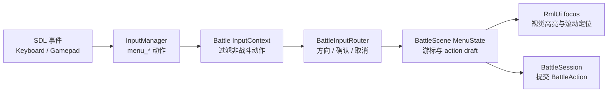

# 战斗场景键盘与手柄操作开发计划

## 目标

让战斗场景在不依赖鼠标的情况下完成完整玩家流程：

- 键盘方向键 / WASD、手柄 D-Pad / 左摇杆可在战斗菜单中移动光标。
- `Return` / `Space` / 手柄南键确认，`Escape` / 手柄东键取消或返回上一级。
- 支持 `Fight / Escape`、`Attack / Skill / Guard / Item`、技能/道具列表、目标选择、胜利结算确认。
- 鼠标点击仍可使用，但不再是战斗场景的唯一操作方式。

本计划只要求战斗场景交付，其它场景不纳入本次验收。

## 当前上下文

- `config/input.json` 和 `engine::input::defaultInputMappings()` 已有 `menu_up/down/left/right/confirm/cancel`，并包含键盘与手柄绑定。
- `InputManager` 已有 `InputContextId::Battle`，Battle context 只允许菜单导航动作，适合战斗覆盖场景使用。
- `BattleScene` 已推入 Battle context，并存在 `BattleInputRouter`、`BattleMenuState`、`BattleMenuModel`、`syncMenuFocus()` 等菜单输入与焦点基础设施；`confirmBattleMenu()` / `cancelBattleMenu()`、RmlUi focus 重试与 `ScrollIntoView()` 也已有实现。
- `ui/rmlui/scenes/battle.rml` 的按钮已有稳定 id 和 `tf-nav-auto`，RCSS 也有 `.tf-input-nav .battle-text-button:focus` 的视觉反馈。
- 玩家反馈仍表现为“只能鼠标操作”，说明问题更可能是运行时链路中的具体短路点、焦点视觉反馈、输入消费或测试缺口，而不是缺少整套战斗输入框架。

## 已确认基线

以下能力已在源码中存在，后续实现不应把它们当作新增交付重复实现：

- `BattleScene::init()` / `clean()` 已成对 push/pop `InputContextId::Battle`，初始化失败路径也会恢复 context。
- `BattleInputRouter` 已接入 `menu_up/down/left/right/confirm/cancel`。
- `confirmBattleMenu()` / `cancelBattleMenu()` 已覆盖 PartyCommand、ActorCommand、列表、目标选择与 Victory flow。
- `BattleInputRouter` 已有方向移动路由；步长应与当前战斗 RML 的竖排按钮布局保持一致。
- `prepareUi()` 已重试 `syncMenuFocus()`，聚焦失败时 `focus_dirty` 会保留下帧继续尝试。
- `focusElementById()` 已调用 `ScrollIntoView(Nearest, Instant, Closest)`。
- menu 导航键在 Menu / Dialogue / Battle context 下会绕过 RmlUi raw keyboard path，避免键盘按键被 RmlUi 先消费。

## 设计原则

- 使用已有 `menu_*` 语义动作，不新增战斗专用物理按键绑定。
- `InputManager` 仍是 SDL 事件唯一入口，战斗场景只消费语义动作。
- `BattleScene` 菜单状态是输入真相来源，RmlUi focus 只作为视觉同步和鼠标兼容层。
- 不用“手柄模拟鼠标”来点按钮；手柄和键盘直接驱动菜单游标与确认/取消。
- 不扩大到完整全局 UI 导航重构，除非复现证明是输入层公共 bug。

## 输入链路



## 阶段 0：复现与链路诊断

1. 在当前分支复现一次战斗场景键盘/手柄不可操作问题，记录失效点：
   - SDL 事件是否进入 `InputManager::processEvent()`。
   - `menu_*` action 是否进入 pressed state。
   - `InputContextId::Battle` 是否已经在栈顶。
   - `BattleInputRouter` 回调是否被触发。
   - `BattleScene::moveBattleMenuCursor()` / `confirmBattleMenu()` 是否生效。
2. 用输入调试面板确认 `last_input_device`、活动手柄、`menu_*` 状态。
3. 如果键盘能触发 action 但 UI 没变化，优先查 `BattleMenuModel::focus_dirty`、RmlUi data-if 生成时机和 `focusElementById()`。
4. 如果手柄南键无法触发 `menu_confirm`，优先查 `SDL_EVENT_GAMEPAD_BUTTON_DOWN` 是否被 RmlUi forwarder 消费后未继续进入 `processEvent()`。
5. 重点排查以下高概率嫌疑：
   - 初次进入战斗时是否一定从 `enterInputMenu()` 走到 `setMenuState(PartyCommand/ActorCommand)`，并把 `focus_dirty` 置为 true。
   - 最近输入设备从 Mouse 切到 Keyboard/Gamepad 后，`GameApp::updateRmlUiFrame()` 是否及时把 RmlUi body class 切到 `tf-input-nav`，否则 focus 已移动但视觉反馈可能不可见。
   - BattleScene 之上若叠了其它覆盖场景，`currentContext()` 是否仍符合预期；context 栈错误会让 dispatch 列表过滤掉战斗导航动作。
   - Enter / Space 是否真的被 `shouldSuppressRmlUiKeyboardEvent()` 截住，避免 RmlUi focused button click 与 `menu_confirm` 双发。

交付物：在后续实现 PR 描述中写清根因，不把“看起来没反应”只当 UI 问题处理。

## 阶段 1：验证并补齐 BattleScene 输入路由

本阶段以“验证现有实现 + 修补 Phase 0 找到的缺口”为主。除非复现证明现有代码有问题，不重复改写已经存在的输入路由。

1. 验证 `BattleScene::init()` push `InputContextId::Battle`，`clean()` 成对 pop，失败路径也必须恢复。
2. 验证 `BattleInputRouter` 只连接一次，并在析构/clean 时断开：
   - `menu_up/down/left/right`
   - `menu_confirm`
   - `menu_cancel`
3. 验证方向输入按当前状态解释：
   - `PartyCommand`：上下移动，左右按一维列表处理。
   - `ActorCommand`：当前按钮为竖排布局，上下步长 1；左右按一维列表处理。
   - `SkillList` / `ItemList` / `TargetSelect`：一维列表，上下移动。
4. 验证所有方向移动跳过 disabled 条目，并允许首尾循环。
5. 验证 `confirm` 根据当前状态转发到现有处理函数：
   - `handlePartyCommand()`
   - `handleActorCommand()`
   - `handleListEntry()`
   - `handleTargetEntry()`
   - Victory flow 下转发到 `victory_flow_controller_.confirm()`
6. 验证 `cancel` 行为固定为：
   - TargetSelect 返回技能/道具列表。
   - SkillList / ItemList 返回 ActorCommand。
   - 由 Fight 刚进入的 ActorCommand 可返回 PartyCommand。
   - PartyCommand 中取消只吞掉输入，不退出战斗。
   - Victory flow 中取消只吞掉输入，不跳过结算。
   - 不复用 `menu_cancel` 作为逃跑入口；逃跑仍需在 PartyCommand 中显式选择 `Escape`。

## 阶段 2：焦点、滚动和目标高亮同步

1. 每次菜单状态或游标变化后设置 `focus_dirty`。
2. 在 `prepareUi()` 中重试 `syncMenuFocus()`，确保 RmlUi data-if 子树下一帧生成后仍能聚焦。
3. 聚焦成功时调用 `ScrollIntoView(Nearest, Instant, Closest)`，保证长技能/道具/目标列表可用键盘和手柄滚动浏览。
4. TargetSelect 游标变化时同步敌方 HP 条 / 目标高亮。
5. 切出输入菜单或提交行动时清理目标高亮，避免动画阶段残留“当前目标”视觉。
6. 保持鼠标 hover/click 与键盘/手柄 focus 视觉一致，不新增单独的“键盘模式”样式分支。

## 阶段 3：手柄/键盘长按重复输入

当前 `menu_*` 主要是 edge-triggered，摇杆或方向键长按只移动一次会显得迟钝。本阶段只在 BattleScene 局部增加重复导航，不改全局输入系统。

方案：

- 在 `BattleInputRouter` 中增加轻量 repeat state，记录最近活跃方向、初始延迟和重复间隔。
- `BattleScene::update()` 调用 `input_router_.update(delta_time, input_manager)`。
- 初始按下立即移动一次；持续按住超过约 `0.28s` 后，每 `0.08s` 重复移动。
- 同时按相反方向时以最近 pressed 的方向为准；松开后清理 repeat state。
- `BattleScene::setMenuState()` 切换菜单层级时也清理 repeat state，避免玩家按住方向键从 PartyCommand 进入 ActorCommand 后立刻跨菜单跳格。
- `menu_confirm` / `menu_cancel` 不做长按重复，避免误提交多次行动。

建议参数先写成 `BattleInputRouter` 内部常量，后续如果其它场景需要再抽到 `InputManager` 或配置。

## 阶段 4：输入提示与可访问性补齐

这阶段不阻塞核心操作，但建议随本功能一起完成低成本打磨：

1. 战斗状态文本或命令窗附近可选显示简短 prompt，例如 `Confirm / Back`。
2. prompt 文本从现有 `InputManager::getActionPrompt(menu_confirm/menu_cancel)` 获取，随最近输入设备切换；静态 glyph / fallback 文本继续复用 `input_glyphs` 里的 `ActionPrompt` 数据结构。
3. 不增加大段说明文字；只提供当前可用动作的提示。
4. 保证提示不挤压 640x360 战斗 HUD 固定布局。

如果工期紧，本阶段可后置；核心验收仍以可操作性为准。

## 阶段 5：测试与验证

### 单元测试

- 为 `BattleInputRouter` 增加独立测试，使用 fake delegate 覆盖：
  - PartyCommand 上下移动。
  - ActorCommand 竖排线性移动。
  - 列表与目标选择移动。
  - confirm/cancel 转发。
  - 长按 repeat 的初始延迟与重复间隔。
- 为 `InputManager` 增加或扩展 Battle context 测试：
  - Battle context 允许 `menu_*`。
  - Battle context 过滤 `inventory`、`hotbar`、`primary_action` 等非战斗动作。
  - 键盘导航键在 Battle context 下不被 RmlUi raw keyboard path 消费。
  - 手柄按钮 down 在 Battle context 下能稳定产生 `menu_confirm`。

### 场景级测试

- 扩展 `BattleSceneSmokeTest` 或新增更接近运行时的 headless 测试：
  - 战斗进入后默认焦点落到 PartyCommand 或 ActorCommand。
  - 键盘 `Down -> Confirm` 可从 `Fight` 进入/执行对应分支。
  - `Attack -> TargetSelect -> Confirm` 能提交 `BattleActionType::Attack`。
  - `Skill / Item` 子菜单取消能返回 ActorCommand。
  - Victory overlay 下 `menu_confirm` 能继续结算。

### 手柄测试

- 先 spike 一个 SDL3 virtual gamepad smoke test，确认本地与 CI 的 SDL3 构建可用。
- 若 virtual joystick 在 CI 不可用，回退为直接向 SDL queue push `SDL_EVENT_GAMEPAD_*` 的 fake injection。
- 覆盖：
  - D-Pad / LeftStick 移动菜单。
  - South 确认。
  - East 取消。
- 没有物理手柄的环境也必须能跑通自动化测试。

### 手动验收

运行：

```bash
ninja -C build/debug game_tests engine_tests
./build/debug/tests/engine_tests --gtest_filter='*Input*'
./build/debug/tests/game_tests --gtest_filter='*BattleScene*:*BattleInput*:*InputContext*'
```

手动进入一场战斗，完成以下流程：

- 键盘：Fight -> Attack -> 选择敌人 -> 确认。
- 键盘：Skill / Item 进入列表后取消返回。
- 键盘：Escape 在 PartyCommand 中触发逃跑。
- 手柄：D-Pad 和左摇杆都能移动；南键确认；东键取消。
- Victory：不碰鼠标也能确认结算并回到探索场景。

## 影响文件清单

预计主要修改：

- `src/game/scene/battle_input_router.h`
- `src/game/scene/battle_input_router.cpp`
- `src/game/scene/battle_scene.h`
- `src/game/scene/battle_scene.cpp`
- `tests/game/battle/battle_scene_smoke_test.cpp`
- 新增 `tests/game/battle/battle_input_router_test.cpp`
- 视问题补充 `tests/engine/input/input_context_test.cpp`
- 视问题补充 `tests/engine/input/input_manager_rmlui_routing_test.cpp`
- 若 Phase 0 指向输入事件链路，可能修改 `src/engine/input/input_event_routing.cpp`
- 若 Phase 0 指向手柄派发或设备切换时机，可能修改 `src/engine/input/input_manager.cpp`
- 若 Phase 0 指向 RmlUi SDL forwarder 行为，可能修改 `src/engine/ui/rmlui/rml_ui_runtime.cpp`
- 如增加提示，再修改 `ui/rmlui/scenes/battle.rml` 与 `ui/rmlui/scenes/battle.rcss`

## 风险与处理

- RmlUi 与场景级输入都可能处理同一按键：Battle context 下优先由 `InputManager` 转为 `menu_*`，RmlUi raw keyboard path 只保留必要输入。
- RmlUi data-if 会让元素延迟生成：焦点同步必须允许下帧重试。
- 手柄摇杆轴抖动可能导致重复移动：使用 press/release 阈值和 repeat 延迟，避免每帧移动。
- BattleScene 内部菜单状态切换时可能继承旧方向输入：提交行动时 `leaveInputMenu()`，切换菜单时清 repeat state；场景 context push/pop 本身已有 `clearAllInputState()`，不需要重复补一套全局清理。
- 鼠标和键盘/手柄视觉可能不一致：统一使用 `.tf-input-mouse :hover` 与 `.tf-input-nav :focus` 现有样式。

## 完成标准

- 战斗场景完整玩家流程可用键盘和手柄完成。
- 鼠标点击行为无回退。
- Battle context 不泄漏探索/背包快捷键。
- 长列表可用键盘/手柄滚动并保持聚焦条目可见。
- 自动化测试覆盖键盘、手柄、确认、取消、目标选择和胜利确认。
- `ninja -C build/debug game_tests engine_tests` 通过。

## 执行记录（2026-05-25）

已完成：

- 在 `BattleInputRouter` 中补齐方向键长按 repeat，并在菜单状态切换、断开监听时清理 repeat state，避免按住方向跨菜单时立刻跳格。
- 根据实测 UI 布局，将 ActorCommand 从旧的 2 列步长修正为竖排线性步长；上下键与左右键都按相邻按钮移动。
- 在 `BattleScene::update()` 中驱动 `BattleInputRouter::update()`，让 repeat 按帧生效。
- 战斗菜单条目增加 `selected` 视图状态，并由 RML/RCSS 绑定到按钮高亮，避免只依赖 RmlUi `:focus` 导致键盘/手柄候选按钮不可见。
- 扩展 RmlUi 输入转发规则：Battle/Menu/Dialogue 这类菜单上下文中，即使 RmlUi forwarder 消费了 `SDL_EVENT_GAMEPAD_BUTTON_DOWN`，仍允许事件继续进入 `InputManager`，保证手柄南键/东键可稳定派发为 `menu_confirm` / `menu_cancel`；Gameplay context 仍保持原有消费语义。
- 新增 `BattleInputRouterTest` 覆盖 ActorCommand 竖排线性移动、方向长按 repeat、跨菜单清 repeat、confirm/cancel 转发。
- 扩展 engine 输入测试，覆盖 menu-like context 下手柄按钮被 RmlUi 消费后的派发行为，以及 Gameplay context 下不强行透传。

已验证：

```bash
ninja -C build/debug engine_tests game_tests
./build/debug/tests/engine_tests --gtest_filter='InputEventRoutingTest.*:InputManagerGamepadTest.*RmlUi*:InputContextTest.*'
./build/debug/tests/game_tests --gtest_filter='BattleInputRouterTest.*:BattleSceneSmokeTest.UsesTypedModelAndSceneLevelMenuInput:BattleSceneSmokeTest.LongSubmenusAreScrollableAndFocusedEntryStaysVisible:BattleSceneSmokeTest.WiresRpgMakerStylePartyAndActorCommands'
./build/debug/tests/engine_tests
./build/debug/tests/game_tests
```

结果：

- `engine_tests` 全量通过：247 passed。
- `game_tests` 全量通过：660 passed，11 skipped；skip 项为 headless RmlUi 环境下的既有跳过。

尚未完成：

- 未进行真实窗口中的手动战斗验收。
- 未接入战斗 UI 上的键鼠/手柄 glyph 提示；该项仍建议等 `input_glyphs` 接口形态明确后单独处理。
