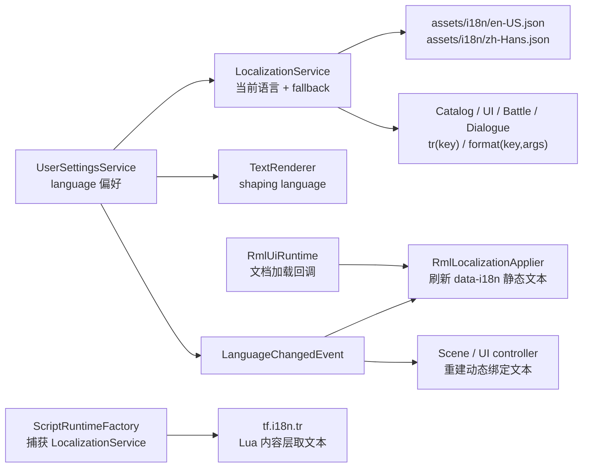

# 本地化与语言切换开发计划

## 元信息

- 任务标题：新增中文语言支持，并在设置菜单中切换语言
- 计划日期：2026-05-25
- 状态：Reviewed Draft
- 目标语言：`en-US`、`zh-Hans`
- 设计原则：以稳定 key 为文本真源；运行时服务统一解析；RmlUi 只负责显示；不考虑向后兼容，可直接迁移现有英文文案。

## 当前上下文

- 项目已有 `game::runtime::UserSettingsService`，负责玩家偏好读取、写回与即时 apply；Options 标签页已经接入该 service。
- 现有文本分散在四类位置：
  - RML：如 `ui/rmlui/scenes/inventory_menu.rml` 中的静态标签。
  - C++：如 battle / shop / pause / inventory 的按钮、状态、提示、格式化字符串。
  - JSON 数据：如 `assets/data/item_config.json`、任务、商店、RPG catalog 的名称和描述。
  - Lua 内容层：如 `scripts/` 下的对白、选项与剧情文本。
- RmlUi 当前默认加载 `assets/fonts/VonwaonBitmap-16px.ttf`；该字体不适合作为中文主字体。项目已有 `assets/fonts/LXGWBright-Regular.ttf`，可作为中文首版字体。
- `TextRenderer` 已接入 FreeType + HarfBuzz，并有 `config/text_render.json` 的语言字段。当前该字段已经是 `zh-Hans`，但 UI 内容仍显示英文，说明它只影响 HarfBuzz shaping / 断字等文本排版提示，不决定"显示哪种语言"。文本内容来源必须由 `LocalizationService` 决定；语言切换时需要同时更新文本内容与 `TextRenderer` shaping language。
- 当前启动路径只创建 `TextRenderer`，尚未显式调用 `TextRenderer::loadConfig("config/text_render.json")`。因此语言切换不能依赖配置文件热改，必须由 `UserSettingsService` 在运行时直接调用 `TextRenderer::setDefaultLanguage(...)`。
- `engine::core::Context` 当前已经通过 `RenderServices` 暴露 `getTextRenderer()`，`GameApp::initContext()` 已把 `*text_renderer_` 注入 Context。`RuntimeServiceFactory` 可直接使用 `params.context.getTextRenderer()` 构造 `UserSettingsService`，不需要新增 Context wire-up。
- 当前 `ScriptModuleInstaller` 只接收 `lua / ScriptHost / registry / dispatcher`，没有直接拿到 `GameRuntimeServices`。Lua 暴露 `tf.i18n` 时必须在 `ScriptRuntimeFactory` 里通过捕获 `LocalizationService*` 的 installer lambda，或把服务指针注入 `registry.ctx()`。

## 实现思路

新增一个 game 层的 `LocalizationService` 作为运行时本地化唯一真源。所有玩家可见文本都使用稳定 key 查询，英文和中文分别放在 `assets/i18n/*.json` 中。`UserSettingsService` 增加 `language` 字段，并在设置菜单中提供语言选择；切换语言时立即：

- 更新 `LocalizationService` 当前语言。
- 更新 `TextRenderer` 默认 shaping language。
- 派发 `LanguageChangedEvent`。
- 刷新所有已加载 RmlUi 文档中标记了 `data-i18n` 的静态文本；新加载文档通过 RmlUi runtime 的文档加载回调自动应用当前语言。
- 通知各 Scene / UI controller 重建动态绑定字符串。
- 标记 dirty，并沿用现有 `flushIfDirty()` 写入 `config/user_settings.json`，下次启动保持选择。

商业项目通常会在这个结构外再接 Crowdin / Phrase / Lokalise / Weblate 一类 TMS；本计划先使用 repo 内 JSON，保持 key 与文件格式稳定，后续可无痛导出到翻译平台。



## 文本资源格式

`assets/i18n/languages.json`：

```json
{
  "fallback": "en-US",
  "languages": [
    {
      "tag": "en-US",
      "native_name": "English",
      "file": "assets/i18n/en-US.json"
    },
    {
      "tag": "zh-Hans",
      "native_name": "简体中文",
      "file": "assets/i18n/zh-Hans.json"
    }
  ]
}
```

路径约定：`languages.json` 本身由 `GameContentManifest` 暴露为 `assets/i18n/languages.json`；其中 `file` 字段继续使用项目现有 catalog loader 风格的运行时相对路径，例如 `assets/i18n/en-US.json`。实现前需确认工作目录与 `assets/data/*` 加载路径一致，不单独引入第二套路由规则。

`assets/i18n/en-US.json` 与 `assets/i18n/zh-Hans.json` 采用扁平 key：

```json
{
  "ui.options.language": "Language",
  "ui.options.damage_popups": "Damage Popups",
  "ui.common.on": "On",
  "ui.common.off": "Off",
  "battle.command.attack": "Attack",
  "battle.victory.continue": "Continue"
}
```

格式化文本使用轻量命名占位符：

```json
{
  "reward.gold_gained": "Gained Gold {amount}",
  "reward.item_gained": "Gained {item} x{count}"
}
```

首版只实现 `{name}` 替换，不接 ICU 复数规则；中英文双语暂时够用，复杂复数和性别格式留到后续独立计划。

`assets/i18n/languages.json` 是 language manifest，不是 catalog。`GameContentManifest` 只提供路径常量，解析、语言文件加载、fallback tag 标准化都由 `LocalizationService` 内部负责。

## RML 迁移约定

RmlUi 静态文本刷新必须显式、可审计，避免 applier 误改动态绑定内容。

- applier 只处理带 `data-i18n`、`data-i18n-title` 等本地化属性的元素，永不扫描或猜测没有标记的普通文本。
- 全量迁移 RML 时，所有需要随语言切换的静态文本都必须补 `data-i18n="..."`。没有补属性的静态文本不会切换，这是有意设计，便于 source-level 测试发现遗漏。
- 同一元素禁止同时包含 `data-i18n` 和 `{{ model }}` 动态绑定，避免 applier 与 RmlUi data model 反复覆盖。若需要"前缀 + 变量"或"变量 + 单位"，由 C++ / Lua 调 `LocalizationService::format(...)` 后把完整字符串写入 model。
- 图标按钮的 `title` / tooltip 使用 `data-i18n-title`；按钮可见文本使用 `data-i18n`。
- 首版只支持元素文本与 `title` 属性。若后续 RML 需要本地化 `alt`、`placeholder` 或其它属性，再扩展统一形式如 `data-i18n-attr-placeholder`；本计划不提前实现未使用属性。
- 不要求每个 Scene 手写一次"load 后 apply"。`RmlUiRuntime` 增加通用文档加载回调，`UserSettingsService` 注册 game 层 applier；service 析构时清空回调，避免 RmlUi runtime 持有悬空捕获。

## 运行时文本边界

本地化后的字符串只能缓存在表现层短生命周期 view model 中，不能进入领域状态、战斗 session、存档或长期运行时结果。

- Catalog 中 `display_name` / `description` 首版继续用原字段名，但字段值迁移为 key。loader 只保存 key，不解析为当前语言。
- UI / Scene / formatter 在写入 Rml model、tooltip、notice、battle log view model 前解析 key。
- 如果某个运行时结构需要跨语言切换后刷新，例如 `BattleLogLine`、`BattleUnit::name`、奖励结算结果，优先保存 id / key / 参数，再在显示边界 format。不要只保存已经翻译完成的字符串。
- 缺失 key 的展示 fallback 由 helper 统一处理：当前语言 → `languages.json::fallback` 指定语言 → 调用方给定 fallback id → `!key!`。
- Debug 面板可以同时展示 raw key 与当前语言解析结果，便于排查。

## 需要新增的文件

| 文件 | 用途 |
|------|------|
| `src/game/runtime/localization_service.h` | `LocalizationService` 接口：加载语言索引、切换语言、`tr`、`format`、语言列表查询 |
| `src/game/runtime/localization_service.cpp` | JSON 读取、fallback 查询、缺失 key 诊断、简单占位符替换 |
| `src/game/defs/localization_events.h` | `LanguageChangedEvent`，包含 `language_tag` |
| `src/game/ui/localized_text.h` | 展示层 helper：把 catalog key / id / fallback 统一解析为当前语言文本 |
| `src/game/ui/rml_localization_applier.h` | RmlUi 文档静态文本刷新 helper |
| `src/game/ui/rml_localization_applier.cpp` | 扫描 `data-i18n`、`data-i18n-title` 并写入本地化文本 |
| `assets/i18n/languages.json` | 支持语言清单与 fallback 配置 |
| `assets/i18n/en-US.json` | 英文文本表 |
| `assets/i18n/zh-Hans.json` | 简体中文文本表 |
| `tests/game/localization_service_test.cpp` | 文本表加载、fallback、格式化、非法输入测试 |
| `tests/game/localized_text_test.cpp` | catalog key fallback 与显示边界解析测试 |
| `tests/game/rml_localization_applier_test.cpp` | `data-i18n` 应用逻辑或 source-level 回归测试 |
| `tests/game/language_settings_test.cpp` | `UserSettings` 语言字段 parse / serialize / clamp 测试 |
| `tests/game/i18n_key_parity_test.cpp` | 断言 `en-US.json` 与 `zh-Hans.json` 的 key 集合完全一致 |

## 需要修改的文件

| 文件 | 修改内容 |
|------|----------|
| `src/game/runtime/user_settings.h/.cpp` | 增加 `language_tag`，默认 `en-US`；解析和序列化 `ui.language`。POD 层只保存字符串，不访问语言清单、不做合法性校验 |
| `src/game/runtime/user_settings_service.h/.cpp` | 持有 `LocalizationService&`、`engine::render::TextRenderer&`、`RmlUiRuntime&`；新增 `setLanguage(...)`；`applyAll()` 同步语言；加载与 setter 中校验未知 tag，非法值回退到 `languages.json::fallback`；注册 / 清理 RmlUi 文档加载回调 |
| `src/game/runtime/runtime_service_factory.cpp` | 先构造并加载 `LocalizationService`，再构造 `UserSettingsService`；从 `Context` 传入 `TextRenderer&`；把 `LocalizationService*` 注入脚本初始化路径 |
| `src/game/runtime/system_bundle.h/.cpp` | `GameRuntimeServices` 持有 `std::unique_ptr<LocalizationService>`；声明顺序必须在 `script_host` 与 `user_settings_service` 之前，确保析构时二者先释放 |
| `src/game/runtime/game_content_manifest.h` | 增加 `I18nLanguages = "assets/i18n/languages.json"` |
| `src/game/defs/options_events.h` | 可保持现有设置事件；语言事件放入 `localization_events.h`，避免 Options 命名继续膨胀 |
| `src/engine/ui/rmlui/rml_ui_runtime.h/.cpp` | 直接修改现有 `forEachDocument` 签名为 `fn(Rml::ElementDocument&, uint64_t owner, const std::string& path)`；新增通用文档加载回调；`loadFontFace` 透出 fallback 参数 |
| `src/engine/debug/panels/rmlui_debug_panel.cpp` | 适配 `forEachDocument` 新签名；它是当前唯一调用方 |
| `src/engine/core/game_app.cpp` | RmlUi 初始化时加载中文字体为 fallback face；现有默认字体调用继续使用默认参数 |
| `src/engine/resource/default_resource_ids.h` | 首版把默认 UI 文本字体切到 `LXGWBright-Regular.ttf`，确保 TextRenderer 能渲染中文 |
| `config/text_render.json` | 保留静态渲染样式默认值；启动语言和切换语言以 `UserSettingsService` 调用 `TextRenderer::setDefaultLanguage(...)` 为准 |
| `src/game/ui/options_tab_content.h/.cpp` | 增加语言行、语言显示文本、prev/next 事件；所有 Options 文案改走本地化 |
| `ui/rmlui/scenes/inventory_menu.rml/.rcss` | Options 中新增 Language row；静态标签改为 `data-i18n` 或绑定字段 |
| `src/game/runtime/script_runtime_factory.cpp` | 使用捕获 `LocalizationService*` 的 installer lambda 安装 TinyFarm 脚本模块 |
| `src/game/script/tinyfarm_script_module.h/.cpp` | 允许 installer 接收 `LocalizationService*`；注册 `tf.i18n` API |
| `src/game/script/script_game_api.h/.cpp` | 增加本地化服务指针，给 Lua 暴露 `tf.i18n.tr` 与 `tf.i18n.format` |
| `src/game/data/*catalog*` | 玩家可见名称/描述字段的值逐步改为文本 key，字段名暂不改；loader 不解析语言，只保存 key |
| `src/game/battle/*formatter*`、`src/game/domain/*` | 避免把已翻译字符串写入长期运行时结果；保存 id/key/参数，显示边界再 format |
| `src/game/scene/*.cpp`、`src/game/ui/*.cpp` | 分批替换硬编码英文，订阅 `LanguageChangedEvent` 并刷新动态绑定 |
| `src/CMakeLists.txt`、`tests/CMakeLists.txt` | 注册新增源码和测试 |

## Catalog 字段方案

本计划采用"字段名不变，值变 key"。

| 方案 | 优点 | 缺点 |
|------|------|------|
| 新增 `display_name_key` / `description_key` | schema 自描述，debug 面板可区分 raw key 与已解析文本 | 需要批改 catalog loader、debug 面板、Lua 绑定和大量测试 fixture |
| 字段名不变，值改为 key | loader / schema / save 路径改动最小，可分批迁移 | `display_name_` 等字段语义会从"显示文本"变成"本地化 key"，需要文档和 helper 命名约束 |

选择第二种方案的原因：当前 catalog schema 和测试 fixture 很多，首版目标是尽快打通中英切换闭环。迁移后展示层必须通过 helper 解析，例如 `localizeDisplayName(item.display_name_, item.id_str_)`；debug 面板可以同时显示 raw key 与解析结果。

重要边界：

- 迁移后的 `display_name_` / `description_` 成员实际保存 key。新代码不要把它们命名为 resolved text，也不要直接拼进 UI。
- `BattleUnit::name`、`BattleLogLine::text`、`QuestTurnInResult::item_name`、`ActorExperienceGrant::display_name` 这类会跨帧保存的结构，不能长期保存已翻译字符串。首版可先在语言切换时重建当前界面 view model；涉及日志历史和战斗单位名时，优先改为保存 source id / key / args。
- 如果某处短期内仍必须保存显示字符串，需要在计划实施中标注为临时债，并加 source-level 测试防止继续扩散。
- Phase 6 前必须审计 `SaveData` / `SaveService` 序列化字段，确认存档没有持久化玩家可见显示名；若发现显示名字段，优先迁移为 id / key / args。当前项目不要求向后兼容，但不能把已翻译文本写入新 schema。

## 实施步骤

### Phase 1：本地化基础设施

目标：服务可加载语言表，C++ 可通过 key 获取英文/中文文本。

1. 新增 `LocalizationService`。
   - `loadLanguageIndex("assets/i18n/languages.json")`
   - `setLanguage("zh-Hans")`
   - `tr("ui.options.language")`
   - `format("reward.gold_gained", {{"amount", "50"}})`
   - fallback 顺序：当前语言 → `languages.json::fallback` 指定语言 → `!key!`
2. 加入缺失 key 诊断。
   - 同一个 key 每种语言只 warn 一次，避免日志刷屏。
   - `format(...)` 替换后若仍残留 `{name}` 风格占位符，按 key 去重输出 warn，便于发现调用方漏传参数。
   - 不抛异常，解析失败返回 false 并保留上一个有效语言。
3. 新增 `game::ui::localized_text` helper，与 `LocalizationService` 同阶段落地。
   - `localizeKeyOrFallback(localization, raw_key, fallback_id)`
   - catalog 展示名 / 描述解析都从这里走，避免 Phase 5 / Phase 6 临时散落 fallback 逻辑。
4. 新增 `assets/i18n/languages.json`、`en-US.json`、`zh-Hans.json`，先覆盖设置菜单、通用按钮、战斗基础指令。
5. 新增 key parity 测试，断言 `en-US.json` 和 `zh-Hans.json` 的 key 集合完全一致；任何一边漏 key 都让测试失败。
6. 注册 CMake 与测试。

### Phase 2：用户设置与语言切换

目标：语言偏好可保存、启动恢复、设置菜单可切换。

1. `UserSettings` 增加 `std::string language_tag{"en-US"}`。`normalizeUserSettings` 不校验该字符串，因为 POD 层没有语言清单依赖。
2. `UserSettingsService` 增加 `setLanguage(std::string_view tag)`。
   - 校验 tag 是否在 `LocalizationService` 支持列表中。
   - `loadFromFileOrFallback` 读到未知 tag 时回退到 `languages.json::fallback`，并把标准化后的 tag 写回内存。
   - `applyLanguage()` 同步调用 `LocalizationService::setLanguage(...)` 与 `TextRenderer::setDefaultLanguage(...)`。
   - 成功切换后标记 dirty。
   - 派发 `game::defs::LanguageChangedEvent`。
3. `RuntimeServiceFactory` 初始化顺序调整为：
   - 在 `injectCatalogPointers(...)` 之后、`initUserSettings(...)` 之前构造 `LocalizationService` 并加载语言表。
   - 将 `LocalizationService*` 注入 `registry.ctx()`，与 catalog / `ResourceManager` 指针约定保持一致，供 Scene / UI / 脚本按需查询。
   - 构造 `UserSettingsService`，传入 `LocalizationService&`、`TextRenderer&`、`RmlUiRuntime&`。
   - 加载 `user_settings.json`。
   - `applyAll()`，其中包含语言 apply。
4. Options 标签页新增 Language row。
   - 显示 native name：`English` / `简体中文`。
   - 左右按钮循环切换。
   - 切换后立即刷新 Options 页自身文本。
   - Phase 2 只负责新增 row 和切换逻辑；语言 native name 来自 `languages.json`，不需要再翻译。row label `"Language"` 自身在 Phase 5 与其它 Options 文案一起 key 化，避免本阶段提前铺太多拼接代码。
5. 扩展 `config/user_settings.default.json`：

```json
{
  "ui": {
    "font_scale": "normal",
    "language": "en-US"
  }
}
```

### Phase 3：字体与文本渲染

目标：中文在 RmlUi 与 TextRenderer 中稳定显示，不出现方块或空白。

1. 修改 `RmlUiRuntime::loadFontFace`，明确透出 fallback 参数：

```cpp
[[nodiscard]] bool loadFontFace(std::string_view path, bool fallback_face = false) const;
```

2. `GameApp::initRmlUi()` 中加载：
   - `assets/fonts/VonwaonBitmap-16px.ttf`
   - `assets/fonts/LXGWBright-Regular.ttf`，作为 fallback face
3. 首版将 `engine::resource::defaults::UI_DEFAULT_FONT_PATH` 切换到 `assets/fonts/LXGWBright-Regular.ttf`，确保 `TextRenderer` 绘制中文时有字形。
4. `UserSettingsService::applyLanguage()` 是运行时语言真入口。它同步调用 `LocalizationService::setLanguage(language_tag)` 与 `TextRenderer::setDefaultLanguage(language_tag)`。前者决定显示文本内容，后者只决定 shaping hint，二者不能互相替代。
5. 如果后续要启用 `TextRenderer::loadConfig("config/text_render.json")`，只把它当作静态默认样式 / fallback language 读取；用户设置加载后必须覆盖它。
6. 首版字体取舍：
   - RmlUi 保留 `VonwaonBitmap-16px.ttf` 作为主字体，`LXGWBright-Regular.ttf` 作为 CJK fallback。英文保持像素风，中文使用 fallback 字体，接受中英混排视觉差异。
   - `TextRenderer` 默认 UI 字体切到 `LXGWBright-Regular.ttf`，优先保证世界文本 / 额外文本渲染中文不缺字。
   - 如果后续要求所有文本视觉完全统一，再引入语言级 font profile；本计划不把它塞进首版闭环。

### Phase 4：RmlUi 静态文本迁移

目标：RML 中硬编码英文标签可随语言即时刷新。

1. 扩展 engine 层 `RmlUiRuntime`，保持 engine 不依赖 game：
   - 直接扩展现有 `forEachDocument` 签名，不新增第二个并存接口。
   - 新增一个通用文档加载回调，例如 `setDocumentLoadedCallback(...)`；回调签名与 `forEachDocument` 一致：`Rml::ElementDocument&`、`uint64_t owner`、`const std::string& path`。
   - 头文件注释说明 owner 是 scene instance id，path 是 runtime 加载 RML 文档路径。
   - `UserSettingsService` 注册捕获 `LocalizationService&` 的 callback，service 析构时清空 callback，避免悬空捕获。

```cpp
template<typename Fn>
void forEachDocument(Fn&& fn) const {
    for (const auto& entry : documents_) {
        if (entry.doc) {
            fn(*entry.doc, entry.owner, entry.path);
        }
    }
}
```

   - 同步修改 `src/engine/debug/panels/rmlui_debug_panel.cpp` 的唯一调用方。
2. 新增 `game::ui::applyLocalizationToDocument(...)`。
   - 扫描 `[data-i18n]` 元素，写入 `textToInnerRml(localization.tr(key))`。
   - 扫描 `[data-i18n-title]` 元素，写入 `title` 属性。
   - 绝不处理没有 `data-i18n` 标记的元素。
   - 若元素同时含 `data-i18n` 和 `{{ model }}`，测试应失败；这类文本必须改为 C++ / Lua format 后写入 model。
3. `UserSettingsService::setLanguage` 成功后，对所有已加载文档调用 applier。
4. 全量给核心 RML 的静态文本加 `data-i18n`：
   - `title.rml`
   - `pause_menu.rml`
   - `inventory_menu.rml`
   - `battle.rml`
   - `shop_menu.rml`
   - `quest_offer.rml`
   - `recruit_offer.rml`
   - `rest_dialog.rml`
   - `save_slot_select.rml`
   - `dialogue_choice.rml`
5. 新打开界面依赖 RmlUi runtime 的文档加载回调自动应用当前语言，不再要求逐个 Scene 调用 applier。测试需要覆盖 `RmlDocumentController::load(...)` 后文档已经按当前语言刷新。

### Phase 5：C++ 动态文案迁移

目标：C++ 中的按钮、状态、提示、格式化字符串全部 key 化。

1. 优先迁移高频正式 UI：
   - `OptionsTabContent`
   - `PauseMenuScene`
   - `BattleScene`
   - `ShopMenuScene`
   - `InventoryMenuScene` 与各 tab content
   - `DialogueChoiceScene`
   - `QuestOfferScene` / `RecruitOfferScene` / `RestDialogScene`
2. 每个需要动态文案的 Scene 持有 `LocalizationService*`。
3. 订阅 `LanguageChangedEvent`。
   - 切换语言后重建 Rml model 中的字符串。
   - 调用 `document_controller_.markDirty(...)` 或 `markAllDirty()`。
4. 格式化字符串统一改为 `localization.format(key, args)`。
5. 对动态内容分两类处理：
   - 纯 view model 字符串可以直接保存已翻译文本，语言切换时重建。
   - 战斗日志、战斗单位名、任务奖励结果、经验奖励结果等跨帧结构保存 id / key / args，渲染前再翻译。
6. source-level 测试禁止新增明显的玩家可见英文硬编码。

### Phase 6：数据目录与 Lua 内容层迁移

目标：物品、任务、商店、对白也能切换语言。

1. 数据目录保持现有字段名，但字段值改为 key：

```json
{ "id": "tool_hoe", "display_name": "item.tool_hoe.name", "description": "item.tool_hoe.desc" }
```

2. Catalog loader 继续保存原字段值；展示层统一把这些值当 key 交给 `LocalizationService` 解析。若 key 缺失，fallback 到 id 或 `!key!`，由 `game::ui::localized_text` helper 决定。
3. 迁移 assets 数据：
   - items
   - crops
   - quests
   - shops
   - RPG actors / classes / skills / states / equipment / enemies / troops
4. 迁移 assets 之前先审计存档 schema。
   - grep `src/game/save` 和 `src/game/component` 中的 `display_name`、`description`、`title`、`label`、`name`。
   - 地图名、actor id、item id 这类稳定 id 可保留；玩家可见显示名必须改为 id/key/args。
   - 审计结果写入实现 PR 说明或计划备注。
5. Lua 暴露：

```lua
tf.i18n.tr("dialogue.greeter.hello")
tf.i18n.format("dialogue.reward.gold", { amount = 50 })
```

6. `ScriptRuntimeFactory` 通过捕获 `services.localization_service.get()` 的 installer lambda 安装 TinyFarm 模块，避免修改 engine 层 `ScriptModuleInstaller` 的通用签名。
7. 迁移 `scripts/` 中对白与选项。
   - Lua 脚本保留流程控制。
   - 具体文本进入 `assets/i18n/*.json`。
   - Lua 每次推送对白时实时调用 `tf.i18n.tr(key)`，所以语言切换后下一句自然使用新语言。
   - 当前已经显示在 dialogue bubble 中的句子不主动刷新，避免 mid-sentence 跳变。
   - 若 choice 选项需要已显示时即时刷新，`DialogueChoiceRequestedEvent` 不能只保存已翻译字符串；需要新增 key / args 负载，或提供 `tf.dialogue.choice_i18n(prompt_key, choice_keys, opts)`。否则首版明确为"下一次打开 choice 使用新语言"。

### Phase 7：测试与验收

目标：语言切换稳定、缺失翻译可发现、构建通过。

1. 单元测试：
   - `LocalizationService` 加载成功。
   - 当前语言缺 key 时 fallback 到 language manifest 配置的 fallback 语言。
   - 英文也缺 key 时返回 `!key!`。
   - `format` 可替换多个命名参数。
   - `format` 缺参数导致占位符残留时会按 key 去重 warn。
   - 非 object JSON 被拒绝。
   - `en-US.json` 与 `zh-Hans.json` key 集合完全一致。
2. 设置测试：
   - `language` 可 roundtrip。
   - 未知 language fallback 到 language manifest 配置的 fallback 语言，默认 manifest 为 `en-US`。
   - `setLanguage("zh-Hans")` 标记 dirty、更新 `TextRenderer` language、派发事件。
3. RmlUi 测试：
   - `data-i18n` 元素可被替换。
   - 切换语言后已加载文档刷新。
   - 新加载文档经 runtime 文档加载回调自动刷新。
   - 含 `{{ model }}` 的动态元素不被 applier 误覆盖。
4. 脚本与数据测试：
   - `tf.i18n.tr` / `tf.i18n.format` 可通过捕获的 `LocalizationService*` 返回当前语言文本。
   - `localized_text` helper 对 catalog key、fallback id、缺失 key 行为一致。
   - 长生命周期结构不新增直接缓存 catalog 已解析显示名的路径。
   - source-level 检查用 gtest 实现：`std::filesystem` 遍历 `src/game/scene`、`src/game/ui`、`src/game/battle`、`scripts` 和核心 RML 文件，正则扫描明显玩家可见英文硬编码，并维护 allowlist。首版先覆盖 `dialogue.show("...")`、choice label、RML 裸英文文本、battle log formatter 字符串。
5. 手动验收：
   - 启动默认英文。
   - Inventory → Options → Language 切到简体中文，当前界面立即中文化。
   - 关闭菜单再打开，仍为中文。
   - 退出重启后仍为中文。
   - 切回 English 后所有已打开/新打开 UI 回到英文。
   - 战斗、商店、任务、Lua 对话至少各走一条中文路径。
6. 构建命令：

```bash
ninja -C build/debug engine_tests game_tests
./build/debug/tests/game_tests --gtest_filter='*Localization*:*UserSettings*:*OptionsTabContent*'
```

## 可追踪待办

- [ ] 新增 `LocalizationService` 与语言表加载测试。
- [ ] 新增 `assets/i18n/languages.json`、`en-US.json`、`zh-Hans.json`。
- [ ] 新增 i18n key parity 测试，保证中英 key 集合一致。
- [ ] `LocalizationService::format` 对残留占位符输出去重 warn。
- [ ] `LocalizationService` 使用 `languages.json::fallback`，不硬编码 fallback tag。
- [ ] `UserSettings` 增加 `ui.language` 持久化。
- [ ] `UserSettingsService` 增加 `setLanguage`、语言 apply、`TextRenderer` 同步与 `LanguageChangedEvent`。
- [ ] Runtime 在 `initUserSettings` 前加载本地化服务，并把 `LocalizationService*` 注入 `registry.ctx()`。
- [ ] `GameRuntimeServices` 中 `localization_service` 声明在 `script_host` 与 `user_settings_service` 之前，保证析构顺序安全。
- [ ] Options 标签页增加 Language row。
- [ ] RmlUi 加载中文 fallback 字体。
- [ ] TextRenderer 默认字体与默认语言跟随语言设置。
- [ ] 扩展现有 `RmlUiRuntime::forEachDocument` 签名、增加文档加载回调并适配 debug panel。
- [ ] 新增 RmlUi `data-i18n` 静态文本 applier。
- [ ] 新增 `localized_text` 展示层 helper，统一 catalog key fallback。
- [ ] 迁移核心 RML 静态文案，所有静态文本显式加 `data-i18n`。
- [ ] 迁移核心 C++ 动态文案。
- [ ] 通过 `ScriptRuntimeFactory` 捕获 `LocalizationService*`，给 Lua 暴露 `tf.i18n.tr` / `tf.i18n.format`。
- [ ] 将数据 catalog 的名称与描述字段值迁移为本地化 key。
- [ ] 战斗日志、战斗单位名、奖励结果等长期结构改为保存 id/key/args 或在语言切换时可重建。
- [ ] 迁移 assets 前审计 `SaveData` / `SaveService`，确认新 schema 不持久化已翻译显示文本。
- [ ] 迁移 Lua 对白与选项文本。
- [ ] Phase 6 首版不刷新已显示的 dialogue choice，或新增 key/args 事件负载后再支持即时刷新；二选一写入实现说明。
- [ ] 新增 source-level gtest 扫描玩家可见英文硬编码与 Lua dialogue 字符串。
- [ ] 补齐本地化、设置、RmlUi 刷新相关测试。
- [ ] 完成中英切换手动验收。

## 风险与处理

- 字体 fallback 不生效会导致中文空白：RmlUi 需要显式加载 fallback face；TextRenderer 首版直接使用 CJK 字体作为默认 UI 字体。
- 首版字体视觉会有取舍：RmlUi 英文保留像素字体、中文走 fallback；TextRenderer 统一走 LXGWBright。若美术上不能接受，需要单独做语言级 font profile。
- `TextRenderer::loadConfig` 当前不在启动路径中：不要把语言切换实现寄托在配置文件变更上，必须由 `UserSettingsService` 运行时调用 setter。
- fallback 语言如果在代码中写死 `en-US`，会和 `languages.json::fallback` 形成第二真源：实现必须从 language manifest 读取 fallback tag。
- RML 静态文本和 data model 动态文本刷新机制不同：静态文本走 `data-i18n` applier 与文档加载回调，动态文本由 Scene 监听 `LanguageChangedEvent` 后重建。
- RmlUi 文档加载回调如果捕获 game service 指针，存在生命周期风险：由 `UserSettingsService` 注册并在析构时清空 callback。
- 数据 catalog 如果继续保存英文显示名，会形成第二套文本真源：本计划直接迁移为 key，不保留旧字段兼容。
- 已翻译字符串进入战斗 session / 日志历史 / 奖励结果后无法自然切换：长期结构保存 id/key/args，显示边界再解析。
- 存档字段如果包含已翻译显示名，读档后语言切换无法刷新：Phase 6 前必须审计保存 schema，新 schema 只保存稳定 id/key/args。
- Lua 脚本中硬编码对白可能遗漏：迁移后新增 source-level 检查，至少对 `dialogue.show("...")`、choice label 字符串给出扫描报告。
- 已显示的 dialogue choice 如果只保存翻译后字符串，无法即时刷新：需要新增 key/args 事件负载或明确首版只刷新后续新打开的 choice。
- 中文文案更长，可能挤压 640x360 UI：迁移每个场景后做一次截图或手动 QA，必要时调整布局宽度、换行或字号。

## 待确认问题

暂无必须澄清的问题。默认方案为：首版支持 `English` 与 `简体中文`，默认 language manifest 的 fallback 语言为 `en-US`，中文语言 tag 使用 `zh-Hans`。
