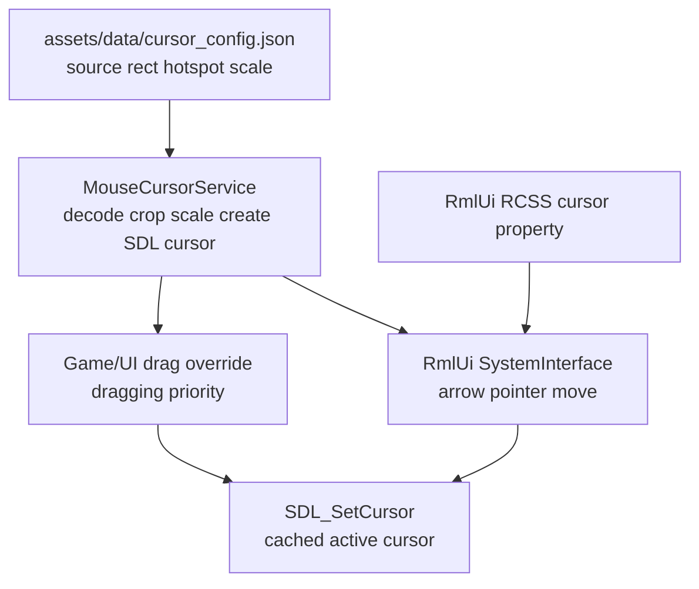

# 自定义鼠标光标开发计划

## 目标

用 `assets/farm-rpg/UI/HUD.png` 中的 16x16 像素图标替换系统箭头，形成一套适合 TinyFarmRPG 的低噪声鼠标皮肤。第一阶段只做“语义清楚、状态少、稳定可读”的默认方案，不把图集中所有颜色都暴露成主题。

采用的默认映射：

| 场景 | 光标语义 | 美术建议 |
| --- | --- | --- |
| 普通世界 / 普通 UI | `default` | 浅米色鼠标箭头 |
| 可点击 UI | `pointer` | 浅肤色手指 / 指向手 |
| 可拖拽槽位 hover | `grab` | 浅肤色张开的手 |
| 正在拖拽物品 | `dragging` | 浅肤色握拳手 |
| 禁用 / 不可交互 | `default` | 不额外换禁用光标 |

第一阶段不把 NPC、宝箱、门等世界对象 hover 强行做成手指光标。当前探索交互主要是面向角色方向的 `interact` 动作，不是鼠标点选；等后续真正有世界鼠标拾取 / hover 语义时，再把 `pointer` 接到世界交互目标上。

## 当前上下文

- 项目使用 SDL3 创建窗口与输入事件，RmlUi 负责生产 UI。
- `RmlUiRuntime` 当前直接使用 `external/RmlUi-6.2/Backends/RmlUi_Platform_SDL.*` 里的 `SystemInterface_SDL`。
- RmlUi 的 `cursor: pointer` / `cursor: move` 已在 `ui/rmlui/theme/base.rcss`、`menu_widgets.rcss`、`slot_widgets.rcss` 等样式中表达了 UI 语义。
- `SystemInterface_SDL::SetMouseCursor()` 当前把 RmlUi cursor 名称映射为 SDL system cursor，所以按钮 hover 仍显示系统手形 / 箭头。
- `assets/data/icon_config.json` 已有 `indicator/cursor`、`indicator/hand_open`、`indicator/hand_closed`，但它面向物品/图标 catalog，不适合直接承载 native cursor 的 hotspot、scale 和 fallback 规则。
- `engine::resource::ImageDecodeService::decodeRGBA()` 已能解码 PNG 为 RGBA 像素，可复用来从 HUD 图集中裁切 cursor。

## 总体方案

使用 SDL native color cursor，而不是在游戏渲染层画一个跟随鼠标的 sprite。native cursor 延迟更低、能覆盖 RmlUi 与游戏画面，也不需要处理渲染顺序。



核心原则：

- 不修改 `external/RmlUi-6.2`，在 `src/engine/ui/rmlui` 增加引擎自有 SDL system interface 包装。
- Cursor 资源数据驱动，坐标、hotspot、scale 放到独立 JSON，避免散落硬编码。
- 默认只启用一套暖浅色 palette。粉色、棕色等变体先留作未来主题，不进第一阶段 UI。
- 所有 cursor 设置都走 `MouseCursorService`，包括 text / resize / cross 这类系统光标 fallback，避免绕过拖拽 override 优先级。
- Setter 内部立即解析并按需调用 `SDL_SetCursor()`；服务缓存当前 active cursor，重复 setter 是 no-op，不暴露需要调用方记住的 `apply()`。

## 数据契约

新增 `assets/data/cursor_config.json`，结构建议：

```json
{
  "sheet": "assets/farm-rpg/UI/HUD.png",
  "theme_id": "warm_light",
  "tile_size": 16,
  "scale": 2,
  "states": {
    "default": {
      "source": [16, 0, 16, 16],
      "hotspot": [1, 1]
    },
    "pointer": {
      "source": [32, 48, 16, 16],
      "hotspot": [8, 1]
    },
    "grab": {
      "source": [0, 48, 16, 16],
      "hotspot": [7, 6]
    },
    "dragging": {
      "source": [16, 48, 16, 16],
      "hotspot": [7, 7]
    }
  }
}
```

说明：

- `source` 使用原图像素坐标，不使用行列号，和现有 `icon_config.json` 风格一致。
- `hotspot` 也使用原 16x16 坐标，实际创建 SDL cursor 时乘以 `scale`。
- `scale: 2` 表示将 16x16 nearest-neighbor 放大为 32x32。这样在高分屏上更清楚，也保持像素风格。
- `theme_id` 第一阶段只作为注释性稳定字段，不提供主题切换 UI；未来增加 palette 时可复用此字段。
- 上表坐标是首选落点，实施时需要用放大预览再确认一次图标姿态；若 `pointer / grab / dragging` 的具体列与实际语义不符，以视觉确认结果为准。

## 引擎改动

新增 `engine::input::MouseCursorService`：

- 生命周期由 `GameApp` 持有，在 `SDL_CreateWindow()` 后、`RmlUiRuntime` 初始化前创建。
- 通过 `Context` 暴露给游戏 UI 层，方便背包/快捷栏拖拽设置 `dragging` override。
- 加载 `cursor_config.json`，用 `ImageDecodeService::decodeRGBA()` 解码 atlas。
- 从 RGBA atlas 中裁切每个 `source`，按 `scale` 做 nearest-neighbor 放大。
- 用 SDL3 color cursor API 创建 `SDL_Cursor*`，析构时统一释放。
- 若配置、图片、裁切或 SDL cursor 创建失败，回退到 SDL system cursor 并输出 warn，不阻塞游戏启动。
- `setUiCursor()`、override 创建/释放都立即触发 resolve；调用方不需要也不能单独调用 `apply()`。
- text / resize / cross 等未定制像素图标的状态也由本服务持有 SDL system cursor，统一参与优先级解析。
- 提供语义接口：

```cpp
enum class MouseCursorKind {
    Default,
    Pointer,
    Grab,
    Dragging,
    Text,
    Resize,
    Cross,
};

class MouseCursorService {
public:
    bool loadTheme(std::string_view config_path);
    void setUiCursor(MouseCursorKind kind);
    [[nodiscard]] ScopedCursorOverride scopedOverride(MouseCursorKind kind);
};
```

优先级：

1. `override` 存在时优先，例如背包拖拽中的 `Dragging`。
2. RmlUi 当前 cursor 语义次之，例如按钮 hover 的 `Pointer`、槽位的 `Grab`、输入框的 `Text`。
3. 都没有时使用 `Default`。

`ScopedCursorOverride` 是移动-only RAII token：

- 构造时向 `MouseCursorService` 注册 override 并立即应用。
- 析构时只清理自己持有的 override id，避免旧 token 误清掉更新的 override。
- 拖拽状态对象持有 token；拖拽结束、取消、场景关闭时状态析构或 `reset()` 自动恢复。

## High-DPI 与像素格式策略

第一阶段不做动态 DPI 响应：

- 当前 `GameApp` 创建窗口时没有传 `SDL_WINDOW_HIGH_PIXEL_DENSITY`，cursor 位图统一按配置中的 `scale` 生成。
- `SDL_CreateColorCursor` 接收物理像素 surface，hotspot 也按物理像素传入；实现中统一使用 `source_hotspot * scale`。
- 不监听多显示器 DPI 变化，不在窗口跨屏时重建 cursor。若后续启用 high pixel density window，再把 cursor scale 与窗口/显示器像素密度一起纳入配置或运行时重建。

像素格式约定：

- 裁切和放大后的像素使用 straight alpha RGBA。
- 创建 SDL surface 时使用 `SDL_PIXELFORMAT_RGBA32`。
- 不做 premultiplied alpha，避免像素光标边缘出现发黑或颜色偏移。

## RmlUi 接入

新增引擎自有 system interface，例如：

- `src/engine/ui/rmlui/rml_system_interface_sdl.h`
- `src/engine/ui/rmlui/rml_system_interface_sdl.cpp`

它可以参考 RmlUi upstream 的 `SystemInterface_SDL`，但由项目自己维护，并额外接收 `MouseCursorService*`：

- `SetMouseCursor("arrow")` / 空字符串 -> `MouseCursorKind::Default`
- `SetMouseCursor("pointer")` -> `MouseCursorKind::Pointer`
- `SetMouseCursor("move")` / `rmlui-scroll*` -> `MouseCursorKind::Grab`
- `SetMouseCursor("unavailable")` -> `MouseCursorKind::Default`
- `SetMouseCursor("text")` -> `MouseCursorKind::Text`
- `SetMouseCursor("resize")` -> `MouseCursorKind::Resize`
- `SetMouseCursor("cross")` -> `MouseCursorKind::Cross`

`Text / Resize / Cross` 第一阶段继续显示 SDL system cursor，但仍必须通过 `MouseCursorService` 设置，不能在 RmlUi system interface 中直接 `SDL_SetCursor()`。这样背包拖拽中的 `Dragging` override 能压过输入框 text 光标等特殊 UI 状态。

`RmlUiRuntime` 替换当前 `std::unique_ptr<SystemInterface_SDL>`，继续复用 `RmlSDL::InputEventHandler()` 做事件转换。`RmlUiRuntime::create()` 增加可选 `MouseCursorService*` 参数，测试或 headless 场景可传 `nullptr` 并自动回退 system cursor。

## 游戏 UI 接入

第一阶段优先接 RmlUi 已有 cursor 语义，不大改 RML 结构：

- 普通按钮、菜单项、地图 marker 等已有 `cursor: pointer` 的元素自动显示 `pointer`。
- `ui/rmlui/theme/slot_widgets.rcss` 中已有 `cursor: move` 的槽位自动显示 `grab`。
- 背包与快捷栏拖拽控制器在拖拽开始时创建 `ScopedCursorOverride(MouseCursorKind::Dragging)`，拖拽状态结束或 UI 对象析构时 token 自动释放。
- 场景析构 / overlay pop 不需要手动清理 cursor，但必须确保拖拽状态对象或 token 随场景释放，避免离开背包后光标仍保持握拳。

拖拽接入点：

- 背包菜单内的背包/快捷栏拖拽以 `src/game/ui/inventory_slot_drag_controller.*` 为唯一状态接入点；`InventoryTabContent` 只负责事件转发和命令派发。
- HUD 快捷栏目前在 `src/game/ui/hotbar_ui.*` 里持有独立 `SlotGridDragState`，第一阶段也需要接入 RAII override，或后续先把它抽到共享 controller 后再接 cursor。

不要在 `InventoryTabContent` 和 `HotbarUI` 的多个 mouseup/drop 分支手写 `clear override`；状态类持有 RAII token 才是主路径。

## 实现步骤

1. 资源与配置
   - 新增 `assets/data/cursor_config.json`。
   - 用放大预览确认 `default / pointer / grab / dragging` 的 `source` 与 hotspot。
   - 保留 `icon_config.json` 现有 indicator，不把 native cursor 配置混进去。
   - 使用 `tile_size` 与 `theme_id: "warm_light"` 字段，为后续主题切换预留稳定结构。

2. Cursor 服务
   - 新增 `MouseCursorKind` 与 `MouseCursorService`。
   - 实现 JSON 解析、atlas 裁切、nearest-neighbor 放大、SDL cursor RAII。
   - 支持加载失败时回退 SDL system cursor。
   - 将 `Default / Pointer / Grab / Dragging` 解析为 color cursor，将 `Text / Resize / Cross` 解析为 system cursor。
   - `setUiCursor()` 与 RAII override 变化时立即 resolve，并缓存当前 applied cursor，避免重复调用 `SDL_SetCursor()`。

3. RmlUi system interface
   - 新增项目自有 `RmlSystemInterfaceSdl`。
   - 保留 elapsed time、clipboard、text input 行为。
   - 将 RmlUi cursor 名称映射到 `MouseCursorService`。
   - 禁止在 system interface 内直接 `SDL_SetCursor()`，所有 cursor 状态都交给 service 统一解析。
   - 更新 `RmlUiRuntime` 创建流程，避免继续直接依赖 external `SystemInterface_SDL`。

4. GameApp / Context 装配
   - `GameApp` 在 SDL window 初始化后创建 cursor service。
   - `initRmlUi()` 把 cursor service 注入 `RmlUiRuntime::create()`。
   - `Context` 暴露 cursor service 指针或引用，供游戏 UI 拖拽 override 使用。
   - `close()` 顺序确保 RmlUi runtime 先释放对 cursor service 的引用，再销毁 cursor service 和 SDL window。

5. 拖拽状态接入
   - `InventorySlotDragController::start()` 创建 `ScopedCursorOverride(MouseCursorKind::Dragging)`。
   - `InventorySlotDragController::clear()` 或 controller 析构释放 token。
   - `HotbarUI` 的独立 `drag_state_` 也需要同样的 token；若先重构为共享 controller，则只在共享状态类中接一次。
   - 必要时微调 `slot_widgets.rcss`，确保可拖拽槽位 hover 使用 `cursor: move`，不可操作槽位保持 default。

6. 测试与验证
   - 配置解析测试：必需 state 存在、source 在图像边界内、hotspot 合法。
   - 裁切/缩放纯函数测试：16x16 输入放大为 32x32，透明像素保留 alpha。
   - 优先级测试：`override` 与 `uiCursor` 同时存在时总是解析为 override；override 释放后恢复为当前 UI cursor。
   - 系统 cursor fallback 测试：`Text / Resize / Cross` 不绕过 service，且会被 override 压过。
   - RmlUi smoke test：确认按钮类仍有 `cursor: pointer`，槽位类仍有 `cursor: move`。
   - 使用 ninja 构建：`ninja -C build`，或按当前构建目录执行等价命令。
   - 手动验收：标题/暂停/背包/商店/战斗 UI hover 不闪烁，拖拽时变握拳，离开拖拽后恢复正确状态。

## 验收清单

- [ ] 游戏启动后默认光标不是系统箭头，而是像素风浅米色箭头。
- [ ] Hover 普通 UI 按钮时显示手指/指向手。
- [ ] Hover 可拖拽物品槽时显示张开的手。
- [ ] 拖拽物品时显示握拳手，松开后恢复 hover 或 default。
- [ ] 禁用按钮、不可交互区域不显示误导性的手形光标。
- [ ] 光标 hotspot 对齐自然：箭头点尖端，手指点指尖，拖拽手不明显偏移。
- [ ] 图标按 nearest-neighbor 放大，没有模糊边缘。
- [ ] 缺失配置或素材时游戏仍可启动，并回退到系统光标。
- [ ] RmlUi debugger / ImGui 调试 UI 捕获鼠标后不造成 cursor stuck；释放后恢复游戏 cursor。

## 后续可选项

- 增加 cursor theme 设置，允许在默认暖浅色、棕色、粉色之间切换。
- 当探索场景加入鼠标 hover picking 后，将 NPC、宝箱、采集物、地图出口等世界交互目标接入 `pointer`。
- 为战斗目标选择增加专用准星或指向光标，但第一阶段先避免新增语义状态。
- 若未来需要文字输入较多的 UI，再从 HUD 或新素材中补像素 `text` 光标。
