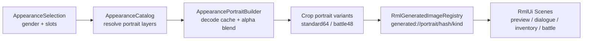

# 主角动态头像与外观预览开发计划

## 目标

让主角头像与 `AppearanceComponent` 中的自定义外观保持同步。玩家在新游戏创建、衣柜换装、存档读档后，头像都应由当前外观部件实时合成，而不是继续使用 `Portrait/Premade/1.png` 静态图。

外观自定义场景还需要在现有 idle 动画预览之外，显示同一套外观合成出的头像预览。

## 当前资源结论

- `assets/data/appearance_catalog.json` 中已有的 `skin`、`eyes`、`clothes`、`hair`、`acc` 条目，按头像素材规则映射后均能在 `assets/farm-rpg/Character and Portrait/Portrait/PNG` 找到。
- `acc/Elf/*` 不对应 `Portrait/PNG/Acc/Elf/*`，而是对应 `Portrait/PNG/Skins/Ears/Elf/*`。
- `Portrait/PNG` 中额外存在 `Beret`、`Pirate eyepatch`、`Santa Hat`。
- `Character/PNG` 中也有这些新增配饰，但命名不完全统一：
  - `Pirate eyepatch` 在部分动作目录中写作 `pirate eye patch`。
  - `Santa Hat` 在部分动作目录中写作 `Santa hat`。
  - `Beret` 在当前扫描中缺少 `7. Watering/Acc/Beret.png`，其他已配置动作目录存在。
- 已确认：`Beret` 等素材补齐后再加入 catalog，本轮不加入。
- 已确认：gender 默认 `male`；新游戏中可切换性别，衣柜中不能切换性别。

## 实现思路

### 数据层

扩展 `AppearanceCatalog`，让它同时描述角色分层贴图和头像分层贴图。角色 sprite 与 portrait 共用同一套外观 variant ID，但各自可以有不同的资源解析规则。

建议新增字段：

- `gender_variants`: `["male", "female"]`
- `selection_order`: `["gender", "skin", "eyes", "clothes", "hair", "acc"]`
- `portrait_texture_root`: `assets/farm-rpg/Character and Portrait/Portrait/PNG`
- `portrait_layer_order`: `["skin", "ears", "clothes", "eyes", "hair", "acc"]`
- `variant_path_aliases`: 处理 `Standard -> Standart`、`Pirate eyepatch -> pirate eye patch`、`Santa Hat -> Santa hat` 等素材包命名差异

`gender` 不作为渲染 layer，而是作为选择字段，影响 sprite 的眼睛层与 portrait 的皮肤/服装层。

UI 层按场景模式决定是否允许修改 gender：`NewGame` 模式展示并允许切换；`Closet` 模式沿用玩家当前 gender，不展示切换入口。

### 头像合成

新增一个 CPU 侧头像构建器，将多个 320x192 RGBA 部件按顺序 alpha 合成到一张完整 portrait sheet：

1. `Skins/{Male|Female}/{skin}.png`
2. 耳朵层：
   - `acc == Elf/N` 时使用 `Skins/Ears/Elf/N.png`
   - 其他情况下使用 `Skins/Ears/Human/{skin}.png`
3. `Clothers/{Male|Female}/{color}.png`，其中 `Farm/Blue` 映射为 `Blue`
4. `Eyes/{eyes}.png`
5. `Hair/{style}/{color}.png`，其中 `Standard` 映射为素材目录 `Standart`
6. 非 `none` 且非 `Elf/*` 的 `Acc/{acc}.png`

完整 sheet 只作为合成中间结果。注册给 RmlUi 前需要裁出 UI 实际使用的头像图：

- `standard64`: 从 `0,0,64,64` 裁出，用于对话、招募、背包等常规头像。
- `battle48`: 从 `8,8,48,48` 裁出，用于战斗 party HUD。

合成结果注册到 RmlUi 的 `RmlGeneratedImageRegistry`，使用 `generated://...` URI 供 RML `` 或 `image(...)` decorator 使用。URI 中应包含稳定的外观选择 hash，避免 RmlUi 复用旧纹理导致头像不刷新。hash 不能直接遍历 `unordered_map`，应按 `gender` + `catalog.selectionOrder()` 或 `catalog.layerOrder()` 的固定顺序拼接后计算。

缓存策略：

- 解码缓存键为单个 layer 文件路径，例如 `Skins/Male/1.png -> DecodedImage`，跨 selection 复用。
- 合成缓存键为稳定 selection hash；可以缓存裁剪后的 `standard64` / `battle48`，也可以每次 slot 变化后重新 blend。主要成本是 PNG decode，blend 本身可以保持简单。

### 主角头像同步

只替换主角 `actor.player` 的头像来源，其他角色暂时继续使用现有静态 portrait。

建议新增一个轻量的 `PlayerPortraitService` 或 `PlayerPortraitPresenter`，由游戏 UI 层持有：

- 读取玩家实体上的 `AppearanceComponent`
- 使用 `AppearancePortraitBuilder` 构建头像
- 持有 `RmlGeneratedImageRegistry::Registration`，通过 RAII 管理 generated image 生命周期
- 在外观改变、读档、进入战斗前刷新
- 向各 UI 入口提供双形态 API：
  - `sourceUri(PortraitImageKind kind)`: 返回 `generated://...`，用于 ``。
  - `decoratorString(PortraitImageKind kind)`: 返回完整 CSS decorator 字符串 `image(generated://...)`，用于 `data-style-decorator`。

调用点不自行拼 `image(...)`，统一从服务取值，避免 URI kind 或格式不一致。

为了让 UI 能可靠感知刷新，建议直接在 `src/game/system/appearance_system.cpp` 的 `AppearanceSystem::rebuildLayerCache()` 内部，在 `AppearanceLayerCacheBuilder::rebuild(...)` 后派发 `AppearanceChangedEvent{target}`。这样 `SetAppearanceSlotCommand`、`RefreshAppearanceCommand`、读档刷新和未来的 gender command 都会自动覆盖。

### RmlUi 接入策略

RmlUi 的 `@spritesheet src:` 不应依赖 `generated://` 动态 URI，因此主角动态头像不要走 `portrait-player` / `battle-party-portrait-player` 静态 spritesheet。采用 view model 注入 decorator 的方案：

- 对话、招募、战斗 turn order 使用 `decoratorString(Standard64)`。
- 战斗 party HUD 使用 `decoratorString(Battle48)`，替代 `battle-party-portrait-player`。
- 背包 party panel 使用 `sourceUri(Standard64)`，直接跳过当前 `actor->portrait_.path_` 的 decode + crop + register 流程。

`portrait.rcss` 与 `battle.rcss` 中的静态 spritesheet 可以保留给 Lyria / Tori 或作为 fallback。`actor.player` 的 view model 默认返回动态 `generated://` decorator；当 `PlayerPortraitService` 尚不可用时，回退到 `image(portrait-player)` / `image(battle-party-portrait-player)`，避免头像空白。

### 外观预览场景

`AppearanceCustomizeScene` 目前已经有一个独立 preview entity 渲染 idle 动画。计划保留这个预览，并在同一预览框内新增头像区域：

- 左/上区域：现有 idle 动画。
- 右/下区域：合成头像 ``。
- 每次 `onSlotStep()`、`onRandomize()`、`onReset()` 后，同时刷新 idle cache 和 portrait preview。
- `NewGame` 模式中的 gender 切换也走同一套控制行与刷新流程；`Closet` 模式不提供 gender 控制。

实现后需要人工确认 idle 动画与头像 overlay 不互相遮挡；当前 idle pivot 已向左/上偏移，头像钉在预览框右/下角。

### 新增配饰策略

`Pirate eyepatch` 和 `Santa Hat` 可以补入 catalog，但需要先通过 alias 解析保证所有已配置动作都能找到对应 sprite。

`Beret` 的 portrait 资源存在，角色 sprite 大多数动作也存在，但当前缺少 watering 动作素材。已确认本轮不加入 catalog，等补齐 `7. Watering/Acc/Beret.png` 后再启用。

## 需要新增的文件

- `src/game/ui/appearance_portrait_builder.h`
- `src/game/ui/appearance_portrait_builder.cpp`
- `src/game/ui/player_portrait_service.h`
- `src/game/ui/player_portrait_service.cpp`
- `tests/game/ui/appearance_portrait_builder_test.cpp`
- `tests/game/data/appearance_portrait_catalog_test.cpp`

也可能需要新增或调整：

- `src/game/defs/events_appearance.h`：新增 `AppearanceChangedEvent`
- `src/game/defs/commands_appearance.h`：如需要独立支持 debug/UI 性别切换，可新增 `SetAppearanceGenderCommand`
- `src/game/ui/appearance_customize_view_model.*`：将 slot view model 扩展为 appearance control view model

## 修改范围

- `assets/data/appearance_catalog.json`
- `src/game/data/appearance_catalog.*`
- `src/game/component/appearance_component.h`
- `src/game/scene/appearance_customize_types.*`
- `src/game/scene/appearance_customize_scene.*`
- `src/game/ui/appearance_customize_view_model.*`
- `src/game/system/appearance_system.*`
- `src/game/runtime/asset_preload_registrar.cpp`
- `src/game/scene/inventory_menu_scene.*`
- `src/game/ui/dialogue_presentation_controller.*`
- `src/game/scene/battle_scene.*`
- `src/game/scene/battle_view_model_builder.*`
- `ui/rmlui/scenes/appearance_customize.rml`
- `ui/rmlui/scenes/appearance_customize.rcss`
- `ui/rmlui/scenes/battle.rml`
- `ui/rmlui/scenes/battle.rcss`
- 需要时调整 `ui/rmlui/hud/dialogue_box.rml`、`ui/rmlui/theme/portrait.rcss`

## 实现步骤

1. 资源验证测试

   写一个可复用的验证测试，扫描 `Character/PNG` 与 `Portrait/PNG`，确认 catalog 中每个 runtime variant 至少能解析出 idle/walk/工具动作 sprite，以及 portrait layers。验证测试需要支持候选 alias，以便先证明 `Pirate eyepatch`、`Santa Hat` 可完整映射；`Beret` 暂不加入，直到 watering 动作素材补齐。

2. 扩展 `AppearanceCatalog`

   增加 gender 控制、portrait root、portrait layer order、variant alias 解析。保留现有角色 layer 解析入口，同时新增 portrait layer 解析入口，避免 UI 代码直接拼资源路径。

3. catalog 补齐新增配饰

   在 alias 解析与验证测试通过后，补入 `Pirate eyepatch`、`Santa Hat`。保持 `Beret` 不在 catalog 中。

4. 增加头像合成器

   新增 `AppearancePortraitBuilder`，输入 `AppearanceSelection` 或 `AppearanceComponent`，输出完整 sheet 与裁剪后的 `standard64` / `battle48`。内部负责 layer-path decode 缓存、alpha 合成、缺层日志和稳定 selection hash。

5. 增加主角头像服务

   新增主角头像 RAII 服务，监听 `AppearanceChangedEvent`，在玩家外观变化时重建 generated image，并暴露 `sourceUri(kind)` / `decoratorString(kind)` 给 UI 层。

6. 接入外观自定义场景

   为 `AppearanceCustomizeScene` 增加 `portrait_src` 数据绑定和 generated image registration。更新 RML/RCSS，在预览框内同时展示 idle 动画和头像。`NewGame` 模式新增 gender 控制行，切换后同步刷新 sprite 与 portrait；`Closet` 模式不提供 gender 切换。

7. 接入主角相关 UI

   Inventory party panel 对 `actor.player` 使用 `sourceUri(Standard64)`，不再重新 decode 主角静态 portrait；Dialogue、RecruitOffer、Battle turn order 使用 `decoratorString(Standard64)`；Battle party HUD 使用 `decoratorString(Battle48)`。其他角色保持原静态资源。

8. 存档、读档与新游戏流程校验

   现有 save data 已有 `appearance_state.gender`，需要确认新 UI 能写入 gender，读档后触发 `AppearanceChangedEvent` 或显式刷新主角头像。

9. 测试与构建

   添加 catalog/portrait builder 单元测试，覆盖 gender、human ears、elf ears、新增 acc、缺失资源处理。使用 ninja 构建并跑相关测试；最后进入外观场景、背包、对话、战斗做一次人工验证。

## TODO

- [x] 确认 `Beret` 本轮不加入 catalog，等待 watering 动作素材补齐。
- [x] 在 `appearance_catalog.json` 增加 `gender_variants`、`selection_order`、portrait 配置和 variant alias。
- [x] 扩展 `AppearanceCatalog` 的角色 sprite alias 解析。
- [x] 扩展 `AppearanceCatalog` 的 portrait layer 解析。
- [x] 新增 catalog 验证测试，确认候选 alias 可解析所有必需角色动作与 portrait layers。
- [x] 验证通过后补入新增配饰 variant：`Pirate eyepatch`、`Santa Hat`。
- [x] 保持 `Beret` 不在 catalog 中，补齐素材后再追加。
- [x] 新增 `AppearancePortraitBuilder`，实现 RGBA alpha 合成、裁剪 `standard64` / `battle48`、layer decode 缓存。
- [x] selection hash 按固定顺序生成，不直接遍历 `unordered_map`。
- [x] 新增 `AppearanceChangedEvent`，在 `AppearanceSystem::rebuildLayerCache()` 内派发。
- [x] 新增主角头像服务，管理 generated image registration、selection hash URI、`sourceUri(kind)`、`decoratorString(kind)`。
- [x] 外观自定义 UI 增加头像预览。
- [x] 新游戏外观 UI 增加 gender 控制，默认 `male`。
- [x] 衣柜外观 UI 保持当前 gender，不允许切换。
- [x] Inventory 中主角头像改用 `sourceUri(Standard64)`，跳过静态 portrait decode/crop/register。
- [x] Dialogue / RecruitOffer 中主角头像改用 `decoratorString(Standard64)`。
- [x] Battle turn order 中主角头像改用 `decoratorString(Standard64)`。
- [x] Battle party HUD 中主角头像改用 `decoratorString(Battle48)`，不再依赖 `battle-party-portrait-player`。
- [x] 主角 view model 默认走动态 portrait，`PlayerPortraitService` 不可用时保留 `portrait-player` / `battle-party-portrait-player` 静态 fallback。
- [x] 新增 catalog 与头像合成单元测试。
- [x] 使用 ninja 构建并运行相关测试。
- [ ] 人工验证新游戏外观、衣柜换装、读档、背包、对话、战斗中的主角头像同步，并确认外观预览框内 idle 动画与头像 overlay 不互相遮挡。

备注：当前已完成自动化验证与默认构建；最后一项需要在可用图形窗口环境中进入实际游戏流程确认。

## 已确认决策

- `Beret` 当前缺少 `assets/farm-rpg/Character and Portrait/Character/PNG/7. Watering/Acc/Beret.png`，本轮不加入 catalog。
- gender 默认 `male`。
- 新游戏外观创建中允许切换 gender。
- 衣柜换装中不能切换 gender，只修改外观部件。
