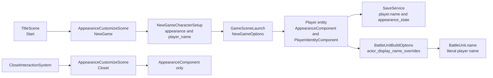

# 新游戏主角姓名输入开发计划

## 目标

在开始新游戏的自定义外观页面中增加主角姓名输入。输入框放在左上角，替换当前新游戏模式下的副标题文案“选择外观”；衣柜换装入口继续只编辑外观，不显示、不读取、不修改姓名。

默认姓名沿用当前玩家显示名，也就是从 `actor.player.name` 本地化 key 解析得到。当前中文默认值为“亚历克斯”，英文默认值为 “Alex”。

## 实现思路

复用现有 `AppearanceCustomizeScene::Mode::NewGame / Closet` 分支。新游戏模式绑定 `player_name` 和 `show_name_input` 到 RmlUi；衣柜模式保持原副标题和现有按钮、外观槽位布局。

姓名不属于外观数据，不放进 `AppearanceSelection`。新游戏确认时返回一个“角色创建结果”，其中包含外观选择和姓名；`TitleScene` 再把它映射到 `NewGameOptions`。`GameScene` 进入新游戏后把姓名写入玩家实体上的运行时身份组件，并由 `SaveService` 持久化。

探索侧 UI 通过统一 helper 从玩家实体解析显示名；战斗侧不能直接使用这个 helper，因为 `battle_unit_factory` 只接收 `RpgCatalog` 和 `BattleUnitBuildOptions`，没有 `registry` 和 `LocalizationService`。因此战斗采用“入场快照注入”：由持有 `registry` 的 `GameScene` 在进入战斗前把玩家自定义名写入 `BattleUnitBuildOptions::actor_display_name_overrides`，工厂构建 `BattleUnit` 时优先使用该字面名。

## 需要新增的文件

- `src/game/component/player_identity_component.h`
  - 保存玩家自定义身份信息，目前只需要 `display_name_`。
- `src/game/ui/player_display_name.h`
  - 声明统一的 actor 显示名解析 helper。
- `src/game/ui/player_display_name.cpp`
  - 对 `actor.player` 优先返回 `PlayerIdentityComponent::display_name_`，否则走 RPG catalog display name + localization。

如实现时发现 helper 只被少量探索侧场景使用，也可以先只新增 component，把 helper 放在后续重构；但推荐新增 helper，避免背包、地图标记、装备页各写一套判断。战斗不直接调用该 helper，而是由 `GameScene` 把 helper 解析出的字面名注入 `BattleUnitBuildOptions`。

## 实现步骤

### 1. 扩展新游戏确认数据

- 在 `appearance_customize_types.h` 增加 `NewGameCharacterSetup`，包含 `AppearanceSelection appearance` 和 `std::string player_name`。
- 将 `AppearanceCustomizeScene::SceneFactory` 从只接收 `AppearanceSelection` 改为接收 `NewGameCharacterSetup`。
- `TitleScene::onStartClicked` 中把 setup 转换为 `NewGameOptions`。
- `NewGameOptions` 增加 `std::string player_name`，外观仍保留 `initial_appearance`。

### 2. 在新游戏外观 UI 左上角加入姓名输入

- `AppearanceCustomizeScene` 增加 data model 字段：
  - `Rml::String player_name_`
  - `bool show_name_input_`
- `AppearanceCustomizeScene` 增加姓名编辑状态：
  - `std::string default_player_name_`
  - `bool name_was_edited_`
- 新游戏模式初始化时：
  - `show_name_input_ = true`
  - `player_name_` 使用 `actor.player.name` 的本地化文本作为默认值
- 衣柜模式初始化时：
  - `show_name_input_ = false`
  - 保留 `subtitle_text_` 显示“换装”类副标题
- 修改 `appearance_customize.rml`：
  - 在原 `#appearance-subtitle` 位置加 `<input id="appearance-name-input" type="text" data-value="player_name" maxlength="16"/>`
  - 给输入框绑定 `data-event-change="player_name_changed"`，回调只负责置位 `name_was_edited_`
  - 使用 `data-if="show_name_input"` 控制输入框
  - 原副标题使用 `data-if="!show_name_input"`，只给衣柜模式显示
- 修改 `appearance_customize.rcss`：
  - 让 `#appearance-name-input` 占用原副标题区域，位置在左上标题下方
  - 样式使用暖色细边框和透明或浅色底，不占用右侧控制面板空间
  - 初始焦点继续放在现有按钮，避免手柄/方向键一进页面就被文本框吞掉；鼠标或 Tab 可进入输入框

### 3. 规范化确认时的姓名

- 新增 `normalizePlayerName` 小函数：
  - 去掉首尾空白
  - 空字符串回退为当前默认玩家名
  - 限制最大长度，优先依赖 RML `maxlength="16"`；C++ 兜底必须按 UTF-8 码点边界截断，不能按字节硬切中文
- 语言切换时：
  - 如果玩家尚未编辑姓名，或者当前输入值仍等于上一份 `default_player_name_`，默认名跟随语言更新
  - 如果玩家已编辑姓名，则保留玩家输入
- 文本输入是生产场景里的新控件，实机验证时要覆盖中文 IME、输入框获得焦点后的 `menu_cancel` 行为，以及初始焦点仍停留在按钮上的手柄/方向键操作。

### 4. 新增玩家身份组件并接入新游戏

- 新增 `PlayerIdentityComponent`。
- `GameScene::applyNewGameAppearance` 可改名为 `applyNewGameCharacterSetup`，同时应用外观和姓名。
- 新游戏进入后：
  - 找到玩家实体
  - 写入 `PlayerIdentityComponent{ .display_name_ = options.player_name }`
  - 继续按原流程应用 `AppearanceComponent`
- 如果 `options.player_name` 为空，则写入默认玩家名，确保后续 UI 不需要猜测。
- `PlayerIdentityComponent::display_name_` 为空时，所有读取路径都必须回退到 catalog 的 `actor.player.name`。

### 5. 持久化 `player.name`

- `SaveData::PlayerSaveData` 增加 `std::string name`。
- `save_data.cpp` 序列化到 JSON：`player.name`。
- `deserialize` 使用 `readOptionalStringField` 读取 `player.name`，缺失时保留空值。
- 本次不升级 `SAVE_SCHEMA_VERSION`，也不新增迁移步骤；`player.name` 是 v8 下的可选扩展字段。这样不会触发 `save_migrator.cpp` 末尾的严格版本相等校验，也不会让现有 v8 存档加载失败。
- `SaveService::capture` 从玩家实体的 `PlayerIdentityComponent` 读取姓名；组件缺失或姓名为空时，回退到当前默认玩家名，并记录 warning。
- `SaveService::apply` 读档时 `emplace_or_replace<PlayerIdentityComponent>`；存档姓名为空时同样回退默认名。

### 6. 统一玩家显示名使用点

- 新增 `game::ui::resolveActorDisplayName` helper，签名需要接收 `registry` / `player entity` / `actor_id` / `RpgCatalog` / `LocalizationService`。
- 探索侧优先更新这些高可见入口：
  - 背包队伍面板
  - 装备页当前角色名
  - 地图角色标记
  - 休息对话队伍成员名
- 非玩家 actor 继续使用 `RpgCatalog::ActorData::display_name_` 和本地化。
- 战斗侧单独处理：
  - `BattleUnitBuildOptions` 增加 `std::unordered_map<std::string, std::string> actor_display_name_overrides`
  - `GameScene::populateBattlePartyState` 或相邻 helper 在持有 `registry` 时填充 `actor.player` 的字面显示名
  - `battle_unit_factory.cpp` 构建玩家单位时优先使用 override，否则继续使用 catalog display name
  - `localizedUnitName` 会继续对 `BattleUnit.name` 调用 `tryLocalize`；自定义姓名通常会原样返回。若玩家姓名刚好等于某个 i18n key，会被本地化，这是可接受的小概率边界。

### 7. 测试与验证

- 更新或新增单元测试：
  - 新游戏 setup 能携带 `player_name`
  - `SaveData` roundtrip 保留 `player.name`
  - `SaveService::capture/apply` 保留 `PlayerIdentityComponent`
  - 背包队伍面板对 `actor.player` 显示自定义姓名
  - `BattleUnitBuildOptions::actor_display_name_overrides` 能覆盖 `actor.player` 的战斗单位名称
  - `localizedUnitName` 对普通字面姓名保持原样
- 更新 source regression 测试：
  - `appearance_customize.rml` 新增 `data-value="player_name"`
  - 输入框由 `show_name_input` 控制
  - 输入框绑定 `player_name_changed`
  - `appearance_customize_scene.cpp` 在 `onLanguageChanged` 中不会冲掉已编辑姓名
  - 衣柜构造路径不传入姓名数据
  - `tests/game/appearance_customize_view_model_test.cpp` 中涉及外观 scene 源码断言的部分同步更新
- 使用 ninja 构建并运行相关测试。

## 待办清单

- [ ] 增加 `NewGameCharacterSetup` 与 `NewGameOptions::player_name`
- [ ] 在 `AppearanceCustomizeScene` 绑定 `player_name` / `show_name_input`
- [ ] 修改 `appearance_customize.rml`，用左上角输入框替换新游戏副标题
- [ ] 修改 `appearance_customize.rcss`，完成输入框布局与视觉样式
- [ ] 实现姓名规范化、UTF-8 安全兜底与默认名回退
- [ ] 实现 `name_was_edited_`，避免语言切换冲掉玩家输入
- [ ] 新增 `PlayerIdentityComponent`
- [ ] 新游戏启动时写入玩家身份组件
- [ ] `SaveData` / `SaveService` 支持可选 `player.name`，不升级 schema
- [ ] 新增统一玩家显示名 helper
- [ ] 背包、装备页、地图标记、休息对话等探索侧显示点改用 helper
- [ ] `BattleUnitBuildOptions` 增加显示名 override，并由 `GameScene` 入场注入
- [ ] 补充并运行相关测试
- [ ] 使用 ninja 完成构建验证

## 暂无疑问

当前需求已经明确：姓名输入只属于新游戏创建流程；衣柜换装不受影响；默认姓名沿用当前玩家名。
