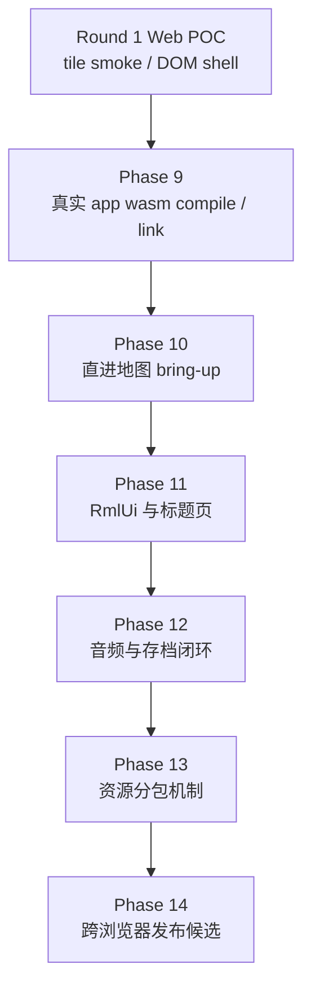

# 2026-06-02 Web Release 第二轮 Gameplay WASM 迁移计划

## 元信息

- 目标分支：`web-release`
- 计划状态：`Ready for Phase 9`
- 前置基线：第一轮 Phase 0-8 已完成，Web POC walking skeleton 可重复构建、预览和 gate。
- 第二轮目标：从 tile smoke / DOM shell 走向浏览器内可玩的真实 gameplay demo。
- 首版策略：单线程、完整 `engine/game` 最小子集、真实地图渲染与移动、RmlUi 基础 UI、IDBFS 存档闭环。

## 审阅采纳

Claude 的审阅意见整体合理，尤其是 Phase 10 / Phase 11 顺序问题。当前 `TitleScene` 加载 `ui/rmlui/scenes/title.rml`，并通过 `RmlUiRuntime` 和 `RmlDocumentController` 绑定 `start/load/menu/exit` 事件。因此在 RmlUi 恢复前要求“点击标题页开始游戏”会把真实渲染管线 bring-up 和 RmlUi bring-up 两个风险源耦合。

本计划采纳以下修改：

- Phase 10 改为绕过标题页，使用临时 dev boot 直接进入 `home_exterior`，只验证真实 `GlRenderer`、`MapManager`、输入、移动和相机。
- Phase 11 再恢复 RmlUi，并把标题页、hotbar、暂停菜单、存档 UI 放在同一 UI 恢复阶段。
- Phase 9 不再把 feature gates 当作待建能力，而是把它们作为已有基础，重点改成 Emscripten 下编译、链接、依赖隔离和 source audit。
- 不新增 `src/web/web_game_main.cpp`。`src/main.cpp` 已是桌面/Web 共用的 SDL3 callback 入口，第二轮应避免制造双入口漂移。
- Phase 13 增加运行时分包加载机制决策，不只定义资源包边界。
- Phase 14 明确 COOP / COEP 只 gate pthreads 变体，不 gate 单线程 demo。

## 实现思路

第二轮不再扩展独立 `src/web` walking skeleton，而是把真实游戏运行时逐步纳入 Web 构建。推进方式采用“可链接子集优先”的路线：先让 `engine` / `game` 静态库在 Emscripten 下可编译链接，再用现有 SDL3 callbacks 启动真实 `GameApp`，随后分阶段恢复地图、RmlUi、音频、存档、资源分包和发布验证。

当前已有基础：

- `src/main.cpp` 已使用 `SDL_MAIN_USE_CALLBACKS`、`SDL_AppInit`、`SDL_AppIterate`、`SDL_AppEvent`、`SDL_AppQuit`。
- `GameApp` 已拆出 `init()`、`tickFrame()`、`handleSdlEvent()`、`shutdown()`。
- callbacks 模式已通过 `EventPumpMode::ExternalCallbacks` 避免每帧再次 `SDL_PollEvent`。
- Web 单线程策略已存在，`SystemScheduler::parallelThreadPool()` 在无线程配置下返回 `nullptr`。
- `MapManager` 已具备同步 preload 路线，可用于单线程 Web。
- IDBFS smoke、WebGL2 shader 边界和 release gate 已建立。
- `web-poc-assets` manifest 已稳定，当前首屏 `.data` 为 274 个文件。

核心改造点：

- 取消 `TF_BUILD_WEB` 下顶层 CMake 早退，把 Web target 从独立 skeleton 切换为真实 app target。
- 让依赖查找区分 native / wasm，避免 Web cross-build 链到 `prebuilt/` native 库。
- 将桌面 OpenGL、RmlUi GL3 loader、FreeType/HarfBuzz、MiniAudio、Lua、spdlog 等依赖逐个收敛到 wasm 可编译配置。
- 用 feature flag 保护未恢复能力：Debug UI、RmlUi、Effekseer、高级后处理、pthreads、工具目标默认关闭。

## 需要新增的文件

- `cmake/WebDependencies.cmake`
  - 管理 Emscripten 下 SDL3、Lua、RmlUi、FreeType/HarfBuzz、MiniAudio 等依赖策略。
- `cmake/WebRuntime.cmake`
  - 集中 Web link flags、异常策略、runtime feature flags、preload / package 设置。
- `src/engine/platform/web_audio_unlock.h`
- `src/engine/platform/web_audio_unlock.cpp`
  - 封装浏览器用户手势音频解锁状态，供 `AudioPlayer` 或启动 UI 使用。
- `src/engine/platform/web_filesystem_sync.h`
- `src/engine/platform/web_filesystem_sync.cpp`
  - 封装启动 sync、保存后 sync 和错误上报，避免 IDBFS 调用散落业务代码。
- `src/engine/render/opengl/web_gl_capabilities.h`
- `src/engine/render/opengl/web_gl_capabilities.cpp`
  - 将第一轮 DOM shell 的 WebGL feature probe 下沉到引擎层。
- `tools/web_release/package_web_assets.py`
  - 生成首屏包、地图包、音频包和压缩体积摘要。
- `tools/web_release/web_smoke.py`
  - 串联本地 server 与浏览器 smoke 的自动化入口。若 Browser 插件覆盖足够，可改为仅记录命令。
- `tests/engine/web_game_target_source_test.cpp`
  - 保护 Web target 不回退到 skeleton、不链接 pthreads、不启用桌面 GL / ImGui / SDL3_image 依赖。
- `plans/reports/2026-06-02-web-release-phase-9-report.md`
  - 后续每个 phase 延续报告记录。

明确不新增：

- 不新增 `src/web/web_game_main.cpp`。Web gameplay target 复用现有 `src/main.cpp` callback 入口。
- Phase 10 的直进地图 dev boot 优先通过 `game_entry.cpp` 中的编译期开关或小型 scene setup helper 完成；只有实现明显膨胀时再新增独立 helper 文件。

## Phase 9：真实 gameplay wasm target 编译与链接

目标：让 Web 构建编译并链接真实 `engine`、`game` 和现有 callback 入口。此阶段重点不是新增 feature gates，而是验证已有 gate 在 Emscripten 下足够干净，并消除 native-only 依赖。

实施步骤：

1. 调整顶层 CMake Web 路线。
   - 去掉 `TF_BUILD_WEB` 下 `add_subdirectory(src/web)` 后立即 `return()` 的结构。
   - 保留 `src/web` walking skeleton 为可选 smoke target，例如 `TF_BUILD_WEB_SKELETON=ON`。
   - 默认 Web target 改为真实 `${TARGET}`，链接 `game`。
2. 新增 Web 依赖模块。
   - `EMSCRIPTEN` 下不设置 native `CMAKE_PREFIX_PATH`。
   - SDL3 使用 Emscripten port 或已验证 wasm 来源。
   - 不链接 `SDL3_image::SDL3_image`，保留 stb_image 路径。
   - Lua、RmlUi、FreeType、HarfBuzz 逐个确认 wasm build source。
3. 固化 WebRuntime 设置。
   - 明确异常策略。首选 no-exception 构建；若第三方必须捕获异常，再单独评估 `-fwasm-exceptions`。
   - 集中 `-sMIN_WEBGL_VERSION=2`、`-sMAX_WEBGL_VERSION=2`、filesystem、memory、single-thread flags。
   - 单线程 gate 不允许 `-pthread`、`USE_PTHREADS`、`PTHREAD_POOL_SIZE`。
4. 审计 debug / desktop-only 源码。
   - 所有 ImGui include 和 `ImGui::` 调用必须只在 `ENABLE_DEBUG_UI` 源文件或宏保护内出现。
   - `TF_BUILD_WEB` 默认关闭 Debug UI、RmlUi debugger、Effekseer、tools、tests、learn。
   - `GL_FRAMEBUFFER_SRGB`、float framebuffer、Bloom、emissive pass 必须有 WebGL2 平台 gate。
5. 编译真实 app。
   - 先解决 compile errors，再解决 link errors。
   - 每个修复优先落在跨平台抽象或 feature gate，不新增长期 Web-only 业务分叉。
6. 保持第一轮 gate。
   - `validate_web_release.py` 增加真实 app target 检查。
   - 确认 `.html/.js/.wasm/.data` 仍可生成。

验收标准：

- `TF_BUILD_WEB=ON` 默认构建真实 gameplay wasm target。
- Web configure 不查找 native OpenGL、GLAD、SDL3_image prebuilt。
- wasm link 成功，产出 `.html/.js/.wasm/.data`。
- 单线程 build flags 干净，不含 pthreads 发布要求。
- native Debug 构建和完整 `ctest` 仍通过。

## Phase 10：直进地图与真实 GlRenderer bring-up

目标：在不依赖 RmlUi 的情况下，浏览器中直接进入 `home_exterior`，验证真实 `GlRenderer`、地图加载、输入、玩家移动和相机。这一阶段刻意绕开标题页和菜单。

实施步骤：

1. 增加 Web dev boot 模式。
   - 使用编译期开关或启动配置让 `game::createApp()` 注册直进地图 scene setup。
   - 直接创建 `GameScene` 并加载 `home_exterior`。
   - 保持 `src/main.cpp` 为唯一入口。
2. 临时关闭 RmlUi 依赖。
   - 增加或复用 `TF_WEB_ENABLE_RMLUI=OFF` 之类 feature gate。
   - `GameApp::initRmlUi()` 和依赖 `RmlUiRuntime` 的场景 UI 在此模式下走 no-op 或跳过。
   - 只验证引擎级地图、渲染、输入和移动。
3. 真实渲染管线 bring-up。
   - 运行完整 `GLRenderer` 的 scene / lighting / composite 基础路径。
   - WebGL2 下保护 `GL_FRAMEBUFFER_SRGB`，避免默认 framebuffer sRGB 在浏览器产生 GL error。
   - Bloom、emissive float pass 和 VFX pass 默认关闭或降级。
   - shader runtime rewrite 和 precision 注入必须覆盖真实 shader assets。
4. 恢复地图和移动。
   - `MapManager` 在单线程 Web 下走同步加载。
   - `home_exterior.tmj`、tileset、基础角色贴图必须来自 preload manifest。
   - SDL3 callbacks 下键盘、鼠标、gamepad 基础事件进入 `InputManager`。
5. 建立浏览器 smoke。
   - 断言 canvas 非空且帧持续变化。
   - 通过引擎日志、debug overlay 或测试 hook 断言 map id、玩家坐标或移动前后位置。
   - 不依赖 RmlUi 文本或标题页按钮。

验收标准：

- 浏览器中直接进入 `home_exterior`。
- 玩家可移动，画面无 WebGL error flood。
- 真实 `GLRenderer` 基础 pass 可在 WebGL2 下运行。
- 刷新后仍能重新进入 dev map boot。
- 失败时 release gate 输出明确的渲染、资源或输入诊断。

## Phase 11：RmlUi 基础 UI 与标题页恢复

目标：恢复真实 RmlUi runtime，并将 Phase 10 的 direct boot 切回标题页入口。标题页、hotbar、暂停菜单和存档选择在同一阶段恢复。

实施步骤：

1. 适配 RmlUi GL3 backend。
   - `RMLUI_GL3_CUSTOM_LOADER` 在 Web 下改用 `engine/platform/gl_platform.h` 或 GLES3 入口。
   - 避免包含 desktop-only `glad/glad.h`。
2. 适配字体路径。
   - FreeType / HarfBuzz 在 wasm 下可编译。
   - 默认字体和 fallback 字体来自 preload manifest。
3. 恢复标题页。
   - `TitleScene` 可加载 `ui/rmlui/scenes/title.rml`。
   - `start/load/menu/exit` data event 绑定可用。
   - 点击 `Start` 可进入现有新游戏流程。
4. 恢复游戏内基础 UI。
   - hotbar 可显示。
   - 暂停菜单可打开、关闭并回到游戏。
   - 存档选择 UI 可加载，保存功能可先延后到 Phase 12。
5. 缩小 DOM shell。
   - DOM shell 仅保留发布 debug overlay 或紧急 fallback。

验收标准：

- 浏览器中能从标题页点击进入游戏。
- 游戏中 hotbar 可显示。
- 暂停菜单可打开、关闭，并返回游戏。
- RmlUi 资源缺失会在 console / log 中给出文件路径。

## Phase 12：音频、存档与玩法闭环

目标：恢复可感知玩法闭环：用户点击后音频可播放，存档 UI 可保存，刷新后可加载。

实施步骤：

1. 浏览器音频解锁服务。
   - 用户手势后初始化或 resume 音频设备。
   - 确认 MiniAudio Emscripten Web Audio 后端在无 `-pthread` 下初始化成功。
   - `AudioPlayer` 初始化失败时不阻塞游戏主路径。
2. 恢复音效和 BGM。
   - 先恢复 `pop.mp3` 和标题/地图 BGM。
   - 音频加载错误必须可诊断。
3. 存档写入 persistent root。
   - 默认配置仍从 readonly package 读取。
   - 存档和用户设置写入 `/persistent`。
4. 保存后 sync。
   - 保存完成后显式 IDBFS sync。
   - 刷新页面后通过存档 UI 读取同一 slot。
5. 浏览器 smoke。
   - 新游戏进入地图。
   - 打开暂停菜单保存。
   - 刷新页面。
   - 加载 slot 并回到地图。

验收标准：

- 首次用户点击后音频状态为 Ready。
- MiniAudio Web Audio 后端在单线程构建下可用。
- 保存 slot 文件写入 persistent root。
- 刷新后存档 UI 能读取并加载 slot。
- 保存和 sync 失败有用户可见提示或 debug overlay 记录。

## Phase 13：资源分包与运行时加载机制

目标：把单个 20.8 MiB `.data` POC 包拆成可发布的分包路线，并先明确运行时加载机制。

实施步骤：

1. 技术决策。
   - 在独立 Emscripten data package 与自定义 `fetch` + `FS.writeFile` 之间做一次小型 spike。
   - 选择标准是加载时序可控、错误可诊断、资源路径仍能被 C++ filesystem 读取。
   - 包就绪必须有明确 gate，地图或音频加载前先等待对应 package ready。
2. 定义包边界。
   - `boot`: html/js/wasm、config、标题页、基础字体。
   - `shared-ui`: RmlUi theme、hotbar、pause、save UI。
   - `home-map`: home exterior/interior 地图、tileset、角色基础贴图。
   - `audio-core`: pop、标题 BGM、地图 BGM。
3. 生成包 manifest。
   - `package_web_assets.py` 从 `web-poc-assets` 和资源引用关系生成分包清单。
   - 输出原始大小、gzip、brotli 估算或实际文件。
4. 实现懒加载。
   - 首屏只加载 boot 包。
   - 进入地图前加载 `home-map`。
   - 音频可在用户点击后加载或延迟播放。
   - 可选将已下载包缓存到 IDBFS，减少二次进入下载等待。
5. 加载指标和 gate。
   - 记录首屏 Running 时间。
   - 记录标题页可交互时间。
   - 记录首次进入地图时间。
   - 校验 boot 包小于当前单包。

验收标准：

- boot 包显著小于当前 20.8 MiB 单包。
- 浏览器 smoke 能按需加载 `home-map`。
- release report 记录原始 / gzip / brotli 体积和加载耗时。
- 资源缺包时错误可定位到 package 和 asset path。

## Phase 14：跨浏览器发布候选

目标：形成可交付的 Web demo 发布候选，覆盖 Chromium 和 Safari。

实施步骤：

1. Chromium 自动 smoke。
   - 构建、gate、本地 server、浏览器自动流程串成单命令。
   - 覆盖标题页、地图、移动、菜单、保存、刷新加载。
2. Safari 手工 smoke。
   - 记录 Safari 版本、WebGL2 状态、音频策略、IndexedDB 行为。
   - 如 Safari 有限制，建立专门兼容任务。
3. 发布产物检查。
   - MIME、cache header、gzip/brotli。
   - COOP / COEP 只作为 pthreads 变体 gate，不作为单线程 demo gate。
   - 单线程和未来 pthreads 产物分开。
4. 禁用项记录。
   - Effekseer、Bloom、高级后处理、完整战斗、全地图资源是否恢复。
   - 每个禁用项给出恢复路线和风险。
5. 文档和交付说明。
   - 更新 plans report。
   - 增加 Web demo 运行说明。

验收标准：

- 从 clean checkout 执行固定命令生成 Web demo。
- Chromium 完整 smoke 通过。
- Safari 手工 smoke 通过或有明确阻塞记录。
- 单线程 demo 不依赖 COOP / COEP。
- 产物体积、加载耗时、禁用项和恢复路线全部记录。

## 第二轮待办清单

- [ ] 新增 `cmake/WebDependencies.cmake`，隔离 wasm 依赖来源。
- [ ] 新增 `cmake/WebRuntime.cmake`，集中 Web link flags、异常策略和 runtime feature gates。
- [ ] 保留 walking skeleton 为可选 smoke target，默认 Web target 改为真实 gameplay wasm。
- [ ] 不新增 Web gameplay main，复用 `src/main.cpp` SDL3 callbacks 入口。
- [ ] 让 `engine` 在 `EMSCRIPTEN` 下编译，不依赖 native OpenGL / GLAD / SDL3_image。
- [ ] 让 `game` 在 `EMSCRIPTEN` 下编译，禁用 Debug UI / Effekseer / pthreads。
- [ ] 审计 ImGui include 和调用，确认全部在 Debug UI gate 后。
- [ ] 审计 `GL_FRAMEBUFFER_SRGB`、float framebuffer、Bloom、emissive pass 的 WebGL2 gate。
- [ ] 浏览器启动真实 `GameApp`，通过 direct map boot 进入 `home_exterior`。
- [ ] 键盘输入和玩家移动在浏览器中可用。
- [ ] 真实 `GlRenderer` 基础 pass 在 WebGL2 下运行且无 GL error flood。
- [ ] RmlUi 标题页、hotbar、暂停菜单和存档 UI 基础恢复。
- [ ] 标题页按钮可点击并进入真实游戏流程。
- [ ] 音频用户手势解锁接入真实 `AudioPlayer` 路径。
- [ ] 确认 MiniAudio Web Audio 后端在无 `-pthread` 下可初始化。
- [ ] 保存 slot 写入 `/persistent` 并在刷新后读取。
- [ ] 决定运行时资源包加载机制。
- [ ] 拆分 boot / shared-ui / home-map / audio-core 资源包。
- [ ] release gate 覆盖真实 gameplay target、分包 manifest 和浏览器 smoke。
- [ ] Chromium 自动 smoke 覆盖标题页、地图、移动、菜单、保存、刷新加载。
- [ ] Safari 手工 smoke 记录并形成发布候选报告。

## 风险与应对

| 风险 | 影响 | 应对 |
|------|------|------|
| RmlUi / FreeType / HarfBuzz wasm 编译阻塞 | 标题页和菜单无法恢复 | Phase 10 先 direct map boot，不把 UI 和渲染风险耦合 |
| 真实 GlRenderer 首次跑 WebGL2 | 地图渲染异常或黑屏 | Phase 10 单独 bring-up，先关 Bloom / emissive / VFX |
| `GL_FRAMEBUFFER_SRGB` 或 float FBO 在 WebGL2 报错 | console error flood 或黑屏 | 平台 gate 加 source test，浏览器 smoke 查 console |
| native prebuilt 被 Web 构建误用 | configure 或 link 失败 | `WebDependencies.cmake` 明确隔离依赖查找路径 |
| ImGui 源文件泄漏到 Web target | compile 或 link 失败 | Phase 9 做 source audit，Debug UI 默认关闭 |
| MiniAudio 浏览器策略复杂 | 音频初始化失败 | 用户手势解锁服务先行，验证无 pthreads Web Audio 后端 |
| 单包资源启动慢 | 首屏等待过长 | Phase 13 先决定 runtime package loader，再拆 boot / map 包 |
| IDBFS sync 时序不稳定 | 刷新后存档丢失 | 保存后显式 sync，并在 smoke 中验证刷新加载 |
| 真实 app target 改动面大 | native 回归风险 | 每个 phase 必跑 native build 和完整 ctest |

## 当前无待澄清问题

计划按“真实 gameplay wasm 最小可玩路径”推进。第二轮 Phase 9 的下一步应从 CMake Web 早退拆除和真实 `engine/game` wasm 编译链接开始。
