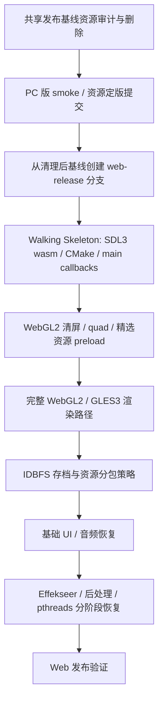

# 2026-06-02 Web Release WebAssembly 迁移计划

## 元信息
- 目标分支：`web-release`
- 状态：`Phase 4 WebGL2 Tile Smoke Implemented`
- 目标平台：浏览器 WebAssembly + WebGL2
- 首版策略：单线程、WebGL2、资源包精简、基础玩法闭环
- 当前工具链：`emsdk latest` 已安装到 `~/.local/emsdk`，当前解析版本为 `5.0.7`
- Phase 0/1 实施记录：`plans/reports/2026-06-02-web-release-phase-0-1-report.md`
- Phase 2 实施记录：`plans/reports/2026-06-02-web-release-phase-2-report.md`
- Phase 3 实施记录：`plans/reports/2026-06-02-web-release-phase-3-report.md`
- Phase 4 实施记录：`plans/reports/2026-06-02-web-release-phase-4-report.md`

## 结论与范围收敛
当前项目可以迁移到 WebAssembly/WebGL2，但不适合直接把桌面端构建一键搬到网页端。审阅后调整为“先在共享发布基线定版资源，再切 `web-release`，随后尽快点亮 Web walking skeleton”的路线：

- 资源审计继续放在前置阶段，而且应在创建 `web-release` 前完成。这样 PC 发布线和 Web 发布线共享同一份清理后的资产基线，避免将来主分支为了 PC 发布再做一轮重复审计与删除。
- 资源删除不再被视为“Web 可行性验证”的前置技术条件。真正的移植未知数仍是 SDL3 wasm 构建、主循环反转、WebGL2 渲染路径和持久化。
- Web 首包优化不等同于删除资源。POC 期只 preload 精选资源子集，生产期再设计分包、懒加载、压缩和缓存策略。

首版 Web POC 不追求完整恢复桌面端全部能力，暂缓以下内容：

- Debug UI / tools / learn / native tests 的 wasm 构建。
- pthreads 线程版构建。
- Bloom、复杂后处理和高级 VFX。
- 完整发布页、CDN、Brotli/gzip 预压缩和 IndexedDB 二次缓存策略。

## 当前基线

| 项目 | 现状 | 迁移影响 |
|------|------|----------|
| 主循环 | `GameApp::run()` 是阻塞式 while 循环 | Web 端需要每帧回到浏览器事件循环 |
| 渲染 | OpenGL 3.3 Core + GLAD + `#version 330 core` shader | 需要 GLES3/WebGL2 路径和 shader 变体 |
| 资源 | `assets` 约 74M，约 5440 个文件，其中 PNG 约 5092 个 | 必须先审计未使用资源，并用 preload manifest 打包 |
| 存档 | 当前写 `saves/slotN.json` | Web 端需迁到 IDBFS 或 SDL persistent path |
| 线程 | 存在 `std::jthread`、线程池、异步预加载、异步存档 | 首版禁用并行和异步 I/O，后续单独恢复 |
| UI/VFX | RmlUi GL3 接法偏桌面，Effekseer 当前创建 OpenGL3 backend | 先跑基础 UI，VFX 延后切 GLES3 |
| 调度器 | `ParallelWaveScheduler` 在 `thread_pool_ == nullptr` 时已有 inline 串行路径 | Web 单线程主要是不创建线程池和关闭异步预加载，不需要重写调度器 |
| SDL3_image | 顶层 CMake 当前硬链 `SDL3_image::SDL3_image`，但纹理与项目 RmlUi 接口已有 stb_image 路径 | Web 端优先确认是否可移除 SDL3_image 依赖，减少 cross-build 风险 |
| wasm 环境 | `emsdk` 已安装并激活到本机 emsdk 配置 | 每个 shell 需 source `emsdk_env.sh`，尚未写入 shell profile |

计划制定时的资源体积粗略基线：

| 路径 | 大小 |
|------|------|
| `assets` | 74M |
| `ui` | 528K |
| `scripts` | 64K |
| `config` | 24K |

Phase 1 清理后的资源体积基线：

| 路径 | 大小 |
|------|------|
| `assets` | 29M |
| `ui` | 288K |
| `scripts` | 64K |
| `config` | 24K |

## 迁移主线



## Phase 0：wasm 环境与分支时机

目标：准备本地 Emscripten 工具链，并明确 `web-release` 分支必须从资源清理后的共享发布基线创建。

已完成：

- 克隆 `emsdk` 到 `~/.local/emsdk`。
- 执行 `./emsdk install latest`，解析版本为 `5.0.7`。
- 执行 `./emsdk activate latest`。
- 验证 `emcc`、`em++`、`emcmake` 可用。
- 验证本机 `cmake` 和 `ninja` 可用。
- 本机 `emcc --show-ports` 可见 `sdl3`，但未见 `sdl3_image`；Web 端应优先确认是否不再需要 SDL3_image。

当前可以随时执行的环境激活命令：

```bash
source "$HOME/.local/emsdk/emsdk_env.sh"
```

不要在 Phase 1 资源审计与删除完成前创建 `web-release`。资源清理、PC 版 smoke 和资源定版提交完成后，再执行：

```bash
git switch -c web-release
```

如果希望以后每个新 shell 自动带上 wasm 工具链，可以手动追加：

```bash
echo 'source "$HOME/.local/emsdk/emsdk_env.sh"' >> "$HOME/.zprofile"
```

资源审计完成后、进入项目级 Web CMake 前，先做一个 SDL3 最小 wasm 试编译：

- 只初始化 SDL3、创建 WebGL2/GLES3 context、清屏。
- 使用当前 `emsdk 5.0.7` 和项目计划采用的 SDL3 来源。
- 目标是前移验证“SDL3 wasm 支持 + 当前 CMake 接入方式”这个头号风险。
- 该试编译不需要项目资源，也不需要接入完整引擎。

验收标准：

- `command -v emcc em++ emcmake` 都指向 `~/.local/emsdk/upstream/emscripten`。
- `em++ --version` 显示 Emscripten `5.0.7`。
- 资源审计前仍留在当前共享发布基线，不提前切到 `web-release`。
- Phase 1 完成后，从清理后的基线创建 `web-release`。
- SDL3 最小 wasm 试编译能产出浏览器可打开的 `.html/.js/.wasm`，或明确记录阻塞原因。

## Phase 1：共享发布基线资源审计与删除

目标：在创建 `web-release` 前，先把 PC/Web 发布都需要的实际资源集合定版。此阶段解决“哪些资源属于发布资产”的问题；Web 首包大小还需要后续 preload 子集、分包、压缩和缓存策略共同解决。

实施步骤：

1. 建立资源引用清单。
   - 扫描 `config/` 中的资源映射、渲染配置、音频配置、字体配置。
   - 扫描 `assets` 下的 world / map / tileset 链路，例如 `.world`、`.tmj`、`.tsj`。
   - 扫描 `ui` 下 `.rml`、`.rcss` 中引用的图片、字体、音效。
   - 扫描 `scripts` 与数据表中硬编码或配置化的资源 path。
   - 扫描 Effekseer 文件中引用的贴图、模型、材质。
2. 生成三份 manifest。
   - `used-assets`：当前发布资产全集。
   - `orphan-assets`：确定无引用或非发布用途资源。
   - `web-poc-assets`：首个 Web walking skeleton 使用的精选子集，例如标题页、一个地图、必要 tileset、基础 UI、一个字体、少量音频。
   - 优先用结构化解析 JSON / TMJ / TSJ / RML / RCSS。
   - 对 Lua 和文本配置可用保守字符串扫描辅助，但删除前必须人工抽查。
3. 将未使用资源分批删除。
   - 第一批：确定无引用的图片、旧草稿、重复素材。
   - 第二批：未接入玩法的 VFX、临时音频、大体积字体。
   - 第三批：仅课程演示或工具使用的资源，必要时移动到非 Web 打包目录。
4. 建立 Web 资源预算。
   - 记录磁盘体积、preload `.data` 候选体积、文件数量。
   - 记录纹理数量、最大纹理尺寸、估算 GPU 纹理内存。
   - 低端/移动浏览器不保证常见桌面压缩纹理格式可用，PNG 磁盘体积不能代表运行时显存压力。
   - 后续评估图集、纹理尺寸上限、重复 tileset 合并和可选压缩纹理扩展。
5. 更新资源索引和课程说明。
   - 保证 `resource_mapping.json` 或后续 asset registry 能覆盖 Web POC 所需资源。
   - 在计划或资源审计报告中记录删除依据，避免误删后难以追溯。

验收标准：

- 原生分支构建通过，基础运行路径不缺贴图、字体、音频。
- 标题页、地图进入、战斗入口、菜单 UI 做一次人工 smoke。
- `used-assets` 与 `web-poc-assets` 都能被脚本稳定复现。
- Web POC 不使用 `--preload-file assets@/assets` 全量打包，而是使用 `web-poc-assets` manifest 生成精选 preload。
- `assets` 中删除的内容可以用 Git diff 清晰审阅。
- 资源清理结果先进入共享发布基线；随后再从该基线创建 `web-release`。

## Phase 2：Web Walking Skeleton 与 Emscripten CMake 骨架

目标：在资源定版后，尽快证明项目能在浏览器中点亮最小可运行骨架：SDL3 初始化、WebGL2/GLES3 context、非阻塞主循环、清屏/quad、精选资源 preload。

实施步骤：

1. 先做 SDL3 最小 wasm 冒烟。
   - 只创建窗口和 WebGL2/GLES3 context，渲染清屏色。
   - 优先验证 `emsdk 5.0.7`、SDL3 来源、CMake 生成器和浏览器打开方式。
   - 失败时先解决 SDL3/CMake 问题，不把完整引擎接入复杂化。
2. 增加 Web 构建选项。
   - `TF_BUILD_WEB=ON` 或直接使用 `if(EMSCRIPTEN)` 分支。
   - Web 默认关闭 `BUILD_TOOLS`、`BUILD_TESTING`、`BUILD_LEARN`、Debug UI。
   - Web 默认关闭并行、异步预加载、高级 VFX、Bloom。
3. 隔离桌面 OpenGL。
   - `EMSCRIPTEN` 下不调用 `find_package(OpenGL)`。
   - `EMSCRIPTEN` 下不链接桌面 GLAD。
   - 新增统一 GL 头文件入口，例如 `gl_platform.h`。
4. 处理依赖来源。
   - 优先确认 SDL3 的 wasm 构建来源和 CMake 接入方式。
   - Web 端优先尝试移除 `SDL3_image::SDL3_image`，因为项目纹理加载和自定义 RmlUi render interface 已有 stb_image 路径；若仍需 SDL3_image，再单独 cross-build。
   - Lua、Sol2、EnTT、glm、nlohmann-json、spdlog 等 header 或普通 C/C++ 依赖走 wasm 编译。
   - FreeType / HarfBuzz / MiniAudio / RmlUi / Effekseer 逐个确认 wasm 编译开关。
   - 避免 Web cross build 误用 `prebuilt/` 或 `$HOME/.local` 里的 native 库。
5. 设置初始 link flags 和决策项。
   - `-sMIN_WEBGL_VERSION=2`
   - `-sMAX_WEBGL_VERSION=2`
   - `-sALLOW_MEMORY_GROWTH=1`
   - `-sSTACK_SIZE=1048576` 作为 POC 起点，后续按实际栈占用调小或调大。
   - `-sINITIAL_MEMORY=134217728` 作为 POC 起点，配合内存增长；正式值根据资源预算和浏览器指标重定。
   - 使用 IDBFS 或 JS 侧 `FS` API 时增加 `-sFORCE_FILESYSTEM=1` 和 `-lidbfs.js`。
   - 异常策略必须显式决策：先审计 RmlUi / nlohmann-json / 第三方容器是否会编译或捕获异常；若可禁用，使用 no-exception 构建；若必须支持捕获，评估 `-fwasm-exceptions` 的兼容性和包体成本。
   - 不使用 Asyncify 作为主循环方案。
6. 设置精选资源 preload。
   - 不使用 `--preload-file assets@/assets` 全量 preload。
   - 使用 Phase 1 的 `web-poc-assets` manifest 生成 preload 参数。
   - 例：`--preload-file <poc-assets-dir>@/assets`，或由 file packager 生成独立 `.data/.js`。
   - `ui`、`scripts`、`config` 只打包 POC 需要的文件。

建议首个配置命令：

```bash
source "$HOME/.local/emsdk/emsdk_env.sh"
emcmake cmake -S . -B build/web-release -G Ninja \
  -DCMAKE_BUILD_TYPE=Release \
  -DTF_BUILD_WEB=ON \
  -DBUILD_TOOLS=OFF \
  -DBUILD_TESTING=OFF \
  -DBUILD_LEARN=OFF
cmake --build build/web-release
```

验收标准：

- `build/web-release` 使用 Emscripten toolchain。
- CMake configure 不再查找桌面 `OpenGL::GL`。
- wasm link 阶段产出浏览器可加载的 `.html/.js/.wasm/.data`。
- `.data` 来自 `web-poc-assets` 精选清单，而不是整个 `assets` 目录。
- 浏览器中至少能创建画布、清屏并绘制一个基础 quad。

## Phase 3：主循环拆分

目标：把桌面阻塞循环改成可由浏览器驱动的帧函数，并优先采用 SDL3 main callbacks 统一桌面/Web 生命周期。

实施步骤：

1. 将 `GameApp::run()` 拆成：
   - `init()`：窗口、渲染、资源、场景初始化。
   - `tickFrame()`：执行一帧事件采样、时间推进、场景更新、渲染提交。
   - `shutdown()`：资源释放和日志收尾。
2. 优先采用 SDL3 main callbacks。
   - 在单一入口源文件启用 `SDL_MAIN_USE_CALLBACKS`。
   - `SDL_AppInit` 创建并初始化 `GameApp`，通过 `appstate` 保存生命周期对象。
   - `SDL_AppIterate` 调用 `tickFrame()`，每次尽快返回。
   - `SDL_AppQuit` 调用 `shutdown()` 并释放 `appstate`。
   - 桌面端和 Web 端共用 callbacks；如改动过大，再退回桌面 while loop + Web `emscripten_set_main_loop_arg` 的双 driver。
3. 重接输入事件。
   - callbacks 模式下，`SDL_AppEvent` 接收 SDL 事件并喂给 InputManager。
   - 当前 `InputManager::sampleInputEvents` 的 `SDL_PollEvent` 路径保留给非 callback driver 或过渡期。
   - 避免在 callbacks 模式下同时由 SDL 和 InputManager 双重 poll。
4. Web 端生命周期约束。
   - App 对象使用 `appstate` / heap / static 生命周期，不能是 `main()` 栈上临时对象。
   - 每帧函数必须快速返回。

验收标准：

- 桌面端行为不回退。
- Web 端主循环不阻塞浏览器事件循环。
- 关闭和异常退出路径不会在 Web 端提前析构 GL 资源。
- callbacks 模式下输入事件没有重复消费或丢失边沿输入。

## Phase 4：WebGL2 / GLES3 渲染路径

目标：把当前 OpenGL 3.3 渲染管线收敛到 WebGL2 兼容子集。

实施步骤：

1. 建立 GL 平台抽象。
   - 桌面端继续走 GLAD + OpenGL 3.3。
   - Web 端包含 GLES3/WebGL2 对应头文件。
2. 调整 context 配置。
   - Web 端请求 GLES3 / WebGL2。
   - Web 端忽略桌面 Core Profile 专属配置。
3. 处理 shader 版本。
   - 桌面 shader 保留 `#version 330 core`。
   - Web shader 使用 `#version 300 es`。
   - fragment shader 增加 `precision mediump float;` 或更明确 precision。
4. 逐项清点 WebGL2 风险点。
   - `GL_FRAMEBUFFER_SRGB` 先 feature-gate；关闭它会改变 gamma/明暗观感，只能作为 POC 降风险手段。
   - 最终需要在 sRGB texture format、framebuffer sRGB 支持和 shader 内手动 gamma 之间做明确决策。
   - `GL_RGB16F` / `GL_RGBA16F` 相关 Bloom 与 emissive pass 先关闭。
   - sRGB texture internal format 先确认 WebGL2 支持和扩展行为。
   - VAO、FBO、texture unit、blend state 做浏览器 smoke。

验收标准：

- Web 端可清屏、绘制基础 quad、绘制地图 tiles。
- shader 编译错误能输出到浏览器 console 或日志。
- 关闭 Bloom / 高级 VFX 后主地图视觉可接受，并记录 sRGB/gamma 临时偏差。

## Phase 5：虚拟文件系统、资源包策略与存档

目标：让资源读取和用户数据写入适配浏览器虚拟文件系统。

实施步骤：

1. POC 资源包。
   - 只 preload Phase 1 的 `web-poc-assets` 精选资源。
   - 资源目录在 Web 端挂载到 `/assets`、`/ui`、`/scripts`、`/config`。
   - 保留桌面端相对路径读取能力。
   - 明确禁止把完整 `assets` 目录作为首版 `--preload-file` 输入。
2. 生产资源包策略。
   - 按标题页、共享 UI、地图区域、战斗/VFX、音频等拆分 data package。
   - 使用 file packager 或自定义 fetch 流程，让非首屏资源按需加载。
   - 使用 `Module.locateFile` 或发布配置把 `.data` 放到稳定 URL/CDN。
   - 对 `.data`、JSON、TMJ、TSJ、脚本和文本资源做 gzip/Brotli 预压缩，并配置正确 MIME 与 `Content-Encoding`。
   - 评估 IndexedDB 缓存已下载资源包，让二次进入减少下载等待。
3. 用户数据。
   - Web 端把存档、设置、输入绑定写到 persistent root，例如 `/persistent`。
   - 使用 IDBFS 或 SDL persistent path。
   - 如果采用 SDL 自动 persistent path，构建 SDL 时设置 `SDL_EMSCRIPTEN_PERSISTENT_PATH`，并确保应用 link `-lidbfs.js`。
   - 如果 JS 侧手动 `FS.mount(IDBFS)`，link 增加 `-sFORCE_FILESYSTEM=1` 和 `-lidbfs.js`。
   - 启动时先 mount + syncfs，再进入游戏初始化。
   - 保存后显式 syncfs，避免刷新页面丢档。
4. 配置写入。
   - Web 端避免向 preload 的 `/config` 写默认配置。
   - 默认配置从 readonly package 读取，用户覆盖写入 persistent root。

验收标准：

- 刷新浏览器后存档仍存在。
- 默认配置缺失时不会尝试写入 readonly preload package。
- 资源路径错误能在日志中快速定位。
- 首屏 preload `.data` 来自精选清单，且记录压缩前/压缩后体积。
- 非首屏资源能通过分包或懒加载路线逐步接入。

## Phase 6：单线程策略与后续 pthreads

目标：首版 Web 构建先去掉线程变量，确认玩法主路径稳定。

实施步骤：

1. 新增 Web 单线程编译开关。
   - 禁用 `std::jthread` 地图异步预加载。
   - `SystemScheduler` 不创建 `parallel_thread_pool_`，让 `ParallelWaveScheduler` 走已有 inline 串行回退路径。
   - 异步存档改成同步保存或主循环任务队列。
   - 不新增一套 Web 专用串行调度器，避免重复维护。
2. 保留后续 pthreads 路线。
   - 单独建立 `web-pthreads` 构建配置。
   - 添加 `-pthread`、worker pool、SharedArrayBuffer 相关设置。
   - 发布服务器必须提供 COOP / COEP header。
   - 线程版和非线程版分开产物，避免发布配置互相污染。

验收标准：

- 单线程 Web POC 无线程相关 link/runtime 错误。
- 串行调度下地图和基础交互可玩。
- 后续 pthreads 恢复点在代码中有明确 feature flag。
- `thread_pool_ == nullptr` 的调度回退路径有测试或 smoke 覆盖。

## Phase 7：UI、音频、Effekseer 和后处理恢复

目标：在基础 Web POC 跑通后，逐步恢复用户可感知能力。

恢复顺序：

1. RmlUi 基础 UI。
   - 处理 `RMLUI_GL3_CUSTOM_LOADER` 和 GL 头文件差异。
   - 优先验证标题页、菜单、对话框、存档 UI。
2. 音频。
   - 浏览器端必须等待用户手势后启动音频设备或 resume audio context。
   - MiniAudio 初始化失败时给出可诊断日志。
3. Effekseer。
   - 从 OpenGL3 backend 切到 OpenGLES3 / WebGL2 路径。
   - 先恢复少量关键特效，再恢复完整特效集。
4. 后处理。
   - Bloom 和 emissive pass 在确认 float render target 与扩展行为后恢复。

验收标准：

- UI 可输入、可点击、可回到游戏。
- 首次用户点击后音频可播放。
- Effekseer 关闭时游戏仍可完整运行；开启时无 WebGL error flood。

## Phase 8：发布验证与质量门

目标：形成可重复构建、可本地预览、可交付的 Web 发布流程。

实施步骤：

1. 本地预览。
   - 使用本地 http server 打开产物目录，避免直接 file 打开 wasm 失败。
   - 若启用 pthreads，server 需带 COOP / COEP header。
2. 浏览器 smoke。
   - 桌面 Chrome / Safari 至少各跑一次。
   - 验证标题页、地图进入、移动、菜单、保存、刷新恢复。
3. 自动化检查。
   - Web 构建 configure + build。
   - 原生构建回归。
   - 资源 manifest 检查。
   - shader variant 编译检查。
4. 发布记录。
   - 记录 wasm/js/data 文件大小。
   - 分别记录首屏 `.data`、后续资源包、压缩前后体积。
   - 记录首屏加载时间和首次进入地图时间。
   - 记录禁用项和恢复路线。

验收标准：

- 能从干净 checkout 执行固定命令构建 Web 产物。
- 浏览器中完成基础玩法闭环。
- 刷新页面后存档仍可读取。
- 首屏 preload 资源包小于发布资产全集，且有继续分包的路线。

## 主要风险与应对

| 风险 | 影响 | 应对 |
|------|------|------|
| SDL3 wasm 接入方式与当前 CMake 不匹配 | configure 或 link 阻塞 | Phase 2 优先做最小 SDL3 wasm 试编译 |
| 桌面 OpenGL 假设较多 | WebGL2 shader 或 FBO 报错 | 先关闭后处理和 VFX，逐项恢复 |
| native prebuilt 污染 cross build | 链接到 macOS 静态库导致失败 | `EMSCRIPTEN` 下隔离 `CMAKE_PREFIX_PATH` 和依赖查找 |
| 全量 preload 资源 | 首屏下载和启动过慢 | POC 使用 `web-poc-assets`，生产拆分 data package |
| PNG 数量和纹理尺寸过大 | 浏览器 GPU 显存不足或上传卡顿 | Phase 1 增加纹理预算，后续做图集和尺寸上限 |
| 异常策略不明确 | 包体增大或第三方编译失败 | Phase 2 明确 no-exception / wasm exceptions 决策 |
| SDL3_image cross-build 不稳定 | 额外依赖阻塞 Web 构建 | 优先使用 stb_image 路径，确认必要性后再引入 |
| 资源误删 | 原生和 Web 都缺资源 | 先 manifest、后删除；每批删除后 smoke |
| IDBFS sync 时序错误 | 刷新丢档 | 启动和保存后都建立明确 sync 点 |
| pthreads 发布条件复杂 | 浏览器运行失败 | 首版单线程；线程版单独产物 |

## 第一轮待办清单

- [ ] 创建并切换到 `web-release` 分支。
- [ ] 编写资源审计脚本，输出 `used-assets` / `orphan-assets` / `web-poc-assets` manifest。
- [ ] 删除第一批确定无引用资源，并做原生 smoke。
- [ ] 做 SDL3 最小 wasm 试编译，验证 WebGL2 context 和清屏。
- [ ] 增加 `EMSCRIPTEN` CMake 骨架，确保不查找桌面 OpenGL、不硬链 SDL3_image。
- [ ] 拆分 `GameApp::run()`，优先迁移到 SDL3 main callbacks。
- [ ] 建立 GLES3 shader 变体，先跑通基础 quad/map。
- [ ] 接入 `web-poc-assets` preload manifest 和 persistent save root。
- [ ] 形成第一版 Web POC 验收记录。

## 参考资料

- Emscripten File System API：https://emscripten.org/docs/api_reference/Filesystem-API.html
- Emscripten Packaging Files：https://emscripten.org/docs/porting/files/packaging_files.html
- Emscripten Deploying Pages：https://emscripten.org/docs/compiling/Deploying-Pages.html
- Emscripten Compiler Settings：https://emscripten.org/docs/tools_reference/settings_reference.html
- SDL3 README-main-functions：https://wiki.libsdl.org/SDL3/README-main-functions
- SDL3 README-emscripten：https://wiki.libsdl.org/SDL3/README-emscripten
