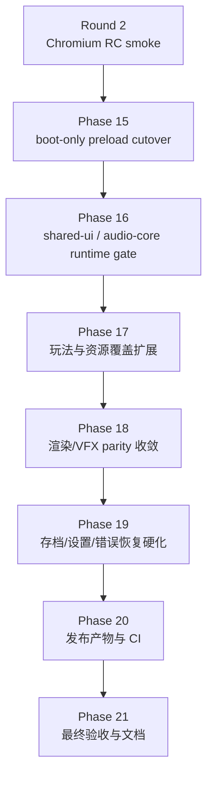

# 2026-06-03 Web Release 第三轮完整移植收敛计划

## 元信息

- 目标分支：`web-release`
- 计划状态：`In Progress`
- 前置基线：第二轮 Phase 9-14 已完成 Chromium 发布候选 smoke，真实 gameplay wasm target 可构建、运行、保存、刷新读档。
- 第三轮目标：完成 Chrome 单线程 Web demo 的正式发布收敛，移除 POC preload 形态，补齐运行时资源包、玩法路径、发布文档和自动化验收。
- 浏览器范围：Chrome / Chromium 为必须验收浏览器。Safari 暂不作为阻塞项。
- 首版发布策略：单线程、WebGL2、IDBFS、boot-only preload、运行时资源包、固定 Chromium smoke。

## 当前状态

第二轮已经证明 Web 移植的核心架构可行：

- `TF_BUILD_WEB=ON` 默认构建真实 `engine/game` target。
- `src/main.cpp` 是桌面和 Web 共用的 SDL3 callback 入口。
- Web 构建已隔离 native OpenGL / GLAD / SDL3_image / pthreads。
- RmlUi、FreeType、HarfBuzz、MiniAudio WebAudio、IDBFS 均已进入真实 wasm 路径。
- `home-map.tfpack` 已可按需加载，并通过 Chrome 自动 smoke。
- 保存 slot 可写入 `/persistent`，刷新后可从标题页 `Load` 回到地图。

第三轮当前进展：

- Phase 15 已完成 boot-only preload cutover：`TinyFarmRPG-Web.data` 已收敛到 2.9 MiB，link-time preload 使用 `web-release-boot.args`。
- Phase 16 已完成 runtime package registry：`shared-ui`、`home-map`、`audio-core` 都通过统一 registry gate，并被 Chrome smoke 观测到 `.tfpack` 响应。
- headed Chrome smoke 已在 boot-only `.data` 下通过，覆盖标题页、appearance、地图、移动、保存、刷新读档。

仍未完成的部分：

- Phase 17 尚未扩展完整 gameplay coverage，目前自动 smoke 仍主要覆盖标题页、appearance、地图、移动、保存和刷新读档。
- Chrome smoke 覆盖主路径，但尚未覆盖完整玩法面，例如室内外切图、inventory、dialogue、工具动作、战斗/商店/任务等。
- Effekseer、Bloom / HDR emissive、高级后处理仍处于关闭或降级状态。
- 发布说明、人工测试说明、产物打包、CI 接入和性能预算尚未形成最终版。

## 完成定义

第三轮完成后，项目应满足以下标准：

- clean checkout 下可用固定命令生成 Web release 产物。
- Chrome 中可人工游玩教学 demo 主流程，不依赖本地开发机特例。
- `.data` 只包含 boot 必需资源，主资源通过 `.tfpack` 按需加载。
- `shared-ui`、`home-map`、`audio-core` 至少三个运行时包都有真实加载 gate 和 smoke 覆盖。
- Chrome 自动 smoke 覆盖启动、标题页、appearance、地图、移动、交互、菜单、保存、刷新读档、资源包网络响应。
- release gate 校验产物、资源包、MIME/cache header、单线程 flags、体积预算和 console error。
- `docs` 中有完整 Web 构建、预览、发布和人工测试说明。
- 禁用项有明确记录；若不能恢复，必须有正式降级策略和后续任务。

## 实现思路

第三轮不再把“可运行”作为主要目标，而是把“可发布、可复现、可维护”作为目标。核心路线是先完成资源启动形态切换，再扩大玩法验收，最后补齐发布工程。

关键原则：

- Chrome 为必须通过的发布浏览器，Safari 暂不阻塞。
- 继续保留单线程为正式发布形态，pthreads 只作为后续独立变体。
- 不再维护 POC 语义。`web-poc-preload.args` 应在第三轮中迁移为 release 命名或被 release manifest 取代。
- 资源加载必须可诊断。缺包、缺资源、解码失败、IDBFS sync 失败都要能定位到 package id 和 asset path。
- 运行时 package cutover 必须和 smoke 同步推进，避免只改包体但没有真实加载验证。

## 需要新增或改造的文件

- `manifests/assets/web-release-full.args`
  - release 资源全集 manifest，替代 POC 命名的 manifest。
- `manifests/assets/web-release-boot.args`
  - 可选：若决定把 boot manifest 固化入仓库，则由工具生成后提交；也可只在 build dir 生成。
- `src/engine/platform/web_asset_package_registry.h`
- `src/engine/platform/web_asset_package_registry.cpp`
  - 统一管理 package id、URL、loaded 状态、错误文本和加载指标。
- `src/engine/platform/web_asset_package_manifest.h`
- `src/engine/platform/web_asset_package_manifest.cpp`
  - 可选：读取 `web-package-index.json` 或编译期生成的 package manifest。
- `src/engine/platform/web_loading_diagnostics.h`
- `src/engine/platform/web_loading_diagnostics.cpp`
  - 可选：集中记录加载耗时、失败原因、已加载包列表。
- `tools/web_release/build_web_release.py`
  - 可选：封装 configure/build/gate/smoke/package report，减少手动命令分叉。
- `tools/web_release/package_web_assets.py`
  - 改造为支持 configure-time package plan、build-time artifact、boot-only cutover。
- `tools/web_release/validate_web_release.py`
  - 改造为支持 boot-only `.data` 预算、运行时包覆盖和 release manifest。
- `tools/web_release/web_smoke.py`
  - 扩展 Chrome smoke 覆盖面和资源包响应断言。
- `docs/web_release.md`
  - Web 构建、预览、发布、人工测试和故障排查说明。
- `plans/reports/2026-06-03-web-release-phase-15-report.md`
  - 第三轮每个 phase 继续写报告。

不新增：

- 不新增第二个 Web main。继续复用 `src/main.cpp`。
- 不把 Safari 作为第三轮阻塞条件。
- 不把 pthreads 和 COOP / COEP 混入单线程正式发布路径。

## Phase 15：boot-only preload cutover

状态：`Completed`。报告见 `plans/reports/2026-06-03-web-release-phase-15-report.md`。

目标：让 Web release 的 `.data` 只包含 boot 必需资源，彻底结束当前完整 POC preload。

实施步骤：

1. 迁移 manifest 命名。
   - 将 `web-poc-preload.args` 的职责迁移为 `web-release-full.args`。
   - 保留 POC 文件只作为历史兼容时，需要在计划中明确废弃时间；若不保留，则同步修改 CMake 和 gate。
2. 将 package plan 生成提前到 link-time preload 前。
   - 当前 `web-boot-preload.args` 是 post-build 生成，不能作为 `tf_target_web_preload()` 的真实输入。
   - 需要把 package classification / boot manifest 生成移动到 configure-time 或 build graph 的 pre-link 阶段。
   - `tf_target_web_preload()` 必须读取 boot manifest，而不是 full manifest。
3. 调整 CMake 选项。
   - 新增或固化 `TF_WEB_BOOT_ONLY_PRELOAD=ON`，Web release 默认开启。
   - Debug 诊断可允许 `TF_WEB_BOOT_ONLY_PRELOAD=OFF`，但 release gate 不接受完整 `.data`。
4. 更新 release gate。
   - `.data` 体积应接近 boot 包体积，而不是 20.8 MiB。
   - gate 同时校验 full manifest 被完整分配到 runtime packages。
   - gate 不再要求所有 gameplay / UI / audio 资源都存在于 staged preload root。
5. 重新跑 Chromium smoke。
   - 证明标题页可进入。
   - 证明 `home-map.tfpack` 真正从网络加载后进入地图。
   - 证明没有因为完整 `.data` 消失而隐式依赖旧资源。

验收标准：

- `TinyFarmRPG-Web.data` 明显小于当前 20.8 MiB，预算目标小于 4 MiB。
- `validate_web_release.py` 能区分 boot preload 与 full package coverage。
- Chrome smoke 在 boot-only `.data` 下通过。
- 如果删除或改名完整 manifest，所有 CMake / tool / test 引用同步更新。

## Phase 16：shared-ui 与 audio-core 运行时包接入

状态：`Completed`。报告见 `plans/reports/2026-06-03-web-release-phase-16-report.md`。

目标：让 `shared-ui.tfpack` 和 `audio-core.tfpack` 不只是被生成，而是在真实运行时路径中有明确加载 gate。

实施步骤：

1. 建立 package registry。
   - 提供 `loadPackage(package_id)`、`isLoaded(package_id)`、`lastError(package_id)`。
   - URL 不再散落硬编码，统一来自 package index 或编译期 registry。
   - 加载成功、失败、耗时都进入日志。
2. 接入 `shared-ui`。
   - 标题页仍可保持 boot 资源。
   - 从标题页进入 appearance 前加载 `shared-ui`。
   - 打开 hotbar、pause menu、save slot select 前必须确认 `shared-ui` ready。
   - RmlUi 文件缺失时错误应指向 `shared-ui`。
3. 接入 `audio-core`。
   - 用户首次手势或进入标题页后加载 `audio-core`。
   - MiniAudio WebAudio start 与音频资源 decode 的时序要清晰。
   - 音频失败不阻塞 gameplay，但 smoke 应记录状态。
4. 扩展 package smoke。
   - `web_smoke.py` 断言 `shared-ui.tfpack`、`home-map.tfpack`、`audio-core.tfpack` 网络响应。
   - smoke 记录每个 package 的 status、MIME、耗时。
5. 更新 source guard。
   - 防止新增 UI / audio 路径绕过 package registry。
   - 防止重新把 shared-ui 或 audio-core 塞回 boot preload。

验收标准：

- boot-only `.data` 下标题页 `Start` 能触发 `shared-ui` 加载并进入 appearance。
- 进入地图前 `home-map` 加载。
- 首次用户手势后 `audio-core` 加载，并且旧的“已注册但未加载”warning 被收敛到可解释范围。
- Chromium smoke 观察到三个 `.tfpack` 响应。

## Phase 17：玩法路径与资源覆盖扩展

目标：把 Chrome 验收从最小主路径扩展到教学 demo 的实际玩法面，避免“只会进图和保存”的 Web 版本。

实施步骤：

1. 列出 demo 必须可玩的流程。
   - 新游戏创建角色。
   - 室外地图移动。
   - 室内外切图。
   - NPC 对话或交互提示。
   - hotbar / inventory 基础打开关闭。
   - 工具动作基础输入。
   - 保存、加载、覆盖、返回标题页。
2. 建立资源覆盖表。
   - 从 map、RmlUi、audio config、data catalog、Lua 脚本反查资源引用。
   - 每个资源归属到 boot、shared-ui、home-map、audio-core 或新增 package。
   - 禁止资源只因为曾在完整 `.data` 中存在而“碰巧可用”。
3. 扩展地图包。
   - `home-map` 至少覆盖 `home_exterior` 和 `home_interior`。
   - 如果 demo 必须进入其他地图，则新增 `town-map` 或 `core-map` package。
   - `MapManager` 根据 map id 加载对应 package。
4. 扩展 Chrome smoke。
   - 从室外进入室内，再回到室外。
   - 打开并关闭 inventory / pause。
   - 触发一次交互提示或对话。
   - 保存后刷新读档，确认地图和玩家位置正确。
5. 记录未覆盖玩法。
   - 如果某个桌面 demo 功能暂不进入 Web release，必须列为禁用项或后续任务。

验收标准：

- Chrome 人工测试可以完整玩一轮教学 demo 主流程。
- Chrome 自动 smoke 至少覆盖两个地图、一个交互、一个菜单、一次保存加载。
- release gate 能发现 package 中缺少 map / UI / data / audio 必需资源。

## Phase 18：渲染、音频与 VFX parity 收敛

目标：恢复或正式降级第二轮中关闭的渲染和 VFX 能力，让 Web 版本的视觉策略稳定。

实施步骤：

1. WebGL2 capability gate。
   - 统一检测 float color buffer、linear filtering、sRGB、MSAA、texture size 等能力。
   - capability 结果写入日志和 release report。
2. Bloom / emissive 恢复评估。
   - 在支持的 Chrome 环境中恢复 WebGL2 兼容路径。
   - 不支持时明确 fallback 到 LDR / no-bloom，不产生 GL error flood。
3. Effekseer 恢复评估。
   - 先确认 wasm 编译和 WebGL2 backend 可行性。
   - 若成本过高，正式保留 `null_vfx_backend`，并将 VFX 作为 Web 后续增强项。
4. 音频 warning 收敛。
   - 完整梳理音频 config 中当前 release 会引用的音频资源。
   - 未进入 Web release 的音频不应产生误导性 warning。
5. 性能预算。
   - 记录首屏、标题页可交互、进地图、刷新读档、package 加载耗时。
   - 设定初版 Chrome 性能预算，超出时 release gate warning 或 failure。

验收标准：

- Chrome console 无 WebGL error flood。
- 当前发布策略中的渲染特性全部有 capability gate。
- Effekseer / Bloom / emissive 的状态在 release report 中明确，不再停留在临时禁用。
- 音频 warning 可解释且不掩盖缺包错误。

## Phase 19：持久化、设置与错误恢复硬化

目标：把 IDBFS 和用户设置从“主路径可用”推进到“发布可依赖”。

实施步骤：

1. 保存系统硬化。
   - 保存、覆盖、加载、删除 slot 都经过 IDBFS sync 验证。
   - 保存失败要有 UI 或 debug overlay 反馈。
2. 用户设置持久化。
   - 语言、音量、窗口/画布相关设置写入 `/persistent`。
   - 刷新后恢复设置。
3. 存储诊断。
   - 增加清空 Web 存档的开发入口或文档命令。
   - IndexedDB mount / sync / quota failure 日志明确。
4. 错误恢复。
   - package 加载失败时不黑屏，应显示可诊断错误或返回标题页。
   - 存档损坏时 slot UI 能提示并跳过。
5. smoke 扩展。
   - 覆盖设置修改刷新恢复。
   - 覆盖存档覆盖后刷新加载。

验收标准：

- Chrome 中保存和设置刷新后稳定保留。
- 存储失败和资源失败均有可定位日志。
- release report 记录 IDBFS mount / sync 次数和状态。

## Phase 20：发布产物、CI 与交付流程

目标：让 Web release 不依赖人工记忆，固定命令和 CI 能生成一致产物。

实施步骤：

1. 固定 release 命令。
   - 可保留 `web_smoke.py --configure`，也可新增 `build_web_release.py`。
   - 命令输出 release report、artifact manifest、体积摘要、截图路径。
2. 产物打包。
   - 输出 `TinyFarmRPG-Web.html/.js/.wasm/.data`、`web-packages/*.tfpack`、`favicon.ico`、release manifest。
   - 生成 gzip / brotli 尺寸报告。
   - 明确部署目录结构。
3. HTTP header 策略。
   - 单线程发布不要求 COOP / COEP。
   - `.wasm` 必须 `application/wasm`。
   - `.data` / `.tfpack` 必须 `application/octet-stream`。
   - cache 策略区分本地 preview 和正式部署。
4. CI 接入。
   - 至少在 Web release branch 跑 configure、build、validate 和 Chromium smoke。
   - 若 CI 无浏览器，则保留 build/gate，浏览器 smoke 作为单独 job。
5. 文档。
   - `docs/web_release.md` 写清楚构建、预览、人工测试、清存档、常见失败。

验收标准：

- clean checkout 使用一条固定命令可生成可发布目录。
- CI 或本地 release job 可重复跑通。
- release artifact manifest 记录每个文件大小、hash、gzip / brotli 尺寸。
- docs 足够让没有参与迁移的人完成 Chrome 人工测试。

## Phase 21：最终验收与移植完成报告

目标：完成第三轮收敛，形成“Web 移植完成”的可审计证据。

实施步骤：

1. clean checkout 验证。
   - 删除旧 build dir 后重新 configure / build / gate / smoke。
   - 确认没有依赖本地缓存的隐式资源。
2. Chrome 人工验收。
   - 按 `docs/web_release.md` checklist 完成一次人工测试。
   - 记录 Chrome 版本、系统、截图和发现的问题。
3. 自动验收。
   - 运行 native debug source tests。
   - 运行 Web release gate。
   - 运行 Chrome smoke。
4. 禁用项最终记录。
   - 每个禁用项必须是正式策略、后续任务或已恢复。
   - 不再存在“暂时先关，之后再说”的模糊项。
5. 完成报告。
   - 新增最终 report，汇总命令、产物、体积、加载耗时、截图、禁用项、后续增强建议。

验收标准：

- 第三轮 checklist 全部完成。
- Chrome 正式人工验收通过。
- Chrome 自动 smoke 通过。
- release docs、artifact manifest、final report 全部存在。
- `plans` 中明确标记 Web 移植完成范围：Chrome 单线程正式 Web demo。

## 第三轮待办清单

- [x] 迁移 `web-poc-preload.args` 到 release manifest 命名。
- [x] 将 boot manifest 生成提前到 link-time preload 前。
- [x] Web release 默认使用 boot-only `.data`。
- [x] release gate 支持 boot preload 与 full package coverage 分离校验。
- [x] Chrome smoke 在 boot-only `.data` 下通过。
- [x] 建立 package registry，移除 `home-map` 散落硬编码。
- [x] `shared-ui.tfpack` 接入真实 UI scene transition gate。
- [x] `audio-core.tfpack` 接入用户手势后的音频加载 gate。
- [x] Chrome smoke 断言 `shared-ui`、`home-map`、`audio-core` 三个包的网络响应。
- [ ] 建立 demo 主流程资源覆盖表。
- [ ] 扩展 map package 覆盖室内外切图。
- [ ] Chrome smoke 覆盖至少两个地图、一个交互、一个菜单、保存和刷新读档。
- [ ] WebGL2 capability 结果进入日志和 release report。
- [ ] Bloom / emissive / Effekseer 给出恢复或正式降级结论。
- [ ] 音频 warning 收敛，不再掩盖缺包错误。
- [ ] 保存、设置、slot 操作和错误恢复完成硬化。
- [ ] 固定 Web release 命令输出 artifact manifest 和报告。
- [ ] Web release 产物生成 gzip / brotli 尺寸摘要。
- [ ] Chromium smoke 接入 CI 或 release job。
- [ ] 新增 `docs/web_release.md`。
- [ ] clean checkout 最终验收通过。
- [ ] 新增 Web 移植完成报告。

## 风险与应对

| 风险 | 影响 | 应对 |
|------|------|------|
| boot manifest 生成时序错误 | `.data` 仍包含完整资源或构建不稳定 | 先改 CMake/package 工具时序，再做运行时包接入 |
| 旧完整 `.data` 掩盖缺包 | smoke 通过但发布后缺资源 | Phase 15 先 cutover，后续所有 smoke 都在 boot-only 下运行 |
| shared-ui 加载时机过晚 | appearance / pause / save UI 文件缺失 | 在 scene transition 前显式 gate，并记录 package id |
| audio-core 解码阻塞首屏 | 标题页启动变慢 | 用户手势后加载，音频失败不阻塞 gameplay |
| 同步 XHR 包加载导致卡顿 | 进图或打开菜单时短暂停顿 | 当前包小可接受；大包后续迁移异步 loading scene |
| WebGL2 capability 差异 | Bloom / emissive 恢复后黑屏或报错 | capability gate + fallback，不把高阶后处理作为无条件路径 |
| 存档 sync 时序竞态 | 刷新后丢档或旧坐标 | smoke 等待 slot 内容变化，保存完成事件必须等待 sync |
| CI 浏览器不可用 | 无法自动跑 Chrome smoke | build/gate 作为基础 job，浏览器 smoke 独立 job 或本地 release gate |

## 当前无待澄清问题

按你的最新要求，第三轮不把 Safari 作为阻塞项。计划默认以 Chrome 单线程正式 Web demo 为完成范围。若后续要把 Safari 或 pthreads 也纳入“完成”定义，应单独制定第四轮兼容性计划。
