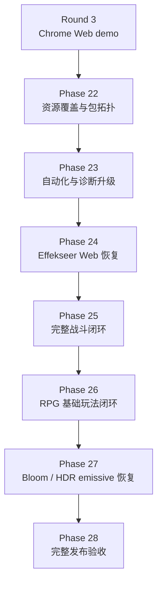
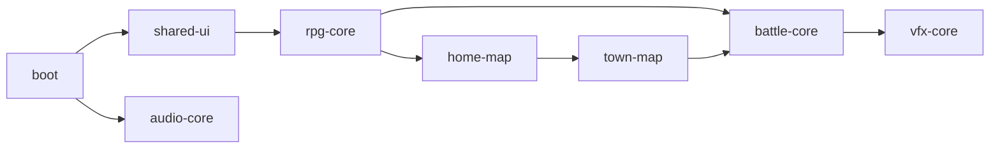

# 2026-06-04 Web Release 第四轮完整 RPG 与渲染恢复计划

## 元信息

- 目标分支：`web-release`
- 计划状态：`In Progress`
- 前置基线：第三轮 Phase 15-21 已完成 Chrome 单线程 Web demo，可启动、进 `home_exterior`、切 `home_interior`、基础交互、保存、刷新读档。
- 本轮目标：把 Web 版本从“可发布 demo”推进到“完整 RPG 基础玩法可玩”，并恢复战斗必需的 Effekseer 与核心发光/后处理视觉能力。
- 浏览器范围：Chrome / Chromium 为阻塞验收目标。Safari 仍不作为本轮阻塞项。
- 线程模型：继续以单线程为正式发布目标。只有当 Effekseer 或后处理恢复被证明必须依赖 pthreads 时，才新增独立 pthreads 变体；单线程路径不因此降级。

## 计划修正

第三轮完成范围应被重新定义为“Chrome 单线程 Web demo 发布收敛”，不是完整 Web 移植完成。完整移植还必须覆盖：

- 完整战斗流程：地图遭遇、战斗 UI、玩家/敌方回合、攻击、技能、物品、守护、逃跑、胜利、失败、奖励、任务进度、存档恢复。
- RPG 基础玩法：商店买卖、任务领取/交付、招募、休息、外观衣柜。
- 战斗视觉依赖：Effekseer 不能作为最终发布降级项；`null_vfx_backend` 只能作为开发期 fallback。
- 渲染视觉恢复：Bloom / HDR emissive / 高级后处理应在 Chrome WebGL2 支持条件下恢复；fallback 只允许在能力缺失时触发，并必须可诊断。

Claude 审阅意见中以下结论采纳为本轮执行约束：

- `town.tmj` 是战斗遭遇和战斗驱动任务的阻塞入口，不是可选补丁；Phase 22/25 必须把 `town.tmj` 的打包和 home → town 可达路径作为前置工作。
- Phase 25 的战斗 smoke 可以先验证 `troop.slime_single` 技能胜利路径，但 Phase 26 的任务闭环必须使用能推进 `village_goblin_cleanup` 的真实任务目标遭遇，例如 `troop.slime`。
- Effekseer Web 恢复优先处理 CMake/macro、`OpenGLES3` device type 和 native-only gate；不预设需要重写一套 Web VFX backend。
- Bloom/HDR 恢复必须显式处理 WebGL2 FBO 格式和运行时 capability gate：`GL_RGB16F` 转换不是“必要时”，而是 WebGL2 下的阻塞项。
- `full_rpg_smoke` 是本轮最大测试工程项，必须按玩法 flow 拆分、保留诊断快照和复跑入口，不能继续堆在单个长流程里。

## 完成定义

第四轮完成后，Web 版本必须满足：

- Chrome 中可人工完成一轮 RPG 教学 demo：创建角色、战斗、领取任务、击败目标、交付任务、购买/出售、招募、休息、衣柜换装、保存、刷新、读档恢复。
- Chrome 自动 smoke 至少覆盖每个基础玩法的成功路径，并记录关键状态断言。
- Web release full manifest 包含这些流程需要的 UI、地图、脚本、数据、战斗背景、VFX、音频和纹理。
- Runtime packages 按职责拆分，缺包、包加载失败、资源加载失败都有明确日志和 release report 记录。
- Web 正式构建启用 Effekseer 后端；战斗 VFX 可见，`backend=null_vfx_backend` 在 full RPG release gate 中失败。
- Chrome WebGL2 能力满足时启用 HDR emissive 与 Bloom；不满足时必须有 capability 原因，不能静默关闭。
- `docs/web_release.md` 不再把 Effekseer / Bloom / HDR emissive 写成正式降级项，而是记录恢复状态、fallback 条件和人工测试步骤。

## 实现原则

- 先修资源覆盖，再扩玩法 smoke。第四轮启动时 `web-release-full.args` 还未覆盖 battle/shop/quest/recruit/rest UI 与 VFX 资源，不能直接扩浏览器流程。
- 用诊断状态断言替代纯坐标猜测。RmlUi 运行在 canvas 内，自动化仍可点击/按键，但成功判断必须来自 C++/JS diagnostics、日志和截图。
- Effekseer 是战斗系统依赖，不再作为可选增强处理。阶段中可短期保留 fallback，但最终 full release gate 必须要求真实后端。
- Bloom / HDR emissive 的恢复必须走 WebGL2 capability gate，避免用桌面 GL 假设制造黑屏或 GL error flood。
- 不新增第二个 Web main，继续使用 `src/main.cpp` 与 SDL3 callbacks。
- 不把 Safari、pthreads 和 COOP / COEP 混入本轮阻塞目标。

## 已确认的基线内容缺口

第四轮启动时不是“可能缺入口”，而是已经确认存在以下结构性缺口：

| 内容 | 当前落点 | 第四轮启动时 Web release 状态 | 本轮处理 |
|---|---|---|---|
| 商店、招募、脚本交互 | `home_exterior.tmj` | 已在现有 home package 覆盖范围内 | Phase 26 扩 smoke 与状态断言 |
| 休息、衣柜 | `home_interior.tmj` | 已在现有 home package 覆盖范围内 | Phase 26 扩 smoke 与状态断言 |
| 战斗遭遇 `battle_troop_id` | `town.tmj` | 启动时被 asset audit 排除，未进入 `web-release-full.args`，且从 `home_exterior` 不可达 | Phase 22 打包，Phase 25 编写 home → town 入口并验证遭遇 |
| `school.tmj` | WIP 地图，当前不在主流程 | 当前被排除 | 本轮默认继续排除，除非 Phase 25 明确需要 town → school 流程 |

这意味着 Phase 25 的第一步不是“确认地图里有遭遇”，而是必须先建立可玩的战斗入口：把 `town.tmj` 纳入 Web release，并在 `home_exterior` 与 `town` 之间补齐可人工和自动化访问的 map transition。

## 需要新增或改造的文件

- `tools/web_release/package_web_assets.py`
  - 改造 package classification，新增 RPG / battle / VFX 相关包。
- `tools/asset_audit/audit_assets.py`
  - 增加 full RPG Web release profile，纳入 battle/shop/quest/recruit/rest/wardrobe/VFX/BattleBg 资源。
- `tools/web_release/validate_web_release.py`
  - 增加 full RPG release gate：必需 package、必需 UI、Effekseer、后处理、玩法 diagnostics。
- `tools/web_release/web_smoke.py`
  - 拆分/扩展 full gameplay smoke，覆盖完整 RPG 基础玩法。
- `src/engine/platform/web_asset_package_registry.*`
  - 第四轮启动时是 3 个 package 的 hardcoded registry；本轮按 package index / definition table 重写为可扩展 registry。
  - 增加 package dependency / load group / diagnostics；必要时支持按 scene id 声明依赖包。
  - package diagnostics 必须暴露真实 file count / byte count；如果暂时仍来自 static definition，Phase 28 前必须与 artifact manifest 或 package index 对齐，不能长期保持 0。
- `src/engine/vfx/effekseer_backend.*`
  - 增加 Emscripten / WebGL2 后端适配、文件加载路径和 diagnostics。
- `cmake/EffekseerDependencies.cmake`
  - 让 Effekseer 在 Emscripten 下可配置、可编译、只启用 Web 可用模块。
- `src/engine/render/opengl/*`
  - 恢复 WebGL2 兼容 HDR emissive / Bloom；补齐 FBO 格式与 shader precision gate。
- `src/game/scene/*`
  - 必要时增加 Web 自动化 diagnostics，不改变玩家可见逻辑。
- `docs/web_release.md`
  - 更新完整 Web 移植构建、人工测试、fallback 条件和故障排查。
- `plans/reports/2026-06-04-web-release-phase-22-report.md` 起
  - 每个 phase 完成后记录报告。

## 目标资源包拓扑

第四轮启动时的 `boot / shared-ui / home-map / audio-core` 不足以表达完整 RPG Web 运行时。目标拓扑：

| package | 内容 | 加载时机 |
|---|---|---|
| `boot` | 标题页最小资源、核心 shader/config/i18n/font | 页面启动 |
| `shared-ui` | 通用 RmlUi theme、HUD、inventory、pause、save、appearance 基础 UI | 进入角色创建或任一菜单前 |
| `rpg-core` | RPG catalogs、shop/quest data、Lua libs、通用交互脚本 | 新游戏确认后 |
| `home-map` | `home_exterior` / `home_interior` 地图、tileset、家园地图纹理 | 进入家园地图前 |
| `town-map` | `town.tmj`、战斗遭遇入口脚本和 town 专属资源 | 从家园进入 town 前 |
| `battle-core` | battle UI、BattleBg、敌人/角色 battle sprites、battle audio cues | 进入战斗前 |
| `vfx-core` | Effekseer `.efkefc/.efkmat/.efkmodel` 与依赖 textures | 初始化 Effekseer 或进入战斗前 |
| `audio-core` | 当前核心 BGM/SFX | 首次用户手势后 |

## Phase 22：完整玩法资源覆盖与 package 拓扑

目标：让 release manifest 和 runtime packages 覆盖完整 RPG 基础玩法，先消除“资源没有被打包所以不可玩”的问题。

实施步骤：

1. 扩展资源审计 profile。
   - `select_web_poc_assets()` 迁移或新增 `select_web_full_rpg_assets()`。
   - 纳入 `ui/rmlui/scenes/battle.*`、`shop_menu.*`、`quest_offer.*`、`recruit_offer.*`、`rest_dialog.*`、`appearance_customize.*`、`dialogue_choice.*`。
   - 纳入 `assets/textures/BattleBg/`、`assets/vfx/`、battle sprites、shop/quest/recruit/rest 所需 scripts/data/audio。
   - 纳入 `assets/maps/town.tmj`；`school.tmj` 默认继续排除并在报告中说明原因。
2. 重建 `web-release-full.args`。
   - 不再排除 `assets/vfx/` 与 `assets/textures/BattleBg/`。
   - 不再排除 `assets/maps/town.tmj`；若新增 `scripts/maps/town.lua`，同步纳入 full manifest。
   - 明确排除仍不属于当前教学 demo 的地图或素材，并写入报告。
3. 改造 package classifier。
   - 新增 `rpg-core`、`town-map`、`battle-core`、`vfx-core`。
   - 避免 VFX 或 BattleBg 回落到 `boot`。
   - `shared-ui` 覆盖全部可打开的 RmlUi 场景。
4. 扩展 package registry。
   - 支持 `loadGroup(["shared-ui", "rpg-core", ...])`。
   - 用 package index 或生成的 definition table 替代当前 hardcoded `std::array<PackageDefinition, 3>`。
   - diagnostics 记录 package id、URL、文件数、字节数、耗时、失败原因。
5. 更新 release gate。
   - 必需 UI / data / VFX / BattleBg 缺失直接失败。
   - `.data` 仍保持 boot-only，不因新增资源膨胀。
   - `artifact-manifest.json` 记录新增包体积。

验收标准：

- `validate_web_release.py` 能证明完整 RPG 资源被分配到 runtime packages。
- `TinyFarmRPG-Web.data` 仍小于 boot budget。
- `web-package-index.json` 包含 `rpg-core`、`town-map`、`battle-core`、`vfx-core`。
- Chrome smoke 至少观测到新增包的网络响应或预加载 diagnostics。

## Phase 23：完整玩法自动化与 diagnostics 基础

目标：让浏览器测试可以稳定断言玩法状态，不依赖脆弱的点击坐标和截图肉眼判断。

实施步骤：

1. 扩展 JS diagnostics。
   - `TinyFarmRPGWebReleaseDiagnostics.gameplay`：当前 scene、map、player position、party、inventory、gold、quest log、open menu、battle state。
   - `TinyFarmRPGWebReleaseDiagnostics.packages`：各 package 状态。
   - `TinyFarmRPGWebReleaseDiagnostics.vfx`：backend、loaded effects、active instances、draw calls。
   - `TinyFarmRPGWebReleaseDiagnostics.renderCapabilities` 保留并扩展后处理字段。
2. 增加测试场景辅助。
   - 优先使用真实地图与真实输入。
   - 对长路径允许增加 release-only diagnostics 和 deterministic seed，不添加玩家可见作弊 UI。
   - 必要时支持测试专用启动参数，例如固定语言、固定新档、清空 IDBFS。
3. 拆分 smoke。
   - 保留快速 `demo_smoke`。
   - 新增 `full_rpg_smoke`，覆盖完整玩法。
   - runbook 增加 `--profile demo|full-rpg`。
   - 将 full smoke 拆成可独立复跑的阶段函数：`start_new_game`、`reach_town`、`battle_flow`、`shop_flow`、`quest_flow`、`recruit_flow`、`rest_flow`、`wardrobe_flow`、`save_reload_verify`。
   - full smoke 需要支持按单个 flow 复跑，至少通过脚本参数、环境变量或报告中记录的复跑步骤实现，避免一次失败只能重跑完整长流程。
   - 每个阶段输出截图、diagnostics snapshot 和可读步骤日志，失败时能定位到具体玩法。
4. 增加 source guard。
   - 防止新增基础玩法 UI 没有进入 full RPG package gate。
   - 防止 Effekseer full release 被意外配置回 OFF。
5. 增加截图与像素检查。
   - 对战斗、Effekseer、Bloom 使用截图信号确认非空、可见且无异常遮挡。
   - 保留 console/WebGL error fail-fast。

验收标准：

- `web_smoke.py --profile full-rpg` 能读取 gameplay diagnostics。
- 自动化能断言状态变化：金币、物品、任务、队伍、HP/MP、外观、当前 scene。
- 快速 smoke 和 full smoke 可分别运行，CI 可先跑快速，人工/夜间跑 full。

## Phase 24：Effekseer Web 恢复

目标：让正式 Web full RPG 构建使用真实 Effekseer 后端，并为 Phase 25 的战斗 VFX 可见性验证扫清编译、链接和初始化风险。

实施步骤：

1. CMake bring-up。
   - 在 `TF_BUILD_WEB=ON` 下允许 `ENABLE_EFFEKSEER=ON`。
   - 审计 Effekseer CMake，关闭 viewer/editor/test/examples/network/audio/native-only 模块。
   - 在 Emscripten 下定义 EffekseerRendererGL 的 GLES3 编译路径，例如 `__EFFEKSEER_RENDERER_GLES3__`，并确认 `<GLES3/gl3.h>` 路径生效。
   - 处理 Emscripten 编译错误、异常策略、RTTI、filesystem 和 GL loader。
2. WebGL2 backend 适配。
   - 当前后端固定 `EffekseerRendererGL::OpenGLDeviceType::OpenGL3`；Web 构建必须切换为 `OpenGLES3`。
   - 上游已有 `OpenGLES3` 与 Emscripten/GLES include 路径，本轮优先做 CMake/macro 与 runtime device type 适配，不预设需要重写并行后端。
   - WebGL2 不支持 CPU map-buffer 路径；`__EMSCRIPTEN__` 下必须禁用 Effekseer buffer range/map buffer support，走 `glBufferSubData` fallback，避免链接或运行时调用 `glMapBufferRange` / `glUnmapBuffer`。
   - 修正 shader version、precision、VAO/FBO/state restore 差异。
   - 渲染前后记录 GL error，禁止 error flood。
3. 资源加载适配。
   - `vfx-core.tfpack` 加载后再播放 Effekseer；实际 effect 资源解析与战斗 draw call 验证归 Phase 25。
   - 确认 `.efkefc` 引用的 texture/model/material 路径在 MEMFS 中可解析。
   - 失败日志必须包含 effect path 与依赖 path。
4. Runtime policy 更新。
   - full RPG release 中 `Web release VFX policy` 必须为 `effekseer_enabled=true backend=effekseer status=enabled`。
   - `backend=null_vfx_backend` 在 full RPG gate 中失败。
   - demo profile 可临时允许 fallback，但必须在报告中标明非完整移植。
5. Visual smoke。
   - 在战斗中触发 Hit / Fire / Thunder / Heal 至少一个 effect。
   - 断言 active instance 或 draw call 计数变化。
   - 截图检查特效通道非空，并确认后续帧能清理实例。
   - 该项依赖 Phase 25 建立 town/battle 入口；Phase 24 只要求浏览器诊断证明 backend 初始化成功。

验收标准：

- Web build 在 `ENABLE_EFFEKSEER=ON` 下通过。
- Chrome smoke 中 Effekseer backend 初始化成功。
- 至少一个战斗特效在截图和 diagnostics 中可见，此项随 Phase 25 战斗闭环一起验收。
- 无 WebGL error flood，无资源依赖缺失 warning。

## Phase 25：完整战斗闭环

目标：Web 上战斗不只是能打开，而是完整可玩并与探索态、任务和存档正确衔接。

状态（2026-06-04）：已完成 `home_exterior` → `town` 可达入口、`battle-core` / `vfx-core` 进战斗前加载、地图遭遇进入战斗、技能触发 Effekseer 诊断、胜利返回地图与金币奖励写回 smoke。Attack / Item / Guard / Escape、失败流程、`defeated encounter` 持久化和战后保存刷新恢复仍保留为后续战斗扩展项。

实施步骤：

1. 战斗入口。
   - 将 `town.tmj` 纳入 `town-map` package。
   - 在 `home_exterior` 新增可见且可自动化访问的 `map_trigger` 通往 `town`。
   - 必要时在 `town` 新增返回 `home_exterior` 的 transition，避免人工测试陷入单向流程。
   - 确认 `town.tmj` 中 `battle_troop_id` 遭遇可从该入口到达并触发。
   - 进入 town 前加载 `town-map`，进入战斗前加载 `battle-core` 与 `vfx-core`。
   - 战斗背景、敌人 sprites、角色 battle sprites 全部从 package 加载。
2. 战斗 UI 与输入。
   - 自动 smoke 覆盖 `Fight`、`Attack`、`Skill`、`Item`、`Guard`、`Escape`。
   - 覆盖目标选择、取消返回、敌方回合。
   - 检查 Battle 输入上下文不会把 RmlUi 与场景级输入双消费。
3. 表现与结算。
   - 覆盖伤害飘字、敌方 HP bar、行动动画、VFX marker。
   - 胜利后结算金币、掉落、经验。
   - 失败后回到正确恢复点或失败流程。
4. 探索态写回。
   - HP/MP、battle item stocks、钱包、背包、defeated encounter 写回。
   - `respawn_on_map_reload=false` 的敌人战后不重复出现。
5. 存档恢复。
   - 战斗后保存，刷新读档，确认奖励、任务进度、已击败遭遇和队伍状态保留。

验收标准：

- Chrome full RPG smoke 可从地图进入战斗并胜利回到地图。
- 至少一个技能触发 Effekseer。
- 战斗奖励、任务进度、遭遇状态、HP/MP 写回可被 diagnostics 验证。
- 保存刷新读档后战斗结果不丢失。

## Phase 26：RPG 基础玩法闭环

目标：覆盖除战斗外的基础 RPG 玩法，使 Web 版本达到教学 demo 的实际可玩边界。

状态（2026-06-05）：已完成 Chrome `full-rpg` smoke 的 RPG 基础玩法闭环。覆盖商店买入/卖出/失败反馈、任务领取、3 次真实 slime 战斗推进、任务交付与奖励、Lyria 招募与后续战斗识别、休息恢复与时间推进、衣柜换装、最终保存刷新读档恢复。Lyria 地图 NPC 已固定站位，避免关键招募入口因随机游走导致人工和自动化交互不稳定。

实施步骤：

1. 商店交易。
   - 打开 `ShopMenuScene`。
   - 买入至少一个消耗品或装备，金币减少、背包增加。
   - 卖出至少一个物品，金币增加、背包减少。
   - 覆盖库存不足、金币不足或背包满的失败反馈至少一类。
2. 任务领取/交付。
   - 打开 `QuestOfferScene` 并接受任务。
   - 通过 `town.tmj` 的真实任务目标遭遇推进任务目标；`village_goblin_cleanup` 需要击败 3 个 slime，不能只复用 Phase 25 的 `troop.slime_single` 冒烟路径。
   - 回到 NPC 交付任务，领取奖励。
   - 验证 quest log 状态和 reward。
3. 招募。
   - 打开 `RecruitOfferScene`。
   - 接受招募，队伍成员变化。
   - 新成员出现在队伍数据中，并能参与后续战斗或被战斗 factory 识别。
4. 休息。
   - 打开 `RestDialogScene`。
   - 确认休息后 HP/MP 恢复，时间推进。
   - 保存刷新后恢复后的状态稳定。
5. 外观衣柜。
   - 从 `closet` 区域打开 `AppearanceCustomizeScene`。
   - 修改至少一个外观层。
   - 返回地图后玩家 sprite/portrait 更新。
   - 保存刷新读档后外观保持。
6. 文案与 UI。
   - 中英文 i18n key parity 继续通过。
   - 所有新增 UI 在 640x360 logical canvas 下不溢出、不遮挡关键操作。

验收标准：

- Chrome full RPG smoke 覆盖商店、任务、招募、休息、衣柜每个成功路径。
- 每个流程都有状态断言，不只截图。
- 人工测试 checklist 可以按同一路径完成。

## Phase 27：Bloom / HDR emissive / 高级后处理恢复

目标：在 Chrome WebGL2 支持能力满足时恢复核心发光和后处理视觉，不再把 LDR / no-bloom 当作正式完成状态。

实施步骤：

1. Capability 精化。
   - 检测 `EXT_color_buffer_float`、half-float/float renderable、linear filtering、sRGB、MSAA、texture format 限制。
   - 区分“能力缺失”和“代码未实现”。
2. WebGL2 FBO 格式适配。
   - 审计 `EmissivePass` / `BloomPass` 使用的 `GL_RGBA16F`、`GL_RGB16F`、filter、attachment。
   - `BloomPass` 当前使用 `GL_RGB16F`，WebGL2 下该格式不可作为可靠 color-renderable 目标；必须改为 `GL_RGBA16F`、`GL_R11F_G11F_B10F` 或明确的 LDR fallback。
   - `EmissivePass` 当前 `GL_RGBA16F` 路径保留，但仍需做 WebGL2 FBO completeness 检查。
   - 所有 pass 初始化必须检查 FBO completeness。
3. Shader 变体。
   - 确认 emissive / blur / composite shader 的 GLSL ES precision、sampler、texture 函数兼容。
   - release gate 检查 Web shader conversion 不破坏桌面路径。
4. 渲染集成。
   - 当前 `GLRenderer` 通过 `if constexpr (engine::platform::gl::kEnableHdrPostProcessingByDefault)` 做编译期关闭；本阶段必须改为运行时 WebGL2 capability gate。
   - 在 WebGL2 capability 满足时启用 `emissive_enabled=true` 与 `bloom=true`。
   - 不满足时 fallback 必须写入 diagnostics：具体缺哪个 extension / format。
   - World VFX 与 Bloom 的关系重新评估；如果战斗特效需要发光，应决定是 Effekseer 自带发光还是接入 Bloom source。
5. Visual smoke。
   - 构造包含 emissive object 或战斗技能特效的截图。
   - 断言 Bloom 开启时像素亮度/范围变化可观测。
   - 记录性能预算，不让 Bloom 恢复把 gameplay smoke 拉爆。

验收标准：

- Chrome 支持能力满足时 release report 显示 Bloom / HDR emissive enabled。
- 不再出现无原因的 `HDR post-processing disabled`。
- 无 WebGL error flood。
- Bloom / emissive visual smoke 通过。

## Phase 28：完整发布验收、文档与 CI

目标：把 full RPG Web release 固化为可重复构建、可自动验收、可人工测试的正式交付形态。

实施步骤：

1. Runbook profile。
   - `web_release_runbook.py auto --profile full-rpg`：build、gate、full smoke、artifact report。
   - `--profile demo` 保留为快速 smoke，但不能作为完整移植完成依据。
   - full profile 的报告必须列出 package file count / byte count、实际加载耗时和 fallback 状态；runtime diagnostics 与 artifact manifest 不一致时视为 release gate 风险。
2. CI。
   - 基础 job：configure + build + release gate。
   - 浏览器 job：Chrome full RPG smoke，可手动或 nightly。
   - artifact 上传 full report、screenshots、package index、logs。
3. 文档。
   - 更新 `docs/web_release.md` 支持范围：Effekseer 与 Bloom/HDR 状态。
   - 新增完整人工测试 checklist。
   - 增加常见失败：package 缺资源、Effekseer 初始化失败、FBO 不完整、Bloom fallback、IDBFS quota。
4. 最终报告。
   - 汇总 package 体积、启动耗时、进战斗耗时、特效 draw calls、Bloom 状态、玩法覆盖、截图。
   - 明确仍未覆盖的非基础玩法；不得把基础 RPG 玩法列为后续增强。
5. 清理旧表述。
   - 第三轮报告可作为历史记录保留。
   - 当前 docs 和最终报告不再宣称“Effekseer 后续增强即可”，而是写清 full RPG release 已恢复或阻塞。

验收标准：

- clean build 下 full RPG profile 通过。
- Chrome full RPG smoke 通过。
- 人工 checklist 通过并有记录。
- docs、release report、artifact manifest、screenshots 完整。

## 第四轮待办清单

- [x] 新增 full RPG Web release asset audit profile。
- [x] 生成并提交覆盖完整玩法的 `web-release-full.args`。
- [x] 新增 `rpg-core`、`battle-core`、`vfx-core` runtime packages。
- [x] 新增 `town-map` runtime package 或等价的 full RPG map package。
- [x] `town.tmj` 纳入 Web release manifest，`school.tmj` 的排除原因写入报告。
- [x] release gate 校验 battle/shop/quest/recruit/rest/wardrobe/VFX/BattleBg 资源。
- [x] release gate 校验 `dialogue_choice.*` UI 进入 shared-ui。
- [x] package registry 支持 package group dependency 和 diagnostics。
- [x] Web diagnostics 暴露 gameplay / package / vfx / render 状态。
- [x] runbook 和 smoke 支持 `demo` / `full-rpg` profile。
- [x] Web 构建启用 Effekseer。
- [x] Effekseer WebGL2 后端初始化成功。
- [x] `vfx-core` 中 Effekseer effect 及依赖资源可加载。
- [x] 战斗 smoke 断言 Effekseer active instance / draw call。
- [x] `home_exterior` 到 `town` 的 map transition 可人工和自动化触发。
- [x] 地图遭遇进入战斗并胜利返回地图。
- [x] 战斗 Skill 胜利路径、VFX 截图和金币奖励写回 smoke 通过。
- [ ] 战斗覆盖 Attack / Item / Guard / Escape 与失败流程。
- [ ] HP/MP、背包、遭遇状态写回并可存档恢复。
- [x] 商店买入、卖出、失败反馈 smoke 通过。
- [x] 任务领取、目标推进、交付、奖励 smoke 通过。
- [x] 招募接受、队伍成员变化、后续战斗识别 smoke 通过。
- [x] 休息恢复 HP/MP、推进时间、保存恢复 smoke 通过。
- [x] 衣柜修改外观、地图 sprite 更新、保存恢复 smoke 通过。
- [ ] Chrome WebGL2 下 HDR emissive 恢复。
- [ ] Chrome WebGL2 下 Bloom 恢复。
- [ ] 后处理 fallback 只在 capability 缺失时触发，并写入具体原因。
- [x] full RPG Chrome smoke 通过。
- [ ] `docs/web_release.md` 更新为完整 Web 移植说明。
- [ ] 新增 Phase 22-28 报告和最终 full RPG Web release 报告。

## 风险与处理

| 风险 | 影响 | 处理 |
|---|---|---|
| Effekseer Emscripten CMake / macro 配置不完整 | 战斗 VFX 阻塞 | 上游已有 `OpenGLES3` 与 Emscripten/GLES 路径；优先修 CMake 定义、native-only gate 和 `OpenGLES3` device type |
| VFX 资源依赖路径在 MEMFS 中解析失败 | 特效加载失败 | `vfx-core` 保持原始目录结构，失败日志输出 effect 和 missing dependency |
| `town.tmj` 当前不在 Web 包且从 home 不可达 | 战斗和战斗驱动任务无法验收 | Phase 22 打包 `town.tmj`，Phase 25 新增 home → town transition 与 encounter reachability smoke |
| 完整 RPG 包体积显著增长 | 首屏或进战斗变慢 | 保持 boot-only，按 rpg/battle/vfx 延迟加载，release report 记录包体积和耗时 |
| 坐标式 smoke 不稳定 | CI 假失败 | 用 diagnostics 做状态断言，坐标只负责触发输入 |
| Bloom `GL_RGB16F` 在 WebGL2 下 FBO 不完整 | Bloom 恢复黑屏或 GL error | Bloom render target 必须切到 WebGL2 renderable 格式，并以 FBO completeness gate 验证 |
| Bloom/HDR 在部分 Chrome GPU/driver 下能力不一致 | 黑屏或 GL error | 运行时 capability gate + FBO completeness + fallback reason，full release 记录启用/降级原因 |
| 玩法流程需要更稳定的测试内容摆放 | 自动化路径过长或不确定 | 允许增加测试友好的真实地图对象或固定 demo route，但不增加玩家可见作弊 UI |

## 当前假设

- Chrome / Chromium 仍是唯一阻塞浏览器。
- 单线程仍是正式发布路径。
- 现有教学 demo 内容可以承载完整 RPG 基础玩法，但战斗入口当前必须补齐：`town.tmj` 要打包，`home_exterior` 到 `town` 的 transition 要新增。
- `school.tmj` 当前按 WIP 处理，除非后续明确纳入完整教学流程，否则继续排除。
- Effekseer 与 Bloom/HDR emissive 在 full RPG Web release 中是阻塞项，不再作为可选增强项处理。
