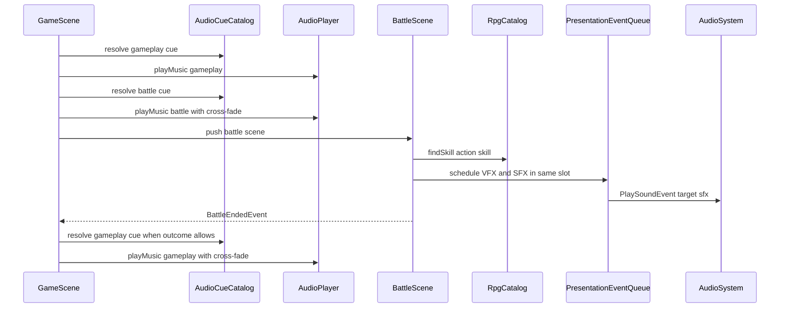

# 战斗音乐音效数据驱动接入计划

## 目标

为当前 JRPG 战斗补齐音乐与技能命中音效，并把资源选择从 C++ 硬编码收束到数据配置中。

- `BATTLE BOSS 2.mp3` 作为战斗默认 BGM。
- `Damage1.ogg` 作为普通攻击与未单独配置物理技能的默认命中音效。
- `Fire1.ogg`、`Heal1.ogg`、`Thunder1.ogg` 分别绑定到火焰、治疗、闪电技能。
- 技能音效从 `assets/data/rpg/skills.json` 中配置。
- 主场景与战斗场景 BGM 使用独立音频语义配置；资源文件路径仍由 `resource_mapping.json` 负责。

## Review 采纳结论

本计划已按审阅意见收敛：

- 采纳：SFX 不新增独立 `scheduled sounds` 队列，和现有 delayed VFX 合并为通用表现事件调度。
- 采纳：删除 `target_sfx_delay_seconds`，SFX 命中时序跟随同一次表现 slot。
- 采纳：明确不走 `ActionSoundSystem`，战斗音效采用结算结果驱动的全局反馈。
- 采纳：`audio_cues.json` 加载 / 校验失败不回退到硬编码音乐 ID。
- 采纳：运行期校验 cue 的 `music_id` 已注册到 `ResourceManager` / `AssetRegistry`。
- 采纳：`onBattleEnded` 按 outcome 区分恢复策略，Defeat 音乐策略保留 TODO。
- 采纳：表现队列入队完整 `PlaySoundEvent`，不只入队 raw `sound_id`。
- 采纳：依赖 `AudioPlayer::playMusic` 现有 cross-fade，不额外 `stopMusic`。
- 采纳：本阶段不预留 `TroopData::battle_music_cue_id` 解析代码。
- 部分采纳：`audio_cues.json` 保留 `schema_version`。现有 `quests.json` / `shops.json` 也有局部 `schema_version`，音频 cue 又不属于 RPG manifest，因此本阶段保持独立版本字段；若未来新增全局 data manifest，再统一迁移。
- 采纳：`MusicCueData` 增加 `volume_scale`，并同步扩展播放入口。
- 采纳：测试命名使用 `GameSceneBattleAudioTest`。
- 采纳：顶层预留 `sfx_cues`，本阶段只定形 schema，不消费该 map。

## 当前结论

- 音频底层已存在：`AudioPlayer` 基于 MiniAudio，支持 `playSound`、`playSound2D`、`playMusic`、`stopMusic` 和淡入淡出。
- `AudioPlayer::playMusic` 已有切歌 cross-fade：播放新音乐时会按本次 fade-in 时长淡出旧音乐，因此场景切换时直接调用 `playMusic` 即可。
- `ResourceManager::loadResources("assets/data/resource_mapping.json")` 已加载 `sound` 与 `music` 映射，并预加载到 `AssetRegistry` / audio cache。
- `AudioSystem` 已订阅 `engine::utils::PlaySoundEvent`，全局音效可用 `entity = entt::null` 播放。
- `ActionSoundSystem` 已支持探索实体的 action trigger 到 `PlaySoundEvent` 映射，但战斗当前是 `BattleActionResult` 单步结算，不是连续 action 状态机。
- `BattleScene` 已有 delayed VFX 调度：`scheduleVfxCommand` / `scheduled_vfx_commands_` / `updateScheduledVfx`。
- `GameScene` 当前硬编码播放 `game::defs::audio::SCENE_BG_MUSIC_ID`；`TitleScene` 当前硬编码播放 title BGM；`BattleScene` 只在胜利时播放 `battle-victory` 音效，没有进入战斗 BGM。
- `SkillData` 已有 `target_vfx_id`、`target_vfx_scale`、`target_vfx_offset`；技能音效可以沿用同一“目标命中表现字段”思路。
- 新增音频资源已在工作区但未提交：
  - `assets/audio/BATTLE BOSS 2.mp3`
  - `assets/audio/Damage1.ogg`
  - `assets/audio/Fire1.ogg`
  - `assets/audio/Heal1.ogg`
  - `assets/audio/Thunder1.ogg`

## 数据设计

### 资源映射

继续把“音频 ID 到文件路径”的映射放在 `assets/data/resource_mapping.json`。建议新增结构化 ID，后续逐步替代 `title-bg-music`、`scene-bg-music` 这类旧命名。

```json
{
  "sound": {
    "sfx.battle.physical_hit": "assets/audio/Damage1.ogg",
    "sfx.battle.fire_1": "assets/audio/Fire1.ogg",
    "sfx.battle.heal_1": "assets/audio/Heal1.ogg",
    "sfx.battle.thunder_1": "assets/audio/Thunder1.ogg"
  },
  "music": {
    "music.battle.boss_2": "assets/audio/BATTLE BOSS 2.mp3"
  }
}
```

资源映射只负责加载，不表达“哪个场景使用哪首音乐”或“哪个技能播放哪个音效”。

### 技能音效字段

在 `game::data::SkillData` 增加可选字段：

| 字段 | 类型 | 默认值 | 说明 |
|---|---|---|---|
| `target_sfx_id` | string | `""` | 目标命中时播放的全局音效 ID；为空时不播放配置音效 |

示例配置：

```json
{
  "id": "skill.fire_1",
  "target_vfx_id": "battle.fire_one_1",
  "target_sfx_id": "sfx.battle.fire_1"
}
```

推荐初始绑定：

| 技能 | 音效 ID | 说明 |
|---|---|---|
| `skill.attack` | `sfx.battle.physical_hit` | 普通攻击默认物理命中音效 |
| `skill.fire_1` | `sfx.battle.fire_1` | 火焰技能音效 |
| `skill.heal_1` | `sfx.battle.heal_1` | 治疗技能音效 |
| `skill.thunder_1` | `sfx.battle.thunder_1` | 闪电技能音效 |

不新增独立 delay 字段。技能音效与同一次目标 VFX 走相同表现 slot：

- 魔法 / 治疗等配置了 `target_vfx_id` 的技能，SFX 与 VFX 一起立即调度。
- 普通攻击和未配置目标 VFX 的物理伤害技能，SFX 跟随物理命中特效的 `PHYSICAL_HIT_VFX_DELAY_SECONDS`。
- 若未来需要咏唱期音效、飞行物音效或多段命中音效，再引入 `cast_sfx_id` / `impact_sfx_id` 等更明确的表现阶段字段。

### 背景音乐语义配置

新增 `assets/data/audio_cues.json`，负责描述“场景语义到音乐资源 ID 与播放策略”的关系。这样 `resource_mapping.json` 保持纯资源表，场景切歌规则集中在一个游戏层配置中。

```json
{
  "schema_version": 1,
  "music_cues": {
    "cue.music.gameplay.default": {
      "music_id": "scene-bg-music",
      "loop": true,
      "fade_in_ms": 200,
      "volume_scale": 1.0
    },
    "cue.music.battle.default": {
      "music_id": "music.battle.boss_2",
      "loop": true,
      "fade_in_ms": 250,
      "volume_scale": 1.0
    }
  },
  "sfx_cues": {},
  "scene_defaults": {
    "gameplay": "cue.music.gameplay.default",
    "battle": "cue.music.battle.default"
  }
}
```

第一阶段只接入 `gameplay` 与 `battle`。`title` 可在同一机制稳定后迁移，避免本次改动影响标题、读档失败回标题等启动路径。

本阶段不为 map / troop 预留未使用字段。后续如果需要地图 / 敌群差异化 BGM，再和实际数据一起增加 `battle_music_cue_id` 解析，并按“命令覆盖、地图覆盖、敌群覆盖、默认 cue”这类优先级设计。

## 运行时流程



注意：切换 BGM 时不先调用 `stopMusic`。`AudioPlayer::playMusic` 已经负责旧曲淡出与新曲淡入。

## 代码设计

### AudioCueCatalog

新增游戏层数据类：

- `src/game/data/audio_cue_catalog.h`
- `src/game/data/audio_cue_catalog.cpp`

职责：

- 解析 `assets/data/audio_cues.json`。
- 保存 `MusicCueData`：`id`、`music_id`、`music_id_hash`、`loop`、`fade_in_ms`、`volume_scale`。
- 保存 `scene_defaults`：`gameplay`、`battle`。
- 提供 `findMusicCue(id)`、`defaultMusicCue(SceneAudioContext)`。
- 运行期校验：
  - `schema_version > 0`
  - cue id 非空
  - `music_id` 非空
  - `fade_in_ms >= 0`
  - `volume_scale` 在 `[0.0, 1.0]`
  - 默认 cue 必须存在
  - 每个 `music_id_hash` 都能在 `context.getResourceManager().getAssetRegistry().findMusicPath(...)` 中找到路径

`AudioCueCatalog` 不直接加载音频文件，只校验语义 ID 已注册。音频文件仍由 `ResourceManager` 和 `AudioPlayer` 管理。

加载 / 校验失败时，记录 `spdlog::error`，对应 cue lookup 返回空，调用方不播放或不切歌；不要回退到 `SCENE_BG_MUSIC_ID` 等旧硬编码 ID。

### AudioPlayer 音量倍率

为支持 cue 级 `volume_scale`，扩展 `AudioPlayer` 的音乐播放入口：

```cpp
bool playMusic(entt::id_type music_id, bool loop = true, int fade_in_ms = 0, float volume_scale = 1.0F);
```

实现要点：

- `volume_scale` clamp 到 `[0.0F, 1.0F]`。
- `ManagedSound::base_volume` 对音乐也使用 `volume_scale`，最终音量仍乘全局 `music_volume_`。
- current music 去重逻辑需要同时考虑 `music_id` 与 cue 音量；同一音乐但音量倍率不同，应允许重设或重播。

### RuntimeServices

在 `game::runtime::GameRuntimeServices` 中增加：

```cpp
std::shared_ptr<game::data::AudioCueCatalog> audio_cue_catalog;
```

在 `GameRuntimeAssembler::assembleServices()` 中加载 `assets/data/audio_cues.json`，并在 `resource_mapping.json` 加载后用 `AssetRegistry` 做引用校验。

装配失败策略：

- `audio_cue_catalog` 文件缺失、JSON 非法、默认 cue 缺失或引用未注册，记录 `spdlog::error`。
- 本阶段可让 GameScene 继续运行，但 BGM cue 播放 no-op；不得静默回退到旧硬编码音乐。

### GameScene BGM

新增私有 helper：

- `playGameplayMusicCue()`
- `playBattleMusicCue()`
- `playMusicCue(const MusicCueData&)`

调整点：

- `GameScene::init()` 末尾不再直接调用 `SCENE_BG_MUSIC_ID`，改为播放 `audio_cues.json` 中的 `gameplay` 默认 cue。
- `GameScene::onEnterBattleCommand()` 在成功构造 units 后、`requestPushScene()` 前播放 battle 默认 cue。
- `GameScene::onBattleEnded()` 不无条件恢复 gameplay cue：
  - `Victory`：结算后恢复 gameplay cue。
  - `Escape`：恢复 gameplay cue。
  - `Defeat`：当前若仍回到 GameScene，可暂时恢复 gameplay cue；但要保留 TODO，未来接入 GameOver / Defeat scene 时改为对应 defeat cue 或停止音乐。

这样 `BattleScene` 不需要负责 BGM 生命周期，也避免战斗场景 pop 时不知道应恢复哪首地图音乐。

### SkillData SFX

扩展：

- `src/game/data/rpg_data.h`
  - `std::string target_sfx_id_{}`
  - `entt::id_type target_sfx_id_hash_{}`
- `src/game/data/rpg_catalog.cpp`
  - 解析 `target_sfx_id`

字段和 `target_vfx_*` 并列，表示“命中目标时的表现反馈”，不进入 `BattleActionResolver`，保持领域层纯结算。

### BattleScene SFX 与表现调度

不要新增 `scheduleSoundEvent` / `updateScheduledSounds`。把当前 VFX 专用队列收敛成通用表现事件队列：

```cpp
struct ScheduledPresentationEvent {
    std::variant<engine::vfx::PlayVfxCommand, engine::utils::PlaySoundEvent> payload;
    float remaining_seconds{0.0F};
};
```

替换 / 新增方法：

- `schedulePresentationEvent(engine::vfx::PlayVfxCommand command, float delay_seconds)`
- `schedulePresentationEvent(engine::utils::PlaySoundEvent event, float delay_seconds)`
- `updateScheduledPresentationEvents(float delta_time)`
- `spawnActionTargetPresentationEvents(...)`

触发条件：

- `result.status == Applied`
- `!result.missed`
- `result.target_id.has_value()`
- 行动类型为 `Attack` 或 `Skill`
- 配置音效存在，或物理命中可回退到 `skill.attack`

播放策略：

- 使用完整 `engine::utils::PlaySoundEvent{entt::null, sound_id}` 入队并在到期时 dispatch。
- 第一阶段不做战斗 UI 坐标到 2D 空间音效的映射；RPG Maker 风格战斗音效通常是全局反馈，先保证稳定。
- SFX 与 VFX 共享同一个 delay slot：配置技能用 `0.0F`，物理默认命中用 `PHYSICAL_HIT_VFX_DELAY_SECONDS`。

与 `ActionSoundSystem` 的关系：

- 不复用 `ActionSoundSystem` 作为战斗技能音效主路径。
- 原因是 `ActionSoundSystem` 面向探索实体的连续 action 状态和 `AudioComponent::sounds_` 二级映射；战斗行动已经由 `BattleSession::submitAction()` 一次性产生 `BattleActionResult`，音效应跟随结算结果和表现时间线。
- 若未来战斗精灵有脚步、待机、武器挥舞等连续动作状态，再给 BattleSprite entity 挂 `AudioComponent` / `ActionSoundComponent`，作为局部动作音效补充。

### Victory 音效

`playVictoryAudioCue()` 当前仍播放 `battle-victory`。本计划不强制改为 BGM/ME 系统，避免扩大范围。后续可在 `audio_cues.json.sfx_cues` 或新的 `me_cues` 中加入胜利 fanfare，再把胜利提示音纳入统一配置。

## 实施步骤

### 阶段一：数据落地

- 更新 `assets/data/resource_mapping.json`，加入 1 个 battle music ID 与 4 个 battle sfx ID。
- 新增 `assets/data/audio_cues.json`，配置 gameplay 默认 BGM 与 battle 默认 BGM，并预留空的 `sfx_cues` map。
- 更新 `assets/data/rpg/skills.json`：
  - `skill.attack` 增加 `target_sfx_id: "sfx.battle.physical_hit"`。
  - `skill.fire_1` 增加 `target_sfx_id: "sfx.battle.fire_1"`。
  - `skill.heal_1` 增加 `target_sfx_id: "sfx.battle.heal_1"`。
  - `skill.thunder_1` 增加 `target_sfx_id: "sfx.battle.thunder_1"`。

### 阶段二：音乐 cue 配置接入

- 实现 `AudioCueCatalog`。
- 将 catalog 装配进 `GameRuntimeServices`。
- 在装配期校验 cue 的 `music_id` 已注册到 `AssetRegistry`。
- 扩展 `AudioPlayer::playMusic` 支持 `volume_scale`。
- 替换 `GameScene` 主场景 BGM 播放逻辑。
- 在进入战斗前直接 `playMusic` battle cue；在 `BattleEndedEvent` 后按 outcome 恢复 gameplay cue。
- 保留 `game::defs::audio` 作为 title / victory 等未迁移路径的短期常量，GameScene gameplay / battle 不再依赖它们做 fallback。

### 阶段三：技能 SFX 接入

- 扩展 `SkillData` 与 `RpgCatalog::loadSkills()`。
- 将 `scheduled_vfx_commands_` 重构为 `scheduled_presentation_events_`。
- 在 `BattleScene` 行动结算后，用一个 `spawnActionTargetPresentationEvents()` 同时调度目标 VFX 与目标 SFX。
- 物理 attack / physical skill fallback 到 `skill.attack` 的 `target_sfx_id`。

### 阶段四：验证与清理

- 覆盖真实资源引用测试。
- 手动验证进入战斗、释放技能、胜利 / 逃跑退出后的音乐切换。
- 记录 Defeat 到 GameOver 场景前的临时音乐策略 TODO。

## 测试计划

- `AudioCueCatalogTest`
  - 正常解析 `music_cues`、`sfx_cues` 与 `scene_defaults`。
  - 缺失默认 cue、空 `music_id`、负 `fade_in_ms`、非法 `volume_scale` 返回失败。
  - `validateReferences` 能发现未注册的 `music_id`。
- `AudioPlayerTest`
  - `playMusic(..., volume_scale)` 会设置音乐 base volume，并继续受全局 music volume 影响。
  - 同一 `music_id` 但 `volume_scale` 不同时不会被错误去重。
- `RpgCatalogTest`
  - 技能 `target_sfx_id` 解析成功。
  - 未配置技能保持空 ID。
- `RpgAssetsCatalogTest`
  - 真实 `skills.json` 中所有非空 `target_sfx_id` 均能在 `resource_mapping.json.sound` 中找到。
  - 真实 `audio_cues.json` 中所有 `music_id` 均能在 `resource_mapping.json.music` 中找到。
  - 新增 5 个音频文件实际存在。
- `BattleSceneSmokeTest`
  - `ExecutingAction` 调用了 `spawnActionTargetPresentationEvents()`。
  - 表现调度使用 `ScheduledPresentationEvent`，不再有独立 `scheduled_vfx_commands_` 与 `scheduled_sound_events_` 双队列。
  - scheduled SFX 通过完整 `PlaySoundEvent{entt::null, sound_id}` 发出。
- `GameSceneBattleAudioTest`
  - 进入战斗前播放 battle cue。
  - `Victory` / `Escape` 后恢复 gameplay cue。
  - `Defeat` 分支有显式策略或 TODO 断言，避免无条件恢复造成未来 GameOver 回归。

验证命令：

```bash
ninja -C build game_tests
```

如单测目标拆分较细，可优先运行 audio cue、RPG catalog、battle scene、GameScene battle audio 相关测试，最终再跑完整 `game_tests`。

## 手动验收

- 启动主场景后播放原主场景 BGM。
- 触发遭遇战后，主场景 BGM 通过 `playMusic` cross-fade 切到 `BATTLE BOSS 2.mp3`。
- 普通攻击命中时播放 `Damage1.ogg`。
- Lyria 释放火焰时播放 `Fire1.ogg`。
- Tori 释放治疗时播放 `Heal1.ogg`。
- Lyria 释放闪电时播放 `Thunder1.ogg`。
- 战斗胜利或逃跑退出后恢复主场景 BGM。
- Defeat 当前策略符合实现注释；未来接 GameOver 时不被 gameplay BGM 恢复逻辑挡住。
- Miss、无目标、未应用行动不播放目标音效。

## 待办清单

- [x] 更新 `resource_mapping.json` 音频资源 ID。
- [x] 新增 `audio_cues.json`。
- [x] 增加 `AudioCueCatalog` 与测试。
- [x] 将 `AudioCueCatalog` 装配进 `GameRuntimeServices`。
- [x] 在装配期校验 cue 的 `music_id` 已注册。
- [x] 扩展 `AudioPlayer::playMusic` 支持 `volume_scale`。
- [x] 替换 `GameScene` gameplay BGM 播放。
- [x] 进入战斗前播放 battle BGM，战斗结束后按 outcome 恢复或处理 BGM。
- [x] 扩展 `SkillData` 的 `target_sfx_id` 字段。
- [x] 更新 `skills.json` 技能音效配置。
- [x] 将 `BattleScene` 的 delayed VFX 队列重构为通用表现事件队列。
- [x] 在 `BattleScene` 行动结算中同 slot 调度目标 VFX 与目标 SFX。
- [x] 补充真实资源引用和 battle smoke 测试。
- [x] 运行 `ninja -C build game_tests`。
- [ ] 手动验证音乐切换与四类命中音效。

## 后续扩展

- 将 title BGM 与 victory fanfare 迁移到 `audio_cues.json`，清理 `game::defs::audio` 中的硬编码音乐 ID。
- 为地图增加 `music_cue_id`，进入不同地图时自动切换探索 BGM。
- 为 troop 增加 `battle_music_cue_id`，支持 Boss / 普通战斗 / 事件战不同战斗曲；等真实数据需要时再做，不在本阶段预留死字段。
- 若后续 `BattleAnimationDirector` 暴露 impact frame 事件，把通用表现事件队列再下沉到 director 的 impact timeline，由 timeline 统一派发 VFX、SFX、伤害飘字和受击 flash。
