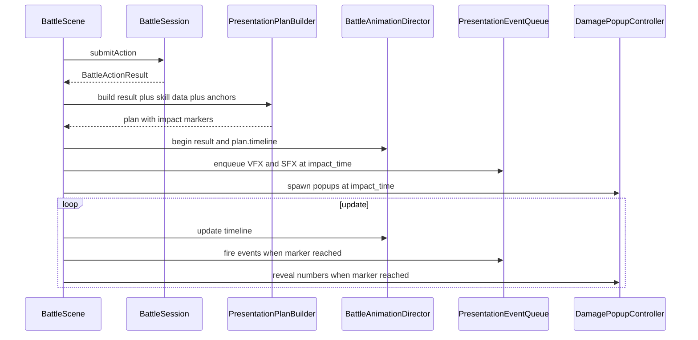
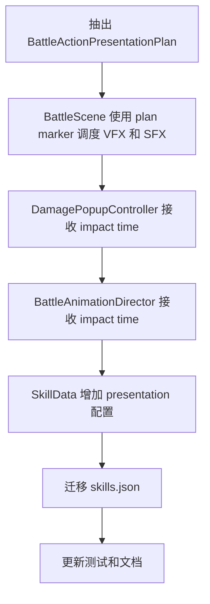

# Battle Impact Timeline 开发计划

## 背景

当前战斗表现链路已经有 `BattleAnimationDirector`、`BattleDamagePopupController` 和 `ScheduledPresentationEvent`，但命中相关表现仍由 `BattleScene` 内的固定延迟驱动：

- 配置了 `target_vfx_id` / `target_sfx_id` 的技能使用 `0.0s` 延迟，表现为瞬发。
- 普通物理命中使用 `PHYSICAL_HIT_VFX_DELAY_SECONDS = 0.18s`。
- 受击抖动在 `BattleAnimationDirector` 内以 `ATTACK_LUNGE_END = 0.22s` 开始。
- 伤害飘字在 `BattleDamagePopupController` 内默认 `impact_delay_seconds = 0.22s`。

这些时间点分散在多个类中，导致技能特效、音效、飘字、受击抖动和角色动作无法保证落在同一个命中帧。后续加入真实攻击动画、武器动作、施法动作或多段技能时，固定延迟会继续扩大错位问题。

## 目标

- 建立统一的战斗表现时间轴，让命中特效、音效、飘字、受击抖动和 HP 条 reveal 都绑定到同一个 `impact_time`。
- 允许每个技能配置自己的表现节奏，例如施法前摇、命中点、收招时间、VFX 偏移和缩放。
- 保持战斗领域逻辑立即结算，避免 TurnCore / BattleSession 依赖表现层时序。
- 为后续多段命中、投射物、武器动画帧事件和 RPG Maker 风格技能动画留扩展口。
- 明确 timeline 总时长语义：表现时间轴必须覆盖命中后的可见尾巴，不能在 VFX / 飘字还在播放时提前切到下一回合。

## 非目标

- 不在本阶段重写 `BattleActionResolver` 或回合推进规则。
- 不要求本阶段实现多目标逐个命中结算；当前 `BattleActionResult` 仍主要是单结果快照。
- 不引入真实时间暂停或全局游戏时间缩放，hit pause 只作为后续可选增强。

## 设计方案

### 核心思路

把 `BattleScene::spawnActionTargetPresentationEvents()` 中的固定 delay 改为由 `BattleActionPresentationPlan` 描述。`BattleScene` 在拿到 `BattleActionResult` 后构建一次表现计划，之后所有表现系统都读取同一个计划。



### 新增表现计划类型

建议新增 `src/game/scene/battle_action_presentation_plan.h/.cpp`，把 `BattleScene` 中的表现决策抽出：

- `BattleActionPresentationPlan`
  - `BattleActionMotionStyle motion_style`
  - `float duration_seconds`
  - `float impact_time_seconds`
  - `float recovery_time_seconds`
  - `float visual_tail_seconds`
  - `glm::vec2 actor_start_offset`
  - `glm::vec2 captured_target_position`
  - `std::vector<BattlePresentationMarker> markers`
- `BattlePresentationMarker`
  - `float time_seconds`
  - `float visual_tail_seconds`
  - `BattlePresentationMarkerType type`
  - `BattleUnitId target_id`
  - VFX / SFX / popup / hp reveal 所需 payload
- `BattlePresentationPlanBuilder`
  - 输入 `BattleActionResult`、`SkillData`、默认攻击技能、单位 anchors。
  - 输出统一时间轴。

`BattleScene` 只负责执行计划，不再硬编码“配置技能 0 秒、普通攻击 0.18 秒、飘字 0.22 秒”。

`duration_seconds` 是整个 action 表现时间轴的总时长，不等同于命中点。builder 必须保证：

- `duration_seconds >= impact_time_seconds`
- `duration_seconds >= impact_time_seconds + recovery_time_seconds`
- `duration_seconds >= max(marker.time_seconds + marker.visual_tail_seconds)`

Phase 1 暂时继续读取 `SkillData::target_vfx_id_`、`target_sfx_id_`、`target_vfx_scale_`、`target_vfx_offset_` 这些旧字段来构建 marker；Phase 2 再切到 `SkillData::presentation_`。

VFX / SFX marker 的位置在 action begin 时从 `BattlePresentationUnitAnchor::base_screen_position` 捕获，不在 marker 触发瞬间重新读取带 pose 偏移的 sprite 位置。这样 target 特效稳定落在战斗站位锚点上，行为也与当前 `spawnActionTargetPresentationEvents()` 一致。

### Skill 数据结构

把技能表现配置收拢到 `presentation` 对象，替代散落的顶层 `target_vfx_*` 字段。项目无需兼容旧数据，可以一次性迁移 `assets/data/rpg/skills.json`。

建议字段：

```json
{
  "presentation": {
    "motion_style": "cast",
    "duration": 0.92,
    "impact_time": 0.46,
    "recovery_duration": 0.30,
    "target_vfx_tail": 0.45,
    "target_vfx_id": "battle.fire_one_1",
    "target_sfx_id": "sfx.battle.fire_1",
    "target_vfx_scale": 6.0,
    "target_vfx_offset": { "x": 0.0, "y": -36.0 }
  }
}
```

默认规则：

- `Attack / physical damage skill`：`motion_style = weapon_attack`，默认 `impact_time = attack_lunge_end`。
- `magical damage / recovery skill`：`motion_style = cast`，默认 `impact_time = duration * 0.55`。
- `Guard / Item / EndTurn`：使用简单动作，只有需要反馈时才创建 marker。
- 若配置了 `impact_time`，所有 target VFX / SFX / popup / hit pose 都以它为准。
- 若未显式配置 `duration`，builder 根据 motion 默认值计算总时长：`duration = impact_time + max(recovery_duration, target_vfx_tail, popup_tail)`。

### BattleAnimationDirector 改造

当前 `BattleAnimationDirector` 内部使用 `ATTACK_LUNGE_END` 和 `HIT_FEEDBACK_END` 控制受击反馈。需要改成从 config / plan 读取：

- `BattleAnimationTimelineConfig` 增加：
  - `duration_seconds`
  - `impact_time_seconds`
  - `hit_feedback_duration_seconds`
  - `weapon_windup_seconds`
  - `weapon_lunge_seconds`
  - `weapon_return_seconds`
- `hitPoseFor()` 从 `timeline_.elapsed_seconds >= impact_time_seconds` 开始。
- `attackPoseFor()` 不做简单等比例拉伸，而是把 impact 作为 lunge 落点：
  - `windup_duration = min(weapon_windup_seconds, impact_time_seconds * 0.5)`
  - `lunge_duration = min(weapon_lunge_seconds, impact_time_seconds - windup_duration)`
  - `windup_end = max(0.0, impact_time_seconds - lunge_duration)`
  - `lunge_end = impact_time_seconds`
  - `return_end = impact_time_seconds + weapon_return_seconds`
  - 如果 `windup_duration < windup_end`，中间保持 windup pose，不把 windup 慢速拉长。
- `finished()` 仍按 `duration_seconds` 结束，不被 VFX 资源长度阻塞。

默认值应能复刻当前节奏：`weapon_windup_seconds = 0.08`、`weapon_lunge_seconds = 0.14`、`weapon_return_seconds = 0.20`，在 `impact_time = 0.22` 时等价于当前 `0.08 / 0.22 / 0.42`。

### PresentationEventQueue 改造

现有 `ScheduledPresentationEvent` 可以保留，但语义应从“delay seconds”改为“timeline marker time”：

- 队列条目保存 `fire_time_seconds` 和 `fired`，或保存 `remaining_seconds` 但由 plan 填充。
- 每次 action 开始时清空上一 action 的未触发 marker。
- 触发时通过 dispatcher 发布 `PlayVfxCommand` / `PlaySoundEvent`。
- 音效和特效使用同一个 marker，避免音画错位。

### DamagePopupController 改造

`BattleDamagePopupTimingConfig::impact_delay_seconds` 不应再是独立真相：

- `spawnFromResult()` 增加 `impact_time_seconds` 参数，或改为接收 `BattleActionPresentationPlan`。
- Critical stagger 仍可相对 impact 追加，例如 `impact_time + 0.12s`。
- Miss popup 也使用该 action 的 impact marker；如果技能配置了 miss marker，后续可独立扩展。

### HP 条和结果文本 reveal

当前 `BattleScene` 在 `submitAction()` 后立即 `syncFromSnapshot()` 和 `revealFromResult()`。建议拆分为：

- 立即保存 `BattleActionResult` 和 final snapshot，保证状态机知道结局。
- 不要立即把 result snapshot 同步进敌方 HP 条。否则 `target_ratio` / 文本值会先变，只有 reveal 动画延后。
- impact marker 到达时再执行敌方 HP 条的同步和 reveal。实现方式二选一：
  - `BattleScene` 在 impact 前保留旧 HP 条状态，到 marker 触发时调用 `syncFromSnapshot(result.snapshot)` + `revealFromResult(result)`。
  - 或者给 `BattleEnemyHpBarController` 增加 `stageSnapshot()` / `applyStagedSnapshotAndReveal()`，内部维护当前显示值与待应用目标值两套状态。
- 飘字、受击 pose、HP 条 reveal 使用同一个 impact marker。
- `CheckVictory` 仍等整个表现 timeline finished 后进入，避免目标在命中前倒下或回合文本提前跳转。
- 战斗日志拆分为“动作宣告”和“结果数字”不是本计划完成定义；如要把伤害文本也延后到 impact，另开 follow-up 更稳。

## 分阶段实施

### Phase 1：统一命中时间源

- 新增 `BattleActionPresentationPlan` 和 builder。
- builder 暂时读取旧的 `SkillData::target_vfx_*` / `target_sfx_id_` 字段，保持 Phase 1 改动集中在表现时间轴。
- 将 `BattleScene::animationConfigForResult()` 改为从 plan 生成 config。
- 将 `spawnActionTargetPresentationEvents()` 改为消费 plan marker。
- 删除或降级 `CONFIGURED_TARGET_VFX_MIN_DURATION_SECONDS`、`PHYSICAL_HIT_VFX_DELAY_SECONDS` 等分散常量；替代方案是 plan 的 `duration_seconds`、`impact_time_seconds` 和 marker `visual_tail_seconds`。
- 新增 `BattlePresentationPlanBuilder` 单元测试，覆盖 attack、configured skill、guard / item、miss / rejected 等路径。

验收标准：

- 配置技能不再 `0.0s` 瞬发。
- 普通攻击、技能 VFX、SFX、飘字、受击抖动使用同一个 impact time。
- action timeline 不会在 marker 的可见尾巴结束前 finished。
- 现有战斗 smoke test 更新为检查 plan / marker，而不是检查固定 delay 常量。

### Phase 2：数据驱动技能表现

- 在 `SkillData` 新增 `SkillPresentationData`。
- 更新 `RpgCatalog::loadSkills()` 解析 `presentation` 对象并校验：
  - `duration > 0`
  - `impact_time >= 0`
  - `impact_time <= duration`
  - `duration >= impact_time + recovery_duration`
  - `duration >= impact_time + target_vfx_tail`
  - `target_vfx_scale > 0`
- 迁移 `assets/data/rpg/skills.json` 中的 `target_vfx_*` / `target_sfx_id` 到 `presentation`。
- 更新 `rpg_catalog_test` 和 `rpg_assets_catalog_test`。

验收标准：

- 火焰、雷电、治疗和普通攻击可以分别配置不同 impact time。
- 缺省技能仍有稳定默认表现。
- 非法表现配置会让 catalog 加载失败并输出明确日志。

### Phase 3：动画导演读取 impact marker

- `BattleAnimationTimelineConfig` 改为包含 impact time。
- `hitPoseFor()`、KO pose、attack lunge 最高点全部对齐 `impact_time_seconds`。
- 添加单元测试：
  - impact 前目标没有 hit pose。
  - impact 到达时目标产生 hit pose。
  - 修改 config impact time 后 hit pose 同步后移。

验收标准：

- 调整技能 `impact_time` 后，受击抖动、飘字、VFX、SFX 同步移动。
- `BattleAnimationDirector` 不再依赖单独的硬编码命中点。

### Phase 4：表现 reveal 与回归验证

- HP 条同步与 reveal 都改到 impact marker，避免数值先变、动画后到。
- 结果日志保持现状，不作为本计划阻塞项。若后续需要更电影化的反馈，再单独把 `formatBattleLogLines()` 拆成动作宣告和结果揭示两段。
- 用 `ninja` 构建并跑重点测试：
  - `battle_action_presentation_plan_test`
  - `battle_animation_director_test`
  - `battle_damage_popup_controller_test`
  - `battle_scene_smoke_test`
  - `rpg_catalog_test`
  - `rpg_assets_catalog_test`

验收标准：

- 手动进入战斗：攻击前摇期间无命中特效/音效，动作到命中点时同步播放。
- 魔法技能可先施法，再在配置时间点于目标位置爆发。
- 失败 / miss / recovery 行动没有错误播放物理命中特效。

## 推荐实现顺序



## 风险与注意事项

- `BattleActionResult` 当前不是 per-target 结果。全体技能后续若要逐个目标播放命中，需要先扩展 result payload。
- VFX 资源本身可能有起播空白或内部前摇；配置 `impact_time` 时要以视觉爆点为准，必要时给 VFX 增加 `prewarm` 或资源侧裁剪。
- 如果 action submit 后立即修改了 session snapshot，UI 不应提前显示“目标已死亡”的视觉状态。需要区分逻辑状态和表现状态。
- 计划执行时优先保持 `BattleSession`、`BattleActionResolver` 无表现依赖，所有时间轴逻辑留在 scene / presentation 层。
- 音频播放存在设备启动延迟，若后续要求严格音画同步，可让 SFX marker 增加一个小的负偏移；本期先保证 SFX 与 VFX 使用同一个 canonical impact time。
- director、popup、scheduled events 当前各自维护 elapsed / delta clamp。完成主线后可清理为共享 timeline clock，减少长帧下的漂移风险。

## 完成定义

- `BattleScene` 不再存在“配置技能命中特效 delay = 0”的路径。
- 一个 action 只有一个 canonical impact time，所有命中反馈都从它派生。
- timeline 总时长覆盖命中后的 VFX / popup / recovery 尾巴。
- 敌方 HP 条不会在 impact 前显示结算后的数值。
- 技能数据可以配置表现节奏，普通攻击和未配置技能有合理默认值。
- 构建和相关战斗测试通过。
