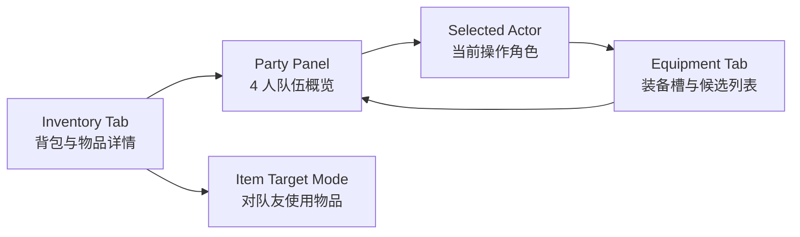
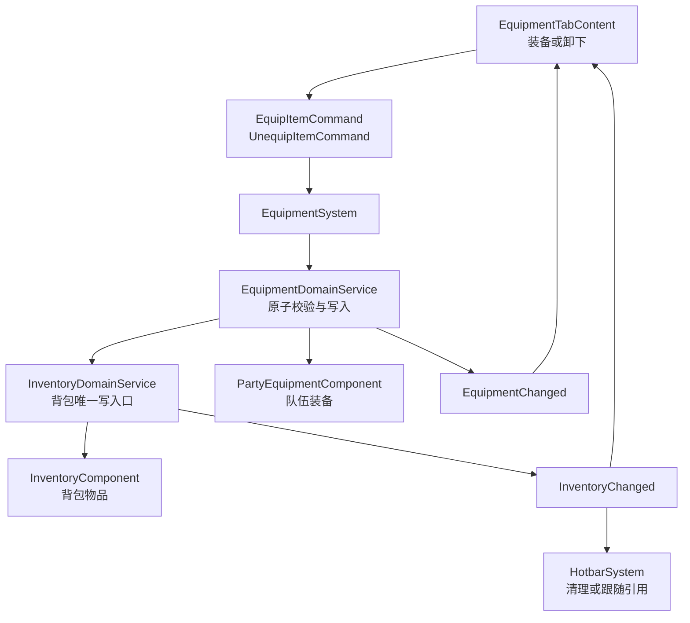

# 物品栏队伍栏与装备栏重构计划

## Context

当前 `InventoryMenuScene` 已经从旧背包小窗升级为独立菜单 Scene，左侧承载背包 / Hotbar / 任务等标签页，右侧仍保留早期单主角假设：

- RML 右栏硬编码为 `char_name / char_title / gold_label / farm_label`。
- `InventoryMenuCharacterPanelData` 只从 `player_` 实体读取名称与钱包。
- 装备格只是 8 个占位 slot，没有装备数据模型、装备命令、装备存档，也没有和战斗参数联动。
- 队伍数据已经存在：`PartyComponent.active_actor_ids_` 最多 4 人，战斗入口也会用它构建玩家方单位。
- RPG 数据已有 `ActorData / ClassData / PortraitRefData`，可用于菜单队伍展示；但当前 ItemCatalog 还没有 `Equipment` 类别，RpgCatalog 也没有装备表。

本计划目标是把右侧信息栏从“主角栏”升级为“队伍栏”，并把 `Equipment` 标签页从占位页升级为真实可交互的装备界面。

## Goals

- 背包页右侧显示最多 4 个 active party member，而不是只显示主角。
- 背包页支持“物品使用目标选择”：选中可用物品后，在右侧队伍栏选择目标。
- 装备页支持选择队友、查看装备槽、从背包装备物品、卸下 / 替换装备。
- 装备数据进入数据驱动链路，装备状态进入存档链路。
- 战斗单位构建时能读取装备加成，使装备系统对回合制战斗真实生效。
- UI 与实现沿用现有 `InventoryMenuScene + IMenuTabContent + RmlDocumentController` 架构。

## Non-Goals

- 本阶段不做完整等级 / 经验 / 成长曲线系统。
- 本阶段不做复杂装备词条、随机属性、强化、耐久度。
- 本阶段不把发型、皮肤、眼睛等纯外观槽混进战斗装备槽；它们仍归已有 appearance system。
- 装备改变角色地图外观可以预留字段，但不作为首个 MVP 的阻塞项。

## Decisions

- MVP 装备槽固定为 5 槽：`weapon / offhand / head / body / accessory`。`hands / feet / accessory_2` 留到词条和装备内容变多后再扩展。
- 每个队友的战斗外当前 HP / MP 由玩家实体上的 `PartyRuntimeStatsComponent` 持久化，`PartyComponent` 继续只负责队伍名单。
- 装备物品可以存在于背包，但不能绑定到 Hotbar；如果历史存档或旧逻辑中已有绑定，装备时必须清空对应 Hotbar 引用。
- `EquipmentDomainService` 不直接改 `InventoryComponent::slots_`，所有背包增减都通过 `InventoryDomainService`，以保持 `InventoryChanged`、Hotbar 跟随和背包不变量只有一条写入路径。
- 装备权限校验使用 `recruited_actor_ids_`，不是 `active_actor_ids_`。板凳队友允许在菜单中换装备，是否参战只影响战斗入口。
- MVP 中跨角色转移装备采用两步操作：从 A 卸下回背包，再给 B 装备。直接从其他角色身上抢装备作为候选源留到后续优化。
- 金币 / 农场名 / 时间等全局信息统一放到 `#menu-panel` 底部的 `#menu-footer`，不再放在右侧角色卡内部。
- 装备外观 MVP 不写入 `equipment.json`。后续若接入外观变化，必须复用现有 layered appearance 的 slot / variant，并通过 appearance system 生效，避免出现战斗和探索两套外观真相。

## Target UX

### 背包页

右侧固定变为 `PartyPanel`：

- 纵向最多 4 张成员卡。
- 每张卡显示小头像、名字、职业 / Lv、HP / MP 概览。
- 当前选中成员高亮。
- 空队友位显示半透明占位。
- 金币和农场名从角色信息中移出，放入 `#menu-footer`。

背包页的默认状态仍以左侧物品槽为主。触发 `Use` 后进入目标选择状态：

- 右侧队伍卡变为目标列表。
- 不可用目标置灰。
- 确认后派发带 actor target 的 `UseItemCommand`。
- 取消回到物品 action menu。

### 装备页

装备页使用同一个右侧 `PartyPanel` 作为队友选择器。左侧 `panel-equipment` 显示当前选中队友的装备详情：

- 上方：当前角色名称、职业、核心参数摘要。
- 中部：5 个装备槽。
  - `weapon`
  - `offhand`
  - `head`
  - `body`
  - `accessory`
- 下方：候选装备列表与详情区。
- 选中装备槽时，候选列表只显示背包中可装备到该槽、且当前角色满足限制的装备。
- 选中候选装备时显示参数变化，例如 `ATK +4 / DEF -1`。



## Data Model

### ItemCatalog

扩展现有物品类别：

- 新增 `ItemCategory::Equipment`。
- `item_config.json` 中装备物品仍负责通用物品字段：`id / display_name / icon_id / description / stack_limit`。
- 装备物品 `stack_limit` 默认建议为 `1`。

示例：

```json
{
  "id": "equip_bronze_sword",
  "category": "equipment",
  "icon_id": "weapons/bronze_sword",
  "stack_limit": 1,
  "display_name": "Bronze Sword",
  "description": "A simple sword for new adventurers."
}
```

### RpgCatalog Equipment Data

新增 `assets/data/rpg/equipment.json`，由 `RpgCatalog` 加载，并在 manifest 中注册。

装备表以 inventory item id 为主键，避免装备物品和背包物品出现两套 id：

```json
{
  "equipment": [
    {
      "item_id": "equip_bronze_sword",
      "slot": "weapon",
      "param_bonuses": {
        "atk": 4
      },
      "allowed_classes": ["class.swordsman"]
    }
  ]
}
```

新增结构建议：

- `EquipmentSlotId`
- `EquipmentData`
- `EquipmentParamBonus`
- `EquipmentRestriction`

`RpgCatalog::validateReferences()` 需要校验：

- `equipment.item_id` 必须存在于 `ItemCatalog`。
- 对应 item 的 category 必须是 `equipment`。
- 对应 item 不允许同时配置 `on_use` 或 `battle_use`，装备和可使用物品保持互斥。
- `slot` 必须是合法装备槽。
- `allowed_classes / allowed_actors` 引用必须存在。

### Party Equipment State

队友不一定都有当前地图实体，所以装备状态不要挂在队友实体上。建议挂在玩家实体的队伍组件旁边：

```cpp
struct ActorEquipmentLoadout {
    std::unordered_map<EquipmentSlotId, entt::id_type> equipped_item_ids_;
};

struct PartyEquipmentComponent {
    std::unordered_map<std::string, ActorEquipmentLoadout> loadouts_by_actor_id_;
};
```

装备物品从背包装备后，应离开 `InventoryComponent`，由 `PartyEquipmentComponent` 持有。卸下时再回到背包。这样背包不会同时显示“已装备物品”和“可用物品”，心智模型更清晰。

### Party Runtime Stats

队伍成员可能没有当前地图实体，但背包队伍栏和菜单中使用药水都需要战斗外当前 HP / MP。因此新增玩家实体组件：

```cpp
struct ActorRuntimeState {
    int current_hp{0};
    int current_mp{0};
};

struct PartyRuntimeStatsComponent {
    std::unordered_map<std::string, ActorRuntimeState> states_by_actor_id_;
};
```

规则：

- 新招募 actor 初始化为当前最终 `mhp / mmp`。
- 如果组件缺失或某个 actor 没有 runtime state，UI 可以用最终最大值作为 `current == max` 的临时 fallback，并记录 warn。
- `ActorStatsResolver` 负责给出最终最大 HP / MP，`PartyRuntimeStatsComponent` 只保存当前值。
- 存档加载时如果当前 HP / MP 超过装备变化后的最大值，需要 clamp 到最大值。
- 存档中 actor id 不存在时丢弃该条 runtime state 并 warn，不阻断读档。

## Command Flow

新增命令 / 事件建议：

- `EquipItemCommand`
  - `player`
  - `actor_id`
  - `inventory_slot_index`
  - `target_slot`
- `UnequipItemCommand`
  - `player`
  - `actor_id`
  - `slot`
  - `preferred_inventory_slot`
- `EquipmentChanged`
  - `player`
  - `actor_id`
  - `slots`
  - `full_sync`
- `PartyRuntimeStatsChanged`
  - `player`
  - `actor_id`
  - `full_sync`

`UseItemCommand` 保留单一命令入口，新增可选字段：

- `std::optional<std::string> actor_target_id`

系统根据物品配置决定语义：

- `on_use`：仍作用于背包自身，不需要 actor target。
- `battle_use` 且 scope 是 `one_ally`：需要 `actor_target_id`，成功后修改 `PartyRuntimeStatsComponent`。
- scope 不支持或目标非法时拒绝，不消耗物品。

核心写入入口建议新增 `EquipmentDomainService`，负责原子事务：

- 校验 actor 是否在 `PartyComponent.recruited_actor_ids_` 中。
- 校验装备物品存在、slot 匹配、职业 / 角色限制通过。
- 先模拟背包空间与替换结果，确认能完整成功后再执行真实写入。
- 装备时通过 `InventoryDomainService::removeItem()` 从背包移除新装备。
- 替换时通过 `InventoryDomainService::addItem()` 把旧装备放回原背包槽或第一个可用槽。
- 卸下时背包无空间则失败且不改变装备状态。
- 装备物品所在 inventory slot 若被 Hotbar 引用，成功装备后必须清空对应 Hotbar 绑定。
- 成功后触发 `InventoryChanged` 与 `EquipmentChanged`。



## Implementation Plan

### Phase 1: 右侧队伍栏重构

- 将 `InventoryMenuCharacterPanelData` 重命名并扩展为 `InventoryMenuPartyPanelData`。
- 新增 `PartyMemberPanelViewModel`：
  - `actor_id`
  - `display_name`
  - `class_label`
  - `level_label`
  - `hp_text`
  - `mp_text`
  - `portrait_decorator`
  - `selected`
  - `empty`
  - `targetable`
- `InventoryMenuScene` 绑定 `party_members` 数组，而不是单个 `char_name / char_title`。
- 数据来源：
  - `PartyComponent.active_actor_ids_`
  - `RpgCatalog::findActor()`
  - `RpgCatalog::findClass()`
  - `PartyRuntimeStatsComponent` 若尚未落地，则临时用 `max/max` fallback。
  - `PlayerWalletComponent`
- 修改 `inventory_menu.rml / rcss`：
  - `#char-col` 改为 `#party-col`。
  - 用 `data-for="member : party_members"` 渲染队伍卡。
  - 新增 `#menu-footer` 承载金币 / 农场名。
- 背包页暂时只做展示与成员选择，不改变物品使用命令。

验收：

- 1 人队伍时显示主角 + 3 个空位。
- 2 到 4 人队伍时按 `active_actor_ids_` 顺序显示。
- 缺失 actor 数据时显示 fallback 文本并记录 warn。
- PartyPanel view model 覆盖 1 / 2 / 3 / 4 名队友的单元测试。
- 原背包 / Hotbar 拖拽与排序行为不回归。

### Phase 2: 装备数据与后端

- 新增装备槽枚举和字符串转换：
  - `src/game/data/rpg_types.*`
- 新增装备数据结构：
  - `src/game/data/rpg_data.h`
- 扩展 `RpgCatalog`：
  - `loadEquipment()`
  - `findEquipmentByItem()`
  - `listEquipment()`
  - manifest 支持 `equipment`
- 扩展 `ItemCatalog`：
  - 支持 `category: "equipment"`
- 新增 `PartyEquipmentComponent`。
- 新增 `PartyRuntimeStatsComponent`。
- 新增 `EquipmentDomainService`。
- 新增 `EquipmentSystem` 订阅装备命令。
- 扩展 `SaveData`：
  - 建议新增 `equipment_state`，schema bump 到 v4。
  - 同时新增 `party_runtime_state`，保存 `actor_id -> current_hp/current_mp`。
  - 保存 `actor_id -> slot -> item_id`。
  - migrator 为旧存档补空装备状态与 runtime stats。
  - 读档遇到已删除装备 item id 时置空该槽并 warn，不阻断存档加载。

验收：

- 装备表加载与引用校验有单元测试。
- 装备 item 不能同时配置 `on_use / battle_use` 的校验测试。
- 装备 / 卸下 / 替换事务有单元测试。
- 背包满时卸下失败且状态不变。
- 装备变动后 Hotbar 引用同步正确；被装备的 inventory slot 若原本被绑定，绑定会被清空。
- 存档 roundtrip 保留每个 actor 的装备。
- 存档 roundtrip 保留每个 actor 的当前 HP / MP。

### Phase 3: 装备页 UI

- 新增 `EquipmentTabContent`：
  - 文件建议：`src/game/ui/equipment_tab_content.h/.cpp`
  - 实现 `IMenuTabContent`
  - 监听 `InventoryChanged / EquipmentChanged`
  - 维护装备槽、候选装备、详情、参数变化 view model
- `InventoryMenuScene` 将 `MenuTabId::Equipment` 从 `PlaceholderTabContent` 替换为 `EquipmentTabContent`。
- RML 结构：
  - `#equipment-summary`
  - `#equipment-slot-grid`
  - `#equipment-candidate-list`
  - `#equipment-detail`
- 支持输入状态：
  - `SlotSelect`
  - `CandidateSelect`
  - `ConfirmSwap`
  - `BlockedMessage`
- 操作规则：
  - 点击装备槽：显示该槽候选装备。
  - 点击已装备槽：打开 `Unequip / Change / Cancel`。
  - 点击候选装备：显示参数变化，确认后派发 `EquipItemCommand`。
  - 不列出其他角色身上的装备作为候选源；跨角色转移使用“卸下再装备”的两步流程。
  - `Cancel` 优先关闭候选列表，再退回标签页，再关闭菜单。

验收：

- 键盘 / 手柄方向导航覆盖装备槽与候选列表。
- 鼠标点击与现有菜单风格一致。
- 可装备物品从背包消失，卸下后回背包。
- 替换装备后旧装备回背包。
- 所有按钮有 `tf-nav-auto` 与焦点样式。

### Phase 4: 背包物品目标选择

- 扩展 `UseItemCommand`：
  - `target`
  - `actor_target_id`
  - `inventory_slot_index`
  - `count`
  - `show_prompt`
- 背包页 action menu 选择 `Use` 时：
  - 如果物品只影响背包自身，例如作物转种子，保持现有 `UseItemCommand`。
  - 如果物品有 actor target，例如恢复 HP / MP，进入 `ItemTargetMode`。
- 右侧 `PartyPanel` 根据物品 scope 标记 `targetable`。
- 初期可先支持 `one_ally`，后续再扩展 `all_allies / dead_ally`。

验收：

- Potion 这类 battle_use 物品可以在菜单中选择队友作为目标。
- 成功使用后写入 `PartyRuntimeStatsComponent`，并 clamp 到当前最大 HP / MP。
- 不可用目标置灰且无法确认。
- 取消目标选择不会消耗物品。

### Phase 5: 战斗与参数联动

- 新增 `ActorStatsResolver` 或等价 helper：
  - 输入 `ActorData / ClassData / ActorEquipmentLoadout`
  - 输出最终 `ParamArray`
- resolver 按需计算并允许轻量缓存；缓存以 `actor_id + equipment revision` 为 key，在 `EquipmentChanged` 后失效。
- `GameScene` 进入战斗前从玩家实体读取 `PartyEquipmentComponent`，传入 `BattleUnitBuildOptions`。
- `BattleUnitFactory` 构建玩家方单位时应用装备参数加成。
- 战斗单位当前 HP / MP 初值优先读取 `PartyRuntimeStatsComponent`，缺失时回退为满状态。
- 战斗结束后，玩家方 final units 的 HP / MP 写回 `PartyRuntimeStatsComponent`。
- 若装备有 `skill_ids` 或 trait，预留到技能系统阶段再接入。
- 装备外观接入留到后续阶段；接入时必须复用 layered appearance，不在 battle scene 内私自解释第二套外观字段。

验收：

- 装备武器后进入战斗，玩家方 ATK 有变化。
- 卸下装备后再次进入战斗，参数恢复。
- 多名队友各自读取自己的装备。
- 战斗结束后队友 HP / MP 能写回菜单队伍栏。

### Phase 6: 文档、调试与回归

- 更新 `docs/game/inventory_hotbar.md`，说明背包菜单新数据流。
- 新增 `docs/gameplay/equipment-system.md`，说明装备数据格式、命令流和存档格式。
- 可选新增 Debug 面板：
  - 查看 active party。
  - 查看每个 actor 当前装备。
  - 一键给背包加入测试装备。
- 回归测试重点：
  - `InventoryMenuScene` data binding source test。
  - `RpgCatalog` equipment load / validation test。
  - `EquipmentDomainService` transaction test。
  - Hotbar pin 项被装备后的同步测试。
  - `SaveData` v4 roundtrip test。
  - `BattleUnitFactory` equipment stat test。

构建与测试建议：

```bash
ninja -C build
ctest --test-dir build -R "(inventory|equipment|rpg|save|battle)" --output-on-failure
```

## File Checklist

预计新增：

- `src/game/component/party_equipment_component.h`
- `src/game/component/party_runtime_stats_component.h`
- `src/game/domain/equipment_domain_service.h/.cpp`
- `src/game/system/equipment_system.h/.cpp`
- `src/game/ui/equipment_tab_content.h/.cpp`
- `assets/data/rpg/equipment.json`
- `docs/gameplay/equipment-system.md`

预计修改：

- `src/game/scene/inventory_menu_scene.h/.cpp`
- `src/game/scene/inventory_menu_character_panel.h/.cpp`
- `ui/rmlui/scenes/inventory_menu.rml`
- `ui/rmlui/scenes/inventory_menu.rcss`
- `src/game/data/item_catalog.h/.cpp`
- `src/game/data/rpg_data.h`
- `src/game/data/rpg_catalog.h/.cpp`
- `src/game/data/rpg_types.h/.cpp`
- `src/game/defs/commands.h`
- `src/game/defs/events.h`
- `src/game/runtime/system_bundle.h/.cpp`
- `src/game/runtime/game_runtime_assembler.cpp`
- `src/game/save/save_data.h/.cpp`
- `src/game/save/save_migrator.cpp`
- `src/game/save/save_service.cpp`
- `src/game/battle/battle_unit_factory.h/.cpp`
- `src/game/battle/actor_stats_resolver.h/.cpp`
- `src/CMakeLists.txt`

## Open Questions

- 装备是否允许被卖出；如果允许，商店 sell 列表需要排除已装备物品或单独列出。
- 后续是否需要支持从其他角色身上直接转移装备，而不是 MVP 的两步流程。
- 装备外观何时接入 layered appearance，以及是否需要区分探索外观和战斗外观。
