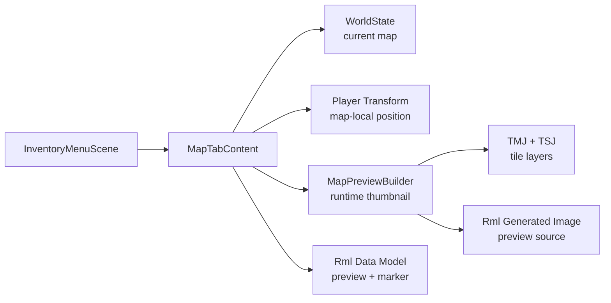

# Map Tab Phase 1：当前地图预览与玩家位置

## 目标

把 `InventoryMenuScene` 的 `Map` tab 从 placeholder 升级为可见的小地图页：

- 显示当前 map 的运行时 tilemap 缩略图。
- 显示当前区域名称。
- 在缩略图上标出玩家当前位置。
- 保持右侧 Party panel 对所有 tab 可见。
- 不新增存档字段，不做 landmark、任务 marker 或地图切换。

## 实现思路

Phase 1 只解决“当前 map 长什么样、玩家在哪里”。数据来源保持单向派生：

- 当前 map id 来自 `WorldState::getCurrentMap()`。
- map 尺寸与文件路径来自 `WorldState::MapState::info`。
- 玩家位置直接来自玩家实体的 `TransformComponent::position_`；运行时坐标是当前 map-local 像素坐标，越界时 clamp 到当前 map 尺寸。
- 缩略图运行时从 `.tmj` 的静态 tile layer 与静态 tile object 生成。

关键设计：

- `MapTabContent` 的 view state 构建函数接受 `map_id`，不要在 view model 内硬编码“当前地图”。
- 坐标换算统一由 helper 负责：`map local pixel -> preview content rect -> RML absolute position`。
- preview frame 固定在左侧 tab panel 内，实际地图图像等比 contain；比例不一致时使用 letterbox offset。
- 玩家 marker 使用 8dp 纯 CSS 圆点，点击区域同视觉大小。Phase 1 先不处理 marker click，也不引入 map icon spritesheet。
- runtime 缩略图不落入 save，不影响地图动态状态。

## 运行时缩略图方案

RmlUi 当前图片加载路径主要走 `RenderInterface_GL3_STB::LoadTexture(source)`。为了避免运行时生成临时 PNG 文件，Phase 1 建议新增一个轻量的 generated image bridge：

- `RmlGeneratedImageRegistry` 持有 `source_uri -> DecodedImage`。
- `RenderInterface_GL3_STB::LoadTexture()` 遇到 `generated://...` 时从 registry 取 RGBA 像素并调用 `GenerateTexture()`。
- `MapPreviewBuilder` 生成当前 map 缩略图后注册为 `generated://map-preview/<map-name>`。
- source URI 使用稳定 map name，避免反复激活 tab 时累积新的 RmlUi GL texture；只有未来确实需要替换同一 map 的 CPU image 时才引入 generation sequence。
- registry 由 `RmlUiRuntime` 持有，生命周期必须长于 `InventoryMenuScene`；document reload 或重新解析 image source 时，RmlUi 仍可能再次请求 CPU 侧 generated image。
- 注册句柄使用 RAII，释放时只 unregister CPU 侧 `DecodedImage`，不尝试回收 GL texture；GL texture 生命周期由 RmlUi 管理。

缩略图生成本身只渲染静态 tilemap：

- 读取 `.tmj` 中 visible、`opacity > 0` 且未标记 `properties.invisible` 的 `tilelayer`，按 Tiled layer 顺序合成。
- 读取 external `.tsj` tileset，解析 `firstgid`、tile size、columns、image path。
- 使用 `ImageDecodeService::decodeRGBA()` 解码 tileset 图片。
- Phase 1 对 Tiled GID flip flag 只 strip flag，不做实际翻转；小地图预览可接受该轻微视觉差异。
- 假设单张 map 内 tile size 一致；若发现不一致，输出 warn 并跳过异常 tile。
- 第一次打开菜单时同步生成缩略图可以接受；同一 `MapPreviewBuilder` 实例按 `map_name` 缓存已生成的 `DecodedImage`，菜单关闭时随 `MapTabContent` 一起释放。
- object layer 只渲染静态 tile object（带 `gid` 的对象，例如房屋、树和装饰）；非 tile object（trigger、collider、light 等）、动态实体、autotile 动画和粒子不进入 Phase 1 缩略图。

## UI 结构

`panel-map` 取代 placeholder，推荐结构：

- 顶部：区域名，例如 `Home Exterior`。
- 中部：固定尺寸 map preview frame。
- frame 内：
  - `` 或等价元素显示 generated preview source。
  - 绝对定位的 player marker。
- 底部：简短状态文字，例如 `Current Position` 或 `No map data`。

文案保持英文，不出现中文 UI 文本。

## 需要新增的文件

- `src/game/ui/map_tab_content.h`
- `src/game/ui/map_tab_content.cpp`
- `src/game/ui/map_preview_builder.h`
- `src/game/ui/map_preview_builder.cpp`
- `src/game/ui/map_coordinate_mapper.h`
- `src/game/ui/map_coordinate_mapper.cpp`
- `src/engine/ui/rmlui/rml_generated_image_registry.h`
- `src/engine/ui/rmlui/rml_generated_image_registry.cpp`
- `tests/game/map_tab_content_test.cpp`
- `tests/game/map_preview_builder_test.cpp`
- `tests/game/map_coordinate_mapper_test.cpp`
- `tests/engine/ui/rmlui_generated_image_registry_test.cpp`

需要修改：

- `src/engine/ui/rmlui/render_interface_gl3_stb.h/.cpp`
- `src/engine/ui/rmlui/rml_ui_runtime.h/.cpp`
- `src/game/scene/inventory_menu_scene.h/.cpp`
- `src/game/scene/game_scene.cpp`
- `ui/rmlui/scenes/inventory_menu.rml`
- `ui/rmlui/scenes/inventory_menu.rcss`
- 相关 CMake / test 注册文件

可选新增素材：

- 无。

Phase 1 玩家 marker 使用纯 CSS 圆点。`ui-map-icons` 与 `landmark / exit / quest` 图标推迟到 Phase 2 一并设计。

## 实现步骤

### Step 1: Rml generated image bridge

新增 generated image registry，让 RmlUi 能直接消费运行时 RGBA 图片。

- `RmlGeneratedImageRegistry` 提供 register / unregister / find。
- `RmlUiRuntime` 持有 registry，并暴露受控访问入口。
- `RenderInterface_GL3_STB` 在 `LoadTexture()` 中优先解析 `generated://` source。
- registry 不拥有 GL texture，只拥有 CPU 侧 `DecodedImage`；GL texture 仍由 RmlUi render interface 生成和释放。
- preview URI 使用稳定的 `generated://map-preview/<map-name>`。同一 map 已注册时跳过重复生成和重复注册。

### Step 2: Tilemap thumbnail builder

新增 `MapPreviewBuilder`，输入 `.tmj` 路径，输出 `DecodedImage`。

- 解析 map width / height / tilewidth / tileheight。
- 解析 external tileset 引用并缓存 decoded tileset image。
- 遍历 visible、`opacity > 0` 且未标记 `properties.invisible` 的 tile layers，把 tile 像素合成到 RGBA buffer。
- 支持地图 background color fallback。
- strip Tiled GID flip flags，但 Phase 1 不执行翻转绘制。
- 按 `map_name` 在 `MapPreviewBuilder` 实例内缓存已生成的 `DecodedImage`，Phase 1 可用容量 1 或小型 LRU。
- 渲染静态 object layer tile object，支持 Tiled image collection tileset；跳过没有 `gid` 的对象。
- 对缺失 tileset / tile image 输出 warn，并生成可见 fallback 图片。

### Step 3: 坐标映射 helper

新增 `MapCoordinateMapper`，集中处理 preview frame 和 marker 坐标。

- 输入：map pixel size、preview frame size、map-local pixel position。
- 输出：content rect、scale、offset、marker left/top。
- 玩家 transform 已经是当前 map-local 像素坐标，caller 只做 bounds clamp 后传入 helper。
- 对 map size 为空、玩家位置越界做 clamp。
- 使用同一套 scale / offset 驱动 preview image 和 player marker。

### Step 4: MapTabContent

新增 `MapTabContent`，实现 `IMenuTabContent`。

- 注册 `MapTabViewModel` / 必要 struct。
- 绑定 `map_title`、`map_preview_src`、`has_map_preview`、`player_marker_*`、`map_status_text`。
- `onActivated()` 从 `WorldState::getCurrentMap()` 取当前 map id，并调用参数化的 view state builder。
- `onActivated()` 同时读取玩家 transform，clamp 到当前 map bounds 后计算 marker 坐标。
- `update()` Phase 1 留空。菜单打开时游戏已暂停，玩家不会移动。
- `onCancel()` 返回 `false`，仍交给菜单关闭逻辑。

### Step 5: InventoryMenuScene 接线

替换 `MenuTabId::Map` 的 `PlaceholderTabContent`。

- `InventoryMenuScene` 构造函数接收 `game::world::WorldState*`。
- `GameScene::onInventoryToggle()` 从 runtime services 传入 `services_->world_state.get()`；当前 `GameRuntimeServices` 已持有 `world_state`。
- `initUI()` 注册 Map tab 数据类型并创建 `MapTabContent`。
- 保持 Party panel 在 tabset 外部，不为 Map tab 引入新的右栏。

### Step 6: RML / RCSS 布局

替换 `panel-map` placeholder。

- 增加 `#map-content`、`#map-title`、`#map-preview-frame`、`#map-preview-image`、`#map-player-marker`、`#map-status`。
- preview frame 使用固定尺寸，留出底部状态区。
- player marker 使用 8dp 纯 CSS 圆点，例如高对比填充色、1dp 深色边框和轻微阴影。
- fallback 状态显示 `No map data`，避免空白面板。

### Step 7: 测试与验收

补齐数据、坐标和 RML 结构测试。

- 坐标映射测试覆盖 560x400、240x240、480x272 三类比例。
- 坐标映射额外覆盖极宽和极高的 fixture 比例，验证 letterbox offset。
- preview builder 用小型 fixture map 验证能生成非空 RGBA 图片。
- MapTabContent 测试覆盖正常 map、缺失 world state、玩家缺少 transform。
- InventoryMenuScene 结构测试确认 Map tab 不再是 placeholder，且 Party panel 仍在 tabset 外。

## Acceptance Criteria

- 切到 `Map` tab 时能看到当前区域标题、地图预览和玩家 marker。
- 玩家 marker 使用统一 scale / offset 规则定位，在不同 map 尺寸下不漂移。
- `Map` tab 不显示 Gold footer，不影响右侧 Party panel。
- 缩略图由运行时 tilemap 数据生成，不依赖手工导出的静态地图图。
- 不新增 save schema。
- 相关单元测试通过，`git diff --check` 通过。

## Todo

- [x] 新增 `RmlGeneratedImageRegistry` 并接入 `RmlUiRuntime`。
- [x] 扩展 `RenderInterface_GL3_STB::LoadTexture()` 支持 `generated://` source。
- [x] 实现 `MapPreviewBuilder` 的 TMJ / TSJ 解析与静态 tile layer / tile object 合成。
- [x] 实现 `MapCoordinateMapper` 并覆盖多尺寸测试。
- [x] 实现 `MapTabContent` view model、data type registration 和 dirty 标记。
- [x] 修改 `InventoryMenuScene` / `GameScene`，传入 `WorldState` 并创建真实 Map tab。
- [x] 替换 `panel-map` RML placeholder。
- [x] 编写 Map tab RCSS，包括 preview frame 和 player marker。
- [x] 补齐 Map tab、preview builder、坐标映射、generated image registry 测试。
- [x] 运行 `ninja -C build engine_tests game_tests`、相关 ctest 过滤与完整 ctest 回归。

## Implementation Notes

实现时需要按本计划锁定以下约束：

- Phase 1 marker 使用 CSS 圆点，不引入美术图标。
- Tiled GID flip flag 只 strip，不做翻转绘制。
- 单张 map 内假设 tile size 一致，异常 tileset 只 warn 并跳过。
