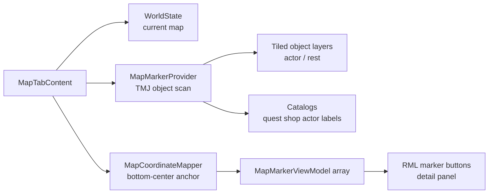

# Map Tab Phase 2：地点标记与详情显示

## 目标

在 Phase 1 的当前地图预览基础上，让 `Map` tab 能显示可选择的静态交互地点：

- 使用像素图标替换 Phase 1 的 CSS 玩家圆点。
- 在当前 map 上显示 `player / quest / shop / rest / npc` marker。
- 支持鼠标 hover / click 与键盘或手柄焦点选择 marker。
- 在地图下方显示选中 marker 的名称、类型和短描述。
- 不接入 active quest 状态、不显示 objective target；这些留给 Phase 3。
- 不新增 save schema。

## Marker 素材

Phase 2 使用专用 spritesheet，不混入 HUD、item 或 inventory sheet。建议放在 `ui/rmlui/theme/spritesheet.rcss`，命名为 `ui-map-icons`，供 Phase 2～3 复用：

```css
@spritesheet ui-map-icons {
    src: ../../../assets/textures/UI/pixel_style4.png;
    map-marker-player: 48px 16px 16px 16px;
    map-marker-quest: 128px 0px 16px 16px;
    map-marker-shop: 48px 32px 16px 16px;
    map-marker-rest: 0px 16px 16px 16px;
    map-marker-npc: 48px 0px 16px 16px;
}
```

显示规则：

- marker source rect 固定为 16px。
- UI 中以固定尺寸显示，不随地图缩放；建议普通态 12dp，选中或焦点态 14dp。
- marker 的理想 map 坐标对齐到图标下方中心点：`left = preview_x - width / 2`，`top = preview_y - height`。
- 为避免靠近地图边缘时被 `#map-preview-frame` 裁切，最终 top-left 需要 clamp 到 preview frame 内；只有图标会溢出时才牺牲少量锚点精度。
- 点击命中区域等于当前视觉尺寸，不额外扩大隐藏热区。
- 没有图标的地图内容不标注，例如 generic landmark、exit、chest、animal、trigger。

## 数据来源

Phase 2 只扫描当前 map 的 Tiled object layer，构建静态交互 marker snapshot。



支持的来源：

- `player`：玩家实体 `TransformComponent::position_`，map-local 像素坐标。
- `quest`：`type="actor"` 且有 `quest_offer_id` 的 Tiled object。Phase 2 只表示“这里有 quest giver”，不根据 quest runtime 判断可接、进行中或可交付。
- `shop`：`type="actor"` 且有 `shop_id` 的 Tiled object。
- `npc`：仅 `type="actor"` 且有 `recruit_actor_id` 的 Tiled object。没有 recruit 专用图标，Phase 2 统一用 `npc` 图标。
- `rest`：`type="rest"` 的 Tiled object。
- 普通有名字 actor 如果没有 `quest_offer_id / shop_id / recruit_actor_id`，Phase 2 不生成 marker，避免把氛围 NPC 误导成可交互入口。

坐标提取：

- point object 使用 `x / y`。
- rectangle object 使用 `x + width * 0.5` 与 `y + height`，让 marker 下方中心点落在区域底部中心。
- ellipse object 退化为 bounding rectangle 底部中心。
- polygon / polyline object 若存在 points，先计算本地 points bounds，再取底部中心；points 无效时 warn 并跳过。
- 坐标在生成 view model 前 clamp 到当前 map pixel bounds。

优先级：

- 同一个 Tiled actor object 若同时满足多类标记，显示优先级为 `shop > quest > npc`，保持和 `entity_builder.cpp` 当前 runtime 交互优先级一致。
- `rest` 来自独立 object type，不参与 actor 合并优先级。
- 默认选中第一个非 player marker，排序按 `quest > shop > rest > npc` 后按 Tiled object id；这是选择顺序，和 actor 合并优先级互不交叉。
- 渲染层级通过 `z-index` 显式控制：selected marker 最高，其次 player、quest、shop、rest、npc。

## 详情文案

底部详情区只使用英文 UI 文案。

- Player：`Current Position` / `Player` / 当前区域名。
- Quest：标题来自 `QuestCatalog`；描述来自 `QuestData::description_`，缺失时 fallback 为 `Quest giver`。
- Shop：标题来自 `ShopCatalog`；描述优先使用 shop greeting，缺失时 fallback 为 `Buy and sell supplies.`。
- Rest：object name 优先，否则 `Rest Point`；描述为 `Recover and pass time.`。
- NPC：`recruit_actor_id` 优先通过 `RpgCatalog` 找 actor display name；否则 humanize object name；描述为 `Talk to this person.`。

若 catalog 缺失或引用失效，marker 仍保留，但使用 object name / id fallback，并输出 warn。

Phase 2 的 quest marker 是已知的过渡态：它只表示 Tiled 上存在 `quest_offer_id` 入口，不读取 quest runtime，因此已完成或暂不可接的 quest giver 仍会显示 quest 图标。Phase 3 会用 active/completed/turn-in 状态替换这套静态显示规则。

## 需要新增的文件

- `src/game/ui/map_marker_provider.h`
- `src/game/ui/map_marker_provider.cpp`
- `tests/game/map_marker_provider_test.cpp`
- `tests/fixtures/maps/map_marker_provider_test.tmj`

需要修改：

- `ui/rmlui/theme/spritesheet.rcss`
- `src/game/ui/map_tab_content.h`
- `src/game/ui/map_tab_content.cpp`
- `src/game/ui/map_coordinate_mapper.h`
- `src/game/ui/map_coordinate_mapper.cpp`
- `src/game/scene/inventory_menu_scene.h`
- `src/game/scene/inventory_menu_scene.cpp`
- `src/game/scene/game_scene.cpp`
- `ui/rmlui/scenes/inventory_menu.rml`
- `ui/rmlui/scenes/inventory_menu.rcss`
- `tests/game/map_tab_content_test.cpp`
- `tests/game/map_coordinate_mapper_test.cpp`
- `tests/game/inventory_menu_scene_slot_grid_registration_test.cpp`
- `tests/game/ui_layout_integration_test.cpp`
- 相关 CMake / test 注册文件

## 实现步骤

### Step 1: Marker data model

新增 `MapMarkerViewModel` 和 marker detail 绑定字段。

- 字段建议包含 `marker_index`、`kind`、`icon_decorator`、`left/top/width/height`、`z_index`、`title`、`type_label`、`description`、`is_selected`。
- player 判定保留在 C++ 内部默认选择逻辑中，不需要暴露 `is_player` 字段给 RML。
- `registerMapTabDataTypes()` 注册 `MapMarkerViewModel` 与 `std::vector<MapMarkerViewModel>`。
- `MapTabContent::bindModel()` 绑定 `map_markers`、`has_map_markers`、`map_detail_title`、`map_detail_type`、`map_detail_description`、`has_map_detail`。

### Step 2: Marker provider

新增 `MapMarkerProvider`，按当前 map 的 `.tmj` object layer 派生 marker candidates。

- 复用 `engine::loader::tiled::getOrLoadLevelJson()` 读取 map JSON。
- 遍历 visible object layers，跳过 `properties.invisible=true` 的 layer 或 object。
- 解析 object type 与 `quest_offer_id / shop_id / recruit_actor_id`。
- 只对带 `quest_offer_id / shop_id / recruit_actor_id` 的 actor object 生成 marker；普通命名 actor 不标注。
- 对 actor object 应用 `shop > quest > npc` 合并优先级，只产生一个 marker。
- 对 rest object 产生 `rest` marker。
- 处理 point / rectangle / ellipse / polygon / polyline 的坐标；未知或异常形状 warn 后跳过。
- 缓存当前 map 的 object marker snapshot，缓存归 `MapTabContent` 或 provider 实例所有，避免全局可变状态。

### Step 3: Catalog label resolver

为 marker 补充详情文案。

- `InventoryMenuScene` 和 `MapTabContent` 增加 `ShopCatalog*`、`QuestCatalog*`、`RpgCatalog*` 输入。
- `GameScene::onInventoryToggle()` 传入 `services_->shop_catalog.get()`。
- quest/shop/actor 引用找不到时保留 marker 并 warn，详情使用稳定 fallback。

### Step 4: Bottom-center coordinate mapping

扩展坐标 helper，支持下方中心锚点。

- 新增 `mapMarkerBottomCenterTopLeft(map_local_position, layout, marker_size)`。
- player 与地点 marker 使用同一套 map preview layout。
- 普通态、选中态尺寸不同，理想情况下下方中心点必须保持不动。
- 若理想 top-left 会溢出 preview frame，则把最终 top-left clamp 到 `0..frame_size-marker_size`，确保 marker 不被裁切；此时允许边缘 marker 的视觉锚点有少量偏移。
- 越界坐标 clamp 到 map bounds 后再映射。

### Step 5: RML / RCSS marker UI

把 marker 渲染为绝对定位的按钮。

- `#map-preview-frame` 内新增 `button.map-marker`，`data-for="marker : map_markers"`。
- 使用 `data-style-left/top/width/height` 定位，显式设置 width / height。
- 使用 `data-style-z-index="marker.z_index"` 或等价 class，把 selected marker 提升到最高层。
- 使用 `data-style-decorator="marker.icon_decorator"`。
- 绑定 `map_marker_focus(marker.marker_index)`、`map_marker_hover(marker.marker_index)`、`map_marker_click(marker.marker_index)`。
- marker button 使用 `tf-nav-auto`，确保键盘/手柄可聚焦。
- 选中态加轻微亮边或阴影，不使用中文说明文本。
- 基础层级固定为：`player=50`、`quest=40`、`shop=30`、`rest=20`、`npc=10`、`selected=100`。

### Step 6: Detail panel

将 Phase 1 的 `map-status` 升级为详情区。

- 有选中 marker 时显示 title / type / description。
- 无地点 marker 但有 player 时显示 player detail。
- 无 map preview 时显示 `No map data`。
- 当前 map 无可标注地点时显示 `No places marked`。

### Step 7: Interaction state

在 `MapTabContent` 内维护选中 marker。

- 使用 `selected_marker_index_`，`onActivated()`、map 切换或 snapshot 重建时都按默认选择规则重新选择，避免跨 tab 残留旧选中态。
- hover / focus / click 都可以更新选中 marker；selection-only 路径只更新 marker 选中态、z-index、尺寸/位置和详情字段，不重建 preview 或重新扫描 marker source 数据。
- `onCancel()` 仍返回 `false`，不新增二级关闭态。
- `update()` Phase 2 仍留空；菜单暂停时玩家位置不会移动。

### Step 8: 测试与验收

补齐数据、坐标、UI 结构测试。

- `MapMarkerProvider` 测试使用 `tests/fixtures/maps/map_marker_provider_test.tmj` 自包含 fixture，避免依赖真实 demo 地图布局。
- `MapMarkerProvider` 测试覆盖 quest/shop/npc 优先级、普通命名 actor 不生成 marker、rest rectangle 坐标、ellipse / polygon / 异常 object 不崩溃。
- `MapTabContent` 测试覆盖 player + object markers、默认选择、hover/focus/click 切换详情、catalog fallback；catalog 文案组合规则用 inline fixture 覆盖，避免全部断言依赖项目真实 JSON 名称。
- `MapCoordinateMapper` 测试覆盖 bottom-center anchor 与选中态尺寸变化不漂移。
- `MapCoordinateMapper` 测试覆盖靠近 preview frame 顶边时 marker 不会被裁切。
- RML / RCSS 结构测试确认 marker 使用 button、`data-for`、event callback、显式 width/height、spritesheet 坐标。
- InventoryMenuScene 结构测试确认 ShopCatalog / QuestCatalog / RpgCatalog / WorldState 透传到 Map tab。

## Acceptance Criteria

- `Map` tab 使用 `assets/textures/UI/pixel_style4.png` 显示 player / quest / shop / rest / npc marker。
- marker 下方中心点对齐到 map-local 坐标，地图 letterbox 下不漂移。
- 靠近地图顶边或其它边缘的 marker 不会溢出或被 preview frame 裁切。
- 同一 actor object 多类型时按 `shop > quest > npc` 显示。
- 没有 `quest_offer_id / shop_id / recruit_actor_id` 的普通 actor 不显示 marker。
- 没有对应图标的地图内容不显示 marker。
- 鼠标、键盘或手柄选中 marker 后，底部详情文本正确更新。
- 无 marker、缺 catalog、缺 map data 都有稳定 fallback。
- 不新增 save schema。
- 相关单元测试通过，`git diff --check` 通过。

## Todo

- [x] 新增 `MapMarkerViewModel`、marker detail 绑定字段与 Rml data type registration。
- [x] 新增 `MapMarkerProvider`，扫描当前 map object layer 并生成 marker candidates。
- [x] 接入 `ShopCatalog` / `QuestCatalog` / `RpgCatalog` 以解析 marker 名称与描述。
- [x] 扩展坐标 helper，支持 bottom-center marker anchor。
- [x] 更新 `MapTabContent`，生成 marker view models 并维护 `selected_marker_index_`。
- [x] 更新 `InventoryMenuScene` / `GameScene` 构造参数和透传。
- [x] 更新 `inventory_menu.rml`，把 marker 渲染为可聚焦按钮。
- [x] 更新 `theme/spritesheet.rcss`，加入 `ui-map-icons` spritesheet。
- [x] 更新 `inventory_menu.rcss`，加入 marker 定位、焦点、选中态和 z-index 样式。
- [x] 将 `map-status` 改为 marker detail panel。
- [x] 补齐 marker provider、MapTabContent、坐标映射、RML 结构测试。
- [x] 运行 `ninja -C build engine_tests game_tests`、相关 ctest 过滤与完整 ctest 回归。

## Implementation Notes

- Phase 2 的 quest marker 是静态 quest giver 位置，不代表当前 quest runtime 状态。
- Phase 3 再处理 active quest、turn-in、objective target 和 quest 状态变体。
- marker 只消费当前 map snapshot，不写入 save。
- 普通有名字 actor 默认不标注；普通对话 NPC 需要等未来有 `dialogue_id` 或显式 map marker 数据后再进入地图。
- RmlUi absolute 元素必须显式设置 `width` / `height`，不要依赖 `left + right` 或 `top + bottom` 拉伸。
