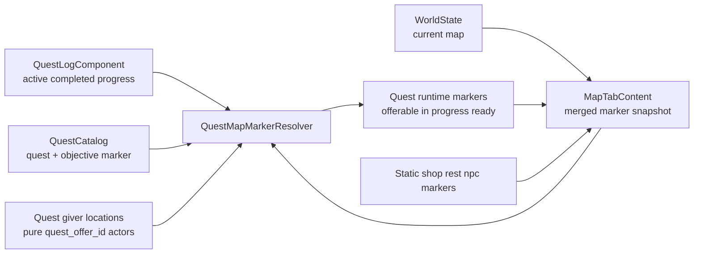

# Map Tab Phase 3：任务标记接入

## 目标

在 Phase 2 的静态地点 marker 基础上，让 `Map` tab 能反映当前任务状态，而不是永远把 quest giver 当作静态地点：

- 根据玩家 `QuestLogComponent` 显示当前任务相关 marker。
- 用不同视觉状态区分 `offerable / in_progress / ready_to_turn_in`。
- 复用 Tiled `quest_offer_id` actor 坐标显示 giver / turn-in marker。
- 为 objective 增加可选 map marker 配置，显示任务目标位置。
- 让详情区展示任务相关短提示和 objective 进度。
- 不新增 Map tab 专用 save schema，不做跨区域世界地图浏览。

## 范围约束

Phase 3 只做“当前区域 quick map 上的 quest hint”，不把地图页扩成完整 quest tracker。

- 只渲染**当前 map** 上的任务 marker；若任务目标在别的 map，本阶段不显示远端 marker，也不做方向箭头。
- `completed` quest 不再显示 quest marker。
- 没有 marker 配置的 objective 仍正常推进任务，只是不出现在地图上。
- 未接受任务的 giver 只在当前 map 存在可交互 `quest_offer_id` actor 时显示 `offerable` marker。
- active quest 的 objective marker 只在任务尚未 ready-to-turn-in 时显示；一旦 ready，改显示 giver 的 turn-in marker，避免同时提示“去打怪”和“可交付”。
- Phase 2 的 `shop > quest > npc` actor 合并优先级不变。若 actor 同时是 shop 与 quest giver，地图上继续显示 shop，不额外叠 quest marker，以保持和 runtime 交互一致。

## 数据模型

Phase 3 使用混合数据源，不新增独立的 `quest_id -> map marker` 配置层。



### Giver / turn-in 坐标

- source of truth 继续是 Tiled actor object 的 `quest_offer_id`。
- `MapMarkerProvider` 在 Phase 2 已能扫描当前 map 的 object markers；Phase 3 需要保留足够信息，让 resolver 能按 `quest_id` 找到当前 map 的 quest giver marker。
- Phase 3 直接把 provider 输出契约拆清楚：`static_place_markers` 只包含 `shop / rest / npc`，`quest_giver_markers` 只包含按 runtime 优先级解析后确实是 quest giver 的 actor。
- `shop_id + quest_offer_id` hybrid actor 不进入 `quest_giver_markers`，resolver 不需要再理解或重复判断 shop 优先级。
- 不把 giver 坐标写回 `QuestData`、quest runtime 或 save。
- 若当前 map 找不到匹配 giver，任务仍存在，但 giver / turn-in marker 跳过并 warn。

### Objective marker 配置

为 `QuestObjectiveData` 增加可选 marker 字段，建议 JSON 结构：

```json
{
  "id": "kill_goblins",
  "kind": "defeat_enemy_count",
  "enemy_id": "enemy.goblin",
  "required_count": 3,
  "marker": {
    "map": "town",
    "position": [456, 224],
    "label": "Goblin Nest"
  }
}
```

对应 C++ 数据建议：

- `QuestObjectiveMarkerData`
  - `std::string map_name_`
  - `entt::id_type map_id_hash_`
  - `glm::vec2 position_`
  - `std::string label_`
- `QuestObjectiveData`
  - `std::optional<QuestObjectiveMarkerData> marker_`

解析与校验规则：

- `marker` 整体可选；缺失时保持现有 objective 行为。
- `map` 必填非空字符串。
- `position` 必须是长度为 2 的数值数组，允许整数或浮点。
- `label` 可选；objective marker 展示标题的 fallback 顺序固定为 `marker.label` → `humanize(objective.id)` → `humanize(enemy_id) + " Target"` → `Quest Objective`。
- `QuestCatalog` 只做结构校验与 hash 计算；是否存在该 map 由 Map tab resolver 结合 `WorldState` 判定并 warn，避免 `QuestCatalog` 反向依赖 world 数据。

## 任务 marker 状态

Phase 3 建议把 quest marker 细分为显式 runtime 状态，而不是继续复用 Phase 2 单一 `quest` kind。

| 状态 | 来源 | 显示条件 | 视觉建议 | 详情类型 |
| --- | --- | --- | --- | --- |
| `quest_offer` | Tiled giver | quest 未 active 且未 completed | 现有 quest icon，暖黄色 | `Quest Available` |
| `quest_objective` | objective.marker | quest active 且未 ready，objective 未完成，marker.map 为当前 map | quest icon，蓝色或青色 | `Quest Objective` |
| `quest_turn_in` | Tiled giver | quest active 且 ready-to-turn-in | quest icon，亮金色 | `Ready to Turn In` |

补充规则：

- 同一 quest 的多个未完成 objective 可各自产生 marker。
- 同一位置若有多个 quest marker，本阶段不做聚合 cluster；按稳定排序和 z-index 渲染，selected 浮顶。UI builder 需要给排序靠后的同位置 marker 一个仅视觉层的 1–2dp horizontal offset，并保证每个 marker button 仍能被键盘或手柄导航聚焦。
- `quest_turn_in` 优先级高于该 quest 的 objective marker；任务 ready 后不再显示未完成目标 marker。
- `completed` quest 不显示任何 quest marker。
- 缺少玩家 `QuestLogComponent` 或 `QuestCatalog` 时，地图退回到 Phase 2 的非 quest 静态地点；不把所有 quest giver 当可接任务显示。

## Phase 2 marker 的替换策略

Phase 3 不应把 runtime quest marker 和 Phase 2 静态 quest marker 叠在一起。

- `MapMarkerProvider` 仍负责读取 Tiled object，但 `MapTabContent` 组装 view model 时：
  - `shop / rest / npc` 继续作为静态地点直接进入。
  - `quest_giver_markers` 只作为 resolver 输入，不再直接渲染成 Phase 2 静态 `quest` marker。
- `QuestMapMarkerResolver` 根据 runtime 状态决定当前 map 实际要渲染的 quest markers。
- 这样可以避免：
  - 已完成 quest 仍显示静态 quest icon。
  - active quest 同时出现“静态 giver marker”和“objective marker”两套相互矛盾的提示。

## 详情文案

底部详情区继续只使用英文 UI 文案。

- `quest_offer`
  - title：`QuestData::title_`
  - type：`Quest Available`
  - description：优先 `QuestData::description_`，缺失时 `Talk to the quest giver.`
- `quest_objective`
  - title：objective marker `label_`，缺失时按 `humanize(objective.id)` → `humanize(enemy_id) + " Target"` → `Quest Objective` fallback
  - type：`Quest Objective`
  - description：例如 `Goblin 1/3`，复用 `QuestLogComponent::objective_progress` 计算当前进度
- `quest_turn_in`
  - title：`QuestData::title_`
  - type：`Ready to Turn In`
  - description：`Return to the quest giver.`

若同一 quest 定义缺失、objective progress key 缺失或 marker 引用当前 world 中不存在的 map：

- marker 只在能安全定位时显示。
- 其余情况 warn 后跳过，不影响菜单打开。
- 缺失 progress key 视为 0，和现有 quest tab / battle progress 语义保持一致。

## 排序与默认选择

为保持交互稳定，Phase 3 需要显式定义 quest runtime marker 的排序。

- 默认选择仍优先第一个非 player marker。
- 建议 marker 排序：
  - `quest_turn_in`
  - `quest_objective`
  - `quest_offer`
  - `shop`
  - `rest`
  - `npc`
  - 同级再按 `quest_id`、`objective_id`、Tiled `object_id`
- 建议渲染层级：
  - `selected=100`
  - `player=50`
  - `quest_turn_in=45`
  - `quest_objective=42`
  - `quest_offer=40`
  - `shop=30`
  - `rest=20`
  - `npc=10`

## 刷新策略

Phase 2 已把 selection-only 路径和 rebuild 路径拆开，Phase 3 要继续保持这个边界。

- `onActivated()`：重建 snapshot，按默认规则重新选择。
- 当前 map 切换：重建 preview + marker snapshot。
- quest runtime 变化后：下次 Map tab 激活时必然重建；本阶段同时给 `MapTabContent` 暴露 public `invalidateQuestMarkers()`，用于同一菜单会话内的 debug 修改或未来显式事件接线。
- Phase 3 菜单打开时游戏仍暂停，所以不需要每帧轮询 `QuestLogComponent`。
- `invalidateQuestMarkers()` 只标记 quest marker snapshot 失效并触发 rebuild；不要在 hover / focus selection-only 路径上隐式重建。
- 本阶段不强制接 dispatcher 监听；如果 debug panel 能拿到当前 `MapTabContent`，可以显式调用该 hook。

## 需要新增的文件

- `src/game/ui/quest_map_marker_resolver.h`
- `src/game/ui/quest_map_marker_resolver.cpp`
- `tests/game/quest_map_marker_resolver_test.cpp`

需要修改：

- `assets/data/quests.json`
- `src/game/data/quest_data.h`
- `src/game/data/quest_catalog.cpp`
- `src/game/ui/map_marker_provider.h`
- `src/game/ui/map_marker_provider.cpp`
- `src/game/ui/map_tab_content.h`
- `src/game/ui/map_tab_content.cpp`
- `ui/rmlui/scenes/inventory_menu.rcss`
- `tests/game/quest_catalog_test.cpp`
- `tests/game/map_marker_provider_test.cpp`
- `tests/game/map_tab_content_test.cpp`
- `tests/game/inventory_menu_scene_slot_grid_registration_test.cpp`，仅当 RML 结构断言或构造参数变化时修改
- 相关 CMake / test 注册文件

通常不需要新增素材：

- 继续复用 `ui-map-icons` 的 `map-marker-quest`。
- 状态区分优先使用 `image-color`、`filter`、`box-shadow`，避免为了 Phase 3 再切一套图。

## 实现步骤

### Step 1: 扩展 quest objective marker 数据

- 新增 `QuestObjectiveMarkerData`。
- 在 `QuestObjectiveData` 增加 `std::optional<QuestObjectiveMarkerData> marker_`。
- 扩展 `QuestCatalog` 解析 objective `marker`。
- 增加 marker JSON 结构校验：
  - 缺 `map`
  - 非法 `position`
  - 非法 `label`
- 更新项目 `assets/data/quests.json`，给 `quest.village.goblin_cleanup / kill_goblins` 配一条当前 demo 可验证的 objective marker。

### Step 2: 拆分 MapMarkerProvider 输出契约

- 新增 provider 输出结构，例如 `MapMarkerSnapshot`：
  - `std::vector<MapObjectMarker> static_place_markers`
  - `std::vector<QuestGiverLocation> quest_giver_markers`
- `QuestGiverLocation` 至少包含 `object_id`、`object_name`、`quest_id`、`map_position`。
- `static_place_markers` 只包含 `shop / rest / npc`，不包含 Phase 2 静态 `quest` marker。
- `quest_giver_markers` 只包含按 runtime 优先级解析后确实会获得 `QuestGiverComponent` 的 actor。
- 继续遵守 actor runtime 优先级：
  - actor 同时声明 `shop_id + quest_offer_id` 时，resolver 不为它生成 quest giver marker。

### Step 3: 新增 QuestMapMarkerResolver

- 输入：
  - `entt::id_type current_map_id`
  - `const QuestLogComponent&`
  - `const QuestCatalog&`
  - `std::span<const QuestGiverLocation>`
- 输出：
  - 当前 map 可渲染的 quest runtime marker 列表
- 负责：
  - 计算 `offerable / in_progress / ready_to_turn_in`
  - 生成 giver、objective、turn-in 三类 marker
  - 过滤 completed quest
  - 过滤非当前 map objective marker
  - 通过 `objective_progress.find()` 计算 objective 进度文本，缺 key 视为 0
  - 稳定排序

建议签名：

```cpp
[[nodiscard]] std::vector<QuestRuntimeMarker> resolveQuestMapMarkers(
    entt::id_type current_map_id,
    const game::component::QuestLogComponent& quest_log,
    const game::data::QuestCatalog& quest_catalog,
    std::span<const QuestGiverLocation> quest_givers);
```

### Step 4: MapTabContent 合并 runtime marker

- Phase 3 开始，`MapTabContent` 不再直接渲染 Phase 2 静态 `quest` object marker。
- 先取得当前 map object markers。
- 将 provider snapshot 中的 `static_place_markers` 作为静态地点保留。
- 将 `quest_giver_markers` 输入交给 `QuestMapMarkerResolver`。
- 把 resolver 输出的 quest runtime markers 与静态地点合并后再构建 `MapMarkerViewModel`。
- 扩展 `MapMarkerViewModel.kind` / `type_label` / decorator tint 逻辑，支持 `quest_offer / quest_objective / quest_turn_in`。
- 保持 Phase 2 的 selection-only 更新路径不回退。
- 增加 public `invalidateQuestMarkers()`；该方法只进入 rebuild 路径，不影响 selection-only 选中更新。

### Step 5: RCSS 状态样式

- 起手先验证 RmlUi 6.2 中 `image-color` 是否作用于 `decorator: image(...)`，因为 marker 当前通过 `data-style-decorator="marker.icon_decorator"` 渲染。若不生效，回退为三个独立 spritesheet entry 或仅使用 `filter` / `box-shadow` 做状态区分。
- 为三类 quest runtime marker 增加 class：
  - `.map-marker-quest-offer`
  - `.map-marker-quest-objective`
  - `.map-marker-quest-turn-in`
- 继续复用 `map-marker-quest` decorator，只通过 tint / brightness / optional glow 区分状态。
- 不新增可见说明文字，不改变 detail panel 总体布局。
- 验收时肉眼确认原 sprite 经 `image-color` 着色后仍可辨识。

### Step 6: 计划中的 demo 数据

- 当前 demo 至少让 `Goblin Cleanup` 能走通：
  - 未接受时：giver 在 `home_exterior` 显示 `Quest Available`
  - 接受后且未完成时：objective marker 在 `town` 显示 `Quest Objective`
  - 达成击杀数后：objective marker 消失，回到 `home_exterior` 时 giver 显示 `Ready to Turn In`
  - 完成交付后：quest marker 消失
- 这刻意覆盖 giver 与 objective 不在同一 map 的 demo 流程，但 Phase 3 仍只显示当前 map 的 marker，不显示跨 map 远端提示。

### Step 7: 测试与验收

- `QuestCatalog` 测试覆盖：
  - 正常解析 objective marker
  - 缺失 marker 时保持兼容
  - 非法 `map / position / label` 被拒绝
- `QuestMapMarkerResolver` 使用 inline quest / quest log / giver snapshot fixture，覆盖：
  - offerable
  - active objective
  - ready-to-turn-in
  - completed
  - 非当前 map marker 过滤
  - 缺 giver / 缺 progress key fallback
  - objective title fallback 链
- `MapTabContent` 测试覆盖：
  - 静态 quest marker 被 runtime marker 替换
  - quest ready 后默认选择与 detail 文案
  - shop + quest hybrid actor 不叠 quest marker
  - 无 `QuestLogComponent` 时没有误导性的 quest marker
  - 同位置多个 quest marker 都存在且可通过 marker array / 键盘导航到达
- RML / RCSS 结构测试确认三类状态 class 存在，detail panel 仍复用既有绑定。
- 完整回归继续跑：
  - `ninja -C build engine_tests game_tests`
  - 相关 `ctest -R` 过滤
  - 完整 `ctest --test-dir build --output-on-failure`
  - `git diff --check`

## Acceptance Criteria

- `Map` tab 不再把所有 quest giver 永久显示为同一种静态 quest marker。
- 当前 demo quest 在 `offerable / in_progress / ready_to_turn_in / completed` 四种状态下显示符合计划。
- objective marker 只在配置了 marker、quest active、objective 未完成且 marker 位于当前 map 时显示。
- ready-to-turn-in 时在 giver 所在当前 map 显示 giver marker，objective marker 不再误导玩家继续追踪目标；`shop + quest` hybrid actor 例外，仍只显示 shop。
- completed quest 不显示任务 marker。
- `shop + quest` hybrid actor 仍只显示 shop，和 runtime 交互一致。
- 缺 catalog、缺 quest log、缺 giver 或缺 marker 配置都有稳定 fallback，不会阻止 Map tab 打开。
- 不新增 save schema。
- 相关测试通过，`git diff --check` 通过。

## Todo

- [x] 扩展 `QuestObjectiveData`，加入可选 marker 数据结构。
- [x] 扩展 `QuestCatalog` objective marker 解析与校验测试。
- [x] 为 demo quest 增加 objective marker 配置。
- [x] 调整 `MapMarkerProvider`，拆分 `static_place_markers` 与 `quest_giver_markers` 输出契约，并继续遵守 runtime actor 优先级。
- [x] 新增 `QuestMapMarkerResolver`，派生当前 map 的 runtime quest markers。
- [x] 更新 `MapTabContent`，用 runtime quest markers 替换 Phase 2 静态 quest markers。
- [x] 增加 `MapTabContent::invalidateQuestMarkers()` 显式失效 hook。
- [x] 更新 quest marker 的详情文案、排序与 z-index。
- [x] 更新 `inventory_menu.rcss`，增加三类 quest 状态样式。
- [x] 补齐 resolver、MapTabContent、QuestCatalog、RML / RCSS 结构测试。
- [x] 运行 `ninja -C build engine_tests game_tests`、相关 ctest 过滤与完整 ctest 回归。

## Implementation Notes

- `QuestMapMarkerResolver` 应该是纯派生层，不写入 quest runtime，也不拥有 save 数据。
- resolver 不持有也不接收 `WorldState*`；`MapTabContent` 负责从 `WorldState` 解出 `current_map_id` 并传入 resolver。
- objective marker 的 `map` 使用地图名字符串并在解析期预先 hash，hash 算法必须与 `WorldState` 保持一致：`entt::hashed_string(map_name).value()`。
- 任务页和地图页的 objective progress 语义必须一致：resolver 必须使用 `objective_progress.find()`，缺少 progress key 视为 0，显示值 clamp 到 `0..required_count`；禁止在 resolver 中使用 `try_emplace` 或写入 quest log。
- 同一 quest 若在同一 map 存在多个纯 `quest_offer_id` giver object，本阶段按 Tiled object 各自生成 marker，不去重。
- Phase 3 继续只做当前 map quick map。跨区域任务提示、world map、路径箭头和 discovered state 留到后续 phase。
