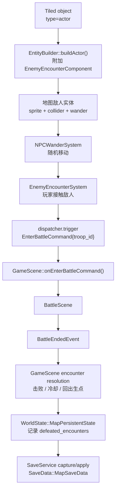

# 地图敌人接触战斗功能计划

## 背景

当前项目已经具备战斗入口与地图实体的两段基础能力：

- `EnterBattleCommand` 已可携带 `troop_id`
- `GameScene::onEnterBattleCommand()` 已能把命令适配为 `BattleScene`
- `RpgCatalog` / `BattleUnitFactory` 已能从 `troop` 构建敌方单位
- `actor` point object 已能通过 `EntityBuilder -> EntityFactory` 生成可见地图实体
- 非玩家 `actor` 已天然具备 sprite / animation / collider / `NPCTag`
- actor blueprint 还已经支持 `wander_radius`，现有 `NPCWanderSystem` 可让地图实体随机移动

也就是说，你真正缺的不是“地图里有个矩形区域能开战”，而是这条链路：

1. 在地图里放一个可见敌人
2. 敌人在出生点附近随机移动
3. 玩家接触敌人 collider 时触发战斗
4. 战斗结束后正确处理该敌人的消失 / 冷却 / 持久化

## 目标

让策划/关卡制作者能够在 Tiled 中直接摆放**可见敌人实体**，并形成稳定闭环：

1. 在 Tiled 中放一个敌人 actor
2. 敌人可在出生点附近随机移动
3. 玩家与敌人发生接触时触发 `EnterBattleCommand`
4. 战斗结束后敌人按规则处理：
   - 胜利后消失或标记已击败
   - 非胜利结果不会立刻无限连战
5. 存档/读档后敌人的击败状态保持一致

## 非目标

- 步数遇敌、草丛遇敌、随机遇敌表
- 复杂仇恨 AI、追击、寻路、巡逻路径
- 战斗胜败后完整剧情编排
- 把商店、任务、战斗三套实例逻辑揉成一个超大 NPC 状态机
- 保存敌人“当前精确漫游位置”这类高成本动态快照

说明：

- “精确位置不持久化”是有意为之。首期只持久化“是否已击败”即可，读档后未击败敌人回出生点继续 wander，成本最低且足够稳定。

## 推荐方案

首期不要新增 `battle_trigger` rect object，改为**复用现有 `actor` point object**，在 actor 实例属性上扩展“地图敌人遭遇”语义。

推荐原因：

- `actor` 已经天然是“可见实体”
- `actor` 已经有 collider，可直接用于接触判定
- `actor` 已能接入 `NPCWanderSystem`
- 现有 `shop_id / quest_offer_id` 也已经证明“在 actor 实例上挂玩法入口”是项目当前的自然扩展点

首期建议新增 actor 实例属性：

- `battle_troop_id`：string，必填，对应 `RpgCatalog` 中的 troop
- `encounter_id`：int，必填，用于存档和跨次加载定位该地图敌人
- `encounter_once`：bool，选填，默认 `false`
- `wander_radius_override`：float，选填，覆盖 actor blueprint 的 `wander_radius`

玩法入口互斥规则：

- `battle_troop_id` 不允许与 `shop_id` 或 `quest_offer_id` 同时出现在同一个 actor object 上
- loader 发现共存时视为 Tiled 配置错误：记录 diagnostics / warning，并且不附加 `EnemyEncounterComponent`
- 首期不做“可对话又可接触开战”的混合 NPC，后续若需要剧情战斗入口，应走脚本或任务事件，而不是复用 touch encounter

首期建议新增运行时组件：

- `EnemyEncounterComponent`

最小字段建议：

- `troop_id`
- `troop_id_hash`
- `encounter_id`
- `once`
- `defeated`
- `home_position`
- `cooldown_seconds`
- `cooldown_timer`
- `engaged`

首期还需要一个探索侧运行时上下文：

- `ActiveEncounterContext`

最小字段建议：

- `active`
- `source_entity`
- `map_id`
- `encounter_id`
- `troop_id`
- `once`
- `home_position`

这个上下文不进入磁盘存档，只用于“进入战斗前后”这一段短生命周期衔接。

持久化字段建议：

- `WorldState::MapPersistentState::defeated_encounters`
- `SaveData::MapSaveData::defeated_encounters`

`defeated_encounters` 与现有 `opened_chests` 同层建模：运行时放在 `WorldState`，磁盘存档时由 `SaveService::capture()` 写入 `SaveData`，读档时由 `SaveService::apply()` 恢复回 `WorldState`。

关键设计决定：

- 触发方式首期只做 `touch`
- 仍然允许未来补 `battle_trigger`，但它应作为“固定遭遇区 / 隐形触发区”扩展，而不是本需求的主方案
- 敌人是否游走，优先复用 blueprint 的 `wander_radius`
- 若同一视觉蓝图需要不同 roaming 半径，再加 `wander_radius_override`

## 运行时链路



## 阶段拆分

### Stage 1：数据约定与组件建模

目标：

- 把“地图敌人”定义成 actor 的一种实例玩法，而不是新 rect 触发器

工作项：

- 在 `src/game/loader/tiled_conventions.h` 新增 actor property 常量：
  - `battle_troop_id`
  - `encounter_id`
  - `encounter_once`
  - `wander_radius_override`
- 新增 `EnemyEncounterComponent`
- 明确其最小字段：
  - `troop_id`
  - `troop_id_hash`
  - `encounter_id`
  - `once`
  - `defeated`
  - `home_position`
  - `cooldown_seconds`
  - `cooldown_timer`
  - `engaged`
- 新增 `ActiveEncounterContext`，建议作为 `GameScene` 持有的探索侧运行时状态，而不是放进 `BattleEndedEvent`
- 在 `WorldState::MapPersistentState` 新增 `defeated_encounters`
- 在 `SaveData::MapSaveData` 新增 `defeated_encounters`
- 扩展 `save_data.cpp`：
  - `serialize()` 写出 `maps[].defeated_encounters`
  - `deserialize()` 读取 `maps[].defeated_encounters`
  - 兼容缺失字段时默认为空
- 扩展 `SaveService`：
  - `capture()` 从 `WorldState::MapPersistentState::defeated_encounters` 写入 `MapSaveData`
  - `apply()` 从 `MapSaveData::defeated_encounters` 恢复到 `WorldState`

验收：

- 地图敌人的 schema 被集中定义
- 组件字段足以支撑“接触开战 + 击败持久化”闭环
- `defeated_encounters` 能完整经过 `WorldState -> SaveData -> JSON -> SaveData -> WorldState`

### Stage 2：Tiled 加载与敌人落地

目标：

- 让地图中的 actor 实例能够成为“会漫游的可见敌人”

工作项：

- 扩展 `EntityBuilder::buildActor()`
- 在 `createActor()` 前先解析 actor 实例属性：
  - `shop_id`
  - `quest_offer_id`
  - `battle_troop_id`
  - `encounter_id`
  - `encounter_once`
  - `wander_radius_override`
- 若 `battle_troop_id` 与 `shop_id` / `quest_offer_id` 共存，记录清晰 warning，并且不附加战斗遭遇语义
- 当 actor object 带有合法 `battle_troop_id` 时，为实体附加 `EnemyEncounterComponent`
- `battle_troop_id` 存在但 `encounter_id` 缺失或 `<= 0` 时，记录配置错误，并且不附加 `EnemyEncounterComponent`
- 同一张地图内 `encounter_id` 重复时，记录配置错误；建议首期只保留第一个合法 encounter，后续重复项不附加 `EnemyEncounterComponent`
- 若存在 `wander_radius_override`，覆盖该实体的 `WanderComponent.radius_`
- 若 `encounter_once=true` 且该 `encounter_id` 已存在于当前地图的 `defeated_encounters`，在 `createActor()` 前直接短路，不生成该敌人实体
- 若 `RpgCatalog` 在加载期可达，则尽量前置校验 `battle_troop_id`
- 若加载期无法校验，则在首次触发时输出明确错误，并在调试面板中可观测

验收：

- Tiled 中的 actor 可以直接落成“地图敌人”
- 正确配置后，敌人会可见且能 wander
- 缺少 `battle_troop_id` / `encounter_id` 时有清晰错误
- 已永久击败的一次性敌人重载地图后不会残留成普通 NPC

### Stage 3：接触判定与 EnterBattleCommand 接线

目标：

- 玩家接触地图敌人时能稳定开战

工作项：

- 新增 `EnemyEncounterSystem`
- 放置顺序建议：
  - `Movement`
  - `TransitionUpdatePost`
  - `SpatialIndex`
  - `EnemyEncounterSystem`
  - `Pickup`
  - `Interaction`
- 使用玩家 collider 与 dynamic colliders 做 overlap 判定
- 过滤条件：
  - 同地图
  - 具备 `EnemyEncounterComponent`
  - 未击败
  - 未 `engaged`
  - 当前不在 cooldown
  - 当前不在地图切换或战斗流程中
- 触发时必须先写入 `ActiveEncounterContext`，并立刻将 encounter 标记为 `engaged=true`
- 同一个 update tick 最多触发一次 encounter；成功触发后立即 `break`
- 触发后发布 `EnterBattleCommand{.troop_id = ...}`
- `ActiveEncounterContext` 记录：
  - 当前遭遇来源 entity
  - map_id
  - encounter_id
  - troop_id
  - once
  - home_position

关键说明：

- 当前 `BattleEndedEvent` 不携带“源地图敌人”信息，所以必须补一个 `ActiveEncounterContext`，否则战斗结束后无法知道该处理哪只敌人
- `requestPushScene(BattleScene)` 是排队执行的，不能假设发布 `EnterBattleCommand` 后本帧后续系统会立即停止；`engaged` 和“一帧只触发一次”是防重入的必要护栏

验收：

- 玩家碰到敌人即可进入 `BattleScene`
- 同一接触不会同帧重复触发
- 同帧 overlap 多个敌人时，只会进入一场战斗，且 active context 与 troop 对得上
- 战斗结束回到地图后不会立刻无限连战

### Stage 4：战斗结算、敌人消耗与存档

目标：

- 让地图敌人在战斗后有正确的去留规则，并且可持久化

工作项：

- 在 `GameScene::onBattleEnded()` 中优先处理 `ActiveEncounterContext`
- Encounter resolution 必须发生在现有奖励 / 任务推进 helper 的 `Victory` 分支之前，避免 `Defeat` / `Escaped` 被 early return 跳过
- 推荐首期规则：
  - 若 `Victory` 且 `encounter_once=true`，标记 defeated，并将 `encounter_id` 写入 `defeated_encounters`
  - 若 `Victory` 且 `encounter_once=false`，敌人回出生点并进入短 cooldown
  - 若非 `Victory`，敌人回出生点并进入短 cooldown
- 对仍存在的来源实体：
  - 清除 `engaged`
  - 重置 `cooldown_timer`
  - 将 transform 移回 `home_position`
  - 标记 `TransformDirtyTag`
  - 停止速度，避免战斗结束后继续冲进玩家
- 对一次性胜利敌人：
  - 写入当前地图 `defeated_encounters`
  - 从 spatial index 移除 collider
  - destroy 实体或标记 `NeedRemoveTag`
  - 清空 `ActiveEncounterContext`
- 若战斗期间来源实体已失效，仍以 `ActiveEncounterContext.map_id + encounter_id` 写入持久化或跳过实体复位
- 读档或重载地图时，根据 `defeated_encounters` 决定是否生成该敌人
- 不要求保存敌人当前 wander 到哪，只保存是否已被永久击败

建议：

- `defeated_encounters` 的建模应参考现有 `opened_chests`
- 存盘顺序也参考 `opened_chests`：`SaveService::capture()` 中排序输出，减少 JSON diff 噪音
- 不建议首期把整只地图敌人并入大体量动态快照

验收：

- 一次性敌人在胜利后会正确消失并持久化
- 可重复敌人不会在战后瞬间贴脸再开一次
- `Defeat` / `Escaped` 后也会回出生点并进入 cooldown
- 存档/读档后状态正确

### Stage 5：文档、调试与测试

目标：

- 让这条地图制作链路可配置、可观察、可测试

工作项：

- 更新 `docs/game/map_data_pipeline.md`
- 更新战斗文档，补充“地图敌人接触开战”入口
- 调试面板补充：
  - 当前地图敌人数
  - 无效 `battle_troop_id`
  - 已击败 `encounter_id`
  - 当前 active encounter
  - 当前处于 cooldown / engaged 的 encounter
- 补充测试：
  - `EntityBuilder::buildActor()` 能识别 `battle_troop_id`
  - `battle_troop_id` 与 `shop_id` / `quest_offer_id` 共存时不会附加 encounter
  - 已在 `defeated_encounters` 中的一次性 encounter 不生成实体
  - 同地图重复 `encounter_id` 有清晰 diagnostics
  - `wander_radius_override` 覆盖成功
  - 玩家接触敌人后发出 `EnterBattleCommand`
  - 同帧 overlap 多个敌人只发出一次 `EnterBattleCommand`
  - 战后 cooldown 生效，不会重复触发
  - `Victory + encounter_once` 写入 `WorldState::MapPersistentState::defeated_encounters`
  - `Defeat` / `Escaped` 不写 defeated，但会回出生点并进入 cooldown
  - `SaveData` JSON roundtrip 保留 `maps[].defeated_encounters`
  - `SaveService::capture()/apply()` 保留 `defeated_encounters`
  - `encounter_once` 的完整 save/load/map reload roundtrip

验收：

- 地图配置方式和限制写入文档
- 核心路径具备自动化测试
- 计划中提到的持久化闭环、非胜利结算、防重入护栏都有对应测试

## 建议的首期 Tiled 配置

首期建议直接复用 `actor` point object：

```json
{
  "point": true,
  "type": "actor",
  "name": "slime_overworld",
  "x": 480,
  "y": 320,
  "properties": [
    { "name": "battle_troop_id", "type": "string", "value": "troop.slime_pair" },
    { "name": "encounter_id", "type": "int", "value": 1001 },
    { "name": "encounter_once", "type": "bool", "value": false },
    { "name": "wander_radius_override", "type": "float", "value": 64.0 }
  ]
}
```

配套约定：

- `name="slime_overworld"` 对应 actor blueprint，负责可见形象、速度、动画
- `battle_troop_id` 决定进入哪一组战斗敌人
- `encounter_id` 只需要在同一张地图内唯一；存档时由 `map_name + encounter_id` 共同定位
- 不要在同一个 actor object 上同时配置 `battle_troop_id`、`shop_id`、`quest_offer_id`
- `wander_radius_override` 不填时，回退到 actor blueprint 的 `wander_radius`

## 未来扩展

- `battle_trigger`：补固定遭遇区或隐形触发区
- `aggro_radius`：先发现玩家再追击
- `patrol_path_id`：按路线巡逻，而不是纯随机 wander
- `respawn_days`：按游戏日刷新地图敌人
- `on_win_quest_id` / `on_defeat_script_id`：与任务、脚本联动
