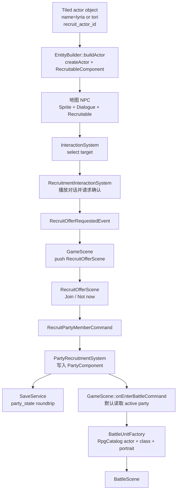

# 战斗角色与入队系统重构计划

## 背景

当前战斗玩家方单位来自 `assets/data/rpg/actors.json`。这些 actor 是从 RPG Maker 数据中引入的占位角色：

- `actor.reed`
- `actor.priscilla`
- `actor.gale`

它们可以支撑战斗系统 smoke 测试，但已经不适合作为当前项目的长期角色来源。当前项目真正的地图角色数据在 `assets/data/actor_blueprint.json`，例如：

- `player`：主角 Alex 的地图表现
- `lyria`：显示名为 `Lyria` 的地图 NPC
- `merchant`：Josh
- `quest`：Manu
- `slime`：地图战斗敌人

本次目标是把项目内真实角色接入战斗角色体系：

- 主角成为默认战斗队员
- `Lyria` 成为可战斗角色，并可通过对话确认加入队伍
- 新增 `Tori` 地图 actor 蓝图和战斗 actor 数据，之后可在地图上放置并通过对话加入
- 每个战斗角色具备肖像引用，为后续战斗 UI 使用

## 目标

1. 用项目自身角色替换 RPG Maker 占位 actor。
2. 保持 `actor_blueprint.json` 负责地图表现，`assets/data/rpg/actors.json` 负责战斗身份和战斗数据。
3. 建立二者之间的显式引用关系，避免两个数据源靠名字猜测。
4. 增加可持久化的队伍状态，战斗入口默认使用当前队伍，而不是 catalog 中的所有 actor。
5. 增加可复用的“对话后确认入队”交互链路，Lyria 和 Tori 都走同一套机制。
6. 给 `BattleUnit` 留出肖像数据，后续战斗 UI 可以直接读取。

## 非目标

- 不在本阶段实现完整角色成长、装备、等级经验曲线。
- 不在本阶段实现队伍编成 UI；首期按加入顺序自动进入可战斗队伍。
- 不把 RPG Maker 原始 actor schema 继续作为项目长期格式。
- 不把地图 actor 蓝图改造成战斗 stats 真源。
- 不在首期实现复杂剧情分支、好感度、条件入队。

## 核心设计决策

### 1. 数据源分工

`actor_blueprint.json` 继续只表达地图实体：

- 行走图
- idle/walk 动画
- NPC wander
- dialogue id
- interact distance
- 地图显示名

`assets/data/rpg/actors.json` 表达战斗角色：

- `actor.id`
- 战斗显示名
- 职业
- 初始技能
- 对应地图蓝图 id
- 肖像引用

建议为 `ActorData` 新增字段：

```json
{
  "id": "actor.lyria",
  "display_name": "Lyria",
  "class_id": "class.swordsman",
  "initial_level": 1,
  "max_level": 99,
  "skill_ids": ["skill.attack", "skill.bash"],
  "map_actor_id": "lyria",
  "portrait": {
    "path": "assets/farm-rpg/Character and Portrait/Portrait/Premade/9.png",
    "x": 0,
    "y": 0,
    "width": 64,
    "height": 64
  }
}
```

说明：

- `map_actor_id` 指向 `actor_blueprint.json` 的 key。
- `portrait` 使用路径加源矩形，先固定取第一帧。
- 三张肖像图尺寸均为 `320x192`，按 `64x64` 可视为 `5x3` atlas，第一帧矩形为 `0,0,64,64`。

### 2. Lyria blueprint key 已整理为 `lyria`

`actor_blueprint.json` 中 Lyria 的 blueprint key 已按用户当前地图配置整理为 `lyria`，后续战斗 actor 使用 `map_actor_id="lyria"` 显式关联。

- 现有地图 `assets/maps/home_exterior.tmj` 中的 actor object 使用 `name="lyria"`
- `dialogue_id` 使用 `lyria_intro`

项目仍在开发中，不需要为旧 key 做长期兼容。

### 3. 队伍状态不能复用 `combat_state.actor_ids`

`SaveData::CombatStateSaveData::actor_ids` 当前语义是 pending battle / battle resume 的上下文，不适合作为长期队伍成员列表。

建议新增独立 `party_state`：

```json
{
  "party_state": {
    "recruited_actor_ids": ["actor.player", "actor.lyria"],
    "active_actor_ids": ["actor.player", "actor.lyria"]
  }
}
```

运行时建议新增 `PartyComponent` 挂在玩家实体上：

- `recruited_actor_ids_`
- `active_actor_ids_`
- `max_active_members_`，首期默认 `4`

默认新档：

- `recruited_actor_ids = ["actor.player"]`
- `active_actor_ids = ["actor.player"]`

### 4. 战斗入口默认读取当前队伍

当前 `BattleUnitFactory` 在 `BattleUnitBuildOptions.actor_ids` 为空时会使用 catalog 中的全部 actor。新增 Lyria/Tori 后，如果保持这个行为，就会导致未入队角色自动参战。

建议调整 `GameScene::onEnterBattleCommand()` 的适配逻辑：

1. 如果 `EnterBattleCommand.actor_ids` 非空，使用命令显式指定的 actor。
2. 否则读取玩家 `PartyComponent.active_actor_ids_`。
3. 如果玩家缺少 `PartyComponent`，fallback 到 `["actor.player"]` 并记录 warning。

`BattleUnitFactory` 可以继续保留“actor_ids 为空时列出全部 actor”的调试 fallback，但 GameScene 的正式入口不应依赖这个 fallback。

### 5. 招募是新的交互 owner

建议新增 Tiled actor 实例属性：

- `recruit_actor_id`：string，指向 `assets/data/rpg/actors.json` 中的 actor id。

当地图 actor object 带有 `recruit_actor_id` 时，loader 附加：

- `RecruitableComponent`

首期字段：

- `actor_id`
- `actor_id_hash`
- `dialogue_id`
- `offer_text`
- `already_joined_text`

交互优先级建议调整为：

```text
Merchant > QuestGiver > Recruitable > Dialogue NPC > Chest > Rest
```

带 `RecruitableComponent` 的实体由 `RecruitmentInteractionSystem` 独占处理，`DialogueSystem` 跳过该目标，避免同一次 `InteractCommand` 被两个系统响应。

## 目标数据

### RPG actors

建议将 `assets/data/rpg/actors.json` 改为项目角色：

```json
{
  "actors": [
    {
      "id": "actor.player",
      "display_name": "Alex",
      "class_id": "class.swordsman",
      "initial_level": 1,
      "max_level": 99,
      "skill_ids": ["skill.attack", "skill.bash"],
      "map_actor_id": "player",
      "portrait": {
        "path": "assets/farm-rpg/Character and Portrait/Portrait/Premade/1.png",
        "x": 0,
        "y": 0,
        "width": 64,
        "height": 64
      }
    },
    {
      "id": "actor.lyria",
      "display_name": "Lyria",
      "class_id": "class.swordsman",
      "initial_level": 1,
      "max_level": 99,
      "skill_ids": ["skill.attack", "skill.bash"],
      "map_actor_id": "lyria",
      "portrait": {
        "path": "assets/farm-rpg/Character and Portrait/Portrait/Premade/9.png",
        "x": 0,
        "y": 0,
        "width": 64,
        "height": 64
      }
    },
    {
      "id": "actor.tori",
      "display_name": "Tori",
      "class_id": "class.monk",
      "initial_level": 1,
      "max_level": 99,
      "skill_ids": ["skill.attack"],
      "map_actor_id": "tori",
      "portrait": {
        "path": "assets/farm-rpg/Character and Portrait/Portrait/Premade/2.png",
        "x": 0,
        "y": 0,
        "width": 64,
        "height": 64
      }
    }
  ]
}
```

首期先复用现有 `class.swordsman` / `class.monk`，后续如要做角色差异，再新增专属 class 或 actor 级参数修正。

### Tori actor blueprint

新增 `actor_blueprint.json` key：

- `tori`

素材路径：

- `assets/farm-rpg/Character and Portrait/Character/Pre-made/Tori/Idle.png`
- `assets/farm-rpg/Character and Portrait/Character/Pre-made/Tori/Walk.png`

已确认尺寸：

- `Idle.png`：`128x96`，每帧 `32x32`，4 帧，3 方向行
- `Walk.png`：`192x96`，每帧 `32x32`，6 帧，3 方向行

方向顺序按现有预制角色约定：

```json
"direction": ["down", "up", "right"]
```

左方向由解析器自动从 right 镜像生成。

### 地图配置

Lyria 现有地图 object 建议更新为：

```json
{
  "type": "actor",
  "name": "lyria",
  "properties": [
    { "name": "recruit_actor_id", "type": "string", "value": "actor.lyria" }
  ]
}
```

Tori 之后由地图中新增 actor point：

```json
{
  "type": "actor",
  "name": "tori",
  "properties": [
    { "name": "recruit_actor_id", "type": "string", "value": "actor.tori" }
  ]
}
```

## 运行时链路



## 阶段拆分

### Stage 1：RPG actor schema 与项目角色数据

目标：

- 替换占位 RPG Maker actor
- 为战斗 actor 增加地图蓝图引用和肖像引用

工作项：

- 扩展 `game::data::ActorData`：
  - `map_actor_id_`
  - `map_actor_id_hash_`
  - `PortraitRef portrait_`
- 新增 `PortraitRef` 数据结构：
  - `path`
  - `path_hash`
  - `rect`
- 扩展 `RpgCatalog::loadActors()` 解析 `map_actor_id` 和 `portrait`
- 保持 `validateReferences()` 只校验 RPG 内部引用：
  - actor -> class
  - actor -> skill
- 新增项目级 smoke test 交叉校验：
  - `actor.player` -> `actor_blueprint.player`
  - `actor.lyria` -> `actor_blueprint.lyria`
  - `actor.tori` -> `actor_blueprint.tori`
  - 三个 portrait 文件存在且第一帧尺寸合法
- 更新 `assets/data/rpg/actors.json` 为 `actor.player / actor.lyria / actor.tori`
- 更新相关测试中的默认 actor id：
  - `actor.reed` -> `actor.player`
  - `actor.priscilla` / `actor.gale` 只保留在测试 fixture 中，不再作为项目资产

验收：

- `RpgCatalog` 可以加载项目角色 actor。
- 项目资产中不再把 RPG Maker 占位 actor 作为默认玩家方。
- actor portrait 数据可被 BattleUnitFactory 读取。

### Stage 2：地图蓝图整理与 Tori 数据落地

目标：

- 让 Lyria / Tori 都有明确的地图 actor blueprint key

工作项：

- 确认 `actor_blueprint.json` 中存在 `lyria` key
- 确认现有地图 `home_exterior.tmj` 的 Lyria object 使用 `name="lyria"`
- 更新 docs 示例中旧 NPC key 引用
- 新增 `tori` actor blueprint：
  - `name = "Tori"`
  - `dialogue_id = "tori_intro"`
  - `wander_radius = 48.0`
  - `interact_distance = 64.0`
  - idle/walk 动画参考 Lyria/Josh/Manu 的 schema
- 更新 `assets/data/dialogue_script.json`：
  - `lyria_intro`
  - `tori_intro`
  - 可选 `lyria_joined`
  - 可选 `tori_joined`

验收：

- Lyria 地图实体仍能加载。
- Tori blueprint 可被 `BlueprintManager` 加载。
- 动画方向和帧数与素材尺寸一致。

### Stage 3：PartyComponent 与存档链路

目标：

- 队伍成员作为长期游戏状态保存，而不是临时战斗命令参数

工作项：

- 新增 `src/game/component/party_component.h`
- 玩家创建时在 `EntityFactory::createPlayer()` 附加 `PartyComponent`
- 默认包含：
  - `actor.player`
- 新增 `SaveData::PartyStateSaveData`
- 扩展 `save_data.h/.cpp`：
  - serialize `party_state.recruited_actor_ids`
  - serialize `party_state.active_actor_ids`
  - deserialize 缺失字段时默认空，由 apply 阶段补 `actor.player`
- 扩展 `save_migrator.cpp`：
  - schema 中确保存在 `party_state`
  - 数组字段类型校验
- 扩展 `SaveService::capture()`：
  - 从玩家 `PartyComponent` 写入 SaveData
- 扩展 `SaveService::apply()`：
  - 从 SaveData 恢复 `PartyComponent`
  - 若 active 为空或不包含合法成员，补回 `actor.player`

验收：

- 新档默认只有主角参战。
- 接收队友后存档，再读档，队伍保持。
- 不污染 `combat_state.actor_ids` 的语义。

### Stage 4：招募交互链路

目标：

- 地图 NPC 可以通过对话和确认 UI 加入队伍

工作项：

- 在 `tiled_conventions.h` 增加 actor property：
  - `recruit_actor_id`
- 新增 `RecruitableComponent`
- `EntityBuilder::buildActor()` 读取 `recruit_actor_id`
- 冲突规则：
  - `recruit_actor_id` 不与 `shop_id` / `quest_offer_id` / `battle_troop_id` 共存
  - 共存时记录 warning，并忽略 recruitable 语义
- 更新 `InteractionSystem` 目标优先级：
  - `Merchant > QuestGiver > Recruitable > Dialogue NPC > Chest > Rest`
- 更新 `DialogueSystem`：
  - 跳过 `RecruitableComponent`
- 新增 `RecruitmentInteractionSystem`
  - 订阅 `InteractCommand`
  - 若目标已入队，显示 already joined 文本
  - 若未入队，播放该 NPC 的对话文本
  - 对话结束后发布 `RecruitOfferRequestedEvent`
  - 距离过远时关闭对话，不弹确认 UI
- 新增 `RecruitOfferScene`
  - 复用 `QuestOfferScene` 的输入上下文和 RML 模式
  - 显示角色名、肖像、确认文本
  - `Join` 触发 `RecruitPartyMemberCommand`
  - `Not now` 关闭场景
- 新增 `PartyRecruitmentSystem`
  - 订阅 `RecruitPartyMemberCommand`
  - 校验 actor 存在于 `RpgCatalog`
  - 校验未重复招募
  - 写入 `PartyComponent.recruited_actor_ids_`
  - 若 active 未满，追加到 `active_actor_ids_`
  - 显示加入成功提示

验收：

- Lyria 对话走完后出现加入确认。
- 接受后 Lyria 进入队伍。
- 重复对话不会重复加入。
- 玩家离开 NPC 旁边时，对话消失，且不会弹加入确认。
- Tori 只要地图上放置 `name="tori"` + `recruit_actor_id="actor.tori"` 即可复用同一流程。

### Stage 5：战斗入口使用当前队伍

目标：

- 地图遭遇战默认使用当前 active party，不让未招募角色参战

工作项：

- 新增 helper：
  - `resolveBattleActorIds(registry, player, cmd.actor_ids)`
- 规则：
  - command 显式给了 `actor_ids`：尊重 command
  - command 没给：读取玩家 `PartyComponent.active_actor_ids_`
  - party 缺失：fallback `actor.player`
- 在 `GameScene::onEnterBattleCommand()` 构造 `BattleUnitBuildOptions` 前使用该 helper
- 更新 `BattleUnitFactory`：
  - 从 `ActorData::portrait_` 写入 `BattleUnit`
  - 可选：如果 actor 缺少 portrait，允许空 portrait，不阻断战斗
- 更新 `BattleUnit`：
  - 新增 `portrait` 字段，或最小新增 `portrait_path / portrait_rect`

验收：

- 只招募主角时，触发 Slime 战斗只有主角。
- Lyria 加入后，触发 Slime 战斗包含主角和 Lyria。
- Tori 加入后，触发 Slime 战斗包含主角、Lyria、Tori。
- Debug 或测试入口仍可通过 `EnterBattleCommand.actor_ids` 指定特殊队伍。

### Stage 6：文档、测试与清理

目标：

- 把新 schema 和制作步骤固定下来

工作项：

- 更新 `docs/game/blueprints.md`
  - `map_actor_id`
  - `recruit_actor_id`
  - Tori/Lyria 示例
- 更新 `docs/game/interaction_and_dialogue.md`
  - 新交互优先级
  - Recruitable 独占规则
- 新增或更新 `docs/game/map_data_pipeline.md`
  - 如何在 Tiled 放置可招募队友
- 可选新增 `docs/game/party_and_recruitment.md`
- 测试覆盖：
  - `RpgCatalogTest`：actor portrait/map_actor_id 解析
  - `BlueprintManagerTest`：Lyria key 和 Tori blueprint
  - `EntityBuilderTest`：`recruit_actor_id` 附加组件
  - `InteractionSystemTest`：Recruitable 优先于普通 Dialogue
  - `RecruitmentInteractionSystemTest`：对话后请求确认，离开距离取消
  - `PartyRecruitmentSystemTest`：加入、重复加入、active party 自动追加
  - `SaveDataRoundtripTest`：party_state roundtrip
  - `SaveServiceAsyncBehaviorTest`：party_state capture/apply
  - `GameSceneBattleEntryTest`：默认使用 PartyComponent actor ids
  - `BattleUnitFactoryTest`：BattleUnit 携带 portrait

验收命令建议：

```sh
jq empty assets/data/actor_blueprint.json assets/data/rpg/actors.json assets/data/dialogue_script.json
ninja -C build game_tests
build/tests/game_tests --gtest_filter='RpgCatalogTest.*:BlueprintManagerTest.*:BattleUnitFactoryTest.*:GameSceneBattleEntryTest.*:SaveData*:*Recruit*:*Party*'
```

## 需要修改的主要文件

数据：

- `assets/data/actor_blueprint.json`
- `assets/data/rpg/actors.json`
- `assets/data/dialogue_script.json`
- `assets/maps/home_exterior.tmj`

核心代码：

- `src/game/data/rpg_data.h`
- `src/game/data/rpg_catalog.cpp`
- `src/game/battle/battle_types.h`
- `src/game/battle/battle_unit_factory.cpp`
- `src/game/component/party_component.h`
- `src/game/component/recruitable_component.h`
- `src/game/loader/tiled_conventions.h`
- `src/game/loader/entity_builder.cpp`
- `src/game/system/interaction_system.cpp`
- `src/game/system/dialogue_system.cpp`
- `src/game/system/recruitment_interaction_system.h/.cpp`
- `src/game/system/party_recruitment_system.h/.cpp`
- `src/game/scene/recruit_offer_scene.h/.cpp`
- `src/game/scene/game_scene.cpp`
- `src/game/runtime/game_runtime_assembler.cpp`
- `src/game/runtime/system_bundle.h`
- `src/game/runtime/system_scheduler.cpp`
- `src/game/save/save_data.h/.cpp`
- `src/game/save/save_migrator.cpp`
- `src/game/save/save_service.cpp`

UI：

- `ui/rmlui/scenes/recruit_offer.rml`
- `ui/rmlui/scenes/recruit_offer.rcss`

文档：

- `docs/game/blueprints.md`
- `docs/game/interaction_and_dialogue.md`
- `docs/game/map_data_pipeline.md`
- 可选 `docs/game/party_and_recruitment.md`

测试：

- `tests/game/rpg_catalog_test.cpp`
- `tests/game/blueprint_manager_smoke_test.cpp`
- `tests/game/battle/battle_unit_factory_test.cpp`
- `tests/game/game_scene_battle_entry_test.cpp`
- `tests/game/save_data_v3_roundtrip_test.cpp`
- `tests/game/save_migrator_test.cpp`
- 新增 `tests/game/recruitment_interaction_system_test.cpp`
- 新增 `tests/game/party_recruitment_system_test.cpp`

## 风险点

1. **未入队角色自动参战**
   - 必须先修正 `GameScene::onEnterBattleCommand()` 的默认 actor ids 来源。

2. **Lyria 地图 key 与 RPG actor 的 `map_actor_id` 不一致**
   - 必须同步 `actor_blueprint.json`、`home_exterior.tmj`、`assets/data/rpg/actors.json` 和文档示例。

3. **Recruitable 与 Dialogue 双响应**
   - `DialogueSystem` 必须显式跳过 `RecruitableComponent`，并且 `InteractionSystem` 优先级要包含 Recruitable。

4. **队伍状态误写进 combat_state**
   - 长期队伍成员必须进入独立 `party_state`。

5. **RML 动态肖像路径**
   - 首期确认场景可以先用数据绑定选择预定义 spritesheet class，战斗 UI 后续再决定是否做动态 image decorator。
   - 领域层应保存 `path + rect`，不要只保存 RML class name。

## 推荐实施顺序

1. Stage 1：RPG actor schema 和项目角色数据
2. Stage 2：Lyria key 整理与 Tori blueprint
3. Stage 3：PartyComponent 与 save roundtrip
4. Stage 5：战斗入口使用 PartyComponent
5. Stage 4：招募交互和确认 UI
6. Stage 6：文档、测试补强和清理

说明：

- Stage 5 放在 Stage 4 之前，是为了先消除“catalog 全 actor 自动参战”的风险。
- 招募 UI 完成前，可以先通过测试或 debug 直接给 `PartyComponent` 添加 Lyria/Tori，验证战斗队伍链路。

## 最小可验收版本

若需要压缩首轮实现范围，最小版本应包含：

1. `assets/data/rpg/actors.json` 替换为 `actor.player / actor.lyria / actor.tori`
2. `ActorData` 支持 `map_actor_id` 和 `portrait`
3. `PartyComponent` + `party_state` save roundtrip
4. `GameScene::onEnterBattleCommand()` 默认读取 active party
5. `tori` actor blueprint
6. `recruit_actor_id` loader + `RecruitableComponent`
7. 简单 `RecruitOfferScene`：对话结束后 Join / Not now

完成以上内容后，主链路即可成立：

```text
地图放置 Lyria/Tori -> 对话确认加入 -> 存档保留队伍 -> 触发 Slime 战斗时队友参战 -> BattleUnit 带肖像引用
```
