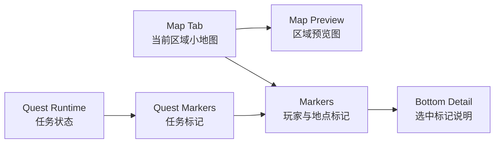

# Map Tab MVP 索引计划

## Context

当前 `InventoryMenuScene` 已经通过 RmlUi 原生 tabset 承载 `Inventory / Equipment / Quests / Map / Options`。`Map` tab 仍是 placeholder，但菜单左侧区域尺寸有限，更适合做“快速查看当前地图状态”的小地图，而不是一开始就做完整世界地图场景。

当前地图与交互数据已有几个可复用来源：

- `assets/maps` 下已有 `home_exterior / home_interior / town / school` 等 Tiled map。
- `WorldState::getCurrentMap()` 已提供当前 map id。
- Tiled actor object 已通过 `quest_offer_id / shop_id / recruit_actor_id` 等属性接入任务、商店、招募入口。
- RmlUi spritesheet 体系已经按领域拆分，适合为地图 marker 新增专用 icon sheet。

本索引只覆盖当前 demo 需要落地的 Phase 1～3。探索状态、多区域切换、全屏世界地图等内容延后，不进入当前 demo 的详细计划。

## Goals

- 在 `Map` tab 中显示当前区域的像素风地图预览。
- 标出玩家当前位置和固定地点标记。
- 支持选择地图标记，并在底部显示地点详情。
- 接入任务系统，在地图上显示当前任务相关标记。
- 继续沿用 `InventoryMenuScene + IMenuTabContent + RmlDocumentController` 架构。

## Non-Goals

- 不做 fog of war / 未探索区域遮罩。
- 不做多区域世界地图切换。
- 不做全屏地图 Scene。
- 不做自定义玩家 pin、路径规划、导航箭头。
- 不做地图缩放、拖拽平移、动态 tilemap 渲染。
- 不新增 Map tab 专用 save schema；当前 demo 的地图显示状态由 `WorldState`、Tiled 对象数据和 quest runtime 派生。

## Recommended Scope

当前 demo 的 `Map` tab 建议定位为：

> 当前区域 quick map：显示玩家在哪、关键地点在哪、当前任务目标在哪。

它不应该成为另一个复杂地图系统。地图 UI 只消费整理好的 view model，不直接扫描 tilemap 或游戏世界实体。

## Decisions

- Phase 1 只显示当前 map。默认 map id 来自 `WorldState::getCurrentMap()`。
- `MapTabContent` 的数据入口按 `map_id` 参数化，而不是在 view model 内硬编码“当前地图”。Phase 4 若加入区域切换，只替换 map id 来源。
- 地图预览以 tilemap 为源，并在运行时生成。source of truth 仍是 Tiled map，避免地图改动后手工同步预览图。
- 坐标映射在 Phase 1 就要锁定：以当前 map-local 像素坐标为输入，左上角为原点，按当前 map 像素尺寸等比缩放到预览区域；若预览区域和 map 比例不同，使用居中 letterbox offset，marker 坐标必须应用同一个 scale 与 offset。
- marker 视觉尺寸以 8dp 为基线，重要/选中状态可放大到 10dp。点击命中区域按视觉 icon 大小设定，不额外扩大隐形热区。
- Phase 1 的玩家 marker 先使用纯 CSS 圆点，避免卡美术资产；Phase 2 引入新增 `ui-map-icons` 专用 spritesheet，不混入 HUD、item 或 inventory sheet。初始图标范围为 `player / landmark / exit / quest`，Phase 3 再补 quest 状态变体。
- 数据刷新策略沿用菜单 tab 模式：打开菜单或切换到 Map tab 时构建一次 snapshot；Phase 3 接入任务后，任务状态变化需要使 Map tab view model 失效并重建。
- 当前 demo 不持久化地图 UI 状态。玩家位置来自当前世界状态，地点来自 Tiled / map 配置，任务 marker 来自 quest runtime 与 quest 数据。
- Phase 3 任务 marker 采用混合数据源：
  - giver / turn-in marker 复用 Tiled actor object 的 `quest_offer_id` 坐标；坐标来自运行时按需扫描 `.tmj` 后形成的 `map_id -> object marker` 缓存，不写入 quest runtime 或 save。
  - objective target marker 使用 quest objective 上的可选 `marker` 字段，例如 `map + pos`。
  - 不新增独立的 `quest_id -> map marker` 反查配置，避免最小联动阶段配置层过重。

## Phase Index

### Phase 1: 当前区域地图预览与玩家位置

目标：

- 让 `Map` tab 从 placeholder 变成可见、可验证的小地图界面。

包含：

- 新增 `MapTabContent`，接入现有菜单 tab 架构。
- 在左侧 panel 显示当前地图预览图。
- 显示玩家当前位置 marker。
- 显示当前区域名称。
- 建立 `map_id -> preview metadata` 的数据入口。
- 锁定 map-local 像素坐标到小地图 UI 坐标的换算规则。

交付判断：

- 打开菜单切到 `Map` tab 时，可以看到当前区域地图和玩家位置。
- 玩家 marker 在不同 map 尺寸下仍能按统一 scale / offset 规则落到正确位置。
- UI 不依赖右侧 Party panel，右侧队伍栏保持全 tab 可见。

建议后续细化文档：

- `plans/map-tab-phase-01-preview-and-player-marker.md`

### Phase 2: 地点标记与详情显示

目标：

- 让小地图具备基础查看价值：玩家可以看到关键地点，并查看地点说明。

包含：

- 新增固定 landmark 配置，例如 `Farmhouse / Shop / Exit / Rest Point / NPC`。
- 可从 Tiled actor object 派生部分 landmark，例如 shop / recruit / quest giver。
- 地点 marker 支持 hover / click / 键盘或手柄焦点选择。
- 底部详情区显示选中 marker 的名称、类型、短描述。
- 设计 marker 图标与选中态样式。

交付判断：

- 至少能在当前 demo 区域显示多个固定地点。
- 选中不同 marker 时，底部详情文本正确更新。
- 空地图或无 landmark 时有稳定 fallback。

建议后续细化文档：

- `plans/map-tab-phase-02-landmarks-and-detail.md`

### Phase 3: 任务标记接入

目标：

- 让 `Map` tab 和任务系统产生最小联动，支持当前任务目标提示。

包含：

- 在 quest 数据或 quest runtime 派生层定义可选 map marker 信息。
- 根据 active quest 状态显示任务 giver / target / turn-in marker。
- 任务 giver / turn-in marker 优先复用 Tiled `quest_offer_id` actor 坐标。
- objective target marker 由 quest objective 的可选 `marker` 字段提供。
- 使用不同视觉状态区分可接、进行中、可交付。
- 底部详情区显示任务相关短提示。

交付判断：

- 当前 active quest 能在地图中显示对应任务 marker。
- 任务状态变化后，marker 状态随菜单刷新同步更新。
- 没有 active quest 时不显示无意义任务 marker。

建议后续细化文档：

- `plans/map-tab-phase-03-quest-markers.md`

## Deferred

### Phase 4: 探索状态与多区域切换

延后原因：

- 需要定义发现状态、区域解锁、存档字段和地图切换 UX，超出当前 demo 的 Map tab MVP。

未来可能包含：

- discovered maps / discovered landmarks
- unexplored area dimming
- 多区域切换按钮
- 地图状态 save/load

### Phase 5: 全屏世界地图场景

延后原因：

- 全屏地图更像独立 Scene，而不是 inventory menu tab 的局部 UI。

未来可能包含：

- 独立 `WorldMapScene`
- zoom / pan
- 路线、传送、区域说明
- 更完整的任务追踪与导航

## Remaining Questions

当前索引层面暂无未决问题。Phase 1 详细计划可以直接围绕运行时 tilemap 缩略图、当前 map marker 和 `MapTabContent` view model 展开。
