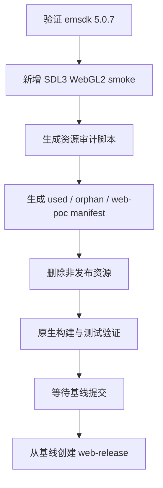

# 2026-06-02 Web Release Phase 0/1 实施记录

## 结果概览

- Phase 0：已验证本机 Emscripten 5.0.7、`emcc`、`em++`、`emcmake`、CMake、Ninja 与 SDL3 wasm port；新增独立 SDL3/WebGL2 smoke 工程。
- Phase 1：已新增可复现资源审计脚本，生成发布资产全集、孤儿资产清单、Web POC 精选资源清单与 preload 参数。
- 资源清理后，`assets` 从计划制定时约 74M 降到 29M，`ui` 从 528K 降到 288K。
- `web-release` 分支尚未创建：计划要求先形成“清理后共享发布基线提交”，当前改动保留为未提交状态，便于审阅后再提交并切分支。

## 执行流程



## Phase 0

新增文件：

- `tools/wasm_smoke/CMakeLists.txt`
- `tools/wasm_smoke/sdl3_minimal.cpp`
- `tools/wasm_smoke/README.md`

验证命令：

```bash
source "$HOME/.local/emsdk/emsdk_env.sh"
emcmake cmake -S tools/wasm_smoke -B build/wasm-smoke -G Ninja -DCMAKE_BUILD_TYPE=Release
cmake --build build/wasm-smoke
```

产物：

- `build/wasm-smoke/sdl3_minimal.html`
- `build/wasm-smoke/sdl3_minimal.js`
- `build/wasm-smoke/sdl3_minimal.wasm`

工具链结论：

- `emcc`、`em++`、`emcmake` 均来自 `~/.local/emsdk/upstream/emscripten`。
- Emscripten 版本为 5.0.7。
- `emcc --show-ports` 可见 `sdl3`，未见 `sdl3_image`；后续 Web 构建应优先移除或绕开 SDL3_image 依赖。

## Phase 1

新增文件：

- `tools/asset_audit/audit_assets.py`
- `manifests/assets/used-assets.txt`
- `manifests/assets/orphan-assets.txt`
- `manifests/assets/web-poc-assets.txt`
- `manifests/assets/web-poc-preload.args`
- `manifests/assets/asset-budget.json`
- `plans/reports/2026-06-02-web-release-phase-1-asset-audit.md`

复现命令：

```bash
python3 tools/asset_audit/audit_assets.py
```

Manifest 摘要：

| Manifest | 文件数 | 磁盘体积 | PNG 纹理 | 估算 RGBA8 显存 |
|---|---:|---:|---:|---:|
| `used-assets` | 803 | 27.6 MiB | 635 | 97.1 MiB |
| `orphan-assets` | 7 | 12.4 KiB | 0 | 0 B |
| `web-poc-assets` | 274 | 20.8 MiB | 158 | 28.4 MiB |

清理策略：

- 删除 `.aseprite`、旧截图、示例 gif、未引用 VFX、未引用 RmlUi demo/test/learn 文件、未引用字体和未引用音频。
- 保留运行期可选择的角色外观变体，包括大小写敏感路径下的 `Santa hat.png` 别名文件。
- 保留 7 个非运行期文本/编辑器元数据文件在 `orphan-assets` 中，避免误删项目说明或 Tiled 项目元数据。

Web POC preload：

- `manifests/assets/web-poc-preload.args` 已由精选 manifest 生成。
- 后续 Phase 2 不应使用 `--preload-file assets@/assets` 全量打包。

## 验证结果

已通过：

- `cmake --build build/debug -- -j$(sysctl -n hw.ncpu)`
- `ctest --test-dir build/debug --output-on-failure -j$(sysctl -n hw.ncpu)`
- `source "$HOME/.local/emsdk/emsdk_env.sh" && emcmake cmake -S tools/wasm_smoke -B build/wasm-smoke -G Ninja -DCMAKE_BUILD_TYPE=Release && cmake --build build/wasm-smoke`
- 从 `build/debug` 启动 `./TinyFarmRPG-Darwin`，进程 5 秒后仍存活；日志显示窗口配置、鼠标光标、渲染配置、RmlUi 字体、游戏字体、音频配置、文本渲染配置、输入配置、游戏时间配置与用户设置均加载成功，未出现缺资源错误。

CTest 结果：

- 1036 个测试全部通过。
- 11 个测试由测试套件跳过，主要是文档/集成类 UI 检查。

未覆盖：

- 未完成窗口内标题页、地图进入、战斗入口、菜单 UI 的逐项人工点击 smoke；本次只完成了启动与资源加载 smoke。尝试通过本地窗口截图补验时未能可靠捕获 SDL 游戏窗口，因此不把该项标记为已完成。

## 分支状态

当前仍在 `main`，尚未执行 `git switch -c web-release`。建议审阅并提交当前资源基线后再创建分支：

```bash
git add assets ui tools/asset_audit tools/wasm_smoke manifests plans
git commit -m "chore: establish web release asset baseline"
git switch -c web-release
```
