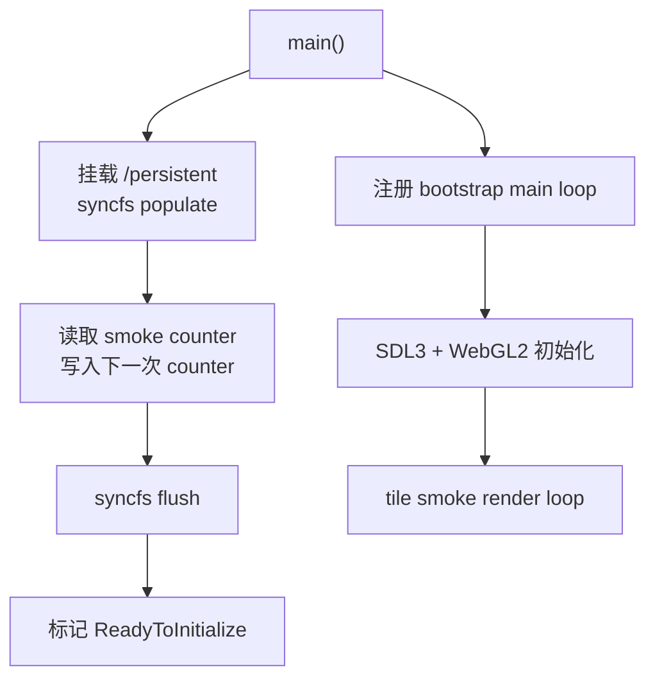

# 2026-06-02 Web Release Phase 5 实施记录

## 结果概览

- 新增平台路径层：native 保持现有相对路径，Web 将用户数据集中到 `/persistent`。
- 新增 Web IDBFS 同步封装：启动时 mount + `syncfs(populate=true)`，写入后 `syncfs(populate=false)`。
- Web target 继续使用 Phase 1 的精选 preload 包，并新增 `-lidbfs.js`；`-sFORCE_FILESYSTEM=1` 已保留。
- `SaveService` 的 slot 存档在 Web 下写入 `/persistent/saves/slotN.json`，native 下仍写入 `saves/slotN.json`。
- 配置、用户设置和输入绑定在 Web 下优先读取 `/persistent/config/...` 覆盖文件，再回退到 readonly `/config/...` 默认文件。
- Web 下默认配置缺失时不再尝试写入 readonly preload package。
- Web walking skeleton 增加 IDBFS 持久化 smoke，刷新后 `boot_count` 可持续递增。

## 同步流程



## 修改文件

- `src/engine/platform/filesystem_paths.h`
- `src/engine/platform/filesystem_paths.cpp`
- `src/engine/platform/web_persistent_storage.h`
- `src/engine/platform/web_persistent_storage.cpp`
- `src/engine/core/config.cpp`
- `src/engine/input/input_binding_config.cpp`
- `src/game/runtime/user_settings_service.cpp`
- `src/game/save/save_service.cpp`
- `src/CMakeLists.txt`
- `src/web/CMakeLists.txt`
- `src/web/web_main.cpp`
- `plans/2026-06-02-web-release-wasm-migration-plan.md`

## 路径策略

| 用途 | Native | Web |
|---|---|---|
| persistent root | 不使用 | `/persistent` |
| save root | `saves` | `/persistent/saves` |
| readonly config | `config/...` | `/config/...` |
| user config override | `config/...` | `/persistent/config/...` |

## Web Persistent Smoke

`src/web/web_main.cpp` 现在会在 SDL/WebGL 初始化前完成 IDBFS 同步，然后写入：

```text
/persistent/saves/web_persistence_smoke.json
```

最新浏览器 smoke 输出：

```text
persistent smoke: root=/persistent path=/persistent/saves/web_persistence_smoke.json previous_boot_count=5 next_boot_count=6
TinyFarmRPG WebGL vendor: WebKit
TinyFarmRPG WebGL renderer: WebKit WebGL
TinyFarmRPG GL version: OpenGL ES 3.0 (WebGL 2.0 ...)
tile smoke: layers=7 tilesets=11 batches=28 vertices=6966
```

截图验证产物：

```text
build/web-release/web-persistent-smoke.png
```

## 构建产物

| 文件 | 大小 |
|---|---:|
| `build/web-release/TinyFarmRPG-Web.html` | 20 KiB |
| `build/web-release/TinyFarmRPG-Web.js` | 252 KiB |
| `build/web-release/TinyFarmRPG-Web.wasm` | 960 KiB |
| `build/web-release/TinyFarmRPG-Web.data` | 21 MiB |

## 验证

已通过：

```bash
cmake --build build/debug -- -j$(sysctl -n hw.ncpu)
ctest --test-dir build/debug --output-on-failure -j$(sysctl -n hw.ncpu)
source "$HOME/.local/emsdk/emsdk_env.sh"
cmake --build build/web-release
```

CTest 结果：

- 1052 个测试全部通过。
- 11 个测试由测试套件跳过。

浏览器验证：

- `http://127.0.0.1:8787/TinyFarmRPG-Web.html`
- canvas 尺寸为 960x540。
- 页面 status 文本为空，没有新的 startup exception。
- 刷新后 persistent smoke 从 `previous_boot_count=5` 增加到 `next_boot_count=6`。
- 画面非空，继续显示 `home_exterior` 地图 tile。

## 仍未覆盖

- 完整 gameplay 存档 UI 尚未在 wasm 中走通；当前验证是 persistent FS smoke。
- IDBFS 写入失败时还只是 stderr 日志，尚未接入 Web UI 状态提示。
- 生产资源分包、懒加载、Brotli/gzip 预压缩和 CDN `locateFile` 仍等待后续阶段。
- 首屏 `.data` 仍是 Phase 1 POC 精选包，尚未进入正式 package split。
