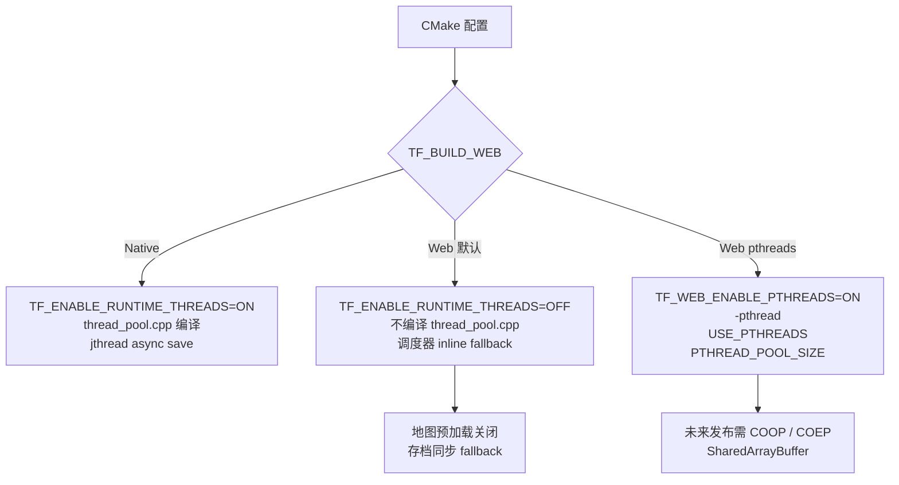

# 2026-06-02 Web Release Phase 6 实施记录

## 结果概览

- 新增运行时线程平台开关：native 默认开启 `TF_ENABLE_RUNTIME_THREADS`，Web 默认关闭。
- 新增后续 pthreads 路线开关：`TF_WEB_ENABLE_PTHREADS=ON` 时才允许 Web 打开运行时线程，并追加 Emscripten pthread flags。
- Web 默认构建不再编译 `engine/async/thread_pool.cpp`，`SystemScheduler` 不再创建并行线程池。
- `ParallelWaveScheduler` 在 `ThreadPool* == nullptr` 时走既有 inline 串行路径，并新增测试覆盖。
- 地图异步预加载在无线程构建下被平台策略强制关闭，`MapManager` 会降级同步加载。
- `SaveService::saveToFileAsync()` 在无线程构建下同步写盘，但仍通过主线程命令队列发布完成事件，保留调用方 API 语义。

## 线程策略



## 修改范围

- `CMakeLists.txt`
- `src/CMakeLists.txt`
- `src/web/CMakeLists.txt`
- `src/engine/platform/threading.h`
- `src/engine/system/parallel_wave_scheduler.cpp`
- `src/game/runtime/system_scheduler.h`
- `src/game/runtime/system_scheduler.cpp`
- `src/game/world/map_loading_settings.h`
- `src/game/world/map_loading_settings.cpp`
- `src/game/world/async_preload_pipeline.h`
- `src/game/world/async_preload_pipeline.cpp`
- `src/game/world/map_manager.cpp`
- `src/game/save/save_service.h`
- `src/game/save/save_service.cpp`
- `tests/engine/system/parallel_wave_scheduler_test.cpp`
- `tests/game/map_loading_settings_test.cpp`
- `plans/2026-06-02-web-release-wasm-migration-plan.md`

## 关键行为

| 模块 | Runtime threads ON | Runtime threads OFF |
|---|---|---|
| `ThreadPool` | 编译并可创建 | 不编译 `thread_pool.cpp` |
| `SystemScheduler` | lazy-init `parallel_thread_pool_` | 返回 `nullptr` |
| `ParallelWaveScheduler` | worker-eligible wave 可并行 | worker-eligible wave inline 执行 |
| `MapLoadingSettings` | 保留 async preload 配置 | `forCurrentPlatform()` 清零并关闭 async preload |
| `AsyncPreloadPipeline` | 使用 worker pool 和 owner thread 检查 | 不持有 worker pool，`schedule()` 返回 false |
| `MapManager` | 可等待 async preload ready | 直接同步 fallback |
| `SaveService` | `std::jthread` 异步写盘 | 同步写盘后投递同一完成事件 |

## 验证

已通过：

```bash
cmake --build build/debug -- -j4
ctest --test-dir build/debug --output-on-failure -R "ParallelWaveSchedulerTest|MapLoadingSettingsTest|SaveServiceAsyncBehaviorTest.AsyncSaveSucceedsAndWritesJsonFile|SaveServiceAsyncBehaviorTest.AsyncSavePublishesCompletionEventForEachRequest"
ctest --test-dir build/debug --output-on-failure -j$(sysctl -n hw.ncpu)
source "$HOME/.local/emsdk/emsdk_env.sh" && cmake --build build/web-release
cmake -S . -B build/debug-single-thread -G Ninja -DCMAKE_BUILD_TYPE=Debug -DTF_ENABLE_RUNTIME_THREADS=OFF -DENABLE_DEBUG_UI=OFF -DENABLE_RMLUI_DEBUGGER=OFF -DENABLE_EFFEKSEER=OFF -DBUILD_TESTING=OFF -DBUILD_TOOLS=OFF -DBUILD_RMLUI_TESTER=OFF -DBUILD_LEARN=OFF
cmake --build build/debug-single-thread -- -j4
```

CTest 结果：

- 聚焦测试：17 个测试全部通过。
- 完整测试：1054 个测试全部通过。
- 11 个测试由测试套件跳过。

构建配置检查：

- `build/web-release/CMakeCache.txt` 中 `TF_BUILD_WEB=ON`。
- `build/web-release/CMakeCache.txt` 中 `TF_ENABLE_RUNTIME_THREADS=OFF`。
- `build/web-release/CMakeCache.txt` 中 `TF_WEB_ENABLE_PTHREADS=OFF`。
- `build/web-release/build.ninja` 未出现 `USE_PTHREADS`、`PTHREAD_POOL_SIZE` 或 `-pthread`。
- `build/debug-single-thread/CMakeCache.txt` 中 `TF_ENABLE_RUNTIME_THREADS=OFF`，主游戏目标可完整编译。

浏览器 smoke：

- 本阶段尝试使用 Codex Browser 插件读取 `http://localhost:8787/TinyFarmRPG-Web.html` 运行状态。
- 插件 URL policy 拦截了对该本地页面的后续读取，因此没有记录新的 canvas / console smoke 结果。
- 未使用绕过方式；Web 侧以 Emscripten 构建通过、无 pthread link flags、Web 运行时线程默认关闭作为本阶段验证边界。

## 仍未覆盖

- 完整 gameplay wasm 仍未链接进 Web target；当前 Web target 仍是 walking skeleton。
- `TF_WEB_ENABLE_PTHREADS=ON` 路线只建立了 feature flag 和 link flags，尚未做单独构建产物验证。
- Web 浏览器端 async save 失败 UI 尚未实机 smoke。
- 单线程下完整地图交互仍等待后续 Phase 7 / Phase 8 gameplay smoke 覆盖。
