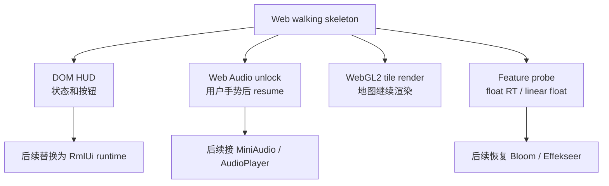

# 2026-06-02 Web Release Phase 7 实施记录

## 结果概览

- Web walking skeleton 新增 `web_shell_ui` 模块，提供可点击的浏览器端状态 HUD。
- HUD 显示启动状态、地图像素尺寸、draw batch 统计、音频解锁状态和 WebGL feature probe。
- Web Audio smoke 必须通过用户点击 `Start Audio` 才创建 / resume `AudioContext`，随后播放一段短音并启用 `Ping`。
- `Hide` / `UI` 可隐藏和恢复 HUD，验证 UI 可点击并能回到游戏画面。
- WebGL feature probe 记录 `EXT_color_buffer_float`、`OES_texture_float_linear` 和 anisotropy，用作后续 Bloom / 后处理恢复门槛。
- Web build 会生成空 `favicon.ico`，避免本地 smoke 被 favicon 404 污染。

## 恢复边界

当前 Web target 仍是 `src/web` 下的独立 walking skeleton，根 CMake 在 `TF_BUILD_WEB=ON` 时会早退，不链接完整 `engine` / `game` / RmlUi / Lua / Effekseer 依赖链。因此本阶段选择先恢复浏览器可见交互与音频解锁 smoke，而不是直接把桌面完整运行时拉入 wasm。



## 修改文件

- `src/web/web_shell_ui.h`
- `src/web/web_shell_ui.cpp`
- `src/web/web_main.cpp`
- `src/web/CMakeLists.txt`
- `tests/engine/web_shell_ui_source_test.cpp`
- `tests/CMakeLists.txt`
- `plans/2026-06-02-web-release-wasm-migration-plan.md`

## 浏览器验证

验证页面：

```text
http://localhost:8787/TinyFarmRPG-Web.html?v=phase7
```

观察结果：

- HUD 状态为 `Running`。
- Map 为 `560x400 px`。
- Draw 为 `7 layers, 11 atlases, 28 batches`。
- WebGL 为 `Float RT ready`。
- 点击 `Start Audio` 后 Audio 变为 `Ready`，`Ping` 从 disabled 变为可点击。
- 点击 `Hide` 后只保留 `UI` 按钮；点击 `UI` 后恢复 HUD。
- 控制台无 error / warning。

浏览器日志：

```text
persistent smoke: root=/persistent path=/persistent/saves/web_persistence_smoke.json previous_boot_count=1 next_boot_count=2
TinyFarmRPG WebGL vendor: WebKit
TinyFarmRPG WebGL renderer: WebKit WebGL
TinyFarmRPG GL version: OpenGL ES 3.0 (WebGL 2.0 (OpenGL ES 3.0 Chromium))
webgl feature probe: color_buffer_float=yes texture_float_linear=yes anisotropy=yes
tile smoke: layers=7 tilesets=11 batches=28 vertices=6966
web audio smoke: unlocked by user gesture
```

## 构建产物

| 文件 | 大小 |
|---|---:|
| `build/web-release/TinyFarmRPG-Web.html` | 19 KiB |
| `build/web-release/TinyFarmRPG-Web.js` | 256 KiB |
| `build/web-release/TinyFarmRPG-Web.wasm` | 906 KiB |
| `build/web-release/TinyFarmRPG-Web.data` | 21 MiB |
| `build/web-release/favicon.ico` | 0 B |

## 验证

已通过：

```bash
source "$HOME/.local/emsdk/emsdk_env.sh" && cmake --build build/web-release
cmake --build build/debug -- -j4
ctest --test-dir build/debug --output-on-failure -R "WebShellUiSourceTest|ParallelWaveSchedulerTest.NullThreadPoolRunsWorkerEligibleWaveInline|MapLoadingSettingsTest.PlatformPolicyMatchesRuntimeThreadingFlag"
```

聚焦测试：

- `WebShellUiSourceTest.AudioContextIsCreatedFromClickHandler`
- `WebShellUiSourceTest.KeepsWebGlFeatureProbeForDeferredPostProcessing`
- `ParallelWaveSchedulerTest.NullThreadPoolRunsWorkerEligibleWaveInline`
- `MapLoadingSettingsTest.PlatformPolicyMatchesRuntimeThreadingFlag`

## 仍未覆盖

- RmlUi 尚未接入 Web target；当前 HUD 是浏览器 DOM shell，用于 Phase 7 smoke。
- MiniAudio / `AudioPlayer` 尚未在 wasm 目标中初始化；当前音频验证是 Web Audio unlock smoke。
- Effekseer 仍按 Web 默认关闭，尚未切换到 GLES3 / WebGL2 backend。
- Bloom 和 emissive 后处理仍未启用；当前只记录 float render target 能力。
- 完整标题页、菜单、对话框、存档 UI 仍等待完整 gameplay wasm target 或 RmlUi runtime 接入后验证。
