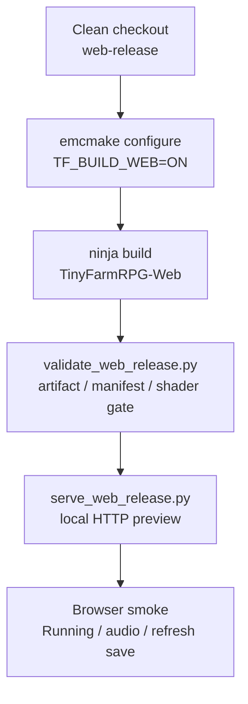

# 2026-06-02 Web Release Phase 8 实施记录

## 结果概览

- 新增 Web 发布 gate：`tools/web_release/validate_web_release.py`。
- 新增本地预览 server：`tools/web_release/serve_web_release.py`，用于避免 `file://` 打开 wasm，并在 pthreads 变体下自动添加 COOP / COEP header。
- Web gate 会检查构建产物、Emscripten CMake cache、单线程 link flags、preload manifest、staged preload 文件、资源预算和 WebGL shader 边界。
- 同步 `manifests/assets/asset-budget.json` 到当前资源体积；manifest 文件集合仍为 274 个 Web POC 资源。
- 浏览器 smoke 验证 Web POC 可进入 Running、解锁音频、渲染地图、刷新后读取 IDBFS smoke 存档。

## 发布流程



固定命令：

```bash
source "$HOME/.local/emsdk/emsdk_env.sh"
emcmake cmake -S . -B build/web-release -G Ninja -DCMAKE_BUILD_TYPE=Release -DTF_BUILD_WEB=ON -DBUILD_TOOLS=OFF -DBUILD_TESTING=OFF -DBUILD_LEARN=OFF
cmake --build build/web-release
python3 tools/web_release/validate_web_release.py --build-dir build/web-release --json-output build/web-release/web-release-gate-summary.json
python3 tools/web_release/serve_web_release.py --build-dir build/web-release --host 127.0.0.1 --port 8787
```

## Gate 覆盖

- `TinyFarmRPG-Web.html` / `.js` / `.wasm` / `.data` / `favicon.ico` 必须存在。
- `CMakeCache.txt` 必须是 Release + Emscripten toolchain + `TF_BUILD_WEB=ON`。
- 默认发布 gate 要求 `TF_ENABLE_RUNTIME_THREADS=OFF`、`TF_WEB_ENABLE_PTHREADS=OFF`，且 `build.ninja` 不含 `-pthread` / `USE_PTHREADS` / `PTHREAD_POOL_SIZE`。
- `web-poc-preload.args` 必须是显式文件清单，不能 whole-tree preload，且 mount path 必须镜像 source path。
- 274 个 preload 文件必须全部存在，并与 `build/web-release/src/web/TinyFarmRPG-Web-preload-root` 中 staged 文件大小一致。
- `web_poc_assets` 必须小于 `used_assets`；当前首屏包为完整发布资产集合的 75.35%。
- WebGL2 shader gate 检查 inline `#version 300 es` shader、`gl_platform.h` 的 WebGL 边界，以及桌面 shader 在 Emscripten 下的 runtime rewrite 路径。

## 产物体积

| 文件 | 原始大小 | gzip 估算 |
|---|---:|---:|
| `build/web-release/TinyFarmRPG-Web.html` | 19.1 KiB | 13.3 KiB |
| `build/web-release/TinyFarmRPG-Web.js` | 256.4 KiB | 56.9 KiB |
| `build/web-release/TinyFarmRPG-Web.wasm` | 905.5 KiB | 289.3 KiB |
| `build/web-release/TinyFarmRPG-Web.data` | 20.8 MiB | 13.7 MiB |
| `build/web-release/favicon.ico` | 0 B | 20 B |

资源包：

| 集合 | 文件数 | 原始大小 |
|---|---:|---:|
| `used_assets` | 803 | 27.6 MiB |
| `web_poc_assets` | 274 | 20.8 MiB |

本地 HTTP 检查：

- `TinyFarmRPG-Web.wasm` 返回 `Content-type: application/wasm`。
- 当前单线程构建不需要 COOP / COEP；`TF_WEB_ENABLE_PTHREADS=ON` 变体会由 preview server 自动添加 header。

## 浏览器 smoke

验证页面：

```text
http://127.0.0.1:8787/TinyFarmRPG-Web.html?v=phase8
```

结果：

- 页面标题从 `Emscripten-Generated Code` 切换为 `TinyFarmRPG WebGL2 Tile Smoke`。
- HUD 状态为 `Running`。
- 点击 `Start Audio` 后 Audio 变为 `Ready`。
- Map 为 `560x400 px`。
- Draw 为 `7 layers, 11 atlases, 28 batches`。
- WebGL 为 `Float RT ready`。
- Console 扫描为 0 error / 0 warning。
- 刷新同 origin 后读取到 `previous_boot_count=1`，并写入 `next_boot_count=2`，确认 IDBFS smoke 存档可恢复。

浏览器日志摘要：

```text
persistent smoke: root=/persistent path=/persistent/saves/web_persistence_smoke.json previous_boot_count=0 next_boot_count=1
TinyFarmRPG WebGL vendor: WebKit
TinyFarmRPG WebGL renderer: WebKit WebGL
TinyFarmRPG GL version: OpenGL ES 3.0 (WebGL 2.0 (OpenGL ES 3.0 Chromium))
tile smoke: layers=7 tilesets=11 batches=28 vertices=6966
```

刷新后：

```text
persistent smoke: root=/persistent path=/persistent/saves/web_persistence_smoke.json previous_boot_count=1 next_boot_count=2
```

## 验证

已通过：

```bash
python3 -m py_compile tools/web_release/serve_web_release.py tools/web_release/validate_web_release.py
source "$HOME/.local/emsdk/emsdk_env.sh" && emcmake cmake -S . -B build/web-release -G Ninja -DCMAKE_BUILD_TYPE=Release -DTF_BUILD_WEB=ON -DBUILD_TOOLS=OFF -DBUILD_TESTING=OFF -DBUILD_LEARN=OFF && cmake --build build/web-release
python3 tools/web_release/validate_web_release.py --build-dir build/web-release --json-output build/web-release/web-release-gate-summary.json
cmake --build build/debug
ctest --test-dir build/debug --output-on-failure
curl -I http://127.0.0.1:8787/TinyFarmRPG-Web.wasm
```

CTest 结果：

- 1056 个测试全部通过。
- 11 个测试由测试套件跳过。

## 仍未覆盖

- 当前 Web target 仍是 walking skeleton，不是完整 `engine` / `game` wasm 运行时；桌面端标题页、RmlUi 菜单、角色移动、完整保存 UI 尚未进入 Web target。
- 浏览器 smoke 本次通过 Codex Browser 的 Chromium 环境完成；Safari 手工 smoke 尚未执行。
- 当前 `.data` 仍是单个首屏 preload 包，虽然小于完整 used assets，但还没有后续 data package / CDN cache 拆分。
- gzip 为脚本内估算值，尚未生成正式 `.gz` / `.br` 预压缩文件。
- shader gate 覆盖 WebGL2 版本边界和 runtime rewrite 路径；完整 shader asset 的逐项浏览器编译仍待完整渲染器 wasm target 接入后补齐。
