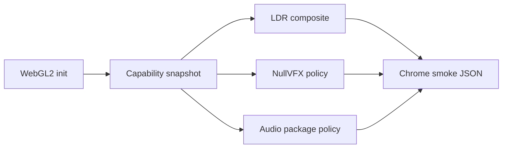

# 2026-06-04 Web Release Phase 18 Report

## 结论

Phase 18 已完成。Web release 的渲染、音频和 VFX 状态已经从“临时关闭”收敛为可验证的发布策略：WebGL2 capability 进入日志和 Chrome smoke JSON，Bloom / HDR emissive 正式降级到 LDR / no-bloom，Effekseer 正式保留 `null_vfx_backend`，音频 package 外资源按 deferred policy 记录且不掩盖缺包错误。

## 主要变更

- `GLRenderer` 新增 `RenderCapabilitySnapshot`，记录 WebGL2 平台、sRGB、float framebuffer、linear float filtering、HDR post-processing、Bloom、Emissive、texture/renderbuffer/MSAA 上限。
- Web 构建通过 `TinyFarmRPGWebReleaseDiagnostics.renderCapabilities` 将 capability 暴露给 Chrome smoke。
- `web_smoke.py` 新增 Phase 18 gate：校验 capability、阻断 WebGL error flood、记录性能预算、记录 VFX 和音频 policy。
- `RuntimeServiceFactory` 在 Web 构建中明确输出 VFX policy：当前首版为 `effekseer_enabled=false backend=null_vfx_backend status=deferred`。
- `ResourceManager` 在 Web 构建中明确输出音频 policy：`audio-core` 外的已注册音频资源延后加载，`failed=0` 时不视为缺包。
- `validate_web_release.py` 和 `WebGameplayTargetSourceTest` 增加 source guard，防止 Phase 18 诊断入口被移除。

## Capability 快照

来源：`build/web-gameplay-phase11/web-release-phase18-smoke/chromium-smoke.json`

| 项 | 值 | 发布结论 |
|---|---:|---|
| Platform | `webgl2` | 首版固定 WebGL2 |
| Default framebuffer sRGB | `false` | Web 默认禁用 `GL_FRAMEBUFFER_SRGB` |
| Float color framebuffers | `false` | 首版不启用 HDR float FBO |
| Linear float filtering | `false` | 首版不依赖 float linear filtering |
| HDR post-processing | `false` | 正式降级到 LDR |
| Bloom | `false` | 正式 no-bloom fallback |
| Emissive | `false` | HDR emissive pass 不启用 |
| Max texture size | `16384` | 通过 |
| Max renderbuffer size | `16384` | 通过 |
| Max samples | `8` | 记录，不作为首版启用条件 |

## 音频与 VFX

| 项 | 结果 |
|---|---|
| VFX | `effekseer_enabled=false backend=null_vfx_backend status=deferred` |
| Registered audio preload | `sounds=3, music=2, skipped_missing=14, failed=0` |
| Audio deferred policy | 14 个 `audio-core` 外已注册音频资源被解释为 deferred |
| Console warnings | 2 条浏览器 `ScriptProcessorNode` deprecation warning，属于 miniaudio WebAudio 后端现状 |

## 性能预算

| 指标 | 实测 | 预算 | 结果 |
|---|---:|---:|---|
| Title interactive | 513 ms | 45000 ms | passed |
| New game to map | 2341 ms | 30000 ms | passed |
| Gameplay flow | 21371 ms | 120000 ms | passed |
| Reload load to map | 2270 ms | 30000 ms | passed |

## 验证

- `PYTHONPYCACHEPREFIX=/private/tmp/tinyfarm-pycache python3 -m py_compile tools/web_release/web_smoke.py tools/web_release/validate_web_release.py`
  - 结果：通过。
- `cmake --build build/debug --target engine_tests -j 10`
  - 结果：通过。
- `./build/debug/tests/engine_tests '--gtest_filter=WebGameplayTargetSourceTest.*'`
  - 结果：16 tests passed。
- `EMSDK_PYTHON=/Users/ziyu/.local/emsdk/python/3.13.3_64bit/bin/python3.13 cmake --build build/web-gameplay-phase11 -j 8`
  - 结果：通过。
- `python3 tools/web_release/web_release_runbook.py auto --output-dir build/web-gameplay-phase11/web-release-phase18-smoke`
  - 结果：通过。
- `python3 tools/web_release/web_release_runbook.py auto --skip-build --output-dir build/web-gameplay-phase11/web-release-phase18-smoke`
  - 结果：通过，用于确认最终 Web 产物的 release gate 和 Chrome smoke。
  - Chrome：`Chrome 147.0.7727.102`
  - Release gate：通过。
  - Performance budget：通过。

## 后续

Phase 19 继续处理持久化、设置和错误恢复硬化。Bloom / HDR emissive 与 Effekseer 不再阻塞 Chrome 单线程首版 Web demo，可作为后续增强项单独评估和恢复。
