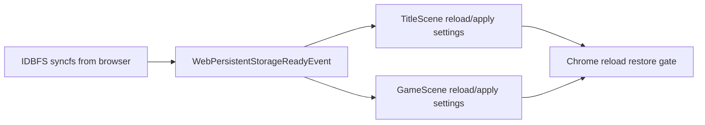

# 2026-06-04 Web Release Phase 19 Report

## 结论

Phase 19 已完成。Chrome smoke 已覆盖设置修改刷新恢复、保存覆盖刷新加载、损坏 slot 跳过、删除 slot 后 IDBFS sync 与刷新缺失验证。期间发现并修复了一个真实时序问题：Web 初始 `syncfs(true)` 是异步的，`UserSettingsService` 可能先按默认配置加载；现在 `GameApp` 会在 IDBFS populate 完成后派发 `WebPersistentStorageReadyEvent`，标题页和 gameplay 场景收到后重新 load/apply 设置。

## 主要变更

- `web_persistent_storage.cpp` 扩展 IDBFS mount/sync 诊断，记录 `from_browser`、`to_browser`、mount、失败原因和完成次数。
- `GameApp` 在 Web 初始持久化 sync 完成后派发 `engine::utils::WebPersistentStorageReadyEvent`。
- `TitleScene` 与 `GameScene` 监听该事件，成功后重新 `loadFromFileOrFallback()` 并 `applyAll()`，消除设置恢复竞态。
- `UserSettingsService` 将保存、flush、load、apply 状态写入 `TinyFarmRPGWebReleaseDiagnostics.userSettings`，并在 Web flush 后执行 IDBFS sync。
- `SaveService` 新增 `deleteSlot()`，删除 slot 及 sidecar 后执行 IDBFS sync。
- Pause menu 新增 Delete 入口，`SaveSlotSelectScene` 新增 Delete mode，删除前确认。
- `web_smoke.py` 扩展 Phase 19 覆盖：设置变更刷新恢复、损坏 slot 写入与跳过、slot 删除后刷新验证缺失、persistent storage 日志汇总。
- source guard 覆盖事件派发、settings reload、delete slot、smoke helper 和 i18n key。

## Smoke 证据

来源：`build/web-gameplay-phase11/web-release-phase19-smoke/chromium-smoke.json`

| 项 | 结果 |
|---|---:|
| Chrome | `148.0.7778.216` |
| Release gate | passed |
| Performance budget | passed |
| IDBFS sync started | 7 |
| IDBFS sync completed | 7 |
| IDBFS sync failed | 0 |
| from-browser completed | 3 |
| to-browser completed | 4 |
| async save sync completed | 2 |
| settings sync completed | 1 |
| slot delete sync completed | 1 |

设置恢复验证：

| 项 | 值 |
|---|---:|
| 保存后的 music volume | `0.4000000059604645` |
| 刷新后文件 music volume | `0.4000000059604645` |
| 刷新后 runtime diagnostics music volume | `0.4000000059604645` |
| 语言 | `en-US` |

覆盖流程：

- `settings_change_reload_restore`
- `save_reload_load`
- `corrupt_save_slot_skip`
- `delete_slot_sync_reload_absent`
- 继续覆盖 Phase 17 的 inventory、hotbar、pause、工具动作、室内外切图和商人对话。

## 性能预算

| 指标 | 实测 | 预算 | 结果 |
|---|---:|---:|---|
| Title interactive | 594 ms | 45000 ms | passed |
| New game to map | 2354 ms | 30000 ms | passed |
| Gameplay flow | 23854 ms | 120000 ms | passed |
| Reload load to map | 2698 ms | 30000 ms | passed |
| Delete slot sync | 3032 ms | 30000 ms | passed |
| Delete reload verify | 219 ms | 30000 ms | passed |

## 验证

- `PYTHONPYCACHEPREFIX=/private/tmp/tinyfarm-pycache python3 -m py_compile tools/web_release/web_smoke.py tools/web_release/validate_web_release.py`
  - 结果：通过。
- `git diff --check`
  - 结果：通过。
- `cmake --build build/debug --target engine_tests game_tests -j 10`
  - 结果：通过。
- `./build/debug/tests/engine_tests '--gtest_filter=WebGameplayTargetSourceTest.*'`
  - 结果：17 tests passed。
- `./build/debug/tests/game_tests '--gtest_filter=PauseMenuSceneAsyncSaveUiTest.*:SaveSlotSelectSceneEnableStateTest.*:I18nKeyParityTest.*:SaveServiceAsyncTest.ExposesAsyncApi:SaveServiceAsyncTest.SaveToFileReusesExtractedWriteHelper:SaveServiceAsyncTest.WriteReplaceFallbackUsesBackupInsteadOfDeletingTarget'`
  - 结果：14 tests passed。
- `EMSDK_PYTHON=/Users/ziyu/.local/emsdk/python/3.13.3_64bit/bin/python3.13 cmake --build build/web-gameplay-phase11 -j 8`
  - 结果：通过。
- `python3 tools/web_release/web_release_runbook.py auto --skip-build --output-dir build/web-gameplay-phase11/web-release-phase19-smoke`
  - 结果：通过。

## 后续

Phase 20 继续做发布产物、artifact manifest、压缩尺寸摘要、CI / release job 固化和 `docs/web_release.md`。
