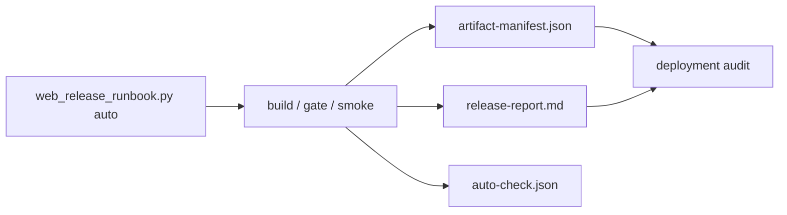

# 2026-06-04 Web Release Phase 20 Report

## 结论

Phase 20 已完成。Web release 现在有固定 runbook 输出、artifact manifest、gzip / brotli 尺寸摘要、Markdown release report、人工测试文档和 CI/release job 定义。Chrome auto smoke 继续通过，且自动模式会在同一个输出目录中留下可审计的 `artifact-manifest.json` 与 `release-report.md`。



## 主要变更

- `tools/web_release/web_release_runbook.py`
  - `auto` 与 `manual --check-only` 都输出 `artifact-manifest.json`。
  - manifest 记录 deploy 文件、MIME、cache 策略、sha256、raw size、gzip size、brotli size。
  - brotli 优先使用 Python 模块，缺失时回退系统 `brotli` CLI。
  - 生成 `release-report.md`，包含尺寸表、性能预算、截图列表和命令记录。
- `docs/web_release.md`
  - 固定 clean checkout 自动验收命令。
  - 记录手动预览、HTTP header、部署目录、清 Web 存档和常见失败。
- `.github/workflows/web-release.yml`
  - `web-release-gate` job 跑 configure / build / release gate。
  - `chromium-smoke` job 作为 workflow_dispatch 可选项，运行 headless Chromium smoke。
  - Emscripten 固定为 `5.0.7`，与本地验证版本一致。
- `WebGameplayTargetSourceTest`
  - 增加 Phase 20 source guard，覆盖 runbook、文档和 workflow 关键片段。

## 固定命令

clean checkout 自动验收：

```bash
python3 tools/web_release/web_release_runbook.py auto \
  --configure \
  --build-dir build/web-release \
  --output-dir build/web-release/web-release-auto
```

已有 build 目录复验：

```bash
python3 tools/web_release/web_release_runbook.py auto \
  --skip-build \
  --build-dir build/web-gameplay-phase11 \
  --output-dir build/web-gameplay-phase11/web-release-phase20-smoke
```

无浏览器环境只跑 build + gate：

```bash
python3 tools/web_release/web_release_runbook.py auto \
  --configure \
  --skip-smoke \
  --build-dir build/web-release \
  --output-dir build/web-release/web-release-gate
```

## Artifact 摘要

来源：`build/web-gameplay-phase11/web-release-phase20-smoke/artifact-manifest.json`

| 项 | 值 |
|---|---:|
| Deploy files | 9 |
| Deploy size | 28.3 MiB |
| Deploy gzip size | 16.3 MiB |
| Deploy brotli size | 13.3 MiB |
| Core files | 4 |
| Runtime packages | 3 |
| Brotli available | true |

| 文件 | Size | Gzip | Brotli | MIME |
|---|---:|---:|---:|---|
| `TinyFarmRPG-Web.html` | 19.1 KiB | 13.3 KiB | 12.6 KiB | `text/html; charset=utf-8` |
| `TinyFarmRPG-Web.js` | 234.7 KiB | 55.2 KiB | 47.6 KiB | `application/javascript` |
| `TinyFarmRPG-Web.wasm` | 7.1 MiB | 2.5 MiB | 1.8 MiB | `application/wasm` |
| `TinyFarmRPG-Web.data` | 2.9 MiB | 1.6 MiB | 1.4 MiB | `application/octet-stream` |
| `web-packages/audio-core.tfpack` | 4.1 MiB | 4.0 MiB | 3.9 MiB | `application/octet-stream` |
| `web-packages/home-map.tfpack` | 662.5 KiB | 268.3 KiB | 258.2 KiB | `application/octet-stream` |
| `web-packages/shared-ui.tfpack` | 13.3 MiB | 7.9 MiB | 5.9 MiB | `application/octet-stream` |
| `web-packages/web-package-index.json` | 20.0 KiB | 2.6 KiB | 2.2 KiB | `application/json` |

## Chrome Smoke

来源：`build/web-gameplay-phase11/web-release-phase20-smoke/chromium-smoke.json`

| 项 | 结果 |
|---|---:|
| Chrome | `148.0.7778.216` |
| Release gate | passed |
| Performance budget | passed |
| Title interactive | 447 ms |
| New game to map | 2353 ms |
| Gameplay flow | 23949 ms |
| Reload load to map | 2695 ms |

覆盖流程继续包含：

- `new_game_character_confirm`
- `home_exterior_to_home_interior_round_trip`
- `inventory_open_close`
- `hotbar_open_close`
- `pause_open_close`
- `settings_change_reload_restore`
- `scripted_merchant_dialogue`
- `save_reload_load`
- `corrupt_save_slot_skip`

## 验证

- `PYTHONPYCACHEPREFIX=/private/tmp/tinyfarm-pycache python3 -m py_compile tools/web_release/web_release_runbook.py tools/web_release/web_smoke.py tools/web_release/validate_web_release.py tools/web_release/package_web_assets.py tools/web_release/serve_web_release.py`
  - 结果：通过。
- `git diff --check`
  - 结果：通过。
- `python3 tools/web_release/web_release_runbook.py manual --skip-build --check-only --build-dir build/web-gameplay-phase11 --output-dir build/web-gameplay-phase20-manual-check`
  - 结果：通过。
  - 输出：`artifact-manifest.json`、`release-report.md`、`manual-preview.json`。
- `cmake --build build/debug --target engine_tests game_tests -j 10`
  - 结果：通过。
- `./build/debug/tests/engine_tests '--gtest_filter=WebGameplayTargetSourceTest.*'`
  - 结果：18 tests passed。
- `python3 tools/web_release/web_release_runbook.py auto --skip-build --build-dir build/web-gameplay-phase11 --output-dir build/web-gameplay-phase11/web-release-phase20-smoke`
  - 结果：通过。
  - 输出：`auto-check.json`、`artifact-manifest.json`、`release-report.md`、`chromium-smoke.json`、`smoke/*.png`。

## 后续

Phase 21 进入最终验收：clean checkout 重新 configure / build / gate / smoke，按 `docs/web_release.md` 完成人工 Chrome 测试，并新增 Web 移植完成报告。
