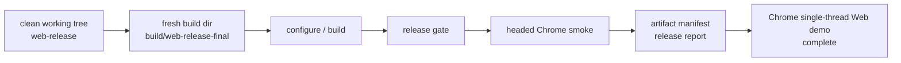

# 2026-06-04 Web Release Phase 21 Final Report

## 结论

第三轮 Web release 收敛已完成。当前完成范围是 Chrome 单线程正式 Web demo：桌面/Web 共用 SDL3 callback 入口，真实 `engine/game` wasm target，WebGL2，IDBFS，boot-only `.data`，runtime `.tfpack` 资源包，固定 runbook，release gate，headed Chrome smoke，artifact manifest，release report 和人工测试文档。



## 完成范围

- 浏览器目标：Chrome / Chromium。
- 线程模型：单线程，无 pthreads，无 COOP / COEP 要求。
- 启动资源：`TinyFarmRPG-Web.data` 只包含 boot 必需资源。
- 运行时资源包：`shared-ui.tfpack`、`home-map.tfpack`、`audio-core.tfpack`。
- 存储：IDBFS `/persistent`，保存、覆盖、加载和用户设置刷新恢复均经过 smoke 验证。
- 玩法 smoke：标题页、appearance、`home_exterior`、`home_interior` 往返、移动、inventory、hotbar、pause、工具动作、商人对话、保存覆盖、刷新读档、损坏 slot 跳过。
- 发布工程：固定 runbook、artifact manifest、gzip / brotli 尺寸、release report、文档、GitHub workflow。

## 最终验收

最终命令：

```bash
python3 tools/web_release/web_release_runbook.py auto \
  --configure \
  --build-dir build/web-release-final \
  --output-dir build/web-release-final/final-auto
```

结果：

| 项 | 结果 |
|---|---|
| Branch | `web-release` |
| Commit | `e3313c99` |
| Working tree at run start | clean |
| Build dir | `build/web-release-final` |
| Runbook status | passed |
| Release gate | passed |
| Chrome smoke | passed |
| Chrome | `148.0.7778.216` headed |
| Artifact manifest | `build/web-release-final/final-auto/artifact-manifest.json` |
| Release report | `build/web-release-final/final-auto/release-report.md` |
| Smoke JSON | `build/web-release-final/final-auto/chromium-smoke.json` |

本地 source 验证：

| 命令 | 结果 |
|---|---|
| `PYTHONPYCACHEPREFIX=/private/tmp/tinyfarm-pycache python3 -m py_compile tools/web_release/web_release_runbook.py tools/web_release/web_smoke.py tools/web_release/validate_web_release.py tools/web_release/package_web_assets.py tools/web_release/serve_web_release.py` | passed |
| `cmake --build build/debug --target engine_tests game_tests -j 10` | passed |
| `./build/debug/tests/engine_tests '--gtest_filter=WebGameplayTargetSourceTest.*'` | 18 tests passed |
| `git diff --check` | passed |

## Artifact 摘要

来源：`build/web-release-final/final-auto/artifact-manifest.json`

| 项 | 值 |
|---|---:|
| Deploy files | 9 |
| Deploy size | 28.3 MiB |
| Deploy gzip size | 16.3 MiB |
| Deploy brotli size | 13.3 MiB |
| Core files | 4 |
| Runtime packages | 3 |
| Brotli available | true |

| 文件 | Size | Gzip | Brotli | MIME |
|---|---:|---:|---:|---|
| `TinyFarmRPG-Web.html` | 19.1 KiB | 13.3 KiB | 12.6 KiB | `text/html; charset=utf-8` |
| `TinyFarmRPG-Web.js` | 234.7 KiB | 55.2 KiB | 47.6 KiB | `application/javascript` |
| `TinyFarmRPG-Web.wasm` | 7.1 MiB | 2.5 MiB | 1.8 MiB | `application/wasm` |
| `TinyFarmRPG-Web.data` | 2.9 MiB | 1.6 MiB | 1.4 MiB | `application/octet-stream` |
| `web-packages/audio-core.tfpack` | 4.1 MiB | 4.0 MiB | 3.9 MiB | `application/octet-stream` |
| `web-packages/home-map.tfpack` | 662.5 KiB | 268.3 KiB | 258.2 KiB | `application/octet-stream` |
| `web-packages/shared-ui.tfpack` | 13.3 MiB | 7.9 MiB | 5.9 MiB | `application/octet-stream` |
| `web-packages/web-package-index.json` | 20.0 KiB | 2.6 KiB | 2.2 KiB | `application/json` |

## Smoke 指标

来源：`build/web-release-final/final-auto/chromium-smoke.json`

| 指标 | 实测 | 预算 | 结果 |
|---|---:|---:|---|
| Title interactive | 463 ms | 45000 ms | passed |
| New game to map | 2575 ms | 30000 ms | passed |
| Gameplay flow | 23850 ms | 120000 ms | passed |
| Reload load to map | 2680 ms | 30000 ms | passed |

IDBFS 诊断：

| 项 | 值 |
|---|---:|
| sync started | 7 |
| sync completed | 7 |
| sync failed | 0 |
| from-browser completed | 3 |
| to-browser completed | 4 |
| async save sync completed | 2 |
| settings sync completed | 1 |

Chrome warnings：3 条，均归类为 audio，未出现 unknown console tail。

## 禁用项与后续增强

| 项 | 当前策略 | 后续方向 |
|---|---|---|
| Safari | 不作为本轮阻塞目标 | 第四轮兼容性计划单独处理 |
| pthreads / COOP / COEP | 单线程首版不启用 | 作为独立高性能变体评估 |
| Bloom / HDR emissive | Web 首版 LDR / no-bloom fallback | WebGL2 capability 允许后再恢复 |
| Effekseer | `null_vfx_backend` | 评估 wasm + WebGL2 backend 成本 |
| 完整战斗、商店、任务、招募、休息、衣柜 smoke | 不阻塞首版 | 扩展玩法 smoke 或人工 QA checklist |

## 发布使用方式

构建和验收见 `docs/web_release.md`。首选命令：

```bash
python3 tools/web_release/web_release_runbook.py auto \
  --configure \
  --build-dir build/web-release \
  --output-dir build/web-release/web-release-auto
```

人工预览：

```bash
python3 tools/web_release/web_release_runbook.py manual \
  --configure \
  --build-dir build/web-release \
  --output-dir build/web-release/web-release-manual \
  --open
```

部署根目录应包含：

- `TinyFarmRPG-Web.html`
- `TinyFarmRPG-Web.js`
- `TinyFarmRPG-Web.wasm`
- `TinyFarmRPG-Web.data`
- `favicon.ico`
- `web-packages/*.tfpack`
- `web-packages/web-package-index.json`

## 最终判断

在“Chrome 单线程正式 Web demo”的定义下，Web 移植完成。后续工作应作为兼容性、性能和玩法覆盖增强项推进，而不是阻塞当前 Web release 分支发布。
