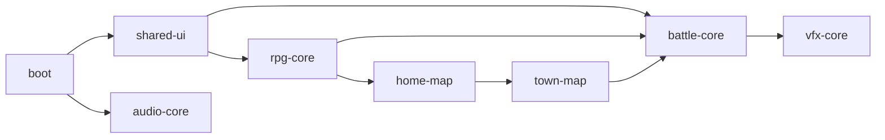

# Web Release Phase 22 Report

日期：2026-06-04

## 结论

Phase 22 已完成。Web release full manifest 现在覆盖完整 RPG 基础玩法所需的资源入口，并将运行时资源拆为 `boot`、`shared-ui`、`rpg-core`、`home-map`、`town-map`、`battle-core`、`vfx-core`、`audio-core`。

`town.tmj` 已进入 Web release manifest 和 `town-map` 包；`school.tmj` 继续按 WIP 地图排除。`home_exterior` 到 `town` 的可玩 transition 尚未建立，属于 Phase 25。



## 主要变更

- `tools/asset_audit/audit_assets.py`
  - 新增 `select_web_full_rpg_assets()`，保留旧 POC profile。
  - 新增 `manifests/assets/web-release-full-assets.txt`。
  - `web-release-full.args` 现在包含 `town.tmj`、battle/shop/quest/recruit/rest/dialogue choice UI、BattleBg、VFX。
- `tools/web_release/package_web_assets.py`
  - 新增 `rpg-core`、`town-map`、`battle-core`、`vfx-core`。
  - package index 写出 `dependencies`、`files`、`bytes`。
- `src/engine/platform/web_asset_package_registry.*`
  - 新增 package 常量、`loadGroup()`、依赖加载、package 状态查询接口。
- `src/game/scene/game_scene.cpp`
  - Web GameScene 入口加载 `shared-ui`、`rpg-core`、`home-map`。
- `src/game/world/map_manager.cpp`
  - Web 加载 `town` 时会加载 `town-map`。
- `tools/web_release/validate_web_release.py`
  - release gate 校验完整 RPG 资源、包路径、依赖、包体积诊断。
- `tools/web_release/web_smoke.py`
  - header 与网络响应检查覆盖新增 package，现有 demo smoke 确认 `rpg-core.tfpack` 会被浏览器实际请求。

## 资源与包体积

`python3 tools/asset_audit/audit_assets.py` 结果：

| Manifest | Files | Size |
|---|---:|---:|
| used-assets | 804 | 27.6 MiB |
| web-poc-assets | 283 | 20.9 MiB |
| web-release-full-assets | 381 | 22.6 MiB |

`build/web-release-final/web-packages/web-package-index.json` 结果：

| Package | Files | Size |
|---|---:|---:|
| boot | 36 | 2.9 MiB |
| shared-ui | 174 | 13.3 MiB |
| rpg-core | 36 | 88.8 KiB |
| home-map | 38 | 551.5 KiB |
| town-map | 5 | 43.7 KiB |
| battle-core | 4 | 434.0 KiB |
| vfx-core | 83 | 1.2 MiB |
| audio-core | 5 | 4.1 MiB |

## 验证

```bash
python3 tools/asset_audit/audit_assets.py
PYTHONPYCACHEPREFIX=/private/tmp/tinyfarm-pycache python3 -m py_compile tools/asset_audit/audit_assets.py tools/web_release/package_web_assets.py tools/web_release/validate_web_release.py tools/web_release/web_smoke.py
python3 tools/web_release/package_web_assets.py --manifest manifests/assets/web-release-full.args --output-dir /private/tmp/tinyfarm-phase22-packages --boot-preload-output /private/tmp/tinyfarm-phase22-web-release-boot.args --json-output /private/tmp/tinyfarm-phase22-package-index.json --skip-artifacts
EMSDK_PYTHON=/Users/ziyu/.local/emsdk/python/3.13.3_64bit/bin/python3.13 cmake --build build/web-release-final -j 8
python3 tools/web_release/validate_web_release.py --build-dir build/web-release-final --json-output /private/tmp/tinyfarm-phase22-release-gate.json
cmake --build build/debug --target engine_tests -j 8
build/debug/tests/engine_tests '--gtest_filter=WebGameplayTargetSourceTest.*'
python3 tools/web_release/web_smoke.py --build-dir build/web-release-final --skip-build --output-dir /private/tmp/tinyfarm-phase22-smoke --json-output /private/tmp/tinyfarm-phase22-smoke/chromium-smoke.json
```

结果：

- Web release build 通过。
- release gate 通过，`TinyFarmRPG-Web.data` 为 2.9 MiB，仍低于 4 MiB boot budget。
- `WebGameplayTargetSourceTest.*` 19 项通过。
- Chromium smoke 通过；实际请求 `audio-core.tfpack`、`shared-ui.tfpack`、`rpg-core.tfpack`、`home-map.tfpack`。

## 后续

- Phase 23：补完整 gameplay/package/vfx/render diagnostics，并拆分 `demo` / `full-rpg` smoke。
- Phase 24：恢复 Effekseer WebGL2 后端。
- Phase 25：建立 `home_exterior` → `town` 可玩入口并完成战斗闭环。
