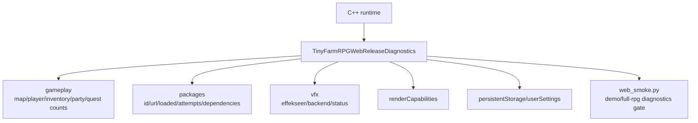

# Web Release Phase 23 Report

日期：2026-06-04

## 结论

Phase 23 已完成 diagnostics 与 smoke profile 基础设施。Web 运行时现在会向 `globalThis.TinyFarmRPGWebReleaseDiagnostics` 发布 gameplay、package、vfx、render、persistent storage、user settings 状态；`web_smoke.py` 支持 `--profile demo|full-rpg`，`web_release_runbook.py auto` 支持 `--smoke-profile demo|full-rpg`。

本阶段只建立可断言状态与 profile 拆分，不实现战斗、商店、任务、招募、休息、衣柜完整流程。这些仍按计划进入 Phase 25/26。



## 主要变更

- `src/game/scene/game_scene.cpp`
  - `publishWebSmokeState()` 同步发布 `diagnostics.gameplay`。
  - 暴露当前 scene、map、player position、gold、inventory slot/item 计数、party 计数、quest active/completed/progress 计数。
- `src/engine/platform/web_asset_package_registry.cpp`
  - package 加载成功、失败或已加载时同步发布 `diagnostics.packages[package_id]`。
  - 字段包括 `id`、`url`、`loaded`、`attempts`、`lastLoadMs`、`lastError`、`dependencies`。
- `src/game/runtime/runtime_service_factory.cpp`
  - VFX 初始化策略发布到 `diagnostics.vfx`。
  - 当前 Web release 仍为 `effekseerEnabled=false backend=null_vfx_backend status=deferred`，Phase 24 将恢复 Effekseer。
- `tools/web_release/web_smoke.py`
  - 新增 `--profile demo|full-rpg`。
  - 新增 `read_web_release_diagnostics()` 与 `validate_web_release_diagnostics()`。
  - demo profile 继续覆盖当前已稳定的 home gameplay。
  - full-rpg profile 在 Phase 23 时执行同一基础流程并额外输出 `full_rpg_profile.status=diagnostics-ready`；该 diagnostics scaffold 已由后续 Phase 25-28 与 battle-depth completion 扩展为完整 full-rpg smoke。
- `tools/web_release/web_release_runbook.py`
  - `auto` 新增 `--smoke-profile demo|full-rpg` 并传递给 smoke。
- `tests/engine/web_gameplay_target_source_test.cpp`
  - 新增 Phase 23 source guard，防止 diagnostics 与 profile 参数退化。

## 验证

```bash
PYTHONPYCACHEPREFIX=/private/tmp/tinyfarm-pycache python3 -m py_compile tools/web_release/web_smoke.py tools/web_release/web_release_runbook.py
cmake --build build/debug --target engine_tests -j 8
build/debug/tests/engine_tests '--gtest_filter=WebGameplayTargetSourceTest.*'
EMSDK_PYTHON=/Users/ziyu/.local/emsdk/python/3.13.3_64bit/bin/python3.13 cmake --build build/web-release-final -j 8
python3 tools/web_release/validate_web_release.py --build-dir build/web-release-final --json-output /private/tmp/tinyfarm-phase23-release-gate.json
python3 tools/web_release/web_smoke.py --build-dir build/web-release-final --skip-build --profile demo --output-dir /private/tmp/tinyfarm-phase23-demo-smoke --json-output /private/tmp/tinyfarm-phase23-demo-smoke/chromium-smoke.json
python3 tools/web_release/web_smoke.py --build-dir build/web-release-final --skip-build --skip-gate --profile full-rpg --output-dir /private/tmp/tinyfarm-phase23-full-rpg-smoke --json-output /private/tmp/tinyfarm-phase23-full-rpg-smoke/chromium-smoke.json
```

结果：

- Python compile 通过。
- Web release build 通过。
- release gate 通过。
- `WebGameplayTargetSourceTest.*` 20 项通过。
- `demo` Chromium smoke 通过。
- `full-rpg` Chromium smoke 通过，Phase 23 输出 `full_rpg_profile.status=diagnostics-ready`。当前最终 full-rpg smoke 已升级为 `full-rpg-flows-ready`，详见 `2026-06-05-web-release-final-full-rpg-report.md` 与 `2026-06-05-web-release-battle-depth-completion-report.md`。

抽查 full-rpg smoke diagnostics：

| Field | Value |
|---|---|
| profile | `full-rpg` |
| diagnostic gate | `passed` |
| gameplay map | `home_exterior` |
| player gold | `300` |
| loaded runtime packages | `audio-core`, `shared-ui`, `rpg-core`, `home-map` |
| vfx backend | `null_vfx_backend` |
| vfx status | `deferred` |

## 后续

- Phase 24：启用并验证 Effekseer WebGL2 后端，使 `diagnostics.vfx` 从 `deferred` 变为真实后端状态。
- Phase 25：建立 `home_exterior` → `town` 战斗入口，并将 full-rpg profile 从 diagnostics scaffold 扩展到完整战斗流程。
- Phase 26：把商店、任务、招募、休息、衣柜接入 full-rpg profile。
