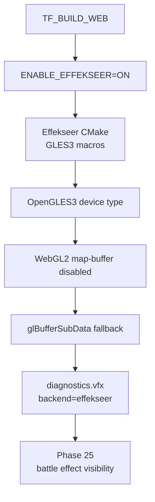

# Web Release Phase 24 Report

日期：2026-06-04

## 结论

Phase 24 已完成 Effekseer WebGL2 后端恢复。正式 Web 构建现在强制 `ENABLE_EFFEKSEER=ON`，Emscripten 下使用 `EffekseerRendererGL::OpenGLDeviceType::OpenGLES3`，Chromium smoke 运行时诊断显示 `effekseerEnabled=true backend=effekseer status=enabled`。

本阶段没有宣称战斗特效已经可见。`vfx-core` 中具体 `.efkefc` effect 的依赖解析、active instance / draw call 计数与截图可见性，依赖 Phase 25 建立 town/battle 入口后一起验收。



## 主要变更

- `CMakeLists.txt`
  - Web full RPG release 下默认并强制启用 `ENABLE_EFFEKSEER`。
  - Web 构建重新接入 `cmake/EffekseerDependencies.cmake` 与 `setup_effekseer_dependencies()`。
- `cmake/EffekseerDependencies.cmake`
  - Emscripten 下开启 `USE_OPENGLES3`，关闭 `USE_OPENGLES2` / `USE_OPENGL3`。
  - 给 `Effekseer` 与 `EffekseerRendererGL` 注入 `__EFFEKSEER_RENDERER_GLES3__`。
- `src/engine/vfx/effekseer_backend.cpp`
  - Web 构建使用 `OpenGLDeviceType::OpenGLES3`。
  - 桌面构建继续使用 `OpenGLDeviceType::OpenGL3`。
- `external/Effekseer-1.7.3.0/.../EffekseerRendererGL.GLExtension.cpp`
  - `__EMSCRIPTEN__` 下禁用 buffer range / map buffer support。
  - 避免链接或运行时调用 WebGL2 不可用的 `glMapBufferRange` / `glUnmapBuffer`，让 Effekseer 走 `glBufferSubData` fallback。
- `tools/web_release/validate_web_release.py`
  - release gate 要求 Web CMake cache 中 `ENABLE_EFFEKSEER=ON`。
- `tools/web_release/web_smoke.py`
  - diagnostics gate 要求 `diagnostics.vfx.effekseerEnabled=true`、`backend=effekseer`、`status=enabled`。
- `tests/engine/web_gameplay_target_source_test.cpp`
  - 新增 Phase 24 source guard，覆盖 Web Effekseer 默认开关、GLES3 macro、OpenGLES3 device type、WebGL2 map-buffer fallback、release gate 与 smoke 断言。
- `plans/2026-06-04-web-release-round-4-full-rpg-and-rendering-plan.md`
  - 勾选 Phase 24 已完成项。
  - 明确战斗 effect 资源加载和可见性随 Phase 25 验收。

## 验证

```bash
cmake --build build/debug --target engine_tests -j 8
build/debug/tests/engine_tests '--gtest_filter=WebGameplayTargetSourceTest.*'
PYTHONPYCACHEPREFIX=/private/tmp/tinyfarm-pycache python3 -m py_compile tools/web_release/validate_web_release.py tools/web_release/web_smoke.py
EMSDK_PYTHON=/Users/ziyu/.local/emsdk/python/3.13.3_64bit/bin/python3.13 cmake --build build/web-release-final -j 8
python3 tools/web_release/validate_web_release.py --build-dir build/web-release-final --json-output /private/tmp/tinyfarm-phase24-release-gate.json
python3 tools/web_release/web_smoke.py --build-dir build/web-release-final --skip-build --profile demo --output-dir /private/tmp/tinyfarm-phase24-demo-smoke --json-output /private/tmp/tinyfarm-phase24-demo-smoke/chromium-smoke.json
python3 tools/web_release/web_smoke.py --build-dir build/web-release-final --skip-build --skip-gate --profile full-rpg --output-dir /private/tmp/tinyfarm-phase24-full-rpg-smoke --json-output /private/tmp/tinyfarm-phase24-full-rpg-smoke/chromium-smoke.json
```

结果：

- `WebGameplayTargetSourceTest.*` 21 项通过。
- Python compile 通过。
- Web release build 通过。
- release gate 通过。
- `demo` Chromium smoke 通过。
- `full-rpg` Chromium smoke 通过。

抽查 Chromium diagnostics：

| Field | demo | full-rpg |
|---|---|---|
| `diagnostics.vfx.effekseerEnabled` | `true` | `true` |
| `diagnostics.vfx.backend` | `effekseer` | `effekseer` |
| `diagnostics.vfx.status` | `enabled` | `enabled` |
| gameplay map | `home_exterior` | `home_exterior` |
| diagnostic gate | `passed` | `passed` |

构建产物：

| Artifact | Size | Gzip |
|---|---:|---:|
| `TinyFarmRPG-Web.wasm` | 8.2 MiB | 2.8 MiB |
| `TinyFarmRPG-Web.data` | 2.9 MiB | 1.6 MiB |
| `vfx-core.tfpack` | 1.2 MiB | 998.7 KiB |

## 后续

- Phase 25：建立 `home_exterior` → `town` 可达入口，进入战斗并加载 `battle-core` / `vfx-core`。
- Phase 25：在战斗中触发至少一个 Effekseer effect，记录 active instance / draw call 或等价 diagnostics，并用截图确认可见。
- Phase 25：验证战斗胜利返回地图、奖励写回、存档恢复。
