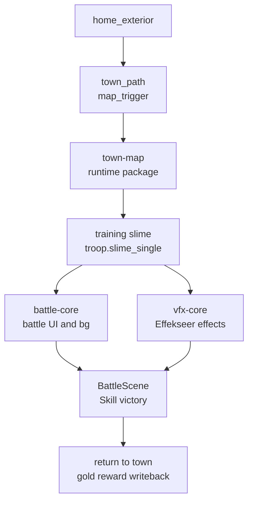

# Web Release Phase 25 Report

日期：2026-06-04

## 结论

Phase 25 已完成 Web 上的战斗入口与胜利闭环：`home_exterior` 可以进入 `town`，`town-map` 按需加载，训练遭遇触发后加载 `battle-core` 与 `vfx-core`，战斗中技能路径可触发 Effekseer 诊断并截图，胜利后返回 `town` 且金币奖励写回。

本阶段尚未覆盖完整战斗命令矩阵。Attack / Item / Guard / Escape、失败流程、`defeated encounter` 持久化、战后保存刷新恢复仍保留为后续战斗扩展项，不计入本次已完成范围。



## 主要变更

- `assets/maps/home_exterior.tmj`
  - 新增 `town_path` map trigger，从家园外部进入 `town`。
- `assets/maps/town.tmj`
  - 新增返回 `home_exterior` 的 `home_path` trigger。
  - 新增入口路径上的训练 slime 遭遇，使用 `troop.slime_single`。
- `assets/data/rpg/troops.json`
  - 新增单体 slime troop，降低 Web smoke 的战斗时长和随机性。
- `src/game/scene/game_scene.cpp`
  - 遭遇进战斗前加载 `battle-core` 与 `vfx-core`。
  - Web gameplay diagnostics 暴露当前地图 encounter 列表、数量和状态。
- `src/game/scene/battle_scene.cpp`
  - Web battle diagnostics 暴露菜单状态、行动结果、敌我数量、胜利按钮状态、VFX 计数。
- `src/game/system/enemy_encounter_system.cpp`
  - 遭遇触发时记录 encounter id 与 troop id，供 smoke 等待稳定信号。
- `tools/web_release/web_smoke.py`
  - `full-rpg` profile 进入 town 后根据 diagnostics 选择可用 encounter。
  - 自动执行 Skill 胜利路径，断言 VFX diagnostics，截图并验证奖励写回。
- `manifests/assets/web-release-boot.args`
  - 将 Clock 资源加入真正的 link-time boot preload，避免首屏资源缺失。
- `tools/web_release/package_web_assets.py`
  - 将敌人纹理归入 `rpg-core`，避免进 town 前 actor blueprint 预加载缺图。
- `assets/shaders/texture.frag` 与 OpenGL sprite/text 渲染代码
  - 新增 `RedAsAlpha` 纹理模式，替代 WebGL2 不支持的 `GL_TEXTURE_SWIZZLE_*` 字体 alpha 路径。

## 验证

```bash
PYTHONPYCACHEPREFIX=/private/tmp/tinyfarm-pycache python3 -m py_compile tools/web_release/web_smoke.py tools/web_release/package_web_assets.py tools/web_release/validate_web_release.py
cmake --build build/debug --target game_tests engine_tests -j 8
build/debug/tests/game_tests '--gtest_filter=EnemyEncounterSystemTest.*:BlueprintManagerTest.ProjectTownKeepsOnePersistentSlimeAndRespawningGoblinEncounter:RpgCatalogTest.ProjectAssetsExposeSlimeTroopForMapEncounter'
build/debug/tests/engine_tests '--gtest_filter=WebGameplayTargetSourceTest.Phase25FullRpgBattleFlowIsReachableOnWeb'
EMSDK_PYTHON=/Users/ziyu/.local/emsdk/python/3.13.3_64bit/bin/python3.13 cmake --build build/web-release-final -j 8
python3 tools/web_release/validate_web_release.py --build-dir build/web-release-final --json-output /private/tmp/tinyfarm-phase25-release-gate.json
python3 tools/web_release/web_smoke.py --build-dir build/web-release-final --skip-build --skip-gate --profile demo --output-dir /private/tmp/tinyfarm-phase25-demo-smoke --json-output /private/tmp/tinyfarm-phase25-demo-smoke/chromium-smoke.json
python3 tools/web_release/web_smoke.py --build-dir build/web-release-final --skip-build --skip-gate --profile full-rpg --output-dir /private/tmp/tinyfarm-phase25-full-rpg-smoke-final --json-output /private/tmp/tinyfarm-phase25-full-rpg-smoke-final/chromium-smoke.json
```

结果：

- Python compile 通过。
- `game_tests` 相关 6 项通过。
- `WebGameplayTargetSourceTest.Phase25FullRpgBattleFlowIsReachableOnWeb` 通过。
- Web release build 通过。
- release gate 通过。
- `demo` Chromium smoke 通过。
- `full-rpg` Chromium smoke 通过。

关键 full-rpg smoke 结果：

| Field | Value |
|---|---:|
| browser | Chrome 148.0.7778.216 |
| profile | `full-rpg` |
| diagnostic gate | `passed` |
| encounter | `1101` / `troop.slime_single` |
| battle outcome | `Victory` |
| last action | `Skill` / `skill.bash` |
| gold | `300` → `303` |

截图输出：

- `/private/tmp/tinyfarm-phase25-full-rpg-smoke-final/phase25-town-entry.png`
- `/private/tmp/tinyfarm-phase25-full-rpg-smoke-final/phase25-encounter-approach.png`
- `/private/tmp/tinyfarm-phase25-full-rpg-smoke-final/phase25-battle-entry.png`
- `/private/tmp/tinyfarm-phase25-full-rpg-smoke-final/phase25-battle-skill-vfx.png`
- `/private/tmp/tinyfarm-phase25-full-rpg-smoke-final/phase25-battle-victory.png`
- `/private/tmp/tinyfarm-phase25-full-rpg-smoke-final/phase25-town-after-victory.png`

## 后续

- 扩展 BattleScene Web smoke，覆盖 Attack / Item / Guard / Escape 和失败流程。
- 验证 HP/MP、背包、`respawn_on_map_reload=false` 遭遇状态写回。
- 增加战后保存、刷新、读档恢复 smoke。
- 进入 Phase 26，覆盖商店、任务、招募、休息和衣柜基础 RPG 闭环。
