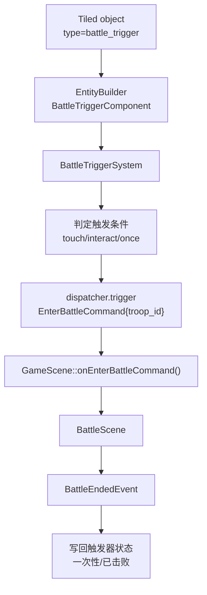

# 地图战斗触发功能计划

## 背景

当前项目已经有完整的战斗运行时入口：

- `EnterBattleCommand` 可以携带 `troop_id`
- `GameScene::onEnterBattleCommand()` 可以把命令适配为 `BattleScene`
- `RpgCatalog` / `BattleUnitFactory` 已能从 `troop` 构建敌方单位

但这条链路目前还**没有接到 Tiled 地图**：

- `src/game/loader/tiled_conventions.h` 里没有 `battle_trigger` object type
- `EntityBuilder` 不会从地图对象创建战斗触发器组件
- `InteractionSystem` / `MapTransitionSystem` 也没有负责“进入战斗”的地图消费方
- 当前可见入口只有 `BattleDebugPanel`

因此，地图里虽然能放商店、任务、切图、休息区和光源，但还不能放“战斗区域”或“战斗触发 NPC”。

## 目标

让策划/关卡制作者能够在 Tiled 中直接配置固定战斗触发，并稳定进入 `BattleScene`。

首期建议只解决最小闭环：

1. 在 Tiled 中放置一个战斗触发区域
2. 进入区域后按规则触发 `EnterBattleCommand`
3. 使用指定 `troop_id` 发起战斗
4. 触发器可配置为一次性或可重复
5. 存档/读档后触发器状态保持一致

## 非目标

- 随机遇敌表、步数遇敌、权重池随机抽 troop
- 复杂脚本分支战斗、胜败后的剧情编排
- 同一 NPC 同时承载商店、任务、战斗三套复杂交互状态机
- 可视化敌人 roaming AI 与“碰撞即开战”的完整敌人实体系统

## 推荐方案

首期采用**专用 rect object**，不要复用现有 `map_trigger`：

- 新增 object type：`battle_trigger`
- 放在 object layer，使用矩形区域定义触发范围
- 必需 property：`troop_id`（string）
- 建议 property：
  - `trigger_mode`：`touch` / `interact`
  - `once`：bool
  - `self_id`：int，用于存档和跨图唯一定位
  - `enabled`：bool，默认 true

原因：

- `map_trigger` 当前语义已经稳定绑定“地图切换”
- 战斗触发和切图触发的状态、反馈、存档需求不同
- rect area 更适合做固定遇敌区，且最贴近“地图触发功能”需求

后续若需要“与 NPC 对话后开战”，再单独扩展 actor 实例属性：

- `battle_troop_id`

但不建议把它并入首期最小实现。

## 运行时链路



## 阶段拆分

### Stage 1：数据约定与组件建模

目标：

- 把地图战斗触发的 schema 和运行时 owner 定下来

工作项：

- 在 `src/game/loader/tiled_conventions.h` 新增 `OBJECT_TYPE_BATTLE_TRIGGER`
- 定义 battle trigger property 常量：
  - `troop_id`
  - `trigger_mode`
  - `once`
  - `self_id`
  - `enabled`
- 新增 `BattleTriggerComponent`
- 明确其最小字段：
  - 触发区域 rect
  - `troop_id`
  - 触发模式
  - 是否一次性
  - 是否已消费
  - 地图 id / self_id

验收：

- 类型和 property 名称集中定义
- 组件结构能覆盖最小玩法闭环

### Stage 2：Tiled 加载与地图落地

目标：

- 让 `battle_trigger` 能从 `.tmj` 稳定进入 ECS

工作项：

- `EntityBuilder::build()` 识别 `type="battle_trigger"`
- 新增 `EntityBuilder::buildBattleTrigger()`
- 校验 `troop_id` 必填，且引用的 troop 在 `RpgCatalog` 中存在
- 将 rect 区域注册到合适的空间查询路径
- 给 `Map Inspector` 增加 battle trigger 数量或 unknown token 观测

验收：

- 错误配置会在日志中给出明确错误
- 正确配置能在运行时看到对应组件实例

### Stage 3：触发系统与 EnterBattleCommand 接线

目标：

- 让玩家接触 battle trigger 后能真正开战

工作项：

- 新增 `BattleTriggerSystem`
- `touch` 模式：
  - 玩家进入区域即触发
- `interact` 模式：
  - 玩家在区域内或面向区域时按 `F` 触发
- 触发后 `dispatcher.trigger(EnterBattleCommand{.troop_id = ...})`
- 防抖：
  - 同一帧不重复触发
  - 战斗进行中不重复触发

验收：

- 能从地图进入 `BattleScene`
- 战斗结束回到探索后不会立刻重复弹战

### Stage 4：一次性触发器与存档

目标：

- 让固定遭遇战能被安全持久化

工作项：

- 为 `once=true` 的 battle trigger 增加“已消费”状态
- 把 battle trigger 的持久化状态写入地图快照或新增最小 save schema
- 读档时正确恢复“是否还能再次触发”

建议：

- 若能复用现有 `WorldState::MapState` 的持久化结构，优先复用
- 不建议把 battle trigger 状态散落到独立临时缓存里

验收：

- 一次性触发战斗在存档/读档后仍保持已消费
- 可重复触发战斗不会被误标记为已完成

### Stage 5：文档、调试与测试

目标：

- 让这条地图制作链路可查、可测、可排错

工作项：

- 更新 `docs/game/map_data_pipeline.md`
- 更新战斗文档，补充地图侧入口说明
- 补充测试：
  - loader 识别 `battle_trigger`
  - 无效 `troop_id` 的失败路径
  - `touch/interact` 触发模式
  - `once` 触发器的存档 roundtrip

验收：

- 地图配置方法和限制写入文档
- 关键路径有自动化测试覆盖

## 建议的首期 Tiled 配置

首期建议只支持下面这组最小字段：

```json
{
  "type": "battle_trigger",
  "x": 480,
  "y": 320,
  "width": 96,
  "height": 96,
  "properties": [
    { "name": "troop_id", "type": "string", "value": "troop.goblin_pair" },
    { "name": "trigger_mode", "type": "string", "value": "touch" },
    { "name": "once", "type": "bool", "value": false },
    { "name": "self_id", "type": "int", "value": 1001 }
  ]
}
```

## 未来扩展

- `battle_troop_id`：给 actor/NPC 挂“交互开战”入口
- `on_win_quest_id` / `on_defeat_dialogue_id`：与任务和对话更深联动
- `cooldown_days` / `respawn_days`：地图战斗刷新
- `encounter_group_id`：一个触发器随机出多组 troop
